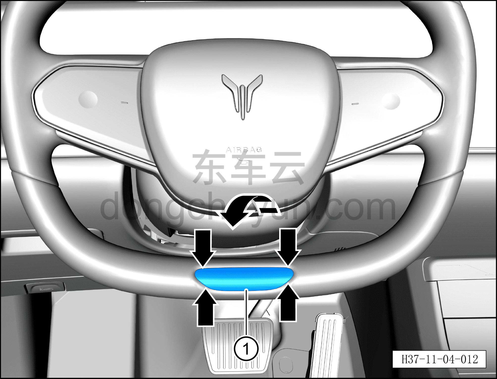
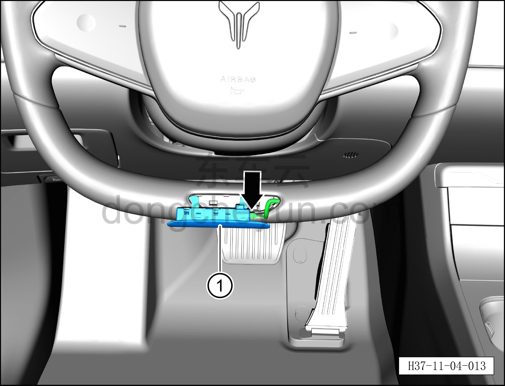
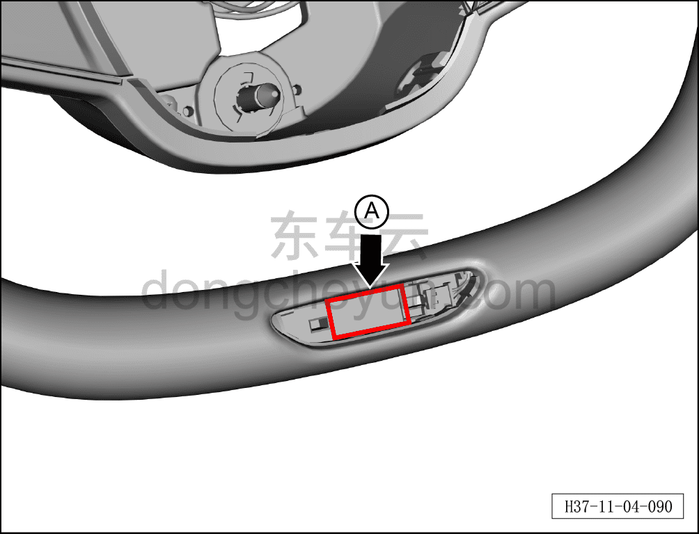

# Снятие и установка подсветки рулевого колеса

> Система безопасности › Система безопасности › Рулевое колесо  
> Оригинал: `拆卸与安装方向盘灯` · [dongcheyun 56746](https://dongcheyun.com/p/56746), страница `82acdfa7fb7640578792dac6d152074a` · [оглавление](../README.md)

**Порядок снятия**

1. Выключите все электроприборы, отключите питание.

2. Выполните операцию обесточивания автомобиля для ремонта. См. [3.1.4.1 Обесточивание автомобиля](../03-техническое-обслуживание/005-обесточивание-автомобиля.md)

3. Снятие подсветки рулевого колеса.

a. Небольшой плоской отвёрткой с обоих концов отсоедините и, следуя направлению стрелки, отверните подсветку рулевого колеса ①.

b. Небольшой плоской отвёрткой нажмите на фиксирующий зажим разъёма подсветки рулевого колеса и отсоедините разъём подсветки рулевого колеса.

c. Извлеките подсветку рулевого колеса ①.

**Порядок установки**

Установка выполняется в обратном порядке.

**Внимание:**

**– Перед установкой подсветки рулевого колеса нанесите клей (клей Henkel 8400 или аналогичный быстросохнущий клей типа 502) на область основания A монтажного отверстия подсветки рулевого колеса, затем защёлкните подсветку рулевого колеса в положенное место и удерживайте нажатой около 60 с, после высыхания клея отпустите.**

**– При нанесении клея следите, чтобы он не попал на поверхность внешней накладки рулевого колеса или на само рулевое колесо.**

**– После завершения установки проверьте и убедитесь в нормальной работе подсветки рулевого колеса.**
