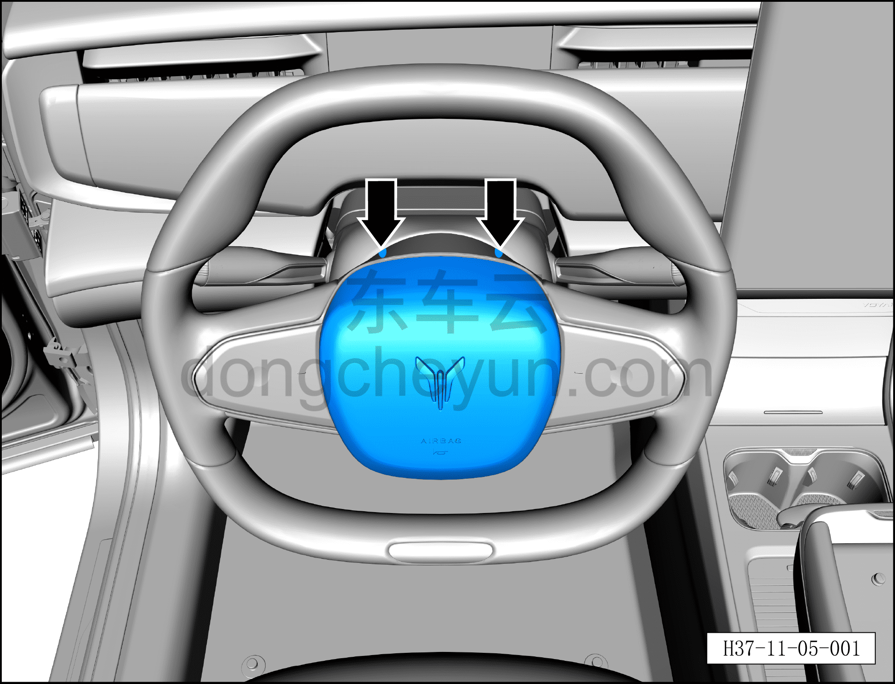
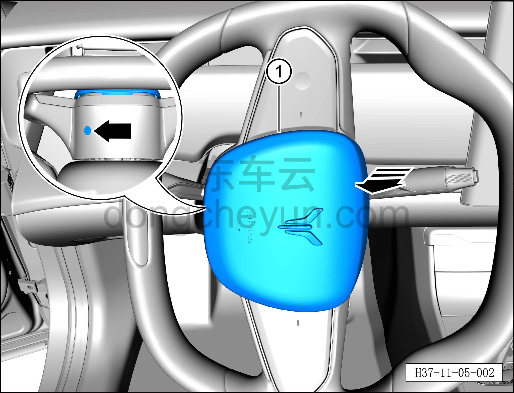
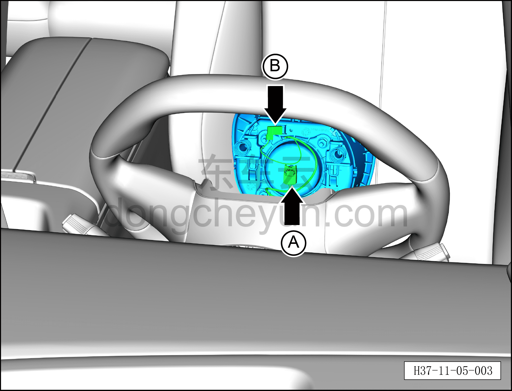
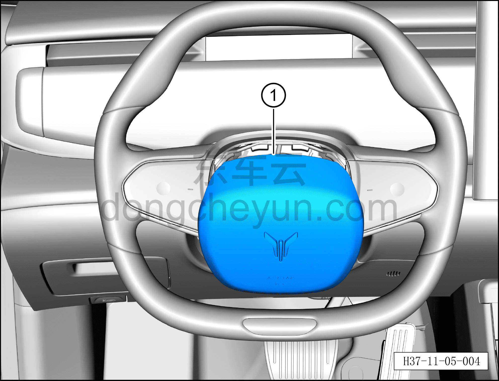

# Снятие и установка подушки безопасности водителя

> Система безопасности › Система безопасности › Подушки безопасности  
> Оригинал: `拆卸与安装驾驶员安全气囊` · [dongcheyun 56746](https://dongcheyun.com/p/56746), страница `50ed69b43c7746ad8151e8ce3f871985` · [оглавление](../README.md)

**Порядок снятия**

**Примечание:**

**– Разборку подушки безопасности водителя можно выполнять только после полного обесточивания автомобиля.**

**– При отсоединении разъёма подушки безопасности водителя необходимо сначала открыть вторичный замок разъёма подушки безопасности, чтобы вызвать внутреннее короткое замыкание подушки безопасности, и только после этого извлекать разъём.**

**– Внимание: несоблюдение указаний повлияет на нормальную работу системы подушек безопасности и может привести к травмированию водителя.**

**– При снятии подушки безопасности водителя необходимо пробить закрытое сервисное отверстие на рулевом колесе.**

1. Выключите все электроприборы, отключите питание.

2. Выполните операцию обесточивания автомобиля для ремонта. См. [3.1.4.1 Обесточивание автомобиля](../03-техническое-обслуживание/005-обесточивание-автомобиля.md)

3. Снятие подушки безопасности водителя.

a. С помощью специального инструмента для снятия подушки безопасности H52226000 введите его внутрь рулевого колеса и отожмите 2 пружинные фиксатора в верхней части подушки безопасности водителя.

**Примечание:**

**– В верхней части имеются 2 сервисных отверстия подушки безопасности с особой маркировкой.**

**– При снятии подушки безопасности водителя необходимо пробить закрытое сервисное отверстие.**

**Внимание:**

**– Перед введением инструмента для снятия подушки безопасности убедитесь, что вводите его в правильно обозначенное отверстие, чтобы не повредить обивку основания рулевого колеса.**

b. Поверните рулевое колесо на 90° вправо, вставьте специальный инструмент для снятия подушки безопасности H52226000 внутрь рулевого колеса и отожмите фиксатор нижней части подушки безопасности водителя.

c. Извлеките подушку безопасности водителя① в направлении стрелки.

**Примечание:**

**– На нижней части подушки безопасности есть специальная маркировка ремонтного отверстия.**

**– При снятии подушки безопасности водителя необходимо пробить закрытое сервисное отверстие.**

**Внимание:**

**– Перед введением инструмента для снятия подушки безопасности убедитесь, что вводите его в правильно обозначенное отверстие, чтобы не повредить обивку основания рулевого колеса.**

d. Используя плоскую отвёртку, отогните фиксатор разъёма и отсоедините разъём подушки безопасности водителя A.

e. Нажмите на защёлку разъёма и отсоедините соединительный разъём звукового сигнала B.

f. Извлеките подушку безопасности водителя①.

g. Если утилизируемая подушка безопасности водителя не была подорвана, необходимо провести её подрыв.

**Внимание:**

**– Не пытайтесь разбирать или ремонтировать подушку безопасности водителя. При обнаружении любых отклонений от нормы необходимо заменить весь узел в сборе новой деталью.**

**– Не пытайтесь измерять сопротивление подушки безопасности водителя или разбирать её. В противном случае это может привести к травме.**

**– Если подушка безопасности водителя упала с высоты, из соображений безопасности её следует заменить новой запасной частью.**

**Порядок установки**

Установка выполняется в обратном порядке.

**Внимание:**

**– После срабатывания любого ремня безопасности или подушки безопасности в результате аварии необходимо заменить не только сработавший компонент, но и весь блок управления подушками безопасности на новый, а после замены выполнить процедуру программирования с помощью диагностического сканера. **

**– Сначала совместите 2 фиксатора на переднем крае подушки безопасности водителя с крепёжными защёлками рулевого колеса и установите их на место, затем нажмите на задний край подушки безопасности водителя, чтобы установить фиксаторы в крепёжные защёлки рулевого колеса.**

**– После завершения установки проверьте и убедитесь, что звуковой сигнал работает нормально, затем подключите диагностический сканер, проверьте наличие кодов неисправностей, и если они есть, найдите причину и очистите коды неисправностей.**
