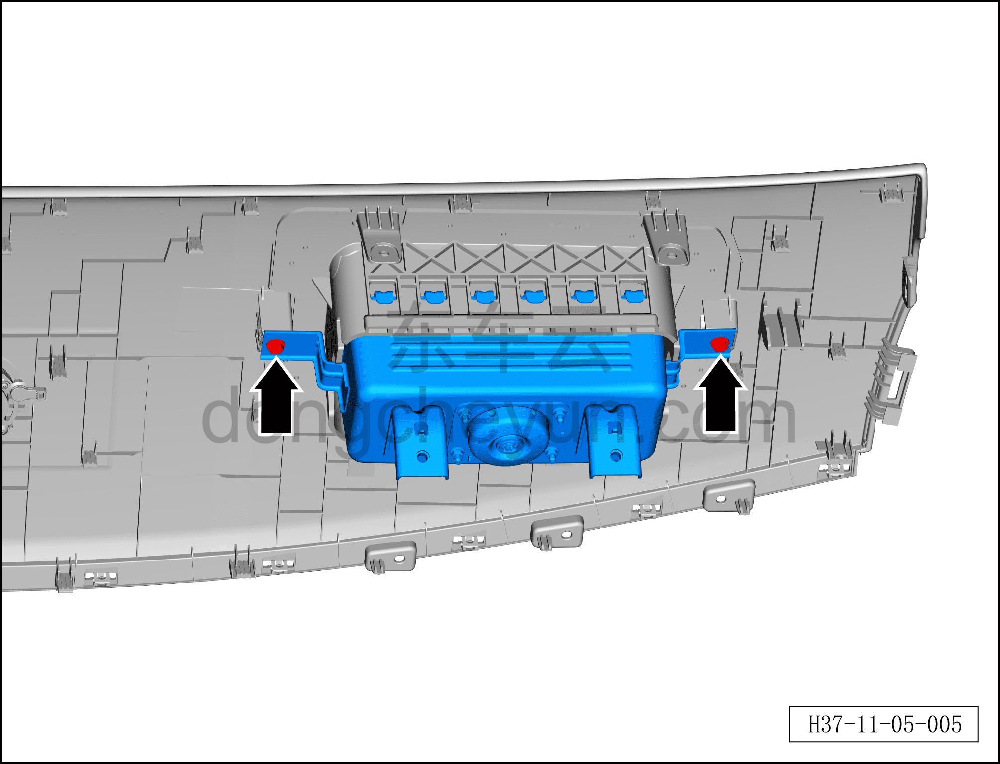
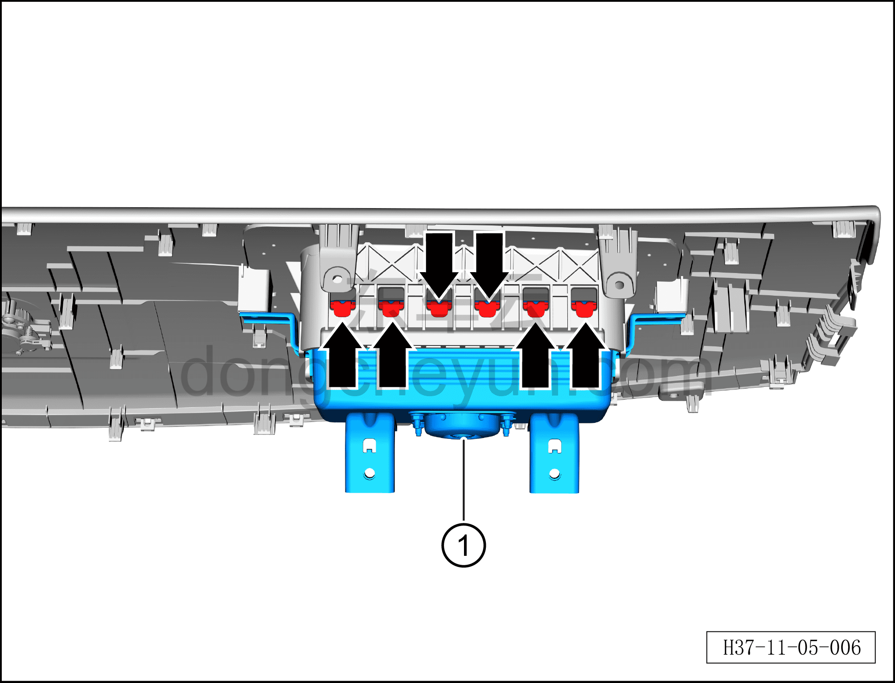
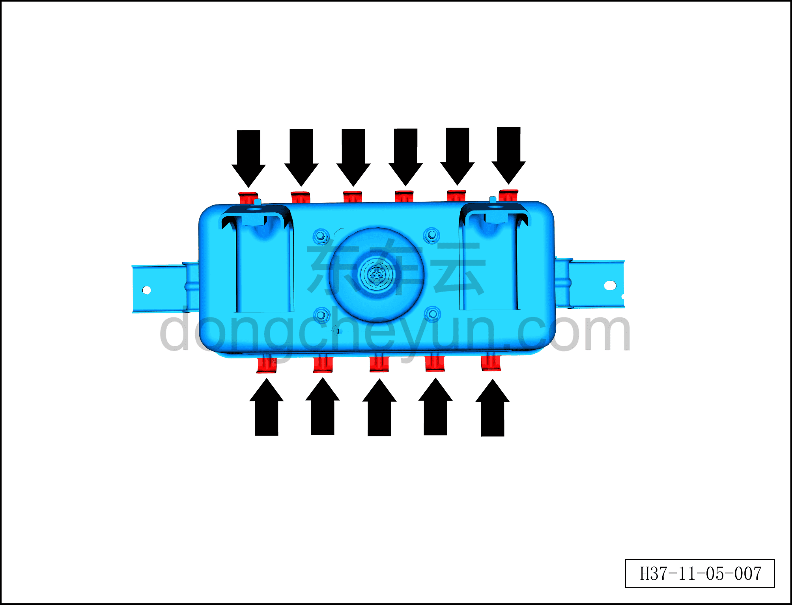

# Снятие и установка подушки безопасности переднего пассажира

> Система безопасности › Система безопасности › Подушки безопасности  
> Оригинал: `拆卸与安装副驾驶员安全气囊` · [dongcheyun 56746](https://dongcheyun.com/p/56746), страница `0a5f36d0f6cb4b118e9159270c75e35f` · [оглавление](../README.md)

**Порядок снятия**

**Примечание:**

**– Разборку подушки безопасности переднего пассажира можно проводить только после обесточивания автомобиля.**

**– При отсоединении разъёма подушки безопасности переднего пассажира сначала необходимо открыть вторичный замок разъёма подушки безопасности, чтобы вызвать короткое замыкание внутри подушки безопасности, и только после этого отсоединять разъём.**

1. Выключите все электроприборы, отключите питание.

2. Выполните операцию обесточивания автомобиля для ремонта. См. [3.1.4.1 Обесточивание автомобиля](../03-техническое-обслуживание/005-обесточивание-автомобиля.md)

3. Снимите верхнюю накладку панели приборов. См. [8.2.4.10 Снятие и установка верхней накладки панели приборов](../08-внутренняя-и-внешняя-отделка/063-снятие-и-установка-верхней-крышки-панели-приборов.md)

4. Снимите подушку безопасности переднего пассажира.

a. Используя крестовую отвёртку, выверните 2 крепёжных винта подушки безопасности переднего пассажира.

Момент затяжки винтов: 6±1 Н·м

b. Используя инструмент для снятия элементов интерьера, отсоедините с обоих концов 11 крепёжных клипс подушки безопасности переднего пассажира.

c. Извлеките подушку безопасности переднего пассажира①.

**Внимание:**

**– Не пытайтесь разбирать или ремонтировать подушку безопасности переднего пассажира. При обнаружении любых отклонений от нормы необходимо заменить весь узел в сборе новой деталью.**

**– Не пытайтесь измерять сопротивление подушки безопасности переднего пассажира или разбирать её. В противном случае это может привести к травме.**

**– Если подушка безопасности переднего пассажира упала с высоты, из соображений безопасности её следует заменить новой запасной частью.**

**Порядок установки**

Установка выполняется в обратном порядке.

**Внимание:**

**– После срабатывания любого ремня безопасности или подушки безопасности в результате аварии необходимо заменить не только сработавший компонент, но и весь блок управления подушками безопасности на новый, а после замены выполнить процедуру программирования с помощью диагностического сканера. **

**– После завершения установки проверьте, нормально ли работают все функции, затем подключите диагностический сканер, проверьте наличие кодов неисправностей, и если они есть, найдите причину и очистите коды неисправностей.**
