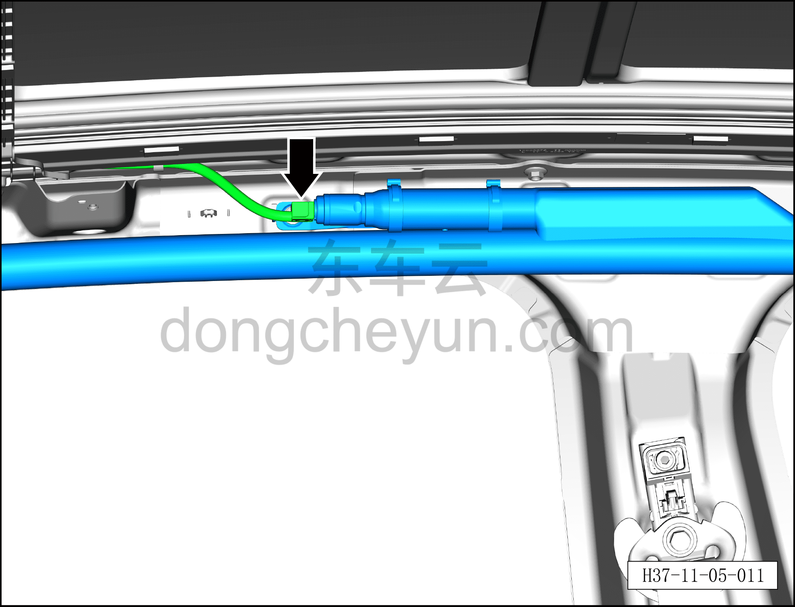
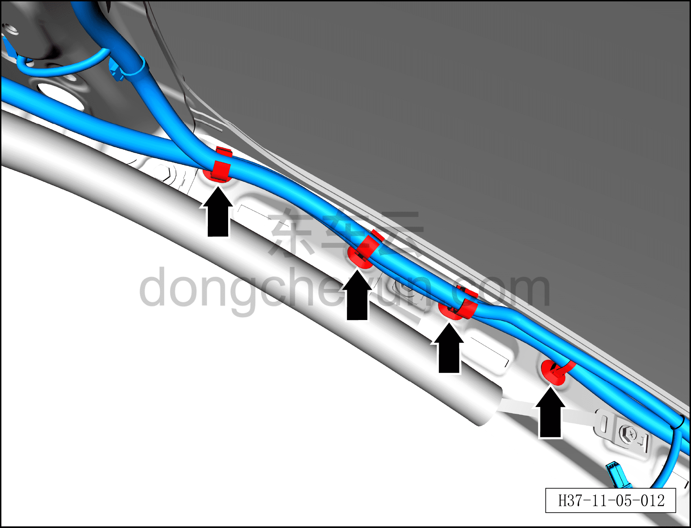
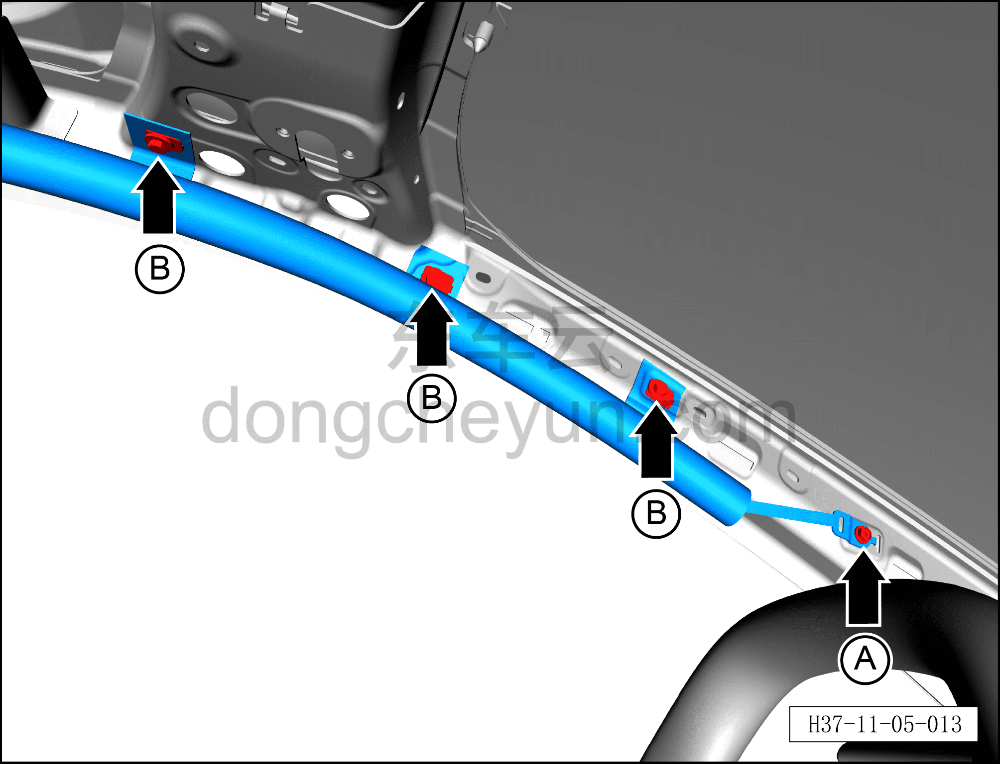
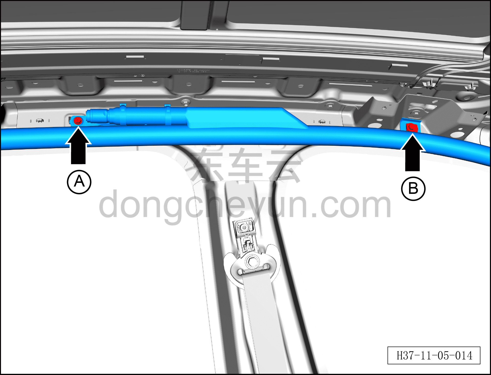
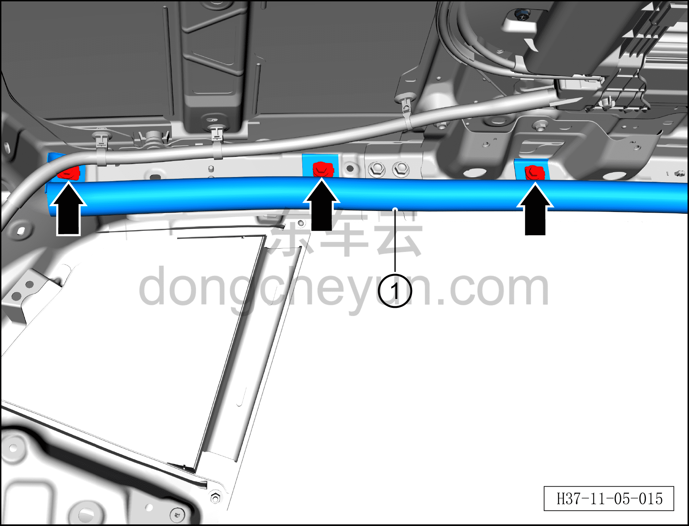

# Снятие и установка левой шторки безопасности

> Система безопасности › Система безопасности › Подушки безопасности  
> Оригинал: `拆卸与安装左侧安全气帘` · [dongcheyun 56746](https://dongcheyun.com/p/56746), страница `0b87cb064fd544939fd9d567804b5a52` · [оглавление](../README.md)

**Порядок снятия**

**Примечание:**

**– Здесь описывается снятие и установка левой шторки безопасности, для правой стороны действуйте по аналогии с левой.**

**– Разборку левой шторки безопасности можно проводить только после обесточивания автомобиля.**

**– При отсоединении разъёма левой шторки безопасности сначала необходимо открыть вторичный замок разъёма подушки безопасности, чтобы вызвать короткое замыкание внутри подушки безопасности, и только после этого отсоединять разъём.**

1. Выключите все электроприборы, отключите питание.

2. Выполните операцию обесточивания автомобиля для ремонта. См. [3.1.4.1 Обесточивание автомобиля](../03-техническое-обслуживание/005-обесточивание-автомобиля.md)

3. Снимите обивку крыши. См. [8.5.6.1 Снятие и установка обивки крыши](../08-внутренняя-и-внешняя-отделка/142-снятие-и-установка-обивки-потолка.md)

4. Снимите левую шторку безопасности.

a. Используя плоскую отвёртку, отогните фиксатор разъёма и отсоедините разъём левой шторки безопасности.

b. Используя инструмент для снятия элементов интерьера, снимите 4 крепёжные клипсы, соединяющие жгут проводов обивки потолка со сливной трубкой люка у левой стойки A, и отведите их в положение, не мешающее работе.

c. Используя торцевую головку 10 мм, выверните передний крепёжный болт A левой шторки безопасности.

Момент затяжки болта A: 8±1 Н·м

d. Используя торцевую головку 10 мм, выверните 3 передних крепёжных болта B левой шторки безопасности.

Момент затяжки болтов B: 8±1 Н·м

e. Используя торцевую головку 10 мм, выверните средний крепёжный болт A левой шторки безопасности.

Момент затяжки болта A: 8±1 Н·м

f. Используя торцевую головку 10 мм, выверните средний крепёжный болт B левой шторки безопасности.

Момент затяжки болтов B: 8±1 Н·м

g. Используя торцевую головку 10 мм, выверните 3 задних крепёжных болта левой шторки безопасности.

Момент затяжки болта: 8±1 Н·м

h. Снимите левую шторку безопасности①.

i. Если утилизируемая левая шторка безопасности не была подорвана, необходимо провести её подрыв.

**Внимание:**

**– Не пытайтесь разбирать или ремонтировать левую шторку безопасности. При обнаружении любых отклонений от нормы необходимо заменить весь узел в сборе новой деталью.**

**– Не пытайтесь измерять сопротивление левой шторки безопасности или разбирать её. В противном случае это может привести к травме.**

**– Если левая шторка безопасности упала с высоты, из соображений безопасности её следует заменить новой запасной частью.**

**Порядок установки**

Установка выполняется в обратном порядке.

**Внимание:**

**– После срабатывания любого ремня безопасности или подушки безопасности в результате аварии необходимо заменить не только сработавший компонент, но и весь блок управления подушками безопасности на новый, а после замены выполнить процедуру программирования с помощью диагностического сканера. **

**– После завершения установки проверьте, нормально ли работают все функции, затем подключите диагностический сканер, проверьте наличие кодов неисправностей, и если они есть, найдите причину и очистите коды неисправностей.**
