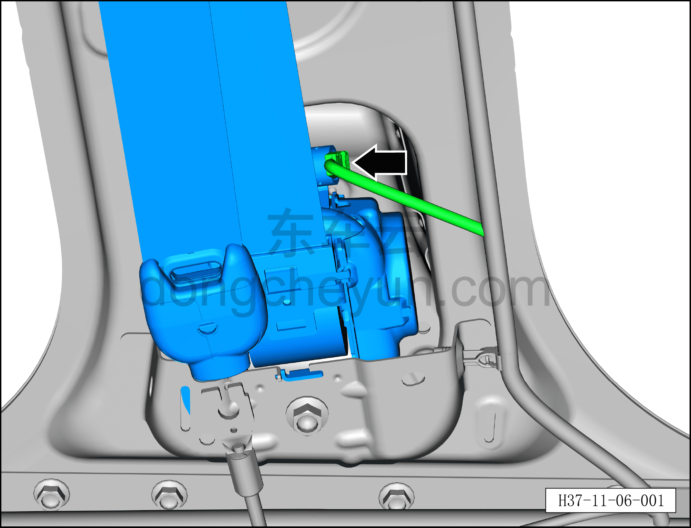
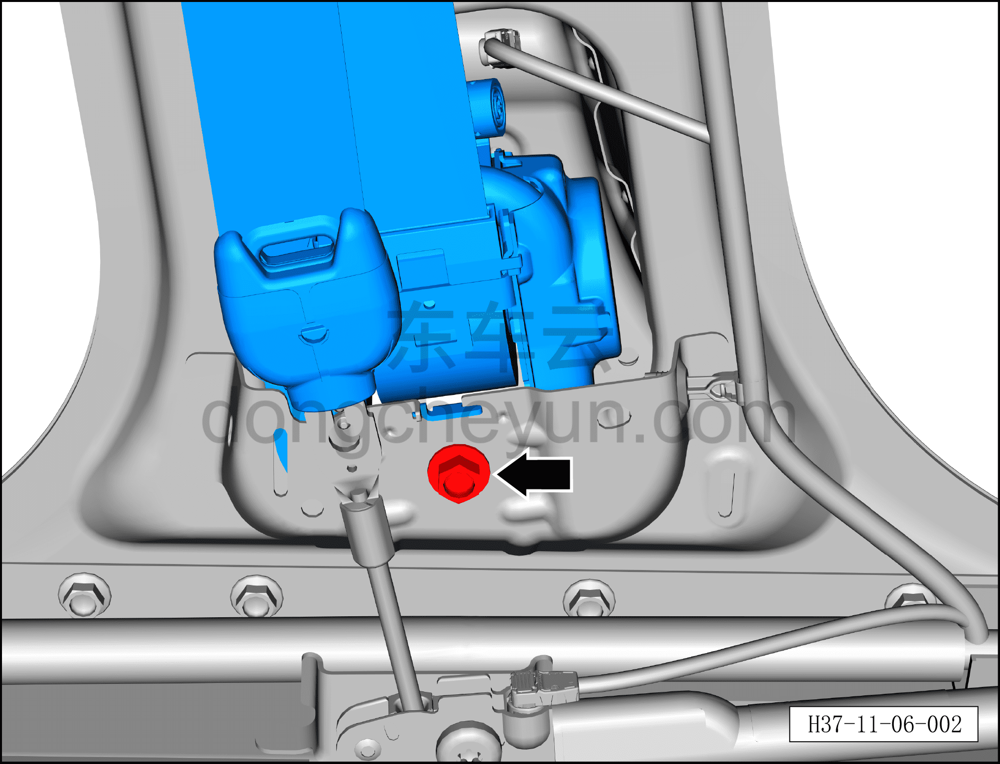
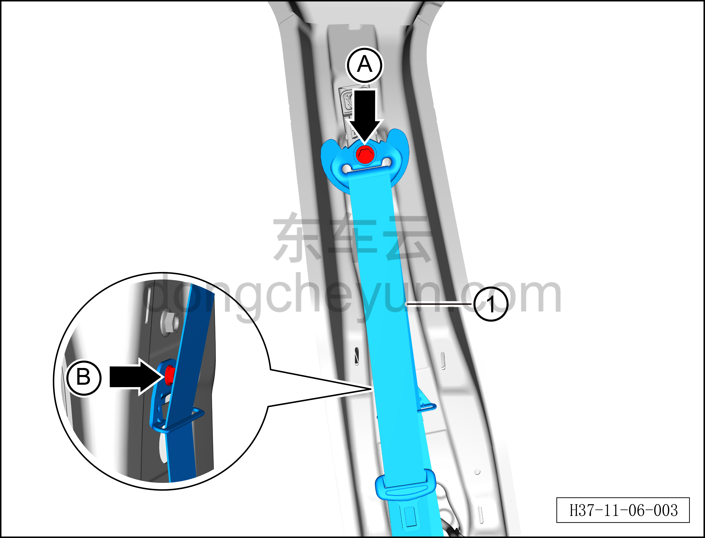

# Снятие и установка левого ремня безопасности переднего сиденья

> Система безопасности › Система безопасности › Ремни безопасности  
> Оригинал: `拆卸与安装前排座椅左侧安全带` · [dongcheyun 56746](https://dongcheyun.com/p/56746), страница `ae5991553f1045d0b4a91963ac804281` · [оглавление](../README.md)

**Порядок снятия**

**Примечание:**

**– Здесь описывается снятие и установка левого ремня безопасности переднего сиденья, для правой стороны действуйте по аналогии с левой.**

1. Выключите все электроприборы, отключите питание.

2. Выполните операцию обесточивания автомобиля для ремонта. См. [3.1.4.1 Обесточивание автомобиля](../03-техническое-обслуживание/005-обесточивание-автомобиля.md)

3. Снимите верхнюю накладку левой стойки B. См. [8.5.5.3 Снятие и установка верхней накладки левой стойки B](../08-внутренняя-и-внешняя-отделка/133-снятие-и-установка-левой-верхней-накладки-стойки-b.md)

4. Снимите левый ремень безопасности переднего сиденья.

a. Используя плоскую отвёртку, отогните фиксатор разъёма и отсоедините разъём левого ремня безопасности переднего сиденья.

b. Используя торцевую головку 14 мм, выверните нижний крепёжный болт левого ремня безопасности переднего сиденья.

Момент затяжки болта: 49±1 Н·м

c. Используя торцевую головку 14 мм, выверните верхний крепёжный болт A левого ремня безопасности переднего сиденья.

Момент затяжки болта A: 49±1 Н·м

d. Используя торцевую головку 10 мм, выверните крепёжный болт B кронштейна левого ремня безопасности переднего сиденья.

Момент затяжки болта B: 10±1 Н·м

e. Снимите левый ремень безопасности переднего сиденья①.

**Порядок установки**

Установка выполняется в обратном порядке.

**Внимание:**

**– После срабатывания любого ремня безопасности или подушки безопасности в результате аварии необходимо заменить не только сработавший компонент, но и весь блок управления подушками безопасности на новый, а после замены выполнить процедуру программирования с помощью диагностического сканера. **

**– Указанные выше болты, задействованные в описанных операциях снятия и установки, покрыты резьбовым фиксатором; для облегчения снятия их можно перед снятием нагреть горячим воздухом, а во время нагрева защитить соседний ремень безопасности влажной тканью.**

**– После завершения установки проверьте, нормально ли работают передние ремни безопасности, затем подключите диагностический сканер, проверьте наличие кодов неисправностей, и если они есть, найдите причину и очистите коды неисправностей.**
