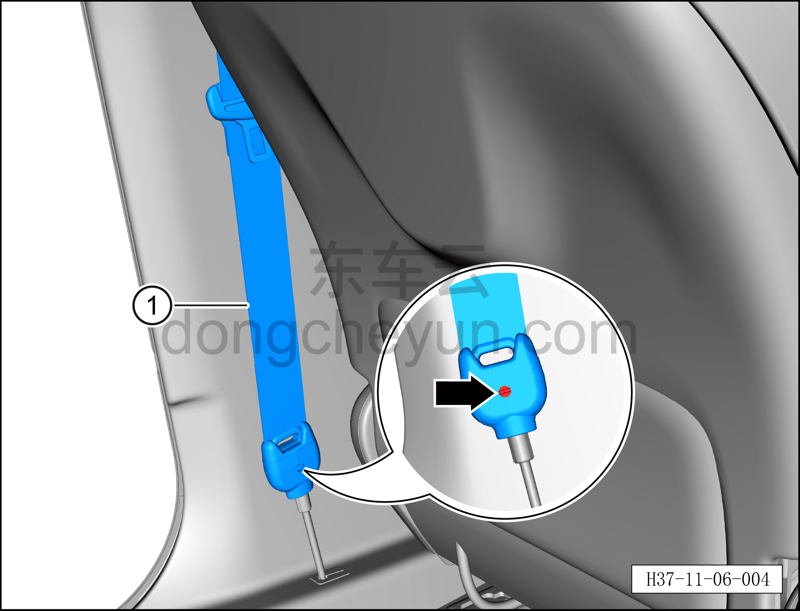
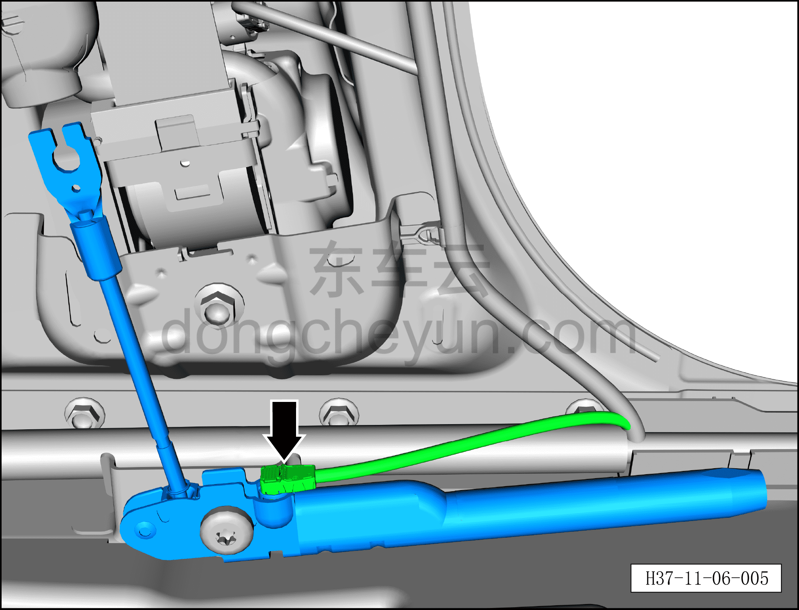
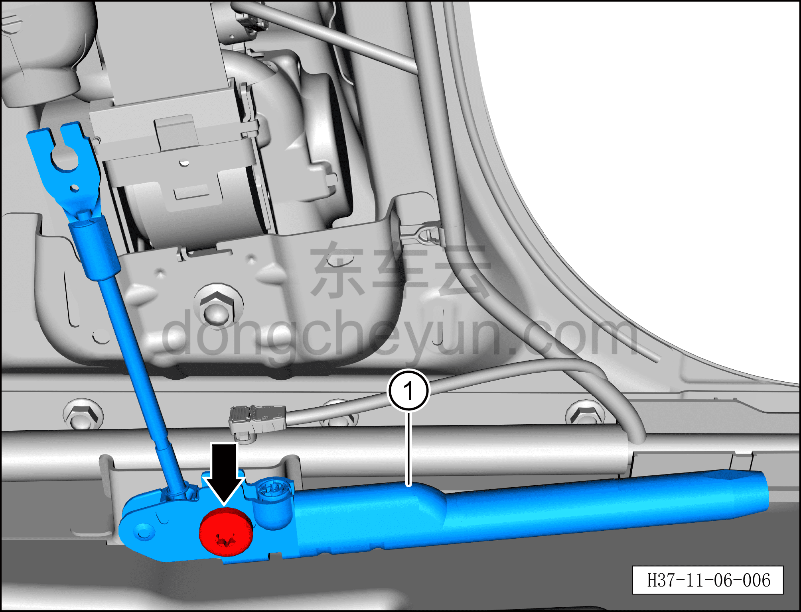

# Снятие и установка левого преднатяжителя концевой пластины

> Система безопасности › Система безопасности › Ремни безопасности  
> Оригинал: `拆卸与安装左端片预紧器` · [dongcheyun 56746](https://dongcheyun.com/p/56746), страница `3207c1e8115a4e189d9b7ee7c849c5d6` · [оглавление](../README.md)

**Порядок снятия**

**Примечание:**

**– Здесь описывается снятие и установка левого преднатяжителя концевой пластины, для правого преднатяжителя концевой пластины действуйте по аналогии с левым.**

1. Выключите все электроприборы, отключите питание.

2. Выполните операцию обесточивания автомобиля для ремонта. См. [3.1.4.1 Обесточивание автомобиля](../03-техническое-обслуживание/005-обесточивание-автомобиля.md)

3. Снимите левый преднатяжитель концевой пластины.

a. Используя плоскую отвёртку, отсоедините фиксатор левого преднатяжителя концевой пластины и извлеките левый передний ремень безопасности①.

b. Снимите нижнюю накладку левой стойки B. См. [8.5.5.2 Снятие и установка нижней накладки левой стойки B](../08-внутренняя-и-внешняя-отделка/132-снятие-и-установка-левой-нижней-накладки-стойки-b.md)

c. Используя плоскую отвёртку, отогните фиксатор разъёма и отсоедините разъём левого преднатяжителя концевой пластины.

d. Используя торцевую головку T50, выверните крепёжный болт.

Момент затяжки болта: 49±1 Н·м

e. Снимите левый преднатяжитель концевой пластины①.

**Порядок установки**

Установка выполняется в обратном порядке.

**Внимание:**

**– **

**– Указанные выше болты, задействованные в описанных операциях снятия и установки, покрыты резьбовым фиксатором; для облегчения снятия их можно перед снятием нагреть горячим воздухом, а во время нагрева защитить соседний ремень безопасности влажной тканью.**

**– После завершения установки проверьте, нормально ли работает левый преднатяжитель концевой пластины, затем подключите диагностический сканер, проверьте наличие кодов неисправностей, и если они есть, найдите причину и очистите коды неисправностей.**
