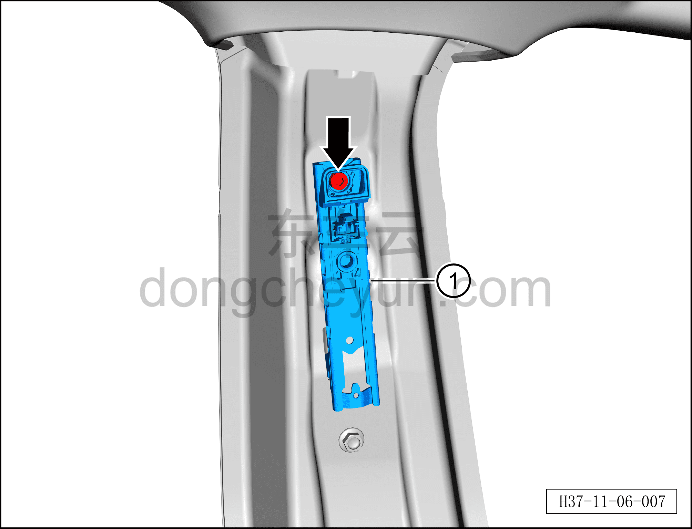

# Снятие и установка регулятора высоты ремня безопасности

> Система безопасности › Система безопасности › Ремни безопасности  
> Оригинал: `拆卸与安装安全带高度调节器` · [dongcheyun 56746](https://dongcheyun.com/p/56746), страница `4daff5d1fd9747b7a4fe3afe7bc0e789` · [оглавление](../README.md)

**Порядок снятия**

**Примечание:**

**– Здесь описывается снятие и установка левого регулятора высоты ремня безопасности, для правой стороны действуйте по аналогии с левой.**

1. Выключите все электроприборы, отключите питание.

2. Выполните операцию обесточивания автомобиля для ремонта. См. [3.1.4.1 Обесточивание автомобиля](../03-техническое-обслуживание/005-обесточивание-автомобиля.md)

3. Снимите верхнюю накладку левой стойки B. См. [8.5.5.3 Снятие и установка верхней накладки левой стойки B](../08-внутренняя-и-внешняя-отделка/133-снятие-и-установка-левой-верхней-накладки-стойки-b.md)

4. Снимите левый ремень безопасности переднего сиденья. См. [11.1.6.1 Снятие и установка левого ремня безопасности переднего сиденья](011-снятие-и-установка-левого-ремня-безопасности-переднего.md)

5. Снимите левый регулятор высоты ремня безопасности.

a. Используя торцевую головку с внутренним шестигранником 6 мм, выверните крепёжный болт левого регулятора высоты ремня безопасности.

Момент затяжки болта: 30±5 Н·м

b. Снимите левый регулятор высоты ремня безопасности①.

**Порядок установки**

Установка выполняется в обратном порядке.

**Внимание:**

**– После завершения установки проверьте, нормально ли работает левый регулятор высоты ремня безопасности, затем подключите диагностический сканер, проверьте наличие кодов неисправностей, и если они есть, найдите причину и очистите коды неисправностей.**
