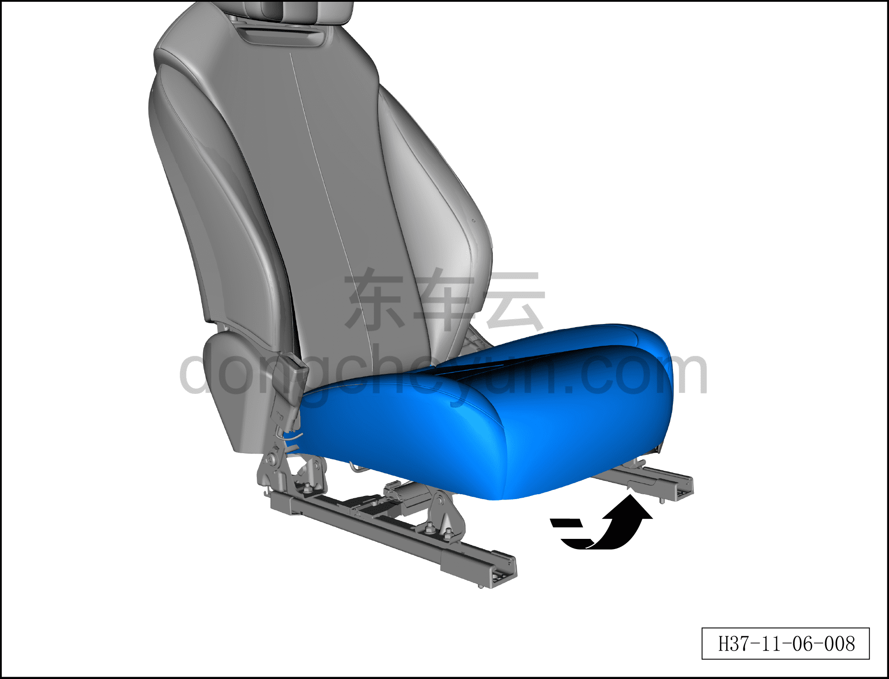
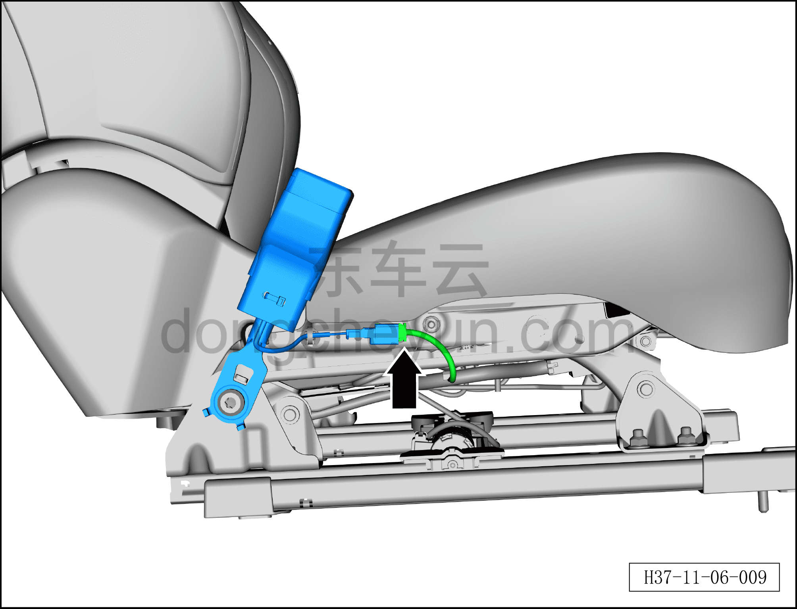
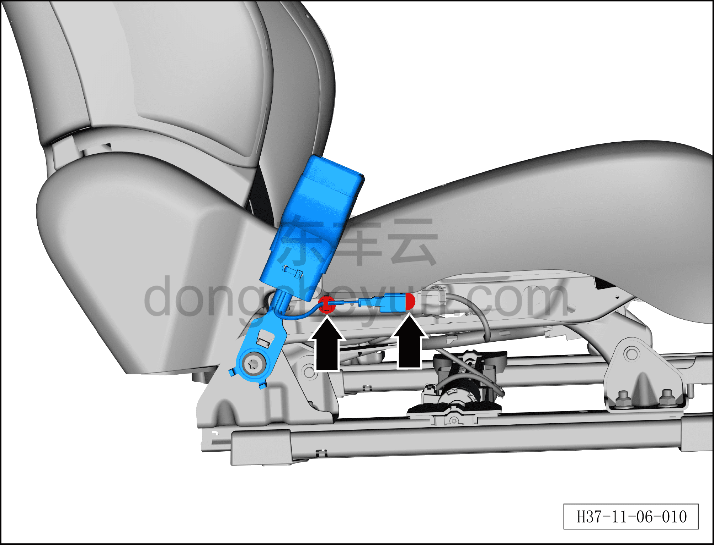
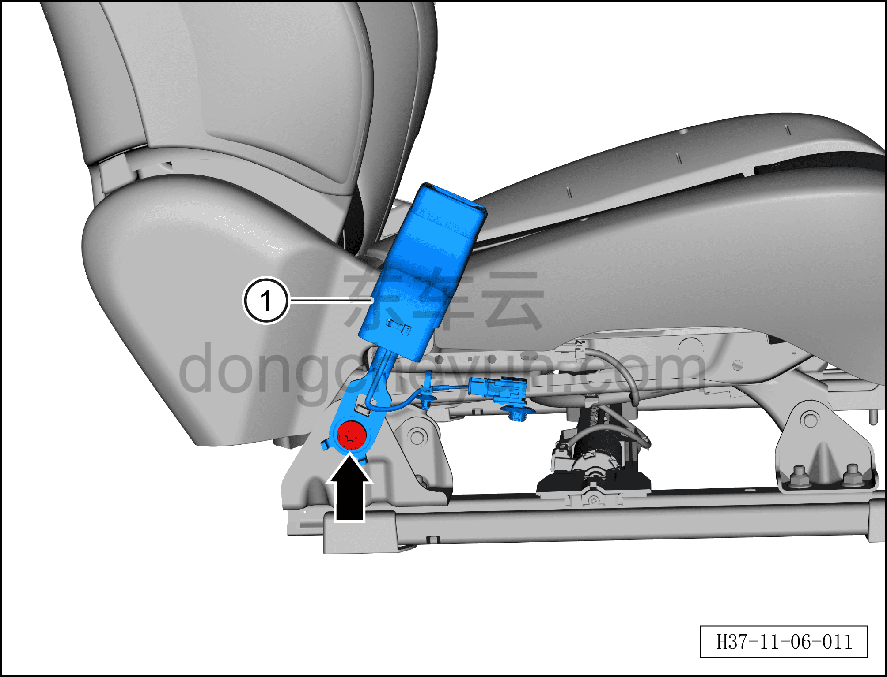

# Снятие и установка замка переднего ремня безопасности

> Система безопасности › Система безопасности › Ремни безопасности  
> Оригинал: `拆卸与安装前排安全带锁扣` · [dongcheyun 56746](https://dongcheyun.com/p/56746), страница `71d1b84f402b43a7b3e7a15ae780f58d` · [оглавление](../README.md)

**Порядок снятия**

**Примечание:**

**– Здесь описывается снятие и установка левого замка переднего ремня безопасности, для правой стороны действуйте по аналогии с левой.**

1. Выключите все электроприборы, отключите питание.

2. Выполните операцию обесточивания автомобиля для ремонта. См. [3.1.4.1 Обесточивание автомобиля](../03-техническое-обслуживание/005-обесточивание-автомобиля.md)

3. Снимите переднее сиденье водителя в сборе. См. [8.1.3.1 Снятие и установка переднего сиденья в сборе](../08-внутренняя-и-внешняя-отделка/003-снятие-и-установка-сиденья-водителя-в-сборе.md)

5. Снимите левый замок переднего ремня безопасности.

a. Приподнимите обивку левого переднего сиденья в направлении стрелки.

b. Используя плоскую отвёртку, нажмите на защёлку разъёма и отсоедините разъём левого замка переднего ремня безопасности.

c. Используя инструмент для снятия элементов интерьера, снимите 2 крепёжные клипсы жгута проводов левого замка переднего ремня безопасности.

d. Используя торцевую головку T50, выверните крепёжный болт левого замка переднего ремня безопасности.

Момент затяжки болта: 50±8 Н·м

e. Снимите левый замок переднего ремня безопасности①.

**Порядок установки**

Установка выполняется в обратном порядке.

**Внимание:**

**– После завершения установки проверьте, нормально ли работают все функции, затем подключите диагностический сканер, проверьте наличие кодов неисправностей, и если они есть, найдите причину и очистите коды неисправностей.**
