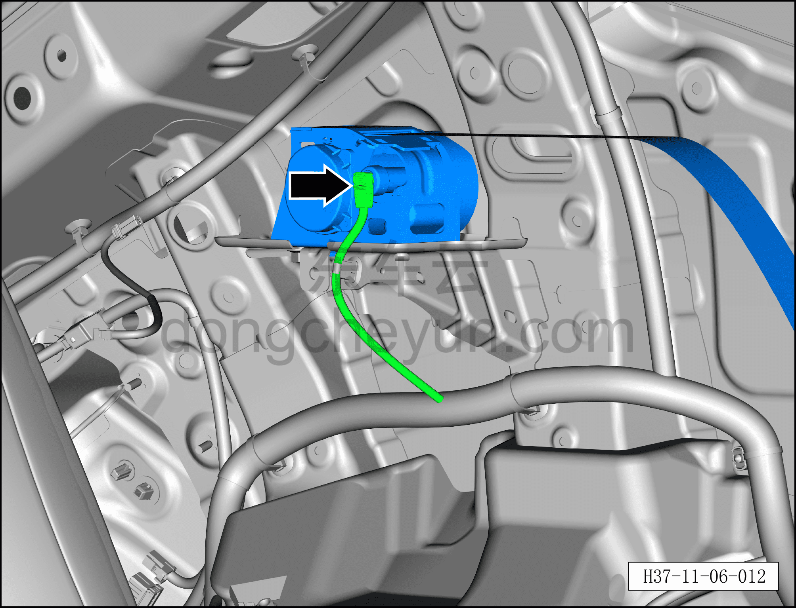
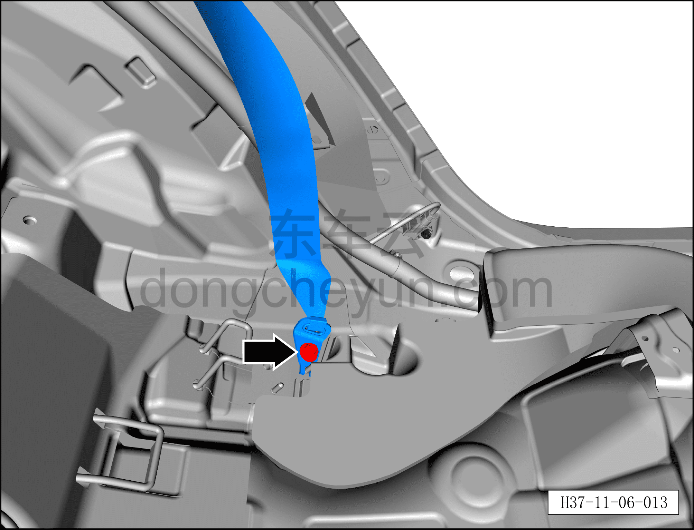
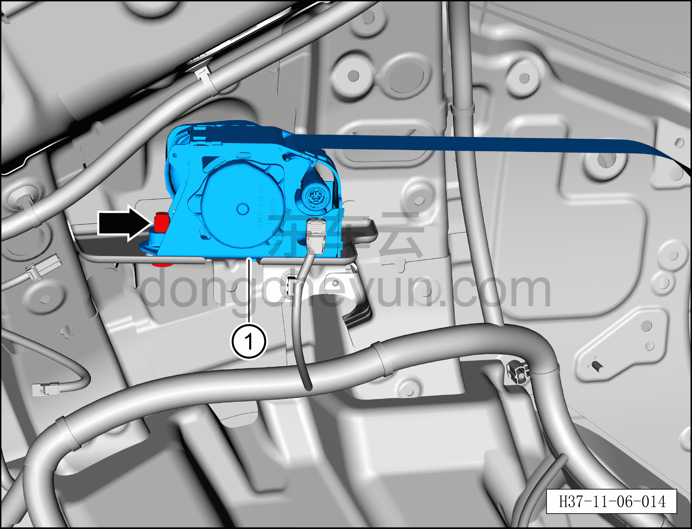

# Снятие и установка левого ремня безопасности второго ряда сидений

> Система безопасности › Система безопасности › Ремни безопасности  
> Оригинал: `拆卸与安装第二排座椅左侧安全带` · [dongcheyun 56746](https://dongcheyun.com/p/56746), страница `15e2b07fd5574a09b6fdbb76b966b971` · [оглавление](../README.md)

**Порядок снятия**

**Примечание:**

**– Здесь описывается снятие и установка левого ремня безопасности второго ряда сидений, для правой стороны действуйте по аналогии с левой.**

1. Выключите все электроприборы, отключите питание.

2. Выполните операцию обесточивания автомобиля для ремонта. См. [3.1.4.1 Обесточивание автомобиля](../03-техническое-обслуживание/005-обесточивание-автомобиля.md)

3. Снимите подушку заднего сиденья в сборе. См. [8.1.5.1 Снятие и установка подушки заднего сиденья в сборе](../08-внутренняя-и-внешняя-отделка/029-снятие-и-установка-подушки-заднего-сиденья.md)

4. Снимите спинку левого заднего сиденья в сборе. См. [8.1.5.6 Снятие и установка спинки левого заднего сиденья в сборе](../08-внутренняя-и-внешняя-отделка/034-снятие-и-установка-левой-спинки-заднего-сиденья.md)

5. Снимите нижнюю накладку левой стойки C. См. [8.5.5.4 Снятие и установка нижней накладки левой стойки C](../08-внутренняя-и-внешняя-отделка/134-снятие-и-установка-левой-нижней-накладки-стойки-c.md)

6. Снимите левую заднюю боковую обивку. См. [8.5.5.6 Снятие и установка левой задней боковой обивки](../08-внутренняя-и-внешняя-отделка/136-снятие-и-установка-левой-обивки-задней-боковины.md)

7. Снимите левый ремень безопасности второго ряда сидений.

a. Используя плоскую отвёртку, отогните фиксатор разъёма и отсоедините разъём левого ремня безопасности второго ряда сидений.

b. Используя торцевую головку 14 мм, выверните нижний крепёжный болт левого ремня безопасности второго ряда сидений.

Момент затяжки болта: 49±1 Н·м

c. Используя торцевую головку 14 мм, выверните верхний крепёжный болт левого ремня безопасности второго ряда сидений.

Момент затяжки болта: 49±1 Н·м

d. Снимите левый ремень безопасности второго ряда сидений①.

**Порядок установки**

Установка выполняется в обратном порядке.

**Внимание:**

**– После срабатывания любого ремня безопасности или подушки безопасности в результате аварии необходимо заменить не только сработавший компонент, но и весь блок управления подушками безопасности на новый, а после замены выполнить процедуру программирования с помощью диагностического сканера. **

**– После завершения установки проверьте, нормально ли работает левый ремень безопасности второго ряда сидений, затем подключите диагностический сканер, проверьте наличие кодов неисправностей, и если они есть, найдите причину и очистите коды неисправностей.**
