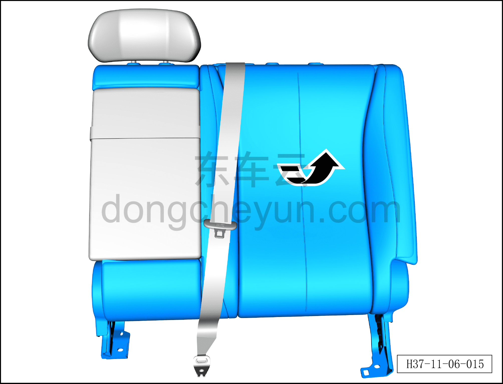
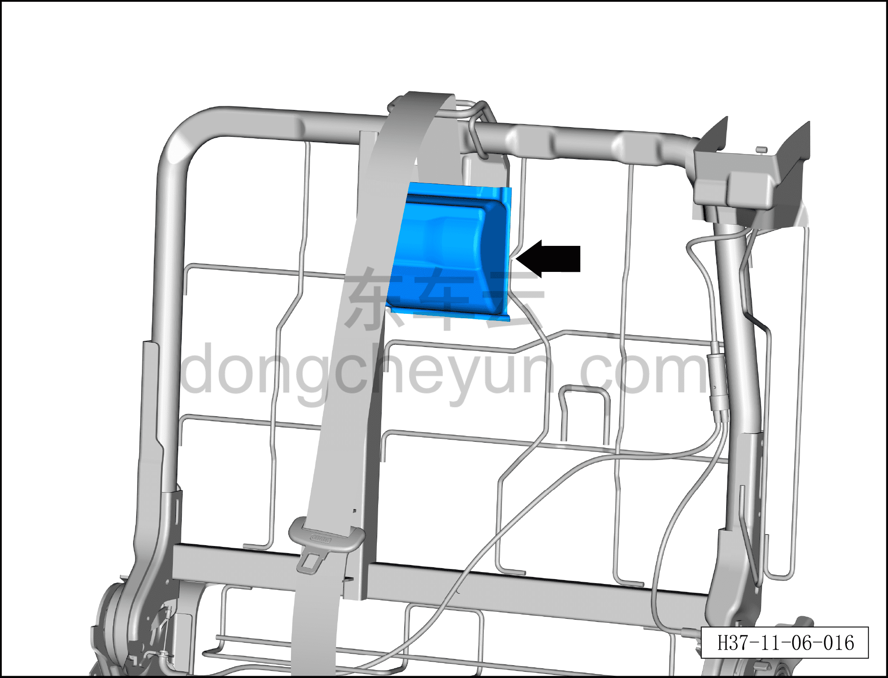
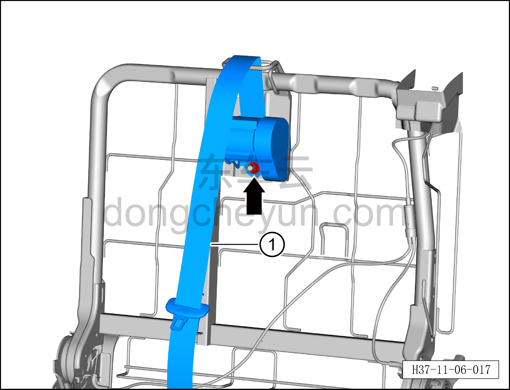

# Снятие и установка среднего ремня безопасности второго ряда сидений

> Система безопасности › Система безопасности › Ремни безопасности  
> Оригинал: `拆卸与安装第二排座椅中安全带` · [dongcheyun 56746](https://dongcheyun.com/p/56746), страница `1e7da7b55488473aacf91af5be3183fd` · [оглавление](../README.md)

**Порядок снятия**

1. Выключите все электроприборы, отключите питание.

2. Выполните операцию обесточивания автомобиля для ремонта. См. [3.1.4.1 Обесточивание автомобиля](../03-техническое-обслуживание/005-обесточивание-автомобиля.md)

3. Снимите подушку заднего сиденья в сборе. См. [8.1.5.1 Снятие и установка подушки заднего сиденья в сборе](../08-внутренняя-и-внешняя-отделка/029-снятие-и-установка-подушки-заднего-сиденья.md)

4. Снимите спинку левого заднего сиденья в сборе. См. [8.1.5.6 Снятие и установка спинки левого заднего сиденья в сборе](../08-внутренняя-и-внешняя-отделка/034-снятие-и-установка-левой-спинки-заднего-сиденья.md)

5. Снимите накладку заднего ремня безопасности. См. [8.1.5.10 Снятие и установка накладки заднего ремня безопасности](../08-внутренняя-и-внешняя-отделка/038-снятие-и-установка-крышки-ретрактора.md)

6. Снимите пластиковую крышку верхней точки крепления детского сиденья с левой стороны. См. [8.1.5.11 Снятие и установка пластиковой крышки точки крепления детского сиденья](../08-внутренняя-и-внешняя-отделка/039-снятие-и-установка-крышки-отсека-детского-сиденья.md)

7. Снимите направляющую втулку левого заднего подголовника. См. [8.1.5.3 Снятие и установка направляющей втулки заднего подголовника](../08-внутренняя-и-внешняя-отделка/031-снятие-и-установка-направляющей-втулки-подголовника.md)

8. Снимите средний ремень безопасности второго ряда сидений.

a. Приподнимите угол чехла левой спинки вместе с наполнителем с правой стороны.

b. Снимите защитный кожух среднего ремня безопасности второго ряда сидений.

c. Используя торцевую головку 16 мм, выверните крепёжную гайку среднего ремня безопасности второго ряда сидений.

Момент затяжки болта: 50±8 Н·м

d. Снимите средний ремень безопасности второго ряда сидений①.

**Порядок установки**

Установка выполняется в обратном порядке.

**Внимание:**

**– После срабатывания любого ремня безопасности или подушки безопасности в результате аварии необходимо заменить не только сработавший компонент, но и весь блок управления подушками безопасности на новый, а после замены выполнить процедуру программирования с помощью диагностического сканера. **

**– После завершения установки проверьте, нормально ли работает средний ремень безопасности второго ряда сидений, затем подключите диагностический сканер, проверьте наличие кодов неисправностей, и если они есть, найдите причину и очистите коды неисправностей.**
