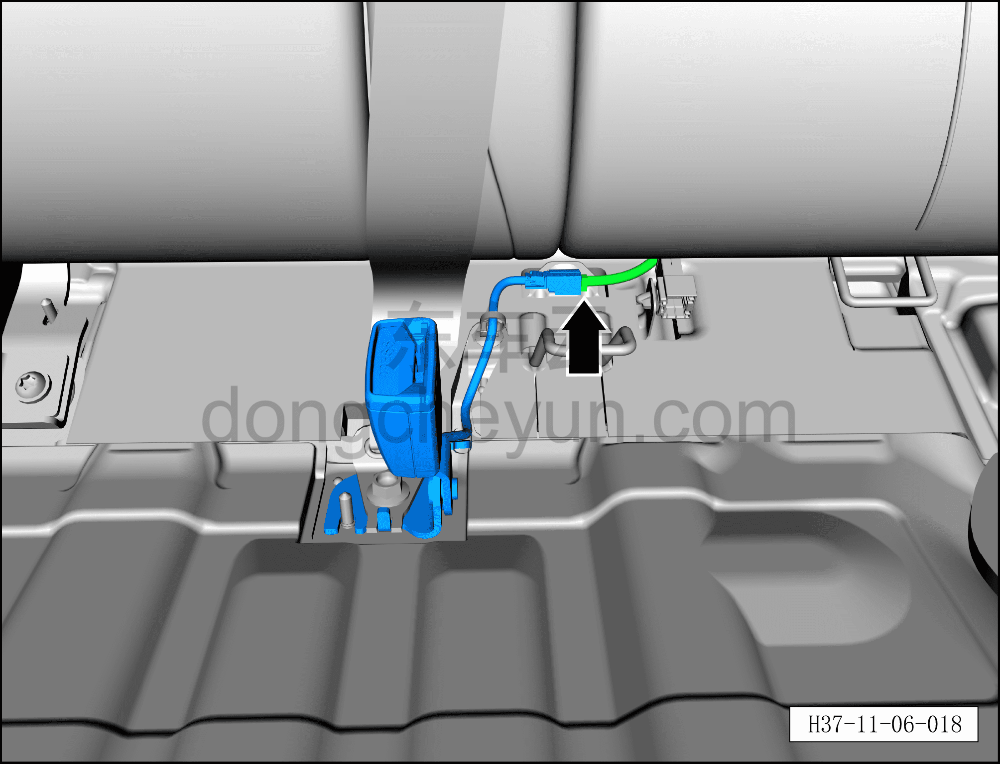
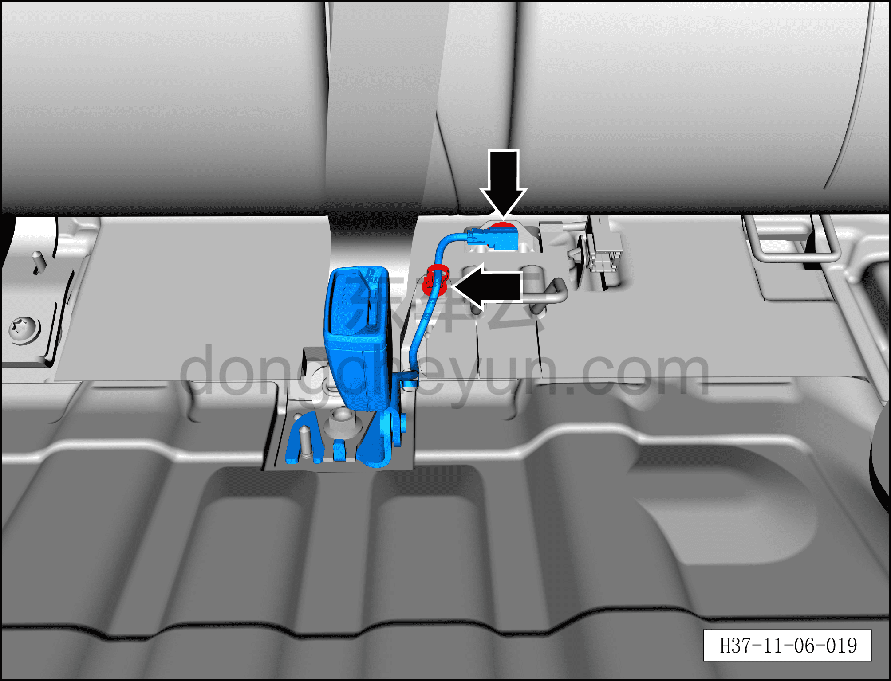
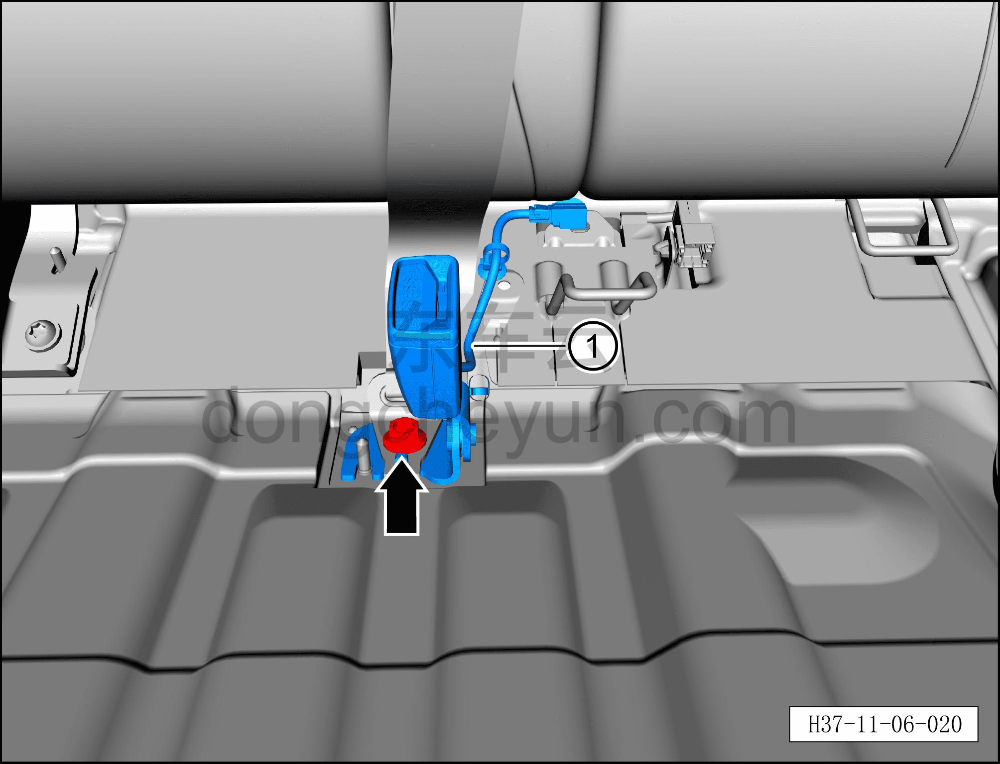

# Снятие и установка одинарного узла замка ремня безопасности заднего ряда

> Система безопасности › Система безопасности › Ремни безопасности  
> Оригинал: `拆卸与安装后排单带扣组件` · [dongcheyun 56746](https://dongcheyun.com/p/56746), страница `d619f220f58b4760b53ba44dc6e011c8` · [оглавление](../README.md)

**Порядок снятия**

1. Выключите все электроприборы, отключите питание.

2. Выполните операцию обесточивания автомобиля для ремонта. См. [3.1.4.1 Обесточивание автомобиля](../03-техническое-обслуживание/005-обесточивание-автомобиля.md)

3. Снимите подушку заднего сиденья в сборе. См. [8.1.5.1 Снятие и установка подушки заднего сиденья в сборе](../08-внутренняя-и-внешняя-отделка/029-снятие-и-установка-подушки-заднего-сиденья.md)

4. Снимите одинарный узел замка ремня безопасности заднего ряда.

a. Используя плоскую отвёртку, нажмите на защёлку разъёма и отсоедините разъём одинарного узла замка ремня безопасности заднего ряда.

b. Используя инструмент для снятия элементов интерьера, снимите 2 крепёжные клипсы жгута проводов одинарного узла замка ремня безопасности заднего ряда.

c. Используя торцевую головку 14 мм, выверните крепёжный болт одинарного узла замка ремня безопасности заднего ряда.

Момент затяжки болта: 49±1 Н·м

d. Снимите одинарный узел замка ремня безопасности заднего ряда①.

**Порядок установки**

Установка выполняется в обратном порядке.

**Внимание:**

**– При установке подушки заднего сиденья в сборе следует предварительно пропустить одинарный узел замка ремня безопасности заднего ряда через предусмотренное отверстие, затем подключить диагностический сканер, проверить наличие кодов неисправностей, и если они есть, найти причину и очистить коды неисправностей.**
