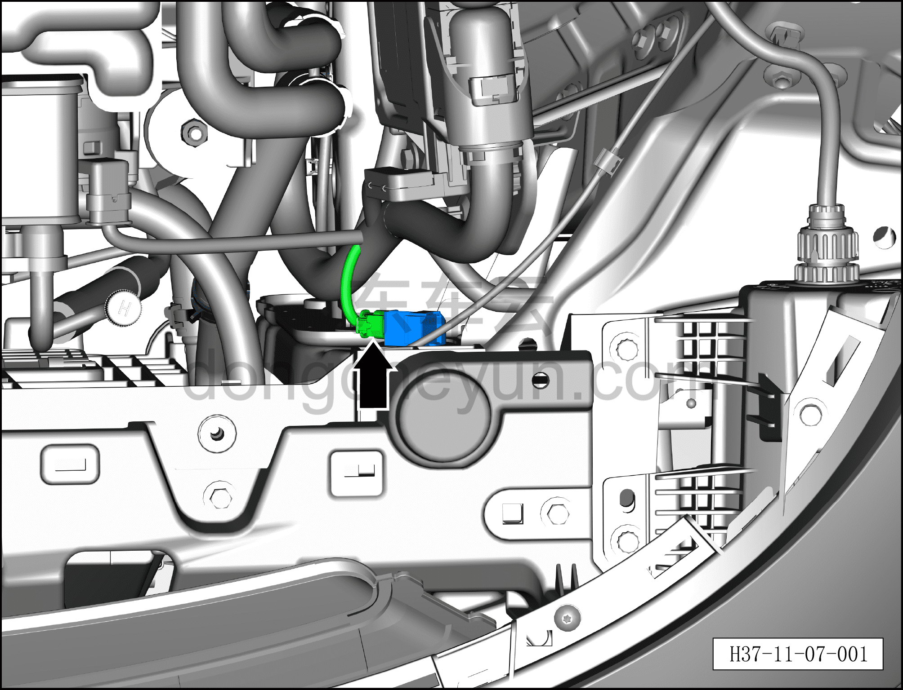
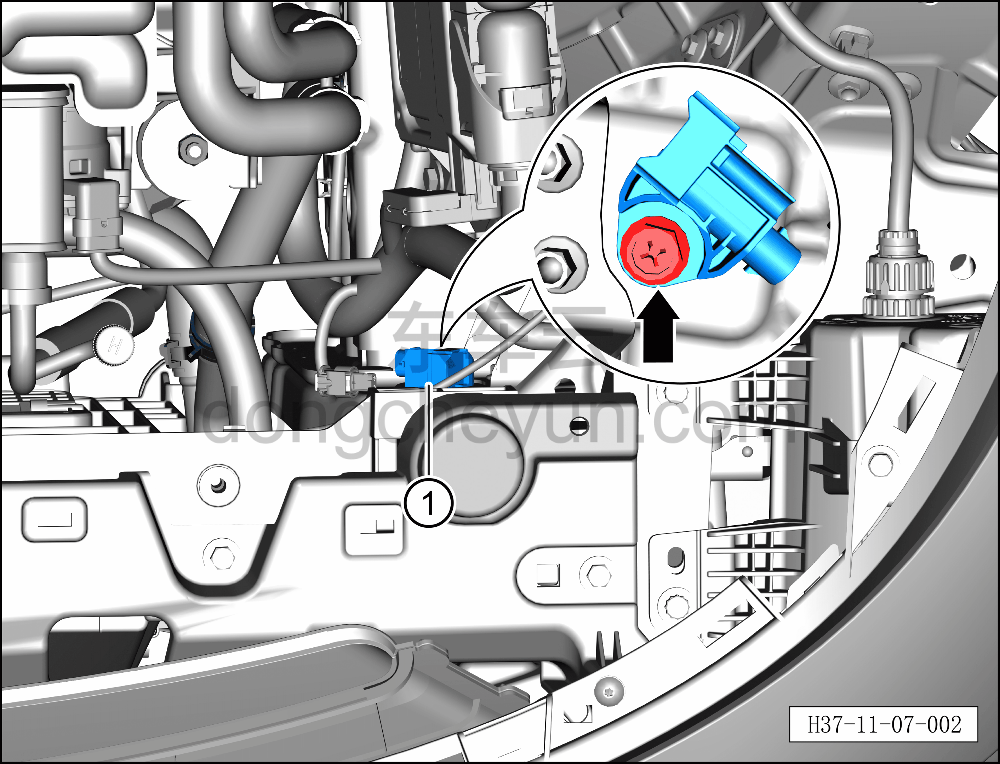

# Снятие и установка переднего датчика удара (в моторном отсеке)

> Система безопасности › Система безопасности › Компоненты и датчики системы пассивной безопасности  
> Оригинал: `拆卸与安装前碰传感器（机舱内）` · [dongcheyun 56746](https://dongcheyun.com/p/56746), страница `65d725a0d8114bfe9489e72d146af36f` · [оглавление](../README.md)

**Порядок снятия**

**Примечание:**

**– Здесь описывается снятие и установка левого переднего датчика удара, для правой стороны действуйте по аналогии с левой.**

1. Выключите все электроприборы, отключите питание.

2. Выполните операцию обесточивания автомобиля для ремонта. См. [3.1.4.1 Обесточивание автомобиля](../03-техническое-обслуживание/005-обесточивание-автомобиля.md)

3. Снимите декоративную накладку моторного отсека. См. [8.6.6.10 Снятие и установка декоративной накладки моторного отсека](../08-внутренняя-и-внешняя-отделка/223-снятие-и-установка-декоративной-накладки-моторного.md)

4. Снимите левый передний датчик удара.

a. Нажмите на защёлку левого разъёма и отсоедините разъём левого переднего датчика удара.

b. Используя торцевую головку 10 мм или крестовую отвёртку, выверните крепёжный болт левого переднего датчика удара.

Момент затяжки болта: 9±1 Н·м

c. Снимите левый передний датчик удара①.

**Порядок установки**

Установка выполняется в обратном порядке.

**Внимание:**

**– После завершения установки проверьте, нормально ли работает передний датчик удара, затем подключите диагностический сканер, проверьте наличие кодов неисправностей, и если они есть, найдите причину и очистите коды неисправностей.**
