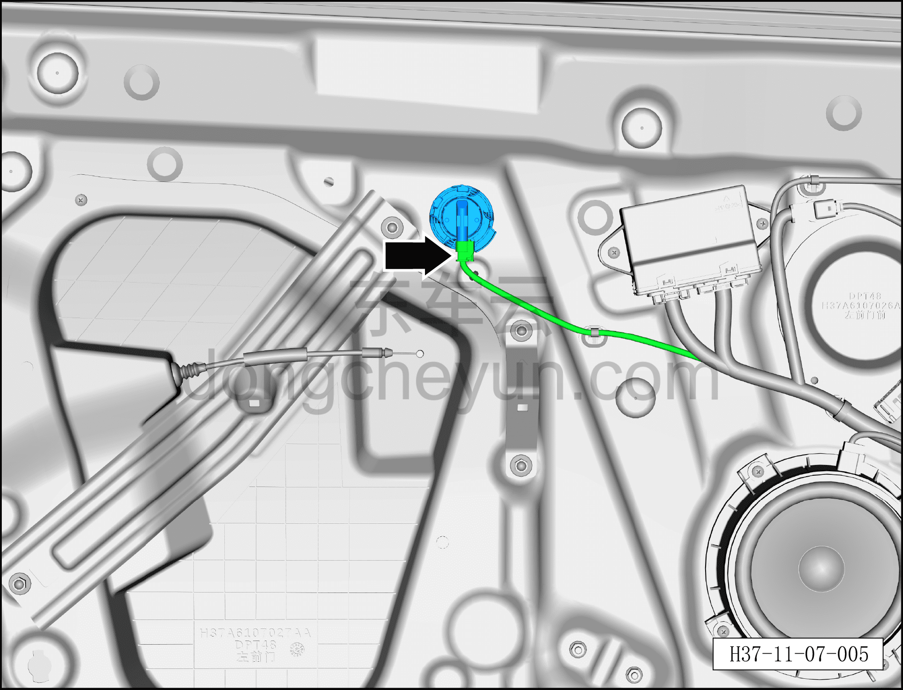
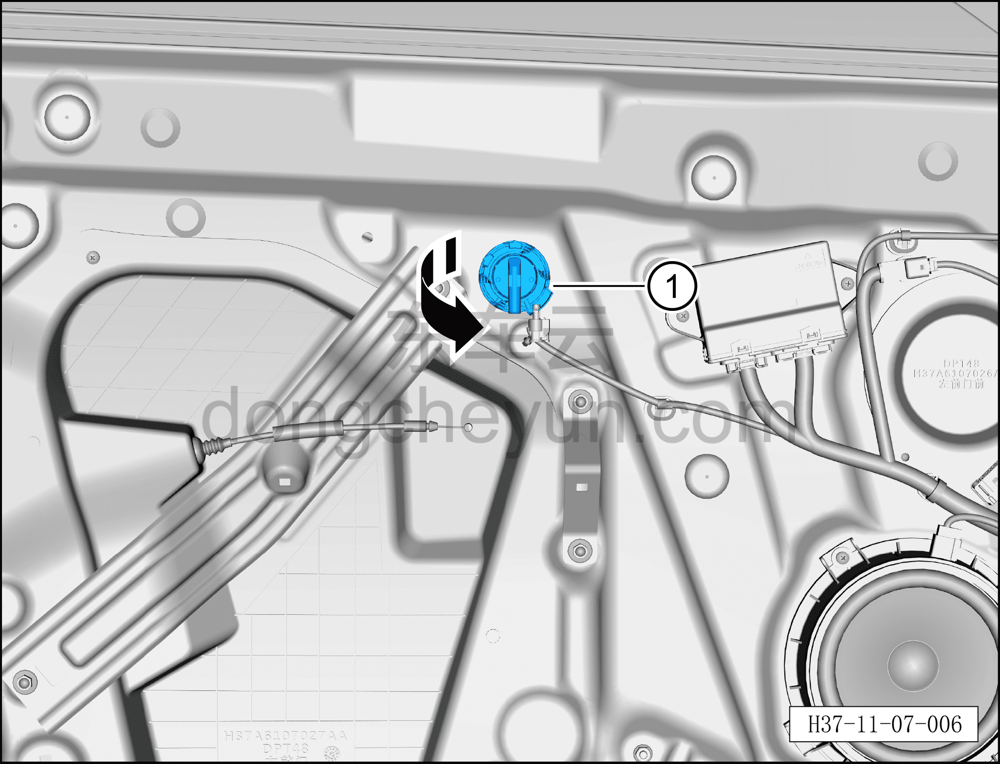

# Снятие и установка датчика давления двери

> Система безопасности › Система безопасности › Компоненты и датчики системы пассивной безопасности  
> Оригинал: `拆卸与安装门压力传感器` · [dongcheyun 56746](https://dongcheyun.com/p/56746), страница `35e778bf716843349459b1bba62f2527` · [оглавление](../README.md)

**Порядок снятия**

**Примечание:**

**– Здесь описывается снятие и установка левого датчика давления двери, для правой стороны действуйте по аналогии с левой.**

1. Выключите все электроприборы, отключите питание.

2. Выполните операцию обесточивания автомобиля для ремонта. См. [3.1.4.1 Обесточивание автомобиля](../03-техническое-обслуживание/005-обесточивание-автомобиля.md)

3. Снимите внутреннюю обивку левой передней двери. См. [8.4.2.1 Снятие и установка внутренней обивки левой передней двери](../08-внутренняя-и-внешняя-отделка/117-снятие-и-установка-обивки-левой-передней-двери.md)

4. Снимите левый датчик давления двери.

a. Нажмите на защёлку разъёма и отсоедините разъём левого датчика давления двери.

b. Выверните левый датчик давления двери① в направлении стрелки.

**Порядок установки**

Установка выполняется в обратном порядке.

**Внимание:**

**– После завершения установки проверьте, нормально ли работает передний датчик удара, затем подключите диагностический сканер, проверьте наличие кодов неисправностей, и если они есть, найдите причину и очистите коды неисправностей.**
