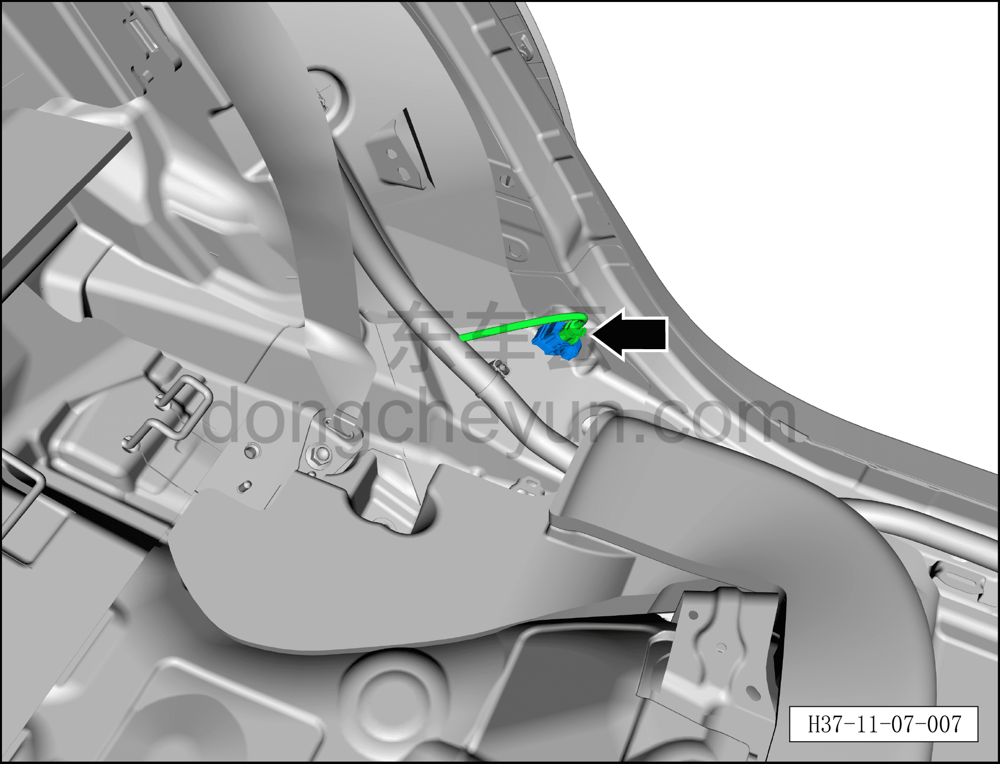
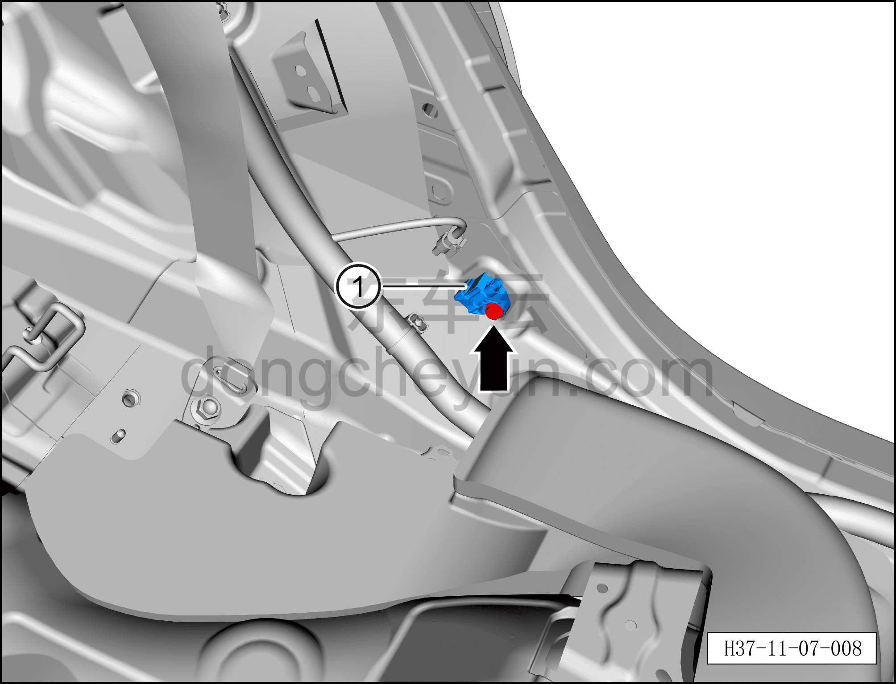

# Снятие и установка датчика бокового удара (у стойки C)

> Система безопасности › Система безопасности › Компоненты и датчики системы пассивной безопасности  
> Оригинал: `拆卸与安装侧碰传感器（C柱处）` · [dongcheyun 56746](https://dongcheyun.com/p/56746), страница `ac1de141ef384beda18e992da6f74d91` · [оглавление](../README.md)

**Порядок снятия**

**Примечание:**

**– Здесь описывается снятие и установка левого датчика бокового удара, для правой стороны действуйте по аналогии с левой.**

1. Выключите все электроприборы, отключите питание.

2. Выполните операцию обесточивания автомобиля для ремонта. См. [3.1.4.1 Обесточивание автомобиля](../03-техническое-обслуживание/005-обесточивание-автомобиля.md)

3. Снимите нижнюю накладку левой стойки C. См. [8.5.5.4 Снятие и установка нижней накладки левой стойки C](../08-внутренняя-и-внешняя-отделка/134-снятие-и-установка-левой-нижней-накладки-стойки-c.md)

4. Снимите левый датчик бокового удара.

a. Нажмите на защёлку разъёма и отсоедините разъём левого датчика бокового удара.

b. Используя торцевую головку 10 мм, выверните крепёжный болт левого датчика бокового удара.

Момент затяжки болта: 9±1 Н·м

c. Снимите левый датчик бокового удара①.

**Порядок установки**

Установка выполняется в обратном порядке.

**Внимание:**

**– После завершения установки проверьте, нормально ли работает датчик бокового удара, затем подключите диагностический сканер, проверьте наличие кодов неисправностей, и если они есть, найдите причину и очистите коды неисправностей.**
