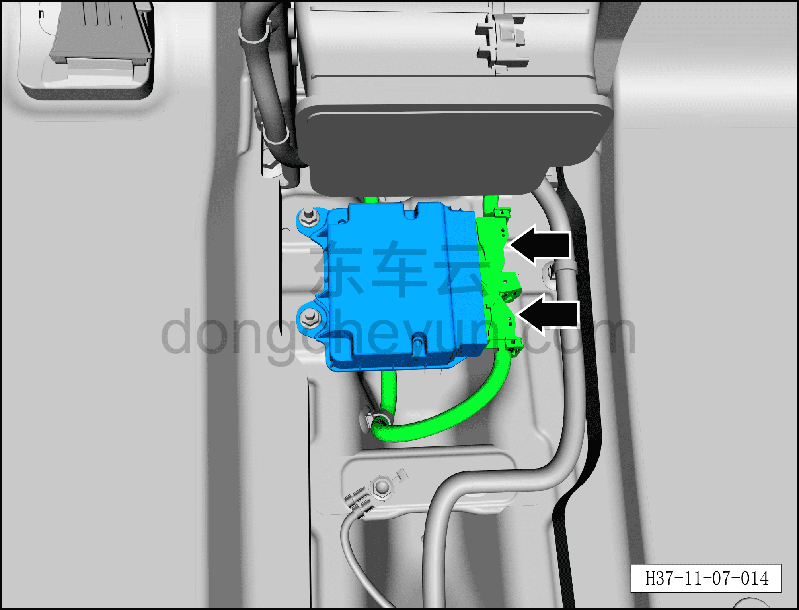
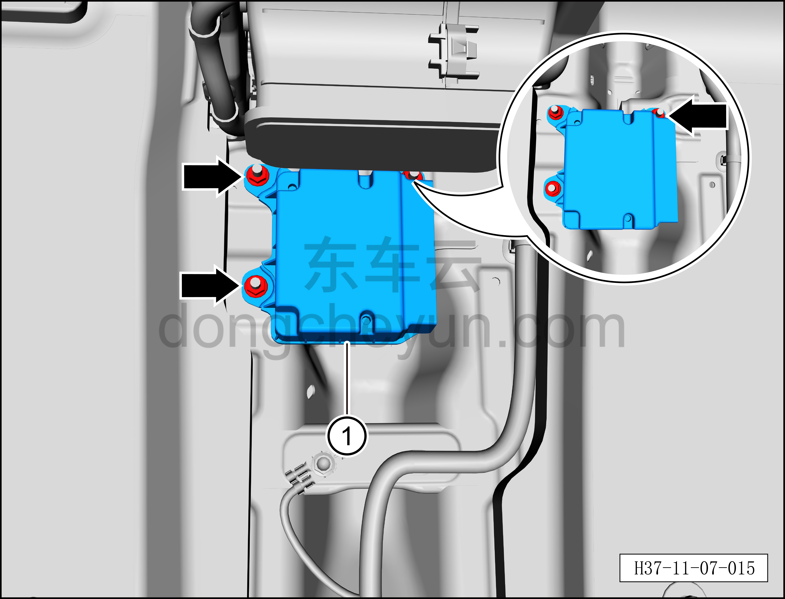

# Снятие и установка блока управления подушками безопасности

> Система безопасности › Система безопасности › Компоненты и датчики системы пассивной безопасности  
> Оригинал: `拆卸与安装安全气囊电控单元` · [dongcheyun 56746](https://dongcheyun.com/p/56746), страница `a5936fdc6ac44027b7166762236fb326` · [оглавление](../README.md)

**Порядок снятия**

1. Выключите все электроприборы, отключите питание.

2. Выполните операцию обесточивания автомобиля для ремонта. См. [3.1.4.1 Обесточивание автомобиля](../03-техническое-обслуживание/005-обесточивание-автомобиля.md)

3. Снимите центральную консоль в сборе. См. [8.3.4.8 Снятие и установка центральной консоли в сборе](../08-внутренняя-и-внешняя-отделка/098-снятие-и-установка-центральной-консоли-в-сборе.md)

4. Снимите блок управления подушками безопасности.

a. Отсоедините 2 разъёма блока управления подушками безопасности.

b. Используя торцевую головку 10 мм, выверните 3 крепёжные гайки блока управления подушками безопасности.

Момент затяжки гаек: 9±1 Н·м

c. Снимите блок управления подушками безопасности①.

**Порядок установки**

Установка выполняется в обратном порядке.

**Примечание:**

**После завершения замены необходимо выполнить следующие операции с помощью диагностического сканера или удалённой диагностики:**

**- Сначала прошить программное обеспечение до последней версии;**

**- После успешного обновления программного обеспечения выполнить процедуру замены детали для контроллера.**

**Внимание:**

**– После завершения установки подключите диагностический сканер, проверьте наличие кодов неисправностей блока управления подушками безопасности, и если они есть, найдите причину и очистите коды неисправностей.**

– После замены ACU **необходимо с помощью диагностического сканера или инженерного режима головного устройства переключить режим автомобиля в нормальный режим.**
