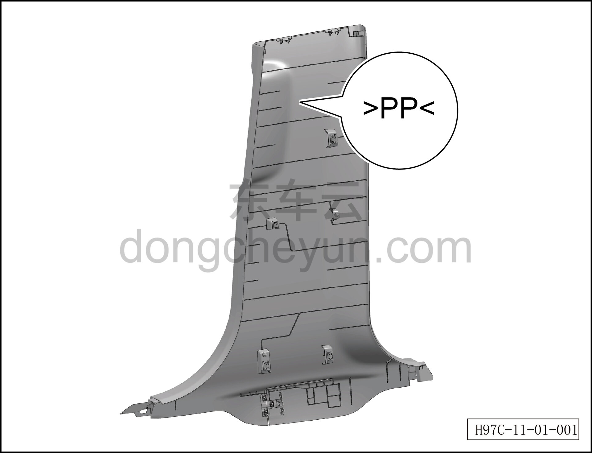
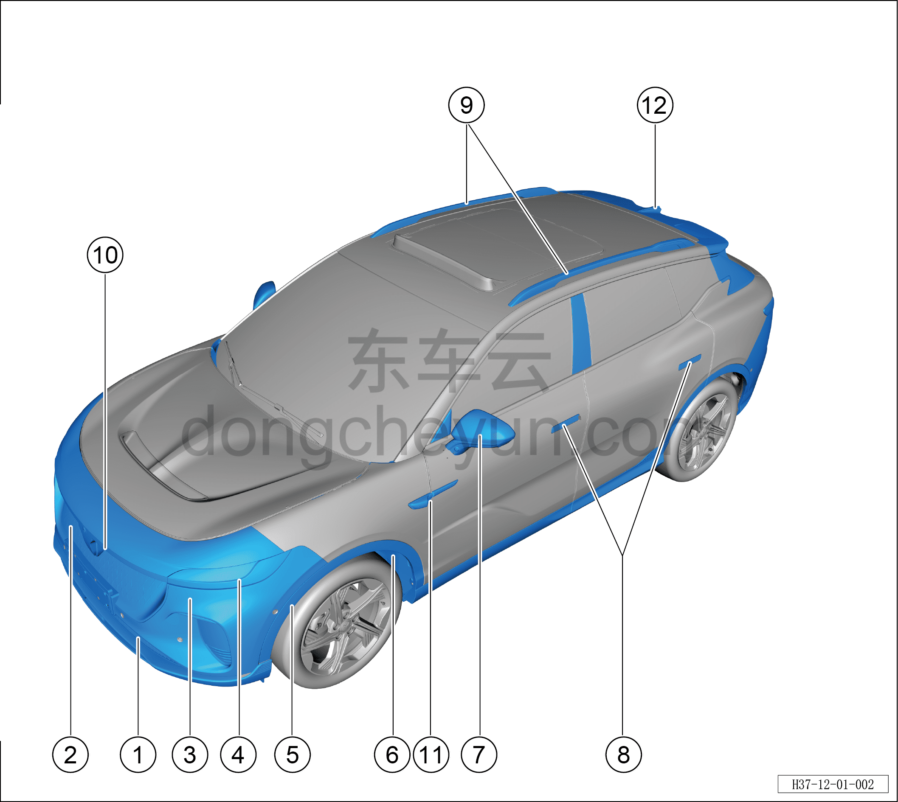
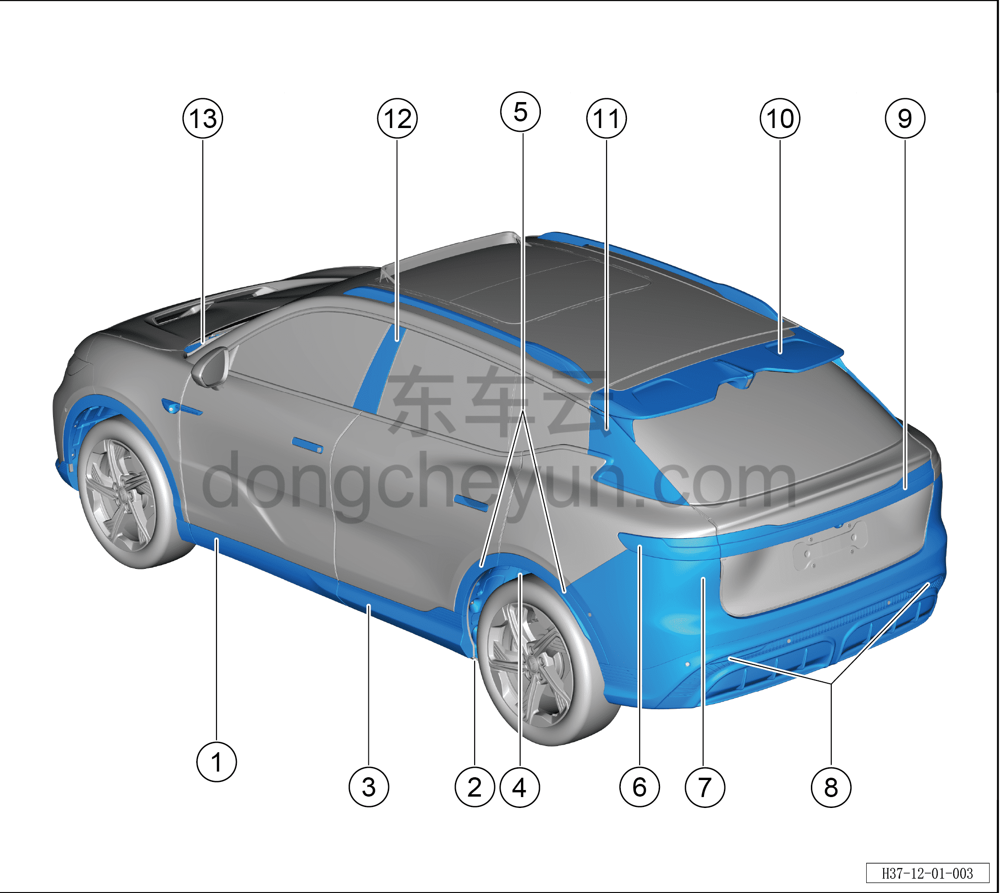

# Перечень материалов пластиковых деталей кузова

> Кузовные жестяные работы, окраска › Кузов в белом (BIW) в сборе  
> Оригинал: `塑料车身部件材料列表` · [dongcheyun 56746](https://dongcheyun.com/p/56746), страница `cf5b01be2a6440eba5e568107125a383` · [оглавление](../README.md)

При ремонте на каждой пластиковой детали нанесён стандартный символ, обозначающий тип используемого материала.

1. Нижняя решётка переднего бампера 2. Передняя решётка радиатора

3. Облицовка переднего бампера 4. Передний комбинированный сигнальный фонарь

5. Накладка переднего колёсного арки 6. Левый подкрылок переднего колеса

7. Декоративный кожух левого наружного зеркала заднего вида 8. Корпус наружной ручки открывания левой двери

9. Багажник на крыше 10. Передний габаритный фонарь

11. Защитная накладка камеры левого крыла в сборе 12. Декоративная накладка дополнительного стоп-сигнала

1. Левая наружная облицовка передней двери в сборе 2. Корпус нижней декоративной накладки левого порога

3. Левая наружная облицовка задней двери 4. Левый подкрылок заднего колеса

5. Накладка заднего колёсного арки 6. Неподвижная сторона левого заднего комбинированного фонаря

7. Облицовка заднего бампера 8. Задняя противотуманная фара

9. Подвижная сторона заднего комбинированного фонаря в сборе 10. Задний спойлер (дефлектор)

11. Декоративная накладка левой стойки D заднего борта в сборе 12. Наружная декоративная накладка левой стойки B в сборе

13. Нижняя декоративная накладка лобового стекла
