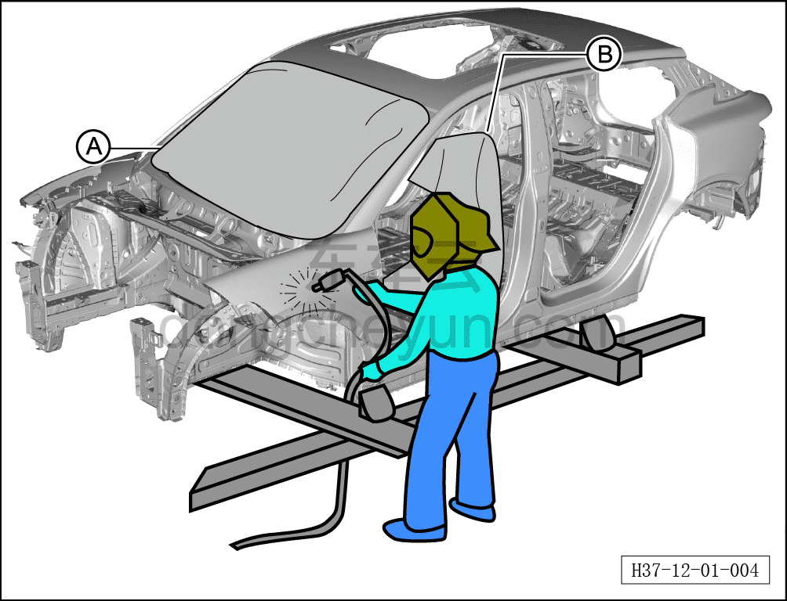
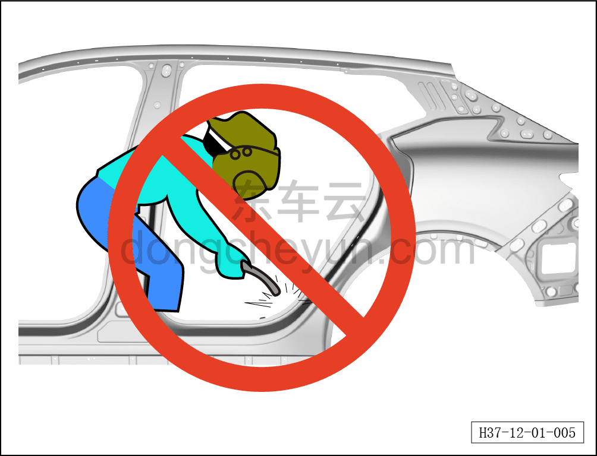
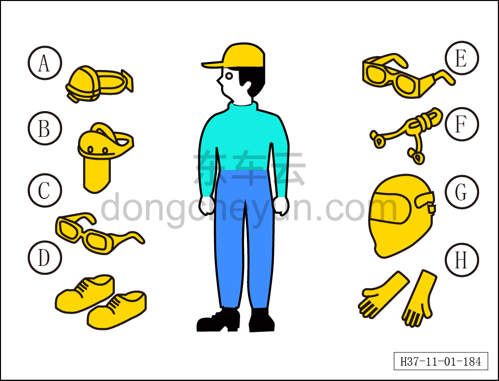
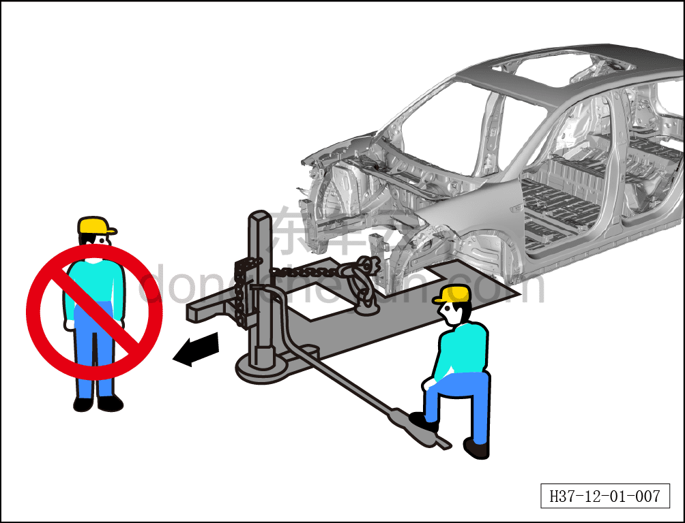
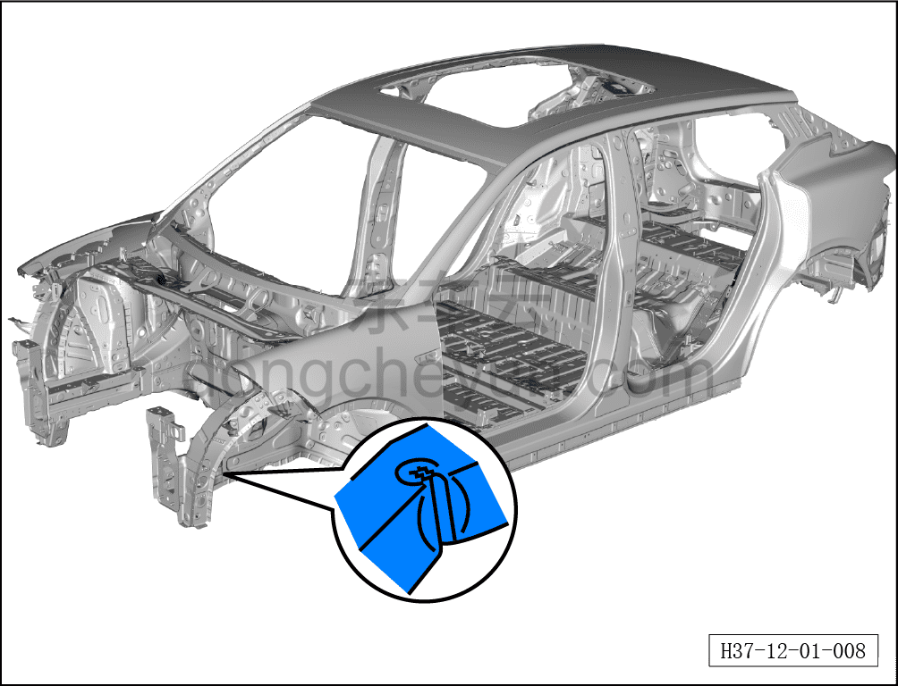
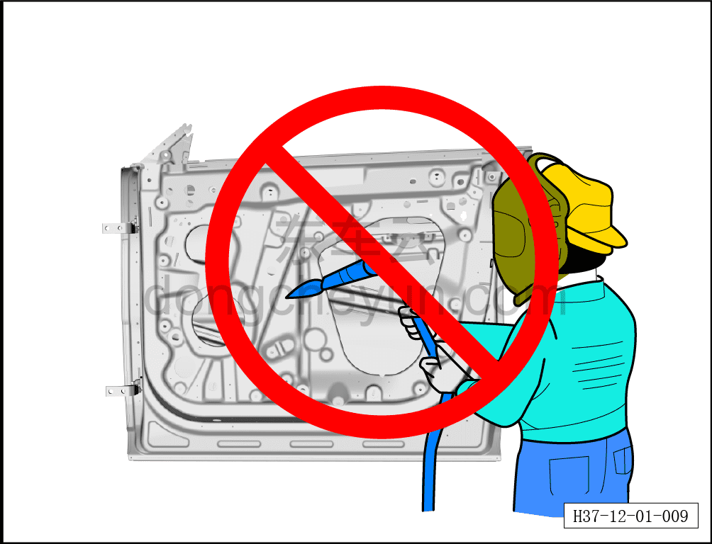
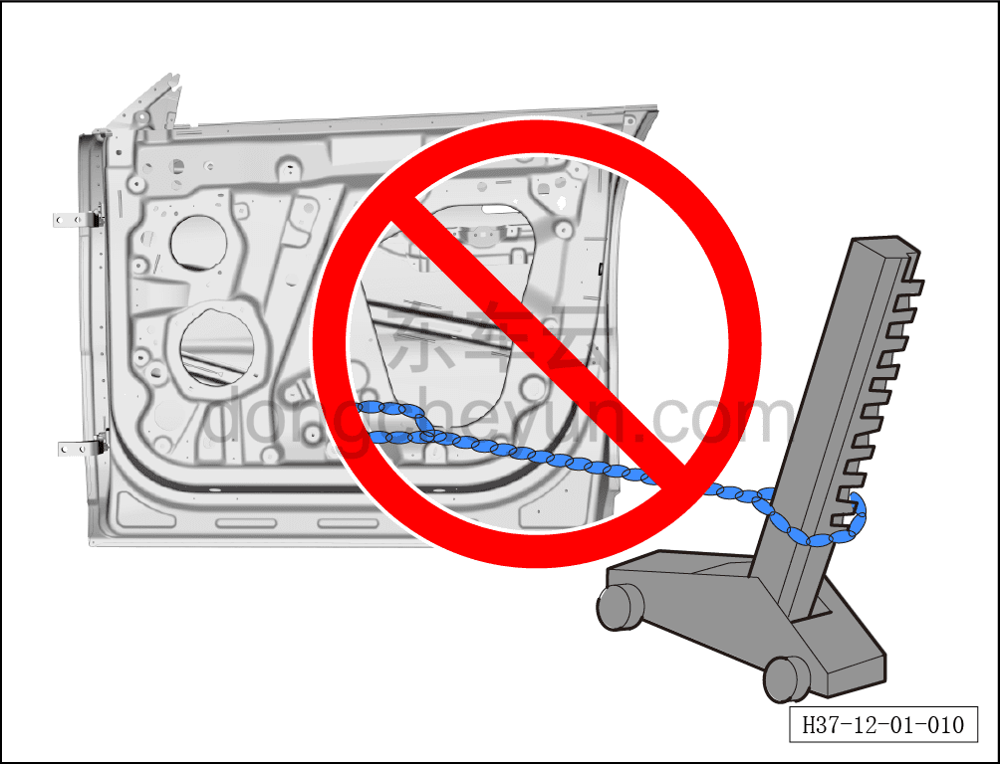
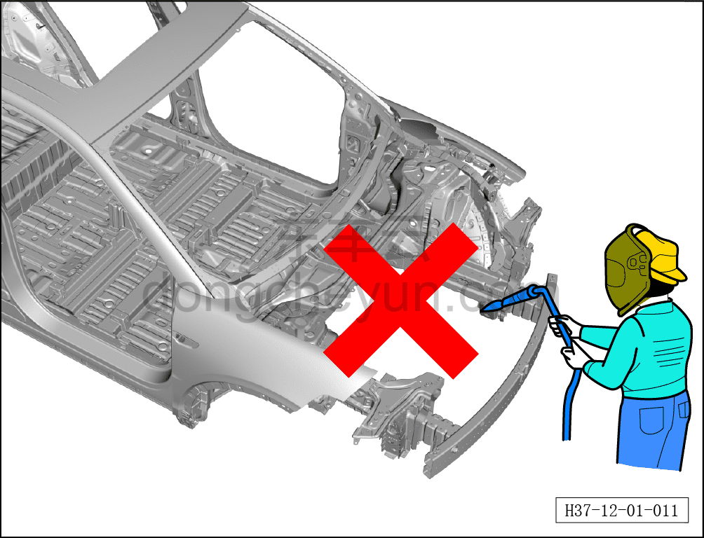

# Указания

> Кузовные жестяные работы, окраска › Кузов в белом (BIW) в сборе › Ремонт после аварии  
> Оригинал: `注意事项` · [dongcheyun 56746](https://dongcheyun.com/p/56746), страница `6e67661892364944b7c668f9f896cb5a` · [оглавление](../README.md)

Защита автомобиля

При выполнении сварочных работ необходимо использовать защитные чехлы с хорошей термостойкостью и огнестойкостью для покрытия лакокрасочного покрытия, стёкол, сидений и ковров, например: защитный чехол для стекла A, защитный чехол для сиденья B.

Меры безопасности

**Предупреждение!**

**- При выполнении работ по ремонту кузова необходимо соблюдать соответствующие государственные требования безопасности. При наличии вопросов обращайтесь в соответствующие органы.**

**- При выполнении сварочных и резочных работ персонал должен надлежащим образом использовать маску, перчатки и защитные очки, чтобы снизить риск получения травм.**

**- Запрещается оставлять в цехе кузовного ремонта незащищённые автомобили (разлетающиеся искры могут вызвать пожар, повредить лакокрасочное покрытие и стёкла).**

**Указания по безопасности**

**- Необходимо проверить, нет ли утечки топлива, и при обнаружении утечки топлива устранить её заранее.**

**- Если сварочные работы необходимо выполнять рядом с топливным баком, следует сначала снять топливный бак, слить топливо из топливопроводов и заглушить топливопроводы.**

**- Обеспечить хорошую вентиляцию цеха кузовного ремонта.**

**Указания по технике безопасности:**

**- Все операции должны выполняться техниками, имеющими соответствующую государственную квалификационную сертификацию, при соблюдении мер безопасности.**

**В зависимости от конкретной ситуации необходимо использовать защитные очки, перчатки, защитную обувь, наушники/затычки и т. п.**

| Символ | Наименование |
|---|---|
| A | Противопылевой респиратор |
| B | Противопылевая маска |
| C | Защитные очки |
| D | Защитная обувь |
| E | Защитная маска сварщика |
| F | Затычки для ушей |
| G | Сварочный защитный экран |
| H | Перчатки сварщика |

Безопасное использование стапеля (рихтовочного стенда)

**Предупреждение!**

**- При использовании гидравлического оборудования или тягового устройства стапеля для рихтовки автомобиля, повреждённого в результате аварии, на кузов воздействуют огромные усилия, которые могут травмировать людей.**

**Необходимо обеспечить безопасность людей в рабочей зоне.**

Вытягивание кузова

- При использовании вытягивающего устройства для вытягивания кузова или рамы запрещается находиться на одной линии с тяговой цепью. Необходимо использовать страховочный трос.

Изгиб конструкционных стальных панелей

При обнаружении изогнутой стальной панели её необходимо заменить.

**Предупреждение!**

**- В соответствии с конструктивными требованиями, форма конструкционных стальных панелей должна соответствовать исходной проектной форме.**

**- Если конструкционные стальные панели деформированы в результате аварии, либо деформированная часть отремонтирована и используется повторно, такие панели могут не соответствовать характеристикам безопасности, заложенным в исходной конструкции. При обнаружении изогнутой стальной панели её необходимо заменить.**

Ремонт противоударной стальной балки

Запрещается выполнять сварочные работы на противоударной стальной балке

Запрещается выполнять вытягивание противоударной стальной балки

**Предупреждение!**

**- Противоударная стальная балка и её кронштейны являются очень важными деталями, снижающими риск травмирования людей в салоне при боковом ударе.**

**- При повреждении противоударной стальной балки или её кронштейнов необходимо заменить дверь в сборе.**

Запрещается выполнять сварочные работы на переднем противоударном брусе

Передний противоударный брус спроектирован так, чтобы полностью реализовывать свои характеристики только в исходной форме. Однако если передний противоударный брус подвергся ремонту, его характеристики снижаются.
