# Порядок ремонта после аварии

> Кузовные жестяные работы, окраска › Кузов в белом (BIW) в сборе › Ремонт после аварии  
> Оригинал: `事故修理顺序` · [dongcheyun 56746](https://dongcheyun.com/p/56746), страница `638b1276c631407e91457f91670d4e75` · [оглавление](../README.md)

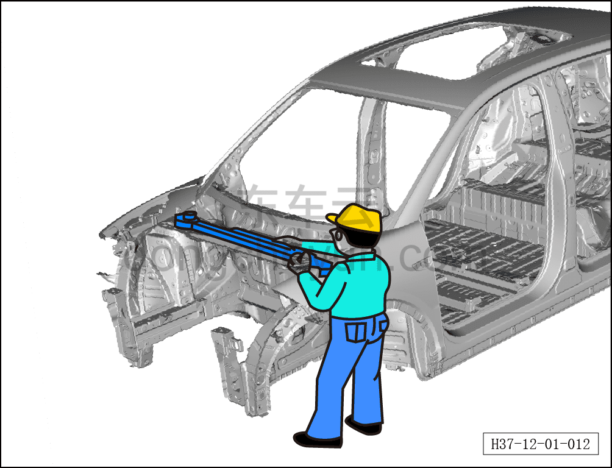

1. Важные детали, подлежащие проверке

a. При подозрении на повреждение или деформацию подвески кузова следует проверить подвеску автомобиля на стапеле и выполнить необходимую рихтовку.

b. Проверить исправность рулевого механизма и рулевых тяг, визуально проверить наличие деформаций и трещин.

c. Проверить все компоненты шасси.

d. Проверить колёса и шины на повреждения, проверить концентричность и балансировку.

e. Проверить рисунок протектора и боковины шины на наличие трещин, а также проверить давление в шинах.

f. Проверить выпускную систему и подвеску на повреждения.

g. После ремонта необходимо провести дорожные испытания автомобиля, чтобы убедиться, что автомобиль может безопасно двигаться и его характеристики безопасности соответствуют нормам.

**Примечание:**

**- Если автомобиль подвергался значительным нагрузкам, необходимо проверить вышеуказанные детали, а также выполнить проверку углов установки колёс.**

2. Измерение

Перед проведением работ по снятию и резке необходимо выполнить измерения в соответствии со схемой размеров кузова, используя вытягивающее устройство для рихтовки повреждённого кузова или рамы.

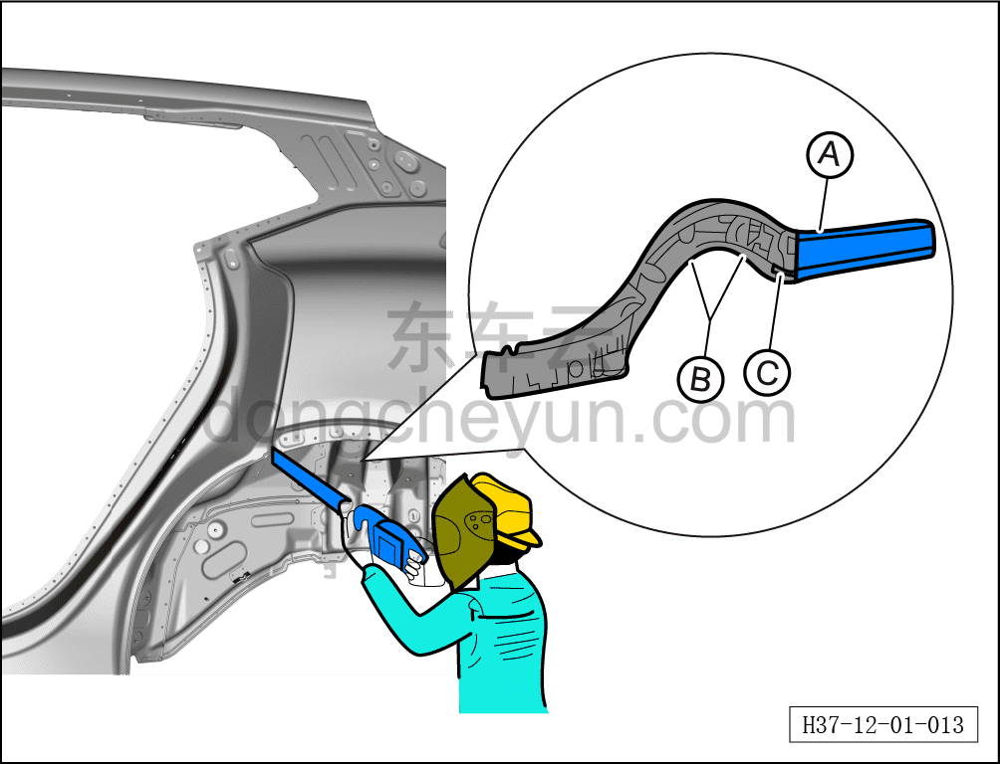

3. Снятие

Место резки

| A | Разрешённое место резки |
|---|---|
| B | Место изгиба |
| C | Усилительный элемент |

**Примечание:**

**- Резку необходимо выполнять по прямой линии, избегая усилительных элементов.**

**- Резка влияет на прочность кузова, поэтому необходимо выполнять обработку с учётом надёжности и безопасности в соответствии с положениями руководства по ремонту.**

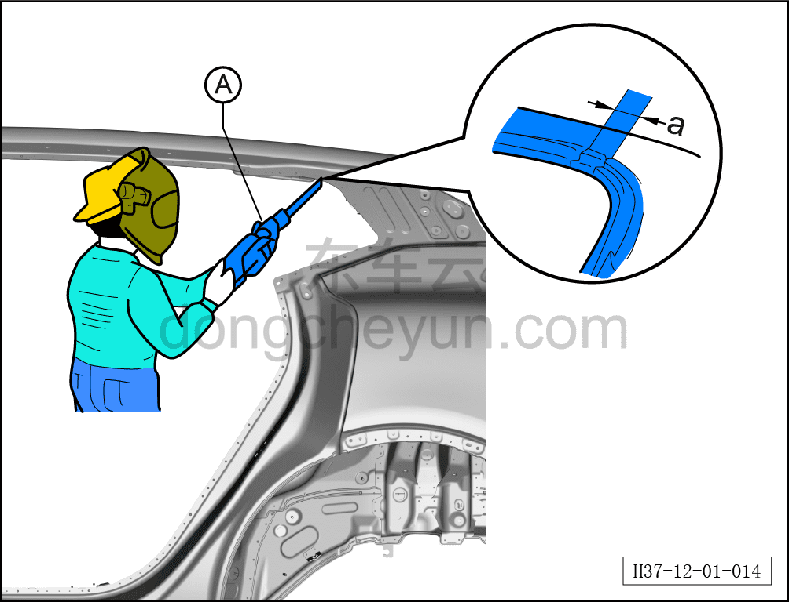

| Ремонтный инструмент A | Пневматическая пила |
|---|---|
| -a- Размер положения | 20 ～ 30 мм |

**Примечание:**

**– При черновой обрезке новой детали в зоне соединения необходимо предусмотреть перекрытие 20–30 мм в части -a-.**

**Внимание:**

**– При резке панелей будьте осторожны, чтобы не повредить соседние панели или любые панели снизу. При повреждении какой-либо панели её обязательно необходимо отремонтировать.**

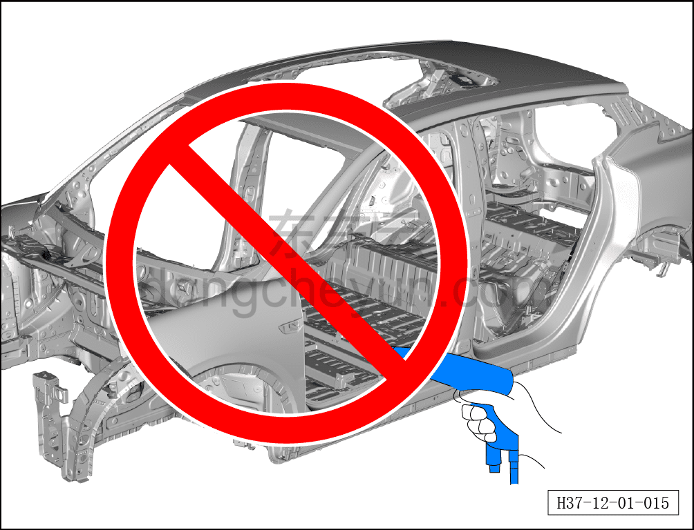

Запрещается сверлить отверстия или выполнять резку в зоне расположения жгутов проводов.

**Примечание:**

**– Проверьте место сверления или резки, убедитесь, что шланги и провода не повреждены.**

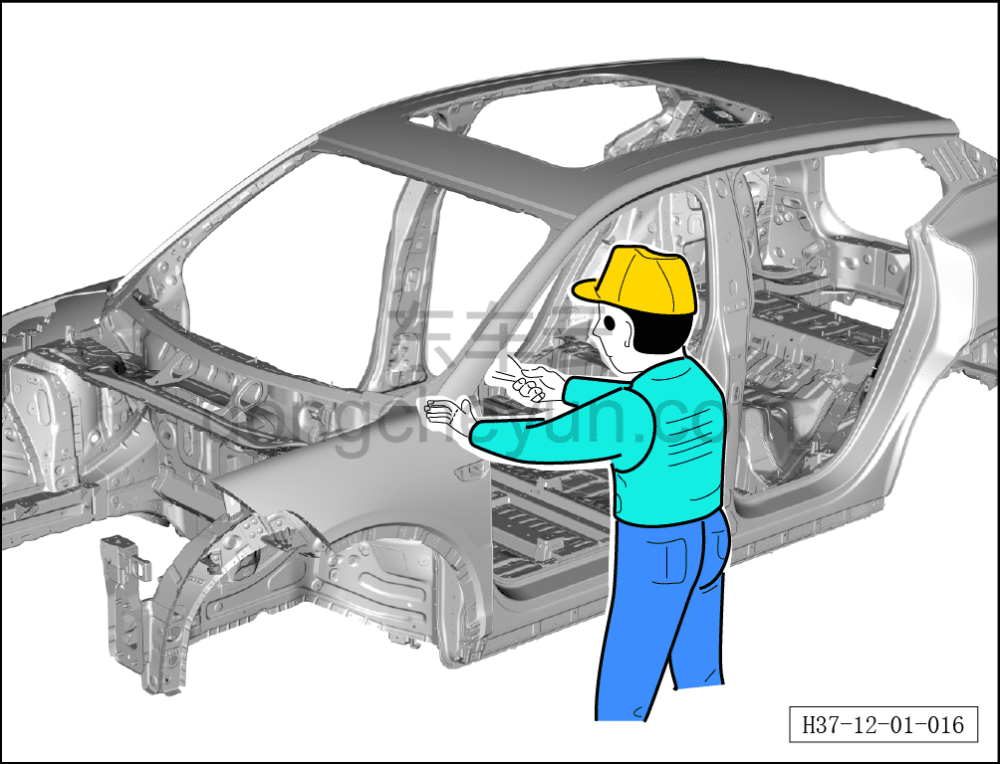

Снятие соседних компонентов

При снятии соседних компонентов необходимо наклеить защитную ленту на кузов вокруг зоны работ и на инструмент для снятия, чтобы избежать повреждения деталей.

**Внимание:**

**– При повреждении лакокрасочного покрытия его обязательно необходимо перекрасить.**

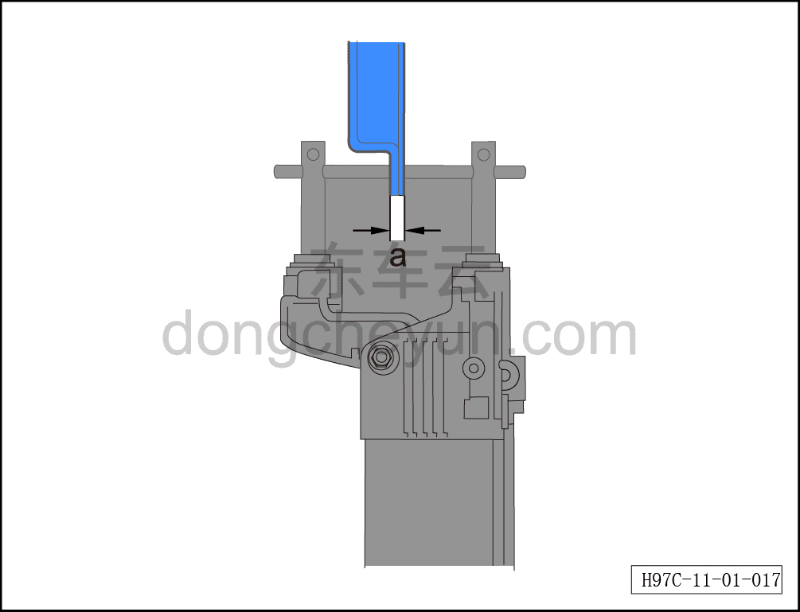

4. Требования к точечной сварке:

Как правило, если суммарная толщина сваренных панелей -a- превышает 3 мм, необходимо выполнять сварку с наплавкой с помощью сварочного аппарата MIG.

**Примечание:**

**– Если суммарная толщина стальных панелей превышает 3 мм, точечная сварка не может обеспечить достаточную долговечность.**

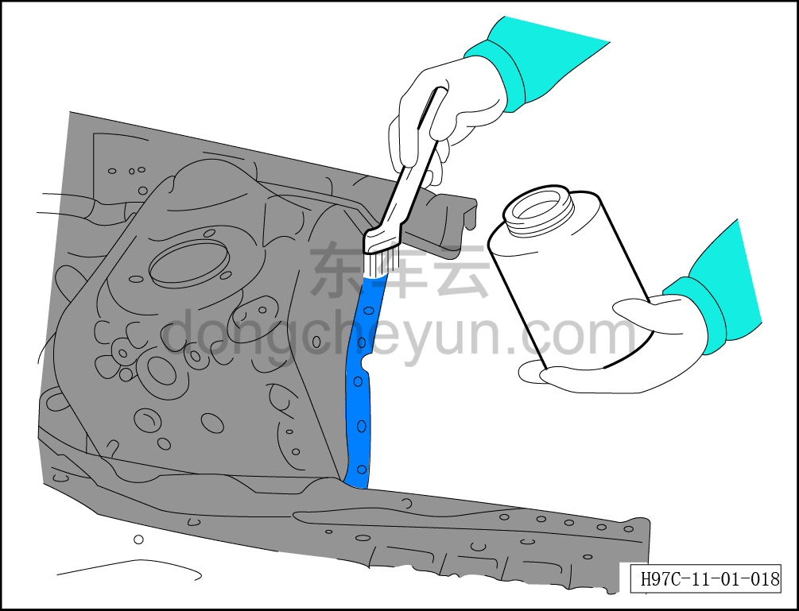

Удалите лакокрасочное покрытие с новой детали, подлежащей сварке, и с кузова, затем нанесите герметик для сварных точек (или грунт для сварки через слой (weld-through)).

**Внимание:**

**– Не наносите герметик для сварных точек (или грунт для сварки через слой (weld-through)) за пределами контактной поверхности.**

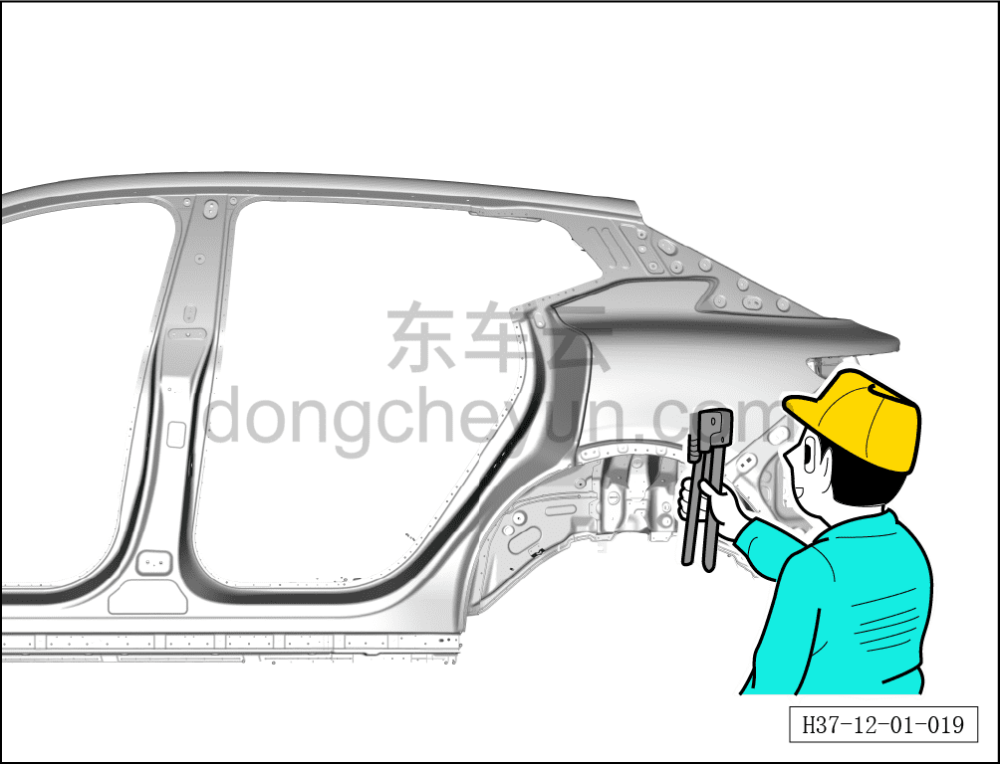

Используйте перфоратор для проделывания отверстий под сварку с наплавкой

<table>
<tr><td colspan=2>Справочные значения (в мм)</td></tr>
<tr><td>Толщина места сварки</td><td>Размер отверстия для наплавки</td></tr>
<tr><td>Менее 1,0</td><td>Более Ø5</td></tr>
<tr><td>1.0 ～ 1.6</td><td>Более Ø6,5</td></tr>
<tr><td>1.7 ～ 2.3</td><td>Более Ø8</td></tr>
<tr><td>Более 2,4</td><td>Более Ø10</td></tr>
</table>

**Примечание:**

**– Для мест, где невозможно выполнить точечную сварку, можно использовать перфоратор или сверло для проделывания отверстий, чтобы выполнить сварку с наплавкой.**

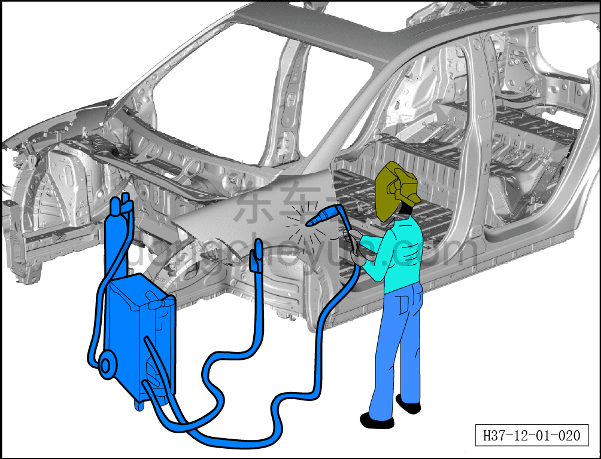

Требования при работе с электронными компонентами

**Примечание:**

**– При сварке электронные компоненты могут быть повреждены током, проходящим через кузов от сварочного аппарата.**

**– Перед началом сварки необходимо отсоединить минусовую клемму аккумуляторной батареи и установить заземление рядом с местом сварки на кузове.**

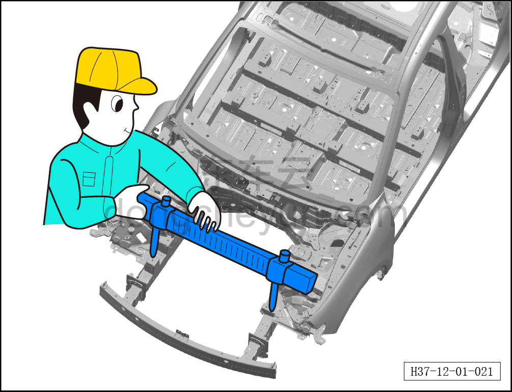

5. Установка

Измерение перед сваркой

**Примечание:**

**– Перед установкой новой детали необходимо выполнить измерение размеров в соответствии со схемой размеров кузова, чтобы обеспечить правильную сборку.**

После завершения установки проверьте правильность сборки.

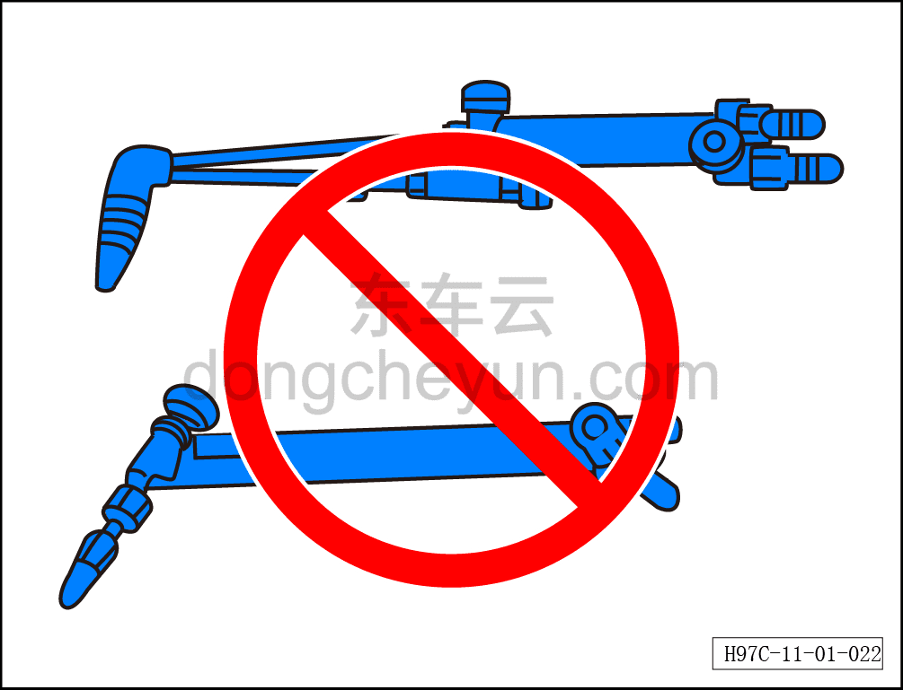

Указания по сварке

- Точечная сварка: как правило, в 1,3 раза больше количества точек сварки, указанного производителем.

- Сварка с наплавкой: как правило, больше количества точек сварки, указанного производителем.

**Внимание:**

**– Для сварки с наплавкой следует использовать сварочный аппарат MIG (сварка в среде инертного газа плавящимся электродом).**

**– Запрещается использовать газовую сварку или сварку с наплавкой за пределами зон, предусмотренных для стальных панелей.**

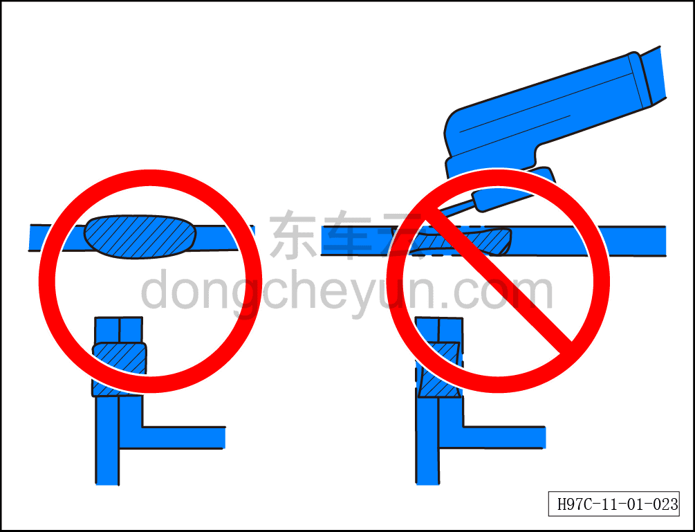

Операция шлифовки после сварки.

**Примечание:**

**- После сварки необходимо проверить место сварки, убедившись в его надёжности.**

**- При шлифовке зоны сварки дисковой шлифовальной машиной нельзя перешлифовывать, иначе прочность места сварки снизится.**

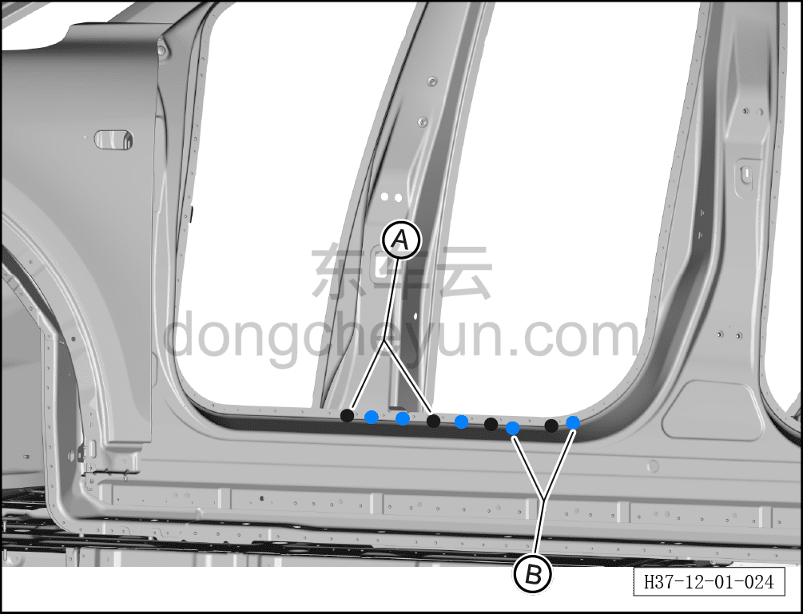

Расположение точек сварки.

-A- Расположение старой точки сварки.

**Примечание:**

**- Избегайте наложения сварки на старую зону сварки.**

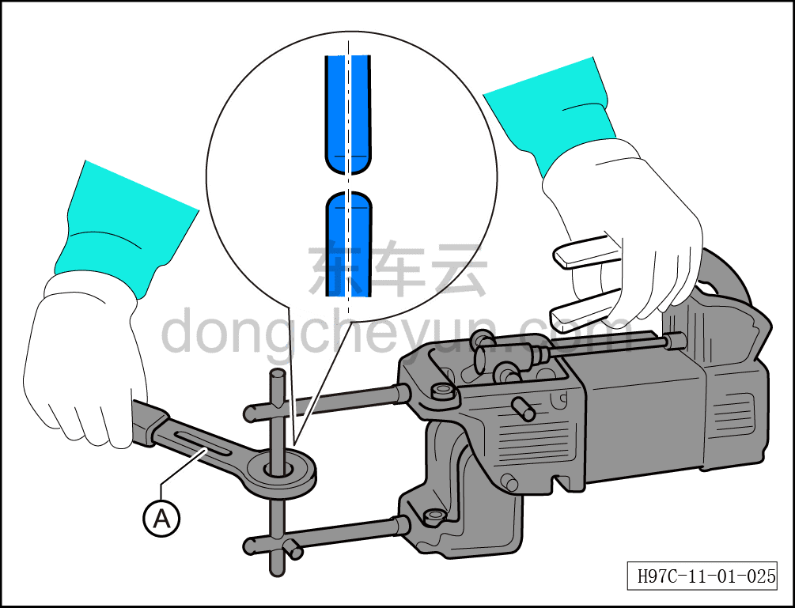

**Указания по сварке:**

**- Форма наконечника точечного сварочного аппарата влияет на прочность сварки, поэтому необходимо поддерживать надлежащую форму наконечника и давать ему остыть после каждых пяти-шести точек сварки.**

**- Полностью удалите лакокрасочное покрытие в месте точечной сварки, включая стык и поверхность, контактирующую со сварочным наконечником.**

**- Используйте шлифовальную машину для удаления заусенцев, образовавшихся в процессе точечной сварки.**

**-A- Скребок для электрода точечной сварки**

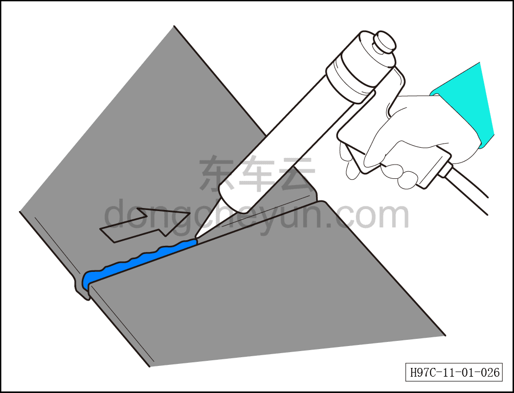

6. Антикоррозийная обработка (перед окрашиванием)

Для предотвращения попадания воды в кузовные панели или их коррозии в местах стыков кузовных панелей и по краям дверей, капота и т. п. наносится кузовной герметик.

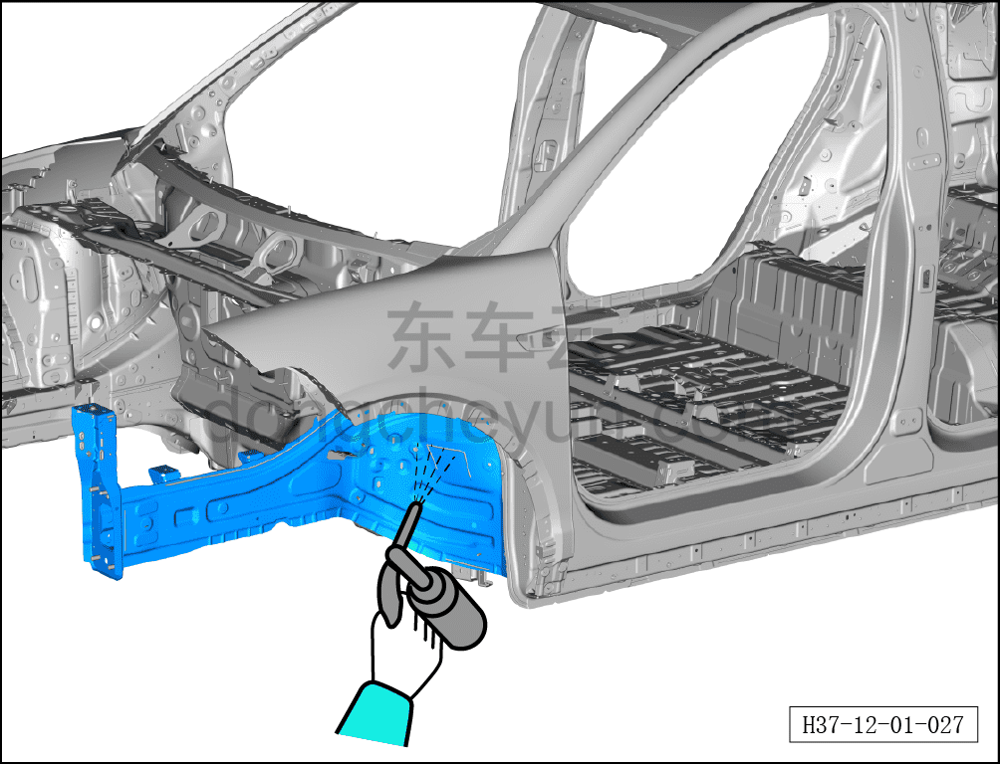

Для предотвращения коррозии и защиты кузова от повреждений камнями необходимо нанести достаточное количество антигравийного покрытия на нижнюю часть кузова и внутреннюю сторону колёсных арок.

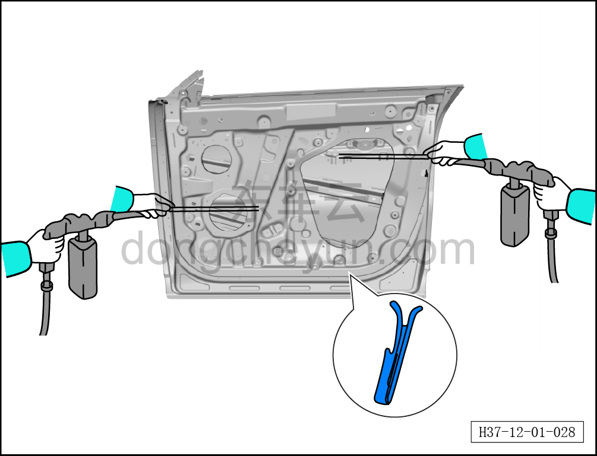

7. Антикоррозийная обработка (после окрашивания)

Для труднодоступных для окрашивания мест (таких как двери, петли и другие места с закрытым сечением) через смотровые или монтажные отверстия деталей наносится достаточное количество антикоррозийного средства (воска).
