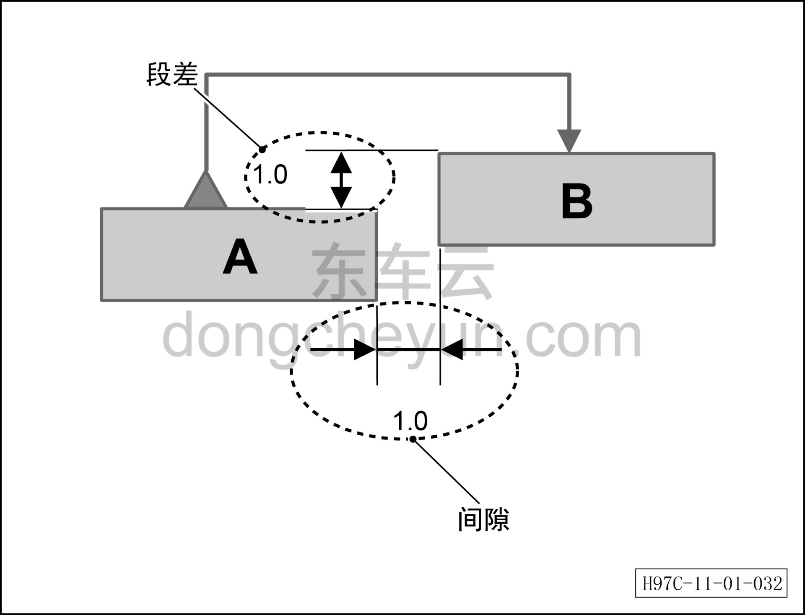

# Стандарты сборки / методы регулировки

> Кузовные жестяные работы, окраска › Кузов в белом (BIW) в сборе › Технические характеристики  
> Оригинал: `装配标准/ 调节方法` · [dongcheyun 56746](https://dongcheyun.com/p/56746), страница `25b383662adb4bc6bc3a9b7b62e9260e` · [оглавление](../README.md)

Описание зазоров и перепадов кузова

- Зазор и перепад между двумя деталями определяются в соответствии со схемой.

- На схеме зазор между деталью A и деталью B составляет 1,0 (мм).

- На схеме деталь A является измерительной базовой поверхностью, деталь B — измеряемой поверхностью; если измеренное значение «+», деталь B выше детали A; если измеренное значение «-», деталь B ниже детали A.
