# Зазоры поверхности кузова

> Кузовные жестяные работы, окраска › Кузов в белом (BIW) в сборе › Технические характеристики  
> Оригинал: `车身表面间隙` · [dongcheyun 56746](https://dongcheyun.com/p/56746), страница `206157c4ed724debbdb81d1b70c90786` · [оглавление](../README.md)

Передняя часть

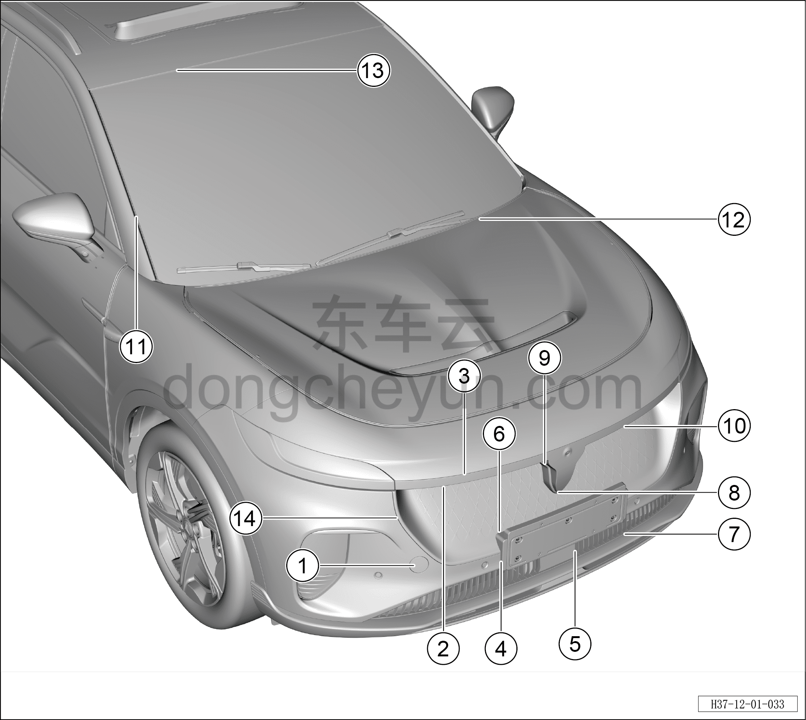

**Примечание:**

**- Для регулировки или проверки размеров зазора следует использовать пластиковый щуп для измерения зазора.**

Стандарт сборки передней части

| № | Место | Допустимый размер зазора (мм) | Допустимый размер перепада (мм) |
|---|---|---|---|
| 1 | Облицовка переднего бампера — крышка буксировочного крюка | 0.5±0.3 | -0.5±0.3 |
| 2 | Верхний воздуховод переднего бампера в сборе — передняя решётка радиатора | 0.8±0.8 | - |
| 3 | Верхняя часть переднего бампера в сборе — передний габаритный фонарь | 1.2±1.0 | - |
| 4 | Облицовка переднего бампера — рамка переднего номерного знака | 0.5±0.5 | - |
| 5 | Заглушка нижней решётки переднего бампера — планка передней решётки радиатора | 0.5±0.5 | - |
| 6 | Передняя решётка радиатора — рамка переднего номерного знака | 0.5±0.5 | - |
| 7 | Нижняя решётка переднего бампера — нижняя облицовка переднего бампера | 0.5±0.3 | - |
| 8 | Передний габаритный фонарь — передняя решётка радиатора | 0.5±0.5 | - |
| 9 | Задняя декоративная накладка переднего габаритного фонаря — передний габаритный фонарь | 0.5±0.5 | - |
| 10 | Задняя декоративная накладка переднего габаритного фонаря — передняя декоративная накладка переднего габаритного фонаря | 1.0±0.8 | - |
| 11 | Левая наружная панель боковины — переднее лобовое стекло | 3.5±1.5 | -1.0±1.0 |
| 12 | Нижняя накладка лобового стекла — лобовое стекло в сборе | 0 / прилегание | - |
| 13 | Наружная панель крыши — лобовое стекло | 4.0±1.2 | -2.9±1.2 |
| 14 | Облицовка переднего бампера — декоративная планка передней решётки радиатора | 0.5±0.5 | - |

Передняя часть

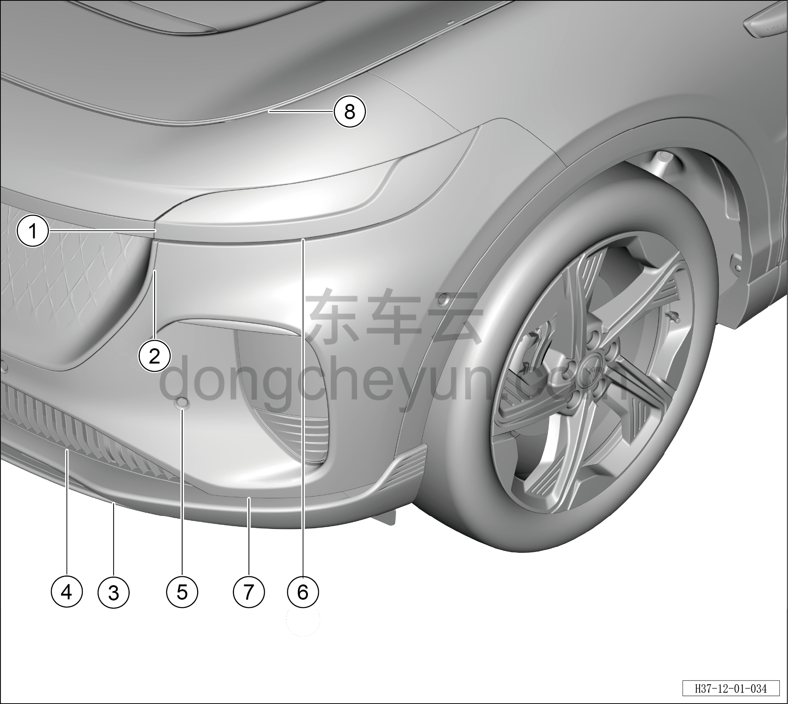

**Примечание:**

**- Для регулировки или проверки размеров зазора следует использовать пластиковый щуп для измерения зазора.**

Стандарт сборки передней части

| № | Место | Допустимый размер зазора (мм) | Допустимый размер перепада (мм) |
|---|---|---|---|
| 1 | Габаритный фонарь — передняя фара | 2.0±1.5 | 0±1.0 |
| 2 | Облицовка переднего бампера — декоративная планка передней решётки радиатора | 0.5±0.5 | - |
| 3 | Нижняя декоративная накладка переднего бампера — нижняя облицовка переднего бампера | 0.5±0.5 | 0.2±0.5 |
| 4 | Нижний корпус переднего бампера — нижняя решётка переднего бампера | 0.5±0.5 | 0.3±0.5 |
| 5 | Передний бампер — датчик радара | 0.2+0.2/0.2-0.1 | - |
| 6 | Передний бампер — передняя фара (a ~ b) (e ~ f) | 1.5±1.0 | 1.0±1.0 |
| 7 | Облицовка переднего бампера — декоративная накладка переднего бампера | 0.5±0.3 | 0.3±0.3 |
| 8 | Верхняя декоративная накладка переднего бампера — до | 3.5±1.0～1.2 | - |

Передняя часть

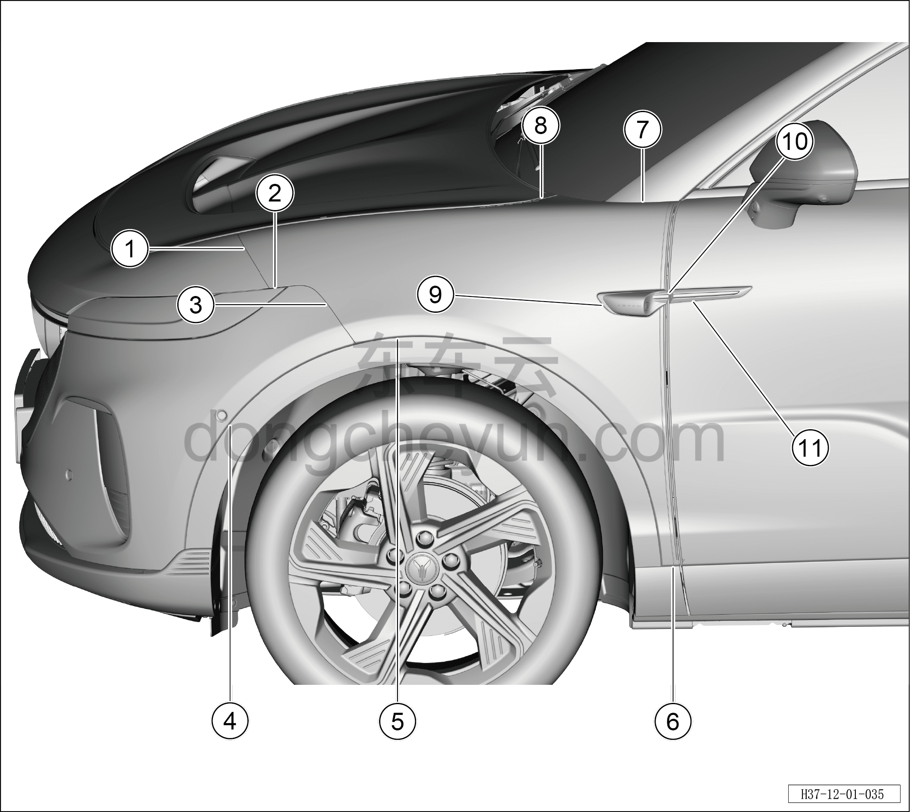

**Примечание:**

**- Для регулировки или проверки размеров зазора следует использовать пластиковый щуп для измерения зазора.**

Стандарт сборки передней части

| № | Место | Допустимый размер зазора (мм) | Допустимый размер перепада (мм) |
|---|---|---|---|
| 1 | Верхняя декоративная накладка переднего бампера — крыло | 1.5±1.0 | 1.0±1.0 |
| 2 | Крыло — передняя фара | 1.2±1.0 | - |
| 3 | Крыло — облицовка переднего бампера | 0+0.5/0 | - |
| 4 | Накладка переднего колёсного арки — облицовка переднего бампера | 0.5±0.5 | - |
| 5 | Крыло — накладка переднего колёсного арки | 0.5±0.5 | - |
| 6 | Крыло — накладка переднего колёсного арки (задний участок) | 0.5±0.5 | - |
| 7 | Наружная панель боковины — крыло | 2.5±1.0 | - |
| 8 | Крыло — капот | 3.5±1.0 | - |
| 9 | Защитная накладка камеры крыла — крыло | 0.5±0.5 | - |
| 10 | Защитная накладка камеры крыла — верхняя декоративная полоса передней двери | 1.2±4.5 | - |
| 11 | Верхняя декоративная полоса передней двери — передняя дверь | 0.5±0.5 | - |

Боковая часть

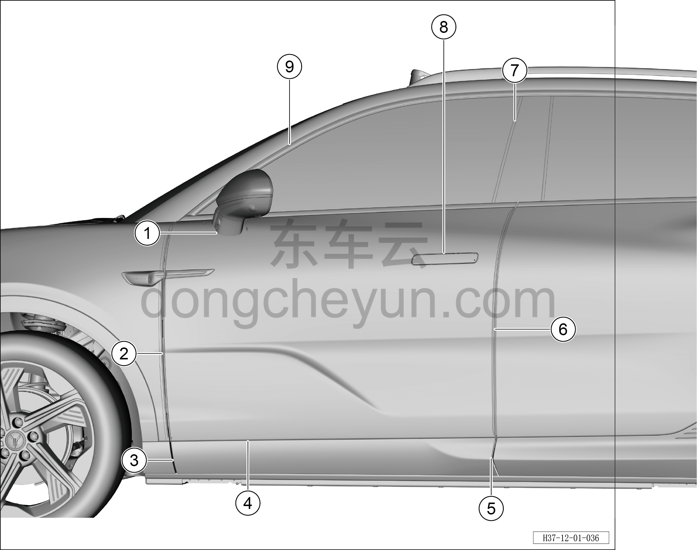

**Примечание:**

**- Для регулировки или проверки размеров зазора следует использовать пластиковый щуп для измерения зазора.**

Стандарт сборки боковой части

| № | Место | Допустимый размер зазора (мм) | Допустимый размер перепада (мм) |
|---|---|---|---|
| 1 | Корпус наружного зеркала заднего вида — передняя дверь | 0.75±0.75/0.75 | - |
| 2 | Крыло — передняя дверь | 3.5±1.0/1.0 | - |
| 3 | Накладка переднего колёсного арки — наружная облицовка передней двери | 4.5±1.2 | - |
| 4 | Наружная панель передней двери — наружная облицовка передней двери | 0.5±0.5 | - |
| 5 | Наружная облицовка задней двери — наружная облицовка передней двери | 4.8±1.2 | - |
| 6 | Наружная панель передней двери — наружная панель задней двери | 3.7±1.0/1.0 | - |
| 7 | Наружная декоративная накладка стойки B боковины — стекло передней двери | 8±1.5/1.5 | - |
| 8 | Наружная панель передней двери — корпус наружной ручки открывания передней двери | 2.5±0.7/0.7 | - |
| 9 | Декоративная полоса боковины — стекло передней двери | 0 | - |

Боковая часть

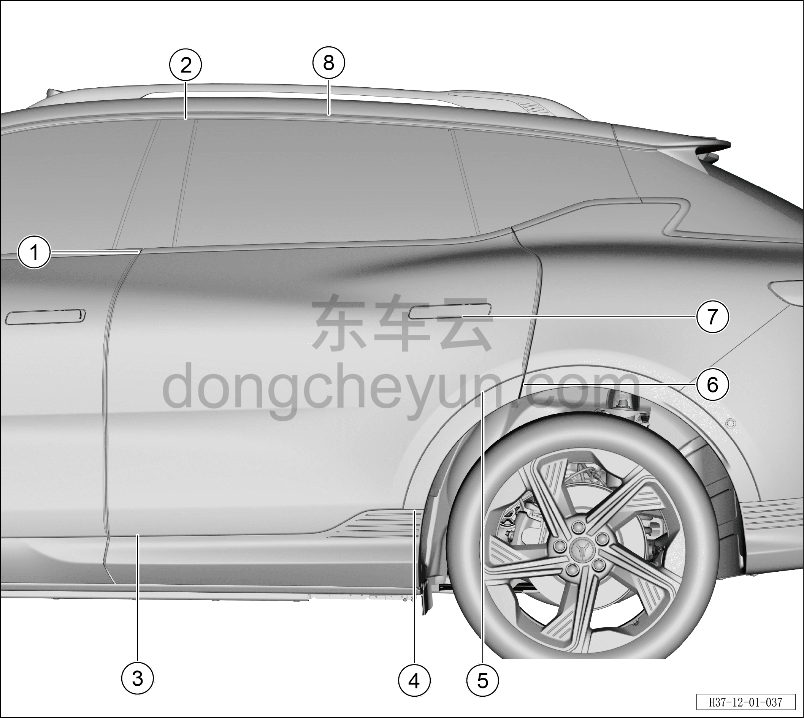

**Примечание:**

**- Для регулировки или проверки размеров зазора следует использовать пластиковый щуп для измерения зазора.**

Стандарт сборки боковой части

| № | Место | Допустимый размер зазора (мм) | Допустимый размер перепада (мм) |
|---|---|---|---|
| 1 | Наружный водосток передней двери — наружный водосток задней двери | 3.7±1.2 | - |
| 2 | Декоративная полоса боковины — наружная декоративная накладка стойки B боковины | 0 | - |
| 3 | Наружная панель задней двери — наружная облицовка задней двери | 0.5±0.5 | - |
| 4 | Декоративный элемент заднего колёсного арки (передний участок) — наружная облицовка задней двери | 0.5±0.5 | - |
| 5 | Наружная панель задней двери — декоративный элемент заднего колёсного арки (передний участок) | 0.5±0.5 | - |
| 6 | Декоративный элемент заднего колёсного арки (передний участок) — декоративный элемент заднего колёсного арки (задний участок) | 3.7±1.2/1.0 | 3.0±1.2/1.0 |
| 7 | Наружная панель задней двери — корпус наружной ручки открывания задней двери | 2.5±0.7/0.7 | - |
| 8 | Декоративная полоса боковины — стекло задней двери | 0 | - |

Боковая часть

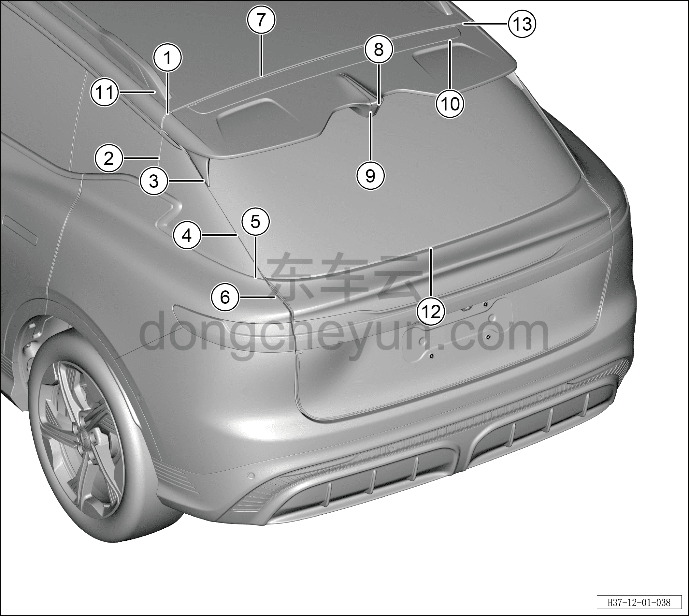

**Примечание:**

**- Для регулировки или проверки размеров зазора следует использовать пластиковый щуп для измерения зазора.**

Стандарт сборки боковой части

| № | Место | Допустимый размер зазора (мм) | Допустимый размер перепада (мм) |
|---|---|---|---|
| 1 | Наружная панель заднего дефлектора — наружная панель боковины | 4.5±1.5 | - |
| 2 | Декоративная накладка стойки D заднего борта боковины — заднее угловое стекло в сборе | 1.0±1.0 | - |
| 3 | Декоративная накладка стойки D заднего борта боковины — боковая внутренняя панель заднего спойлера | 4.0±1.5 | - |
| 4 | Декоративная накладка стойки D заднего борта боковины — заднее стекло | 4.0±1.5 | - |
| 5 | Декоративная накладка стойки D заднего борта боковины — наружная панель боковины | 0.5±0.5 | - |
| 6 | Верхняя панель наружной панели двери багажника — наружная панель боковины | （3.7~4.0）±1.0 | - |
| 7 | Наружная панель крыши — верхняя панель наружной панели двери багажника | 5.5±1.2 | - |
| 8 | Декоративная накладка дополнительного стоп-сигнала — наружная панель заднего дефлектора | 0.5±0.5 | - |
| 9 | Наружная панель заднего дефлектора — третий стоп-сигнал | 1.0±0.7 | - |
| 10 | Верхняя панель наружной панели двери багажника — наружная панель заднего дефлектора | 1.0±0.7 | - |
| 11 | Задняя часть багажника на крыше — наружная панель крыши | 1.5±1.0 | - |
| 12 | Заднее стекло — верхняя панель наружной панели двери багажника | 1.0±2 | - |
| 13 | Наружная панель боковины — боковая наружная панель заднего спойлера | （5.5~4.5）±1.5 | - |

Задняя часть

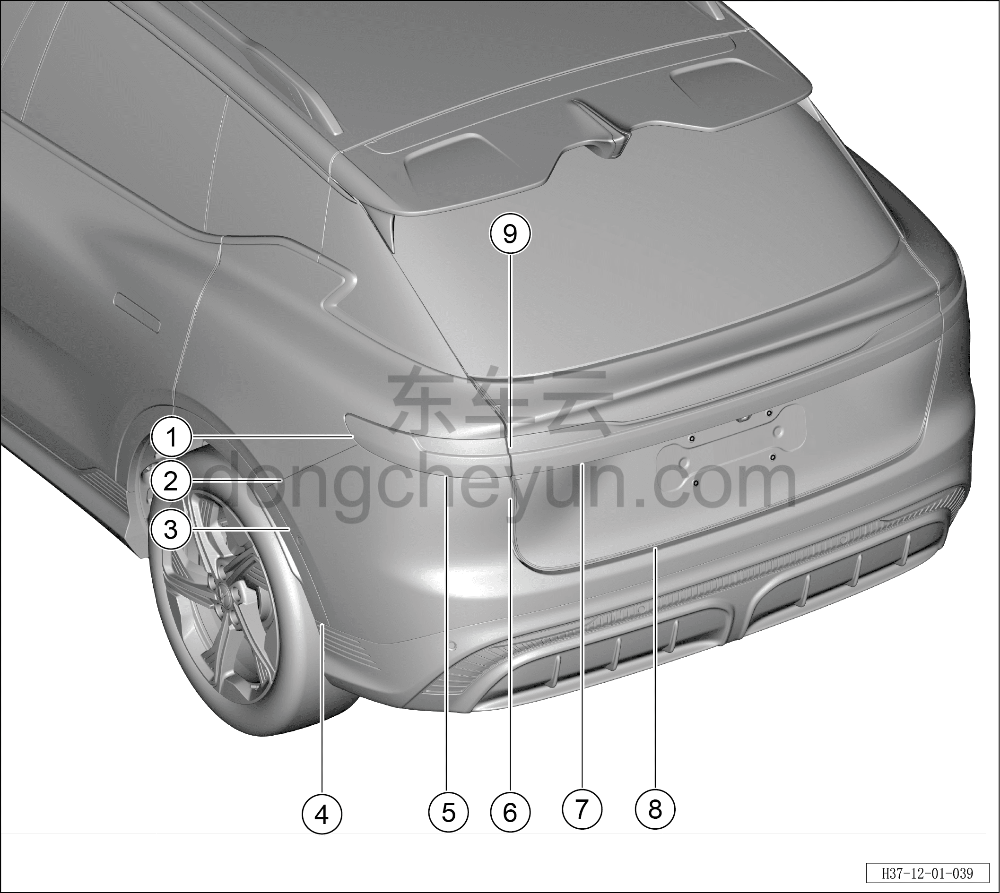

**Примечание:**

**- Для регулировки или проверки размеров зазора следует использовать пластиковый щуп для измерения зазора.**

Стандарт сборки задней части

| № | Место | Допустимый размер зазора (мм) | Допустимый размер перепада (мм) |
|---|---|---|---|
| 1 | Боковина — задний комбинированный фонарь (неподвижная сторона) | 1.2±1.0 | 0±1.0 |
| 2 | Боковина — задний бампер | 0+0.5/0 | -0.5±0.5 |
| 3 | Задний бампер — накладка заднего колёсного арки (левая задняя) | 0.5±0.5 | - |
| 4 | Накладка заднего колёсного арки (левая задняя) — задний бампер | 0.5±0.5 | -1.5±0.8 |
| 5 | Задний комбинированный фонарь (неподвижная сторона) — задний бампер | 1.2±1.0 | - |
| 6 | Задний бампер — дверь багажника (направление Y) | 4.0±1.5 | - |
| 7 | Задний комбинированный фонарь (подвижная сторона) — дверь багажника | 1.2±1.0 | - |
| 8 | Задний бампер — дверь багажника (направление Z) | 5.0±1.5 | - |
| 9 | Задний комбинированный фонарь (неподвижная сторона) — задний комбинированный фонарь (подвижная сторона) | 4.0±1.5 | (-1.5～-2.2)±1.5 |

Задняя часть

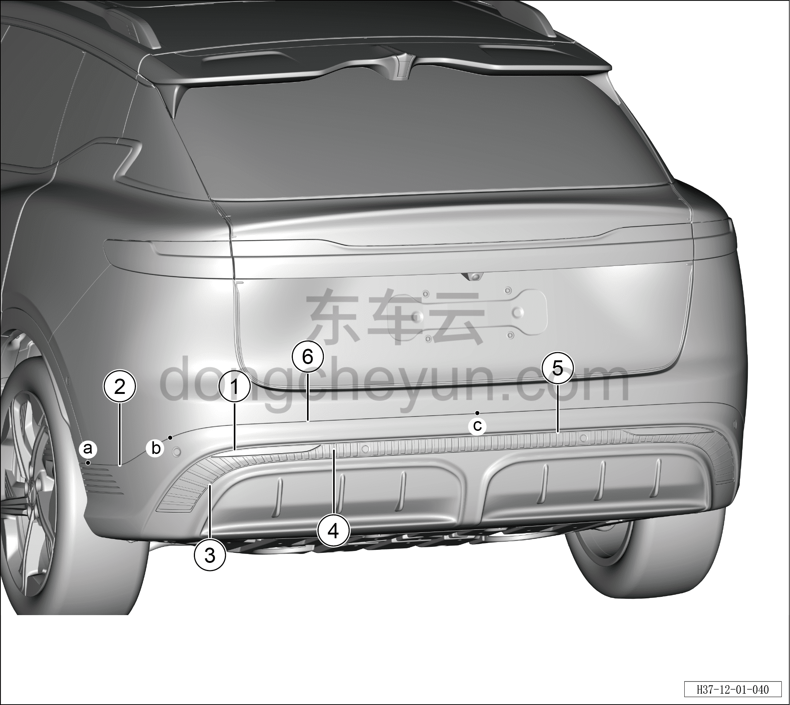

**Примечание:**

**- Для регулировки или проверки размеров зазора следует использовать пластиковый щуп для измерения зазора.**

Стандарт сборки задней части

| № | Место | Допустимый размер зазора (мм) | Допустимый размер перепада (мм) |
|---|---|---|---|
| 1 | Левая декоративная полоса нижней облицовки заднего бампера — задняя противотуманная фара | 1.0±0.7 | - |
| 2 | Верхняя облицовка заднего бампера — нижняя облицовка заднего бампера (a~b) | 0.3±0.3 | - |
| 3 | Левая декоративная полоса нижней облицовки заднего бампера — нижняя облицовка заднего бампера | 0.7±0.5 | 0.5±0.5 |
| 4 | Левая декоративная полоса нижней облицовки заднего бампера — средняя декоративная полоса нижней облицовки заднего бампера | 0.7±0.5 | - |
| 5 | Нижняя облицовка заднего бампера — нижняя облицовка заднего бампера | 0.7±0.5 | 0.5±0.5 |
| 6 | Верхняя облицовка заднего бампера — нижняя облицовка заднего бампера (b~c) | 0.5±0.3 | - |

Крыша — версия с люком

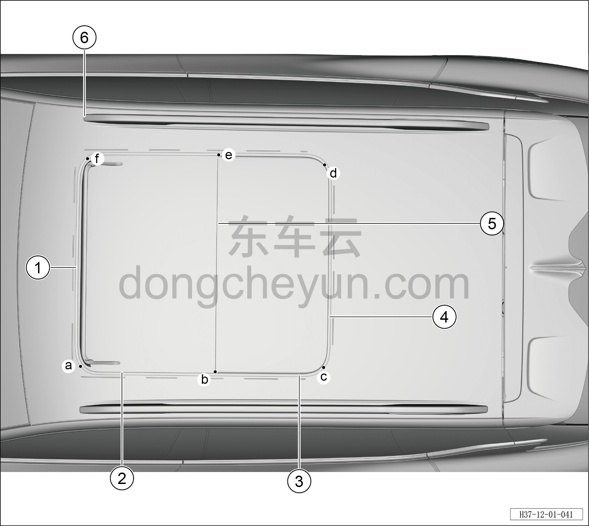

**Примечание:**

**- Для регулировки или проверки размеров зазора следует использовать пластиковый щуп для измерения зазора.**

Стандарт сборки крыши — версия с люком

| № | Место | Допустимый размер зазора (мм) | Допустимый размер перепада (мм) |
|---|---|---|---|
| 1 | Крыша — передний участок люка (a~f) | 0, прилегание | -1.5～+0.3 ±1.5 |
| 2 | Крыша — передний участок люка (b~c) | 0, прилегание | -1.3～0±1.5 |
| 3 | Крыша — задний участок люка (c~d) | 0, прилегание | -0.8～0.5±1.5 |
| 4 | Крыша — задний участок люка (d~e) | 0, прилегание | 0.9～0.4+1.0 |
| 5 | Задний участок люка — передний участок люка | 1.5±1.5 | 1.4～1.7 +1.0±1.5 |
| 6 | Передняя часть багажника на крыше — наружная панель крыши | 1.5±1.0 | - |

Внутренняя отделка накладки стойки B

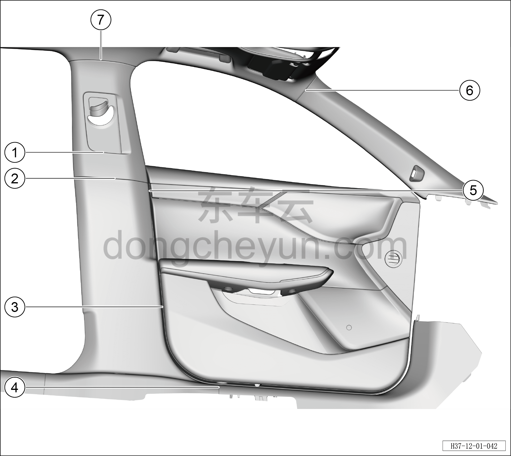

**Примечание:**

**- Для регулировки или проверки размеров зазора следует использовать пластиковый щуп для измерения зазора.**

Стандарт сборки внутренней отделки накладки стойки B

| № | Место | Допустимый размер зазора (мм) | Допустимый размер перепада (мм) |
|---|---|---|---|
| 1 | Ползун регулятора высоты ремня безопасности — верхняя накладка стойки B | 0/0.5 | - |
| 2 | Нижняя накладка стойки B — верхняя накладка стойки B | 0.5±0.5//0.5 | - |
| 3 | Нижняя накладка стойки B — карман передней двери | 8±2 | - |
| 4 | Нижняя накладка стойки B — декоративная накладка порога передней двери | 0.5±0.5//0.5 | - |
| 5 | Нижняя накладка стойки B — декоративная накладка INS передней двери | 8±2 | - |
| 6 | Верхняя накладка стойки A — обивка потолка | 0, прилегание | - |
| 7 | Верхняя накладка стойки B — обивка потолка | 0, прилегание | - |

Внутренняя отделка панели задней двери

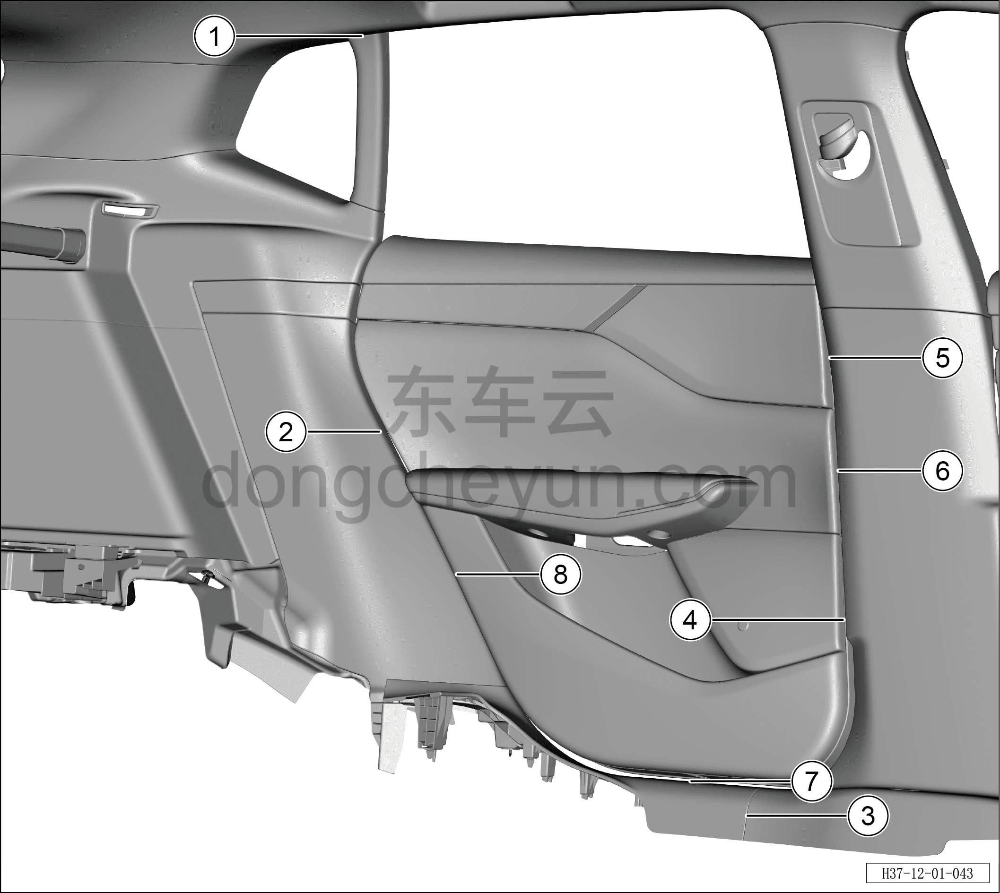

**Примечание:**

**- Для регулировки или проверки размеров зазора следует использовать пластиковый щуп для измерения зазора.**

Стандарт сборки внутренней отделки панели задней двери

| № | Место | Допустимый размер зазора (мм) | Допустимый размер перепада (мм) |
|---|---|---|---|
| 1 | Декоративная накладка заднего углового стекла — обивка потолка | 0, прилегание | - |
| 2 | Нижняя накладка стойки C — декоративный элемент накладки задней двери | 6±2 | - |
| 3 | Нижняя накладка стойки B — накладка порога задней двери | 0.5±0.5//0.5 | - |
| 4 | Нижняя накладка стойки B — кожух динамика накладки задней двери | 8±2 | - |
| 5 | Нижняя накладка стойки B — декоративная накладка INS внутренней накладки задней двери | 7.5±2 | - |
| 6 | Нижняя накладка стойки B — декоративный элемент накладки задней двери | 6±2 | - |
| 7 | Накладка задней двери — накладка порога задней двери | 9.7±2 | - |
| 8 | Нижняя накладка стойки C — накладка двери багажника | 7±2 | - |

Внутренняя отделка стойки C

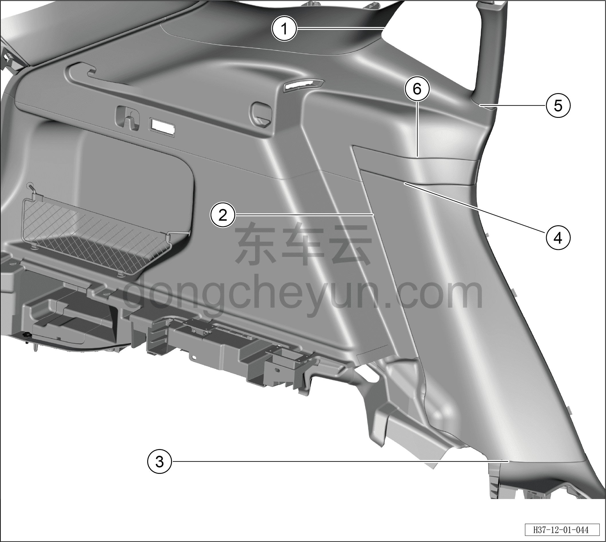

**Примечание:**

**- Для регулировки или проверки размеров зазора следует использовать пластиковый щуп для измерения зазора.**

Стандарт сборки внутренней отделки стойки C

| № | Место | Допустимый размер зазора (мм) | Допустимый размер перепада (мм) |
|---|---|---|---|
| 1 | Верхняя накладка стойки D — стекло заднего углового окна | 3±1.5//1.5 | - |
| 2 | Нижняя накладка стойки C — задняя боковая внутренняя обивка | 0, прилегание | - |
| 3 | Нижняя накладка стойки C — накладка порога задней двери | 0/0.5 | - |
| 4 | Деталь INS задней боковой накладки — нижняя накладка стойки C | 0.5±0.5 | - |
| 5 | Декоративная накладка заднего углового стекла — задняя боковая внутренняя обивка | 0.3±0.3 | - |
| 6 | Деталь INS задней боковой накладки — верхняя деталь накладки порога задней двери | 0.3±0.3//0.3 | - |

Внутренняя отделка багажника

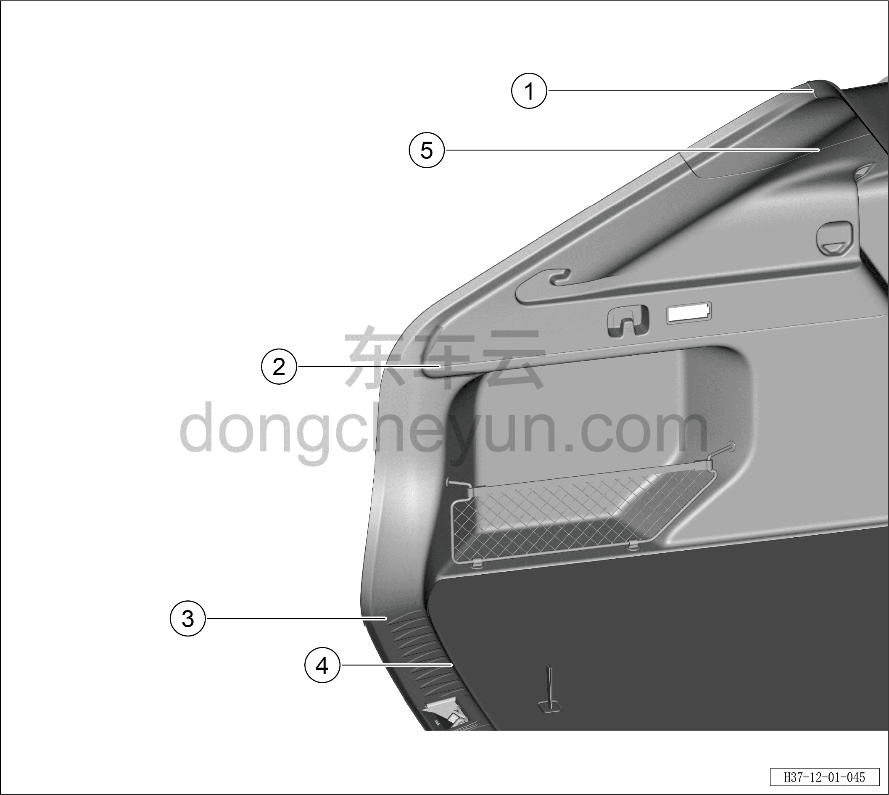

**Примечание:**

**- Для регулировки или проверки размеров зазора следует использовать пластиковый щуп для измерения зазора.**

Стандарт сборки внутренней отделки багажника

| № | Место | Допустимый размер зазора (мм) | Допустимый размер перепада (мм) |
|---|---|---|---|
| 1 | Верхняя накладка стойки D — обивка потолка | 0, прилегание | - |
| 2 | Внутренняя накладка задней боковины — верхняя часть внутренней накладки задней боковины | 0, прилегание | - |
| 3 | Нижняя накладка задней боковины — накладка порога двери багажника | 0, прилегание | - |
| 4 | Накладка крышки багажника — накладка порога двери багажника | 2±2//2 | - |
| 5 | Верхняя накладка стойки D — внутренняя накладка задней боковины | 0.5±0.5//0.5 | - |

Внутренняя отделка двери багажника

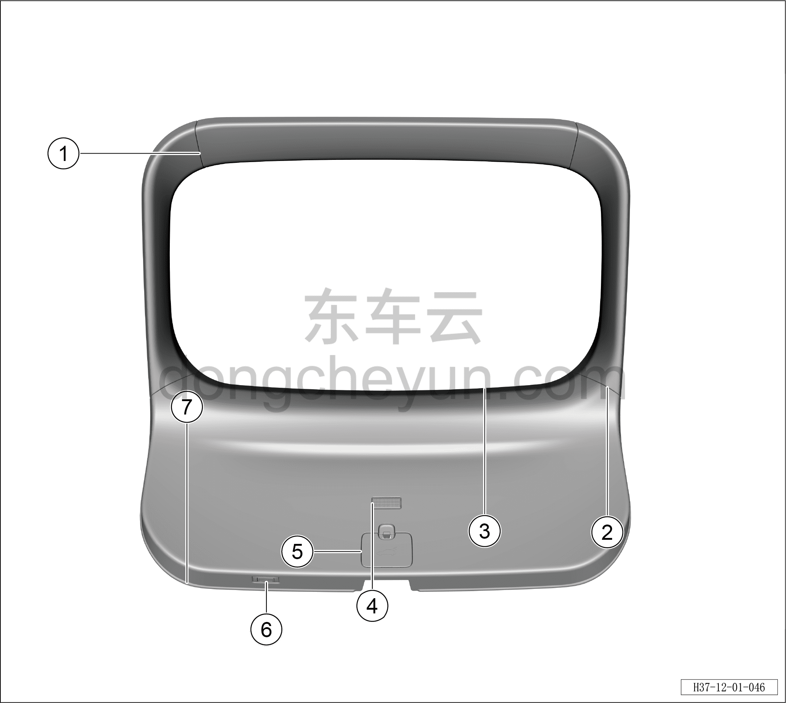

**Примечание:**

**- Для регулировки или проверки размеров зазора следует использовать пластиковый щуп для измерения зазора.**

Стандарт сборки внутренней отделки двери багажника

| № | Место | Допустимый размер зазора (мм) | Допустимый размер перепада (мм) |
|---|---|---|---|
| 1 | Боковая декоративная накладка двери багажника — верхняя декоративная накладка двери багажника | 0.5±0.5//0.5 | - |
| 2 | Боковая декоративная накладка двери багажника — нижняя декоративная накладка двери багажника | 0.5±0.5//0.5 | - |
| 3 | Заднее стекло — нижняя накладка двери багажника | 3±1.5//1.5 | - |
| 4 | Нижняя накладка двери багажника — фонарь багажника | 0.3/0 | - |
| 5 | Крышка замка двери багажника — нижняя накладка двери багажника | 0.5±0.5//0.5 | - |
| 6 | Кнопка открывания — нижняя накладка двери багажника | 0.3±0.3//0.3 | - |
| 7 | Накладка двери багажника — металлическая панель двери багажника | 0/0.5 | - |

Внутренняя отделка (ковровое покрытие)

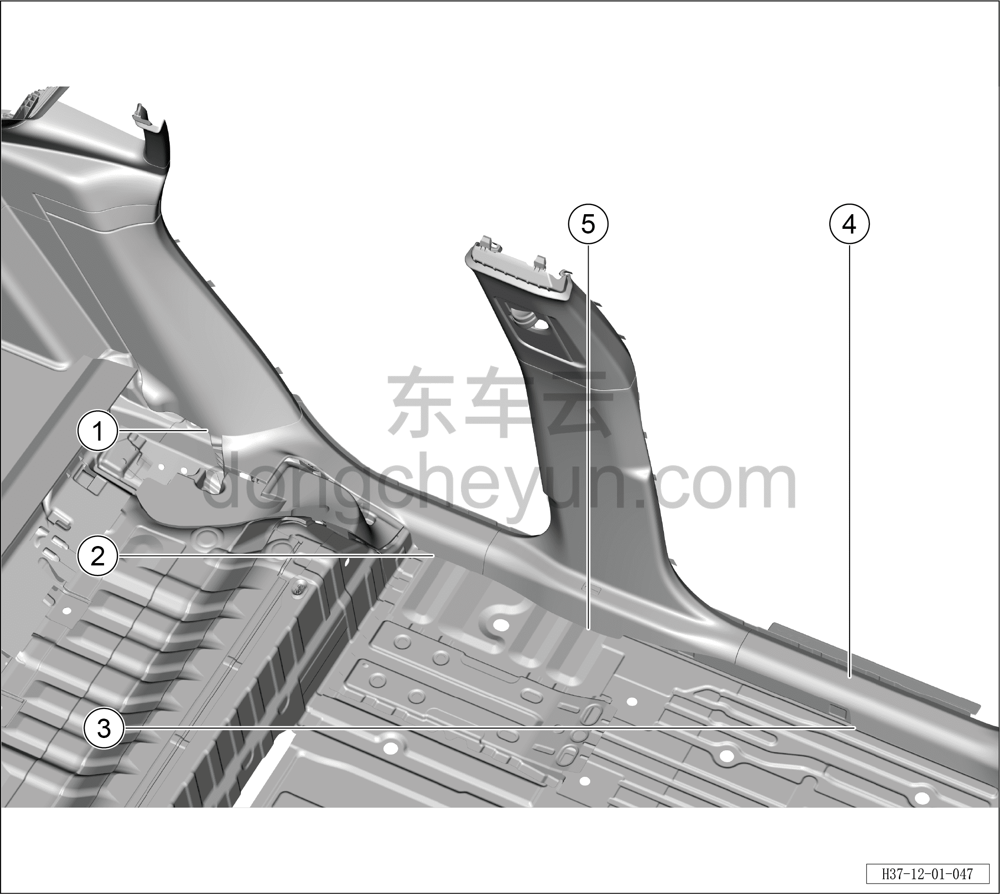

**Примечание:**

**- Для регулировки или проверки размеров зазора следует использовать пластиковый щуп для измерения зазора.**

Стандарт сборки внутренней отделки (ковровое покрытие)

| № | Место | Допустимый размер зазора (мм) | Допустимый размер перепада (мм) |
|---|---|---|---|
| 1 | Нижняя накладка стойки C — ковровое покрытие | 0/0.5 | - |
| 2 | Накладка порога задней двери — ковровое покрытие | 0, прилегание | - |
| 3 | Накладка порога передней двери — ковровое покрытие | 0, прилегание | - |
| 4 | Накладка порога передней двери — накладка передней двери | 9.6±2 | - |
| 5 | Нижняя накладка стойки B — ковровое покрытие | 0, прилегание | - |

Внутренняя отделка обивки потолка — версия с люком

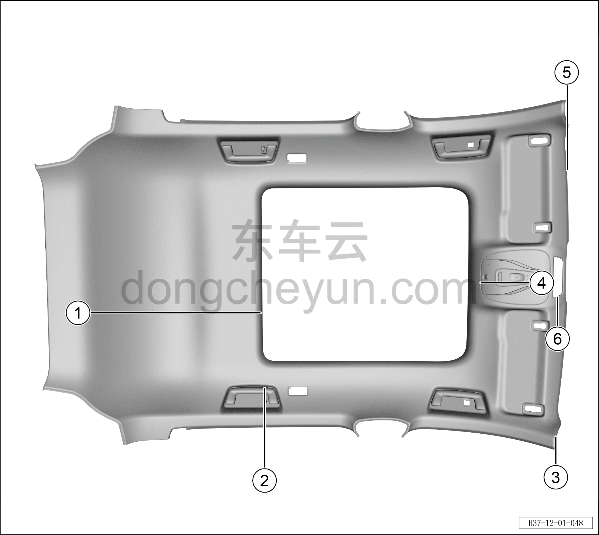

**Примечание**:

**- Для регулировки или проверки размеров зазора следует использовать пластиковый щуп для измерения зазора.**

Стандарт сборки обивки потолка — версия с люком

| № | Место | Допустимый размер зазора (мм) | Допустимый размер перепада (мм) |
|---|---|---|---|
| 1 | Обивка потолка — люк в сборе | 3±1.5//1.5 | - |
| 2 | Обивка потолка — поручень обивки потолка | 4±2 | - |
| 3 | Обивка потолка — верхняя накладка стойки A | 0, прилегание | - |
| 4 | Обивка потолка — панель потолочного светильника | 0, прилегание | - |
| 5 | Обивка потолка — лобовое стекло | 3±1.5//1.5 | - |
| 6 | Обивка потолка — декоративная крышка камеры мониторинга заднего ряда | 0, прилегание | - |

Внутренняя отделка корпуса передней двери

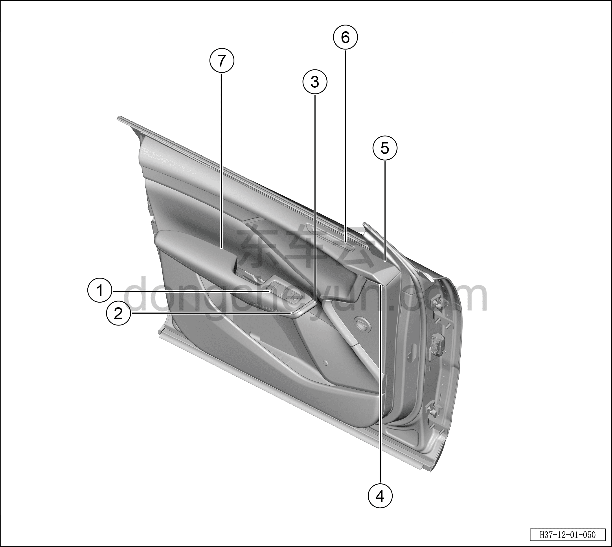

**Примечание:**

**- Для регулировки или проверки размеров зазора следует использовать пластиковый щуп для измерения зазора.**

Стандарт сборки внутренней отделки корпуса передней двери

| № | Место | Допустимый размер зазора (мм) | Допустимый размер перепада (мм) |
|---|---|---|---|
| 1 | Подлокотник передней двери — декоративная полоса панели управления | 0.3/0 | - |
| 2 | Подлокотник передней двери — декоративная накладка подлокотника левой передней двери | 0.3/0 | 3±0.5 |
| 3 | Подлокотник передней двери — нижняя декоративная накладка подлокотника левой передней двери | 0.3±0.3 | - |
| 4 | Подлокотник передней двери — верхняя облицовка дверной панели | 0, прилегание | - |
| 5 | Декоративная накладка статичного уплотнителя передней двери — верхняя облицовка дверной панели | 0.5/0 | - |
| 6 | Боковой дефростерный воздуховод передней двери — верхняя облицовка дверной панели | 0.5/0 | - |
| 7 | Средняя облицовка дверной панели — подлокотник передней двери | 0, прилегание | -1±0.5 |

Внутренняя отделка корпуса передней двери

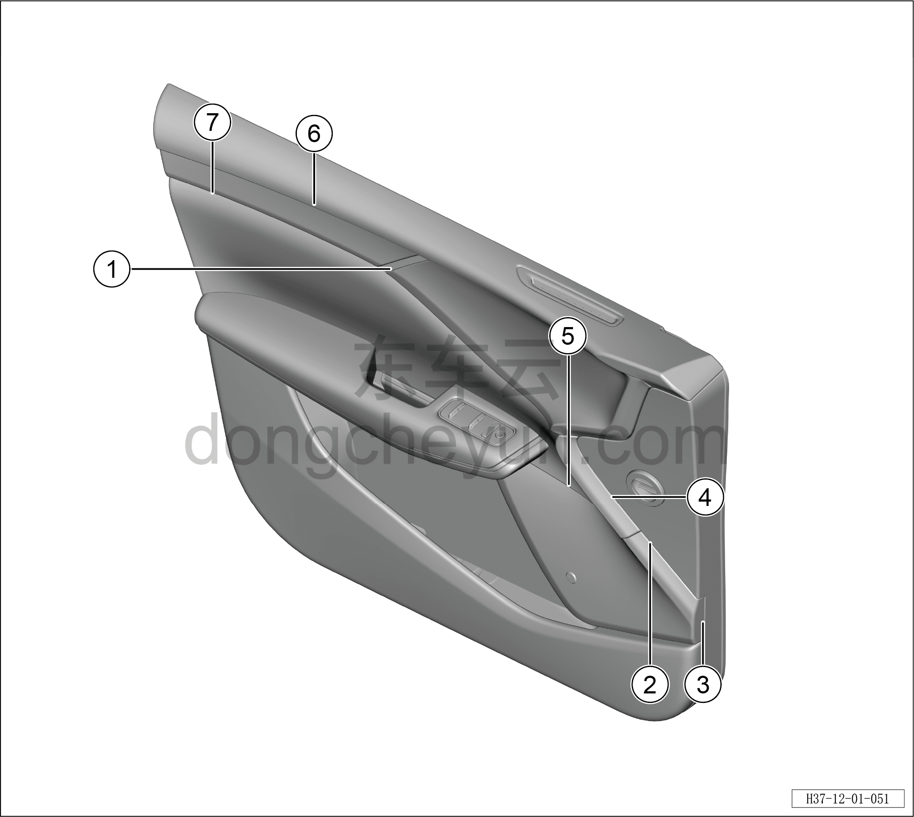

**Примечание:**

**- Для регулировки или проверки размеров зазора следует использовать пластиковый щуп для измерения зазора.**

Стандарт сборки внутренней отделки корпуса передней двери (продолжение)

| № | Место | Допустимый размер зазора (мм) | Допустимый размер перепада (мм) |
|---|---|---|---|
| 1 | Декоративная накладка передней двери — декоративная полоса накладки передней двери | 0.3±0.3//0.3 | - |
| 2 | Внутренняя накладка передней двери — облицовка динамика | 0.5±0.5 | - |
| 3 | Внутренняя накладка передней двери — облицовка динамика | 0.3±0.3 | - |
| 4 | Внутренняя накладка передней двери — средняя облицовка накладки двери | 0.5/0 | - |
| 5 | Облицовка динамика — средняя облицовка накладки двери | -1.0±0.5 | - |
| 6 | Верхняя облицовка накладки двери — декоративная накладка передней двери | 0.3/0 | - |
| 7 | Средняя облицовка накладки двери — декоративная накладка передней двери | 0.3/0 | - |

Внутренняя отделка корпуса передней двери

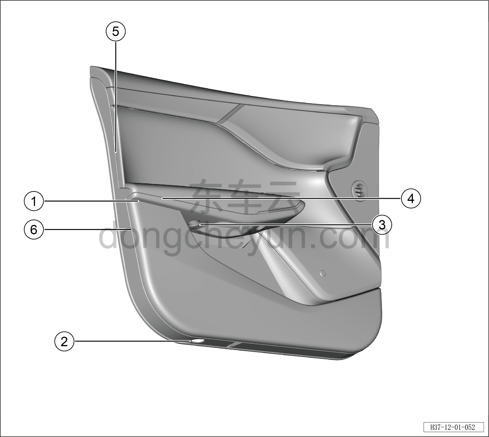

**Примечание:**

**- Для регулировки или проверки размеров зазора следует использовать пластиковый щуп для измерения зазора.**

Стандарт сборки внутренней отделки корпуса передней двери

| № | Место | Допустимый размер зазора (мм) | Допустимый размер перепада (мм) |
|---|---|---|---|
| 1 | Карман передней двери — нижняя декоративная накладка подлокотника передней двери | 0.5±0.5 | - |
| 2 | Подсветка пола — внутренняя накладка передней двери | 0.5±0.3 | - |
| 3 | Заглушка передней двери — нижняя декоративная накладка подлокотника передней двери | 0.3±0.3 | - |
| 4 | Облицовка подлокотника — нижняя декоративная накладка левого подлокотника передней двери | 0.3/0 | - |
| 5 | Внутренняя панель передней двери — внутренняя накладка передней двери | 0.5/0 | - |
| 6 | Карман передней двери — внутренняя накладка передней двери | 0.3±0.3//0.3 | - |

Внутренняя отделка корпуса задней двери

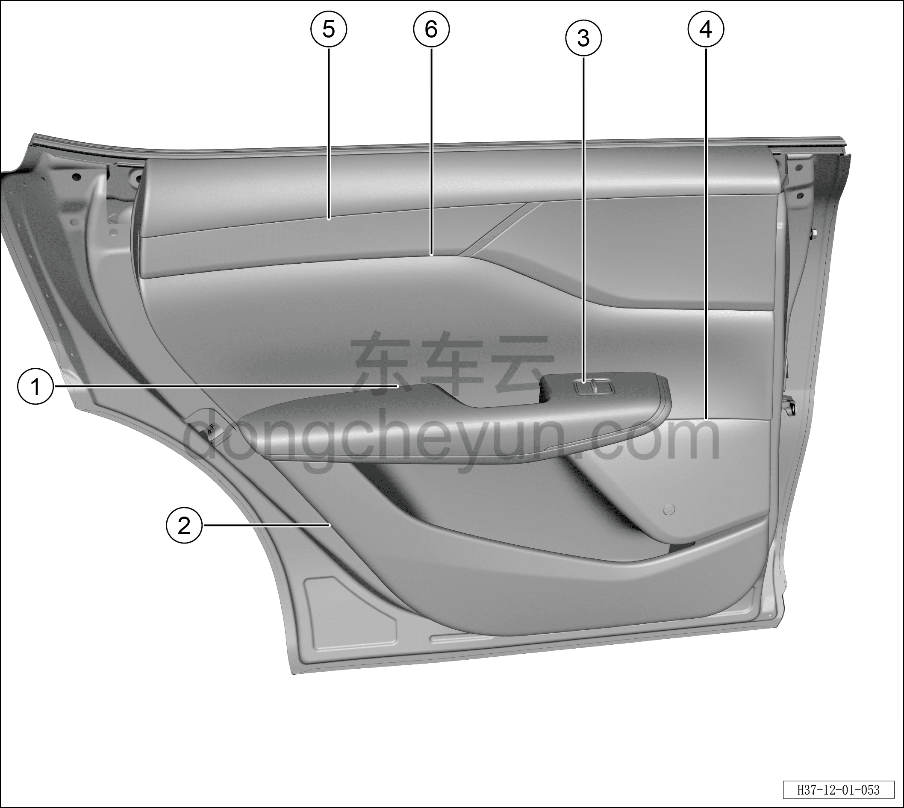

**Примечание:**

**- Для регулировки или проверки размеров зазора следует использовать пластиковый щуп для измерения зазора.**

Стандарт сборки внутренней отделки корпуса

| № | Место | Допустимый размер зазора (мм) | Допустимый размер перепада (мм) |
|---|---|---|---|
| 1 | Панель переключателей — декоративная панель | 0.5±0.5 | - |
| 2 | Панель переключателей — средняя вставка | 0/0.3 | 3±0.5 |
| 3 | Корпус — средняя вставка | 0/0.3 | - |
| 4 | Корпус — средняя вставка | 0/0.3 | - |
| 5 | Корпус — верхняя обшивка выступающей формы | 0/0.5 | - |
| 6 | Декоративный элемент рамки окна — верхняя обшивка выступающей формы | 0/0.3 | - |
| 7 | Верхняя обшивка выступающей формы — боковой дефростерный воздуховод | 0/0.3 | -1±0.5 |
| 8 | Верхняя обшивка выступающей формы — средняя вставка | 0/0.3 | - |

Внутренняя отделка корпуса

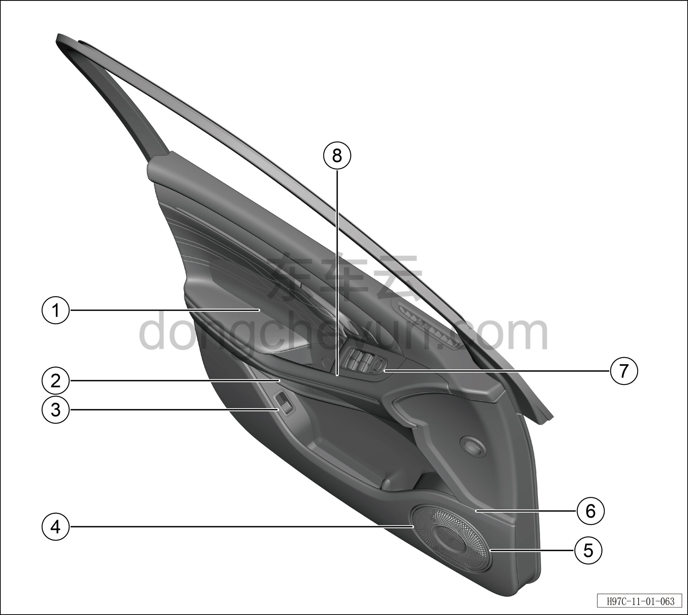

**Примечание:**

**- Для регулировки или проверки размеров зазора следует использовать пластиковый щуп для измерения зазора.**

Стандарт сборки внутренней отделки корпуса задней двери

| № | Место | Допустимый размер зазора (мм) | Допустимый размер перепада (мм) |
|---|---|---|---|
| 1 | Средняя облицовка дверной панели — облицовка подлокотника задней двери | 0, прилегание | - |
| 2 | Карман задней двери — внутренняя накладка задней двери | 0.3±0.3//0.3 | - |
| 3 | Подлокотник задней двери — декоративная полоса панели управления | 0.3/0 | - |
| 4 | Средняя облицовка дверной панели — облицовка динамика задней двери | 0.5/0 | - |
| 5 | Верхняя облицовка дверной панели — декоративная накладка задней двери | 0.3/0 | - |
| 6 | Средняя облицовка дверной панели — декоративная накладка задней двери | 0.3/0 | - |

Внутренняя отделка корпуса задней двери

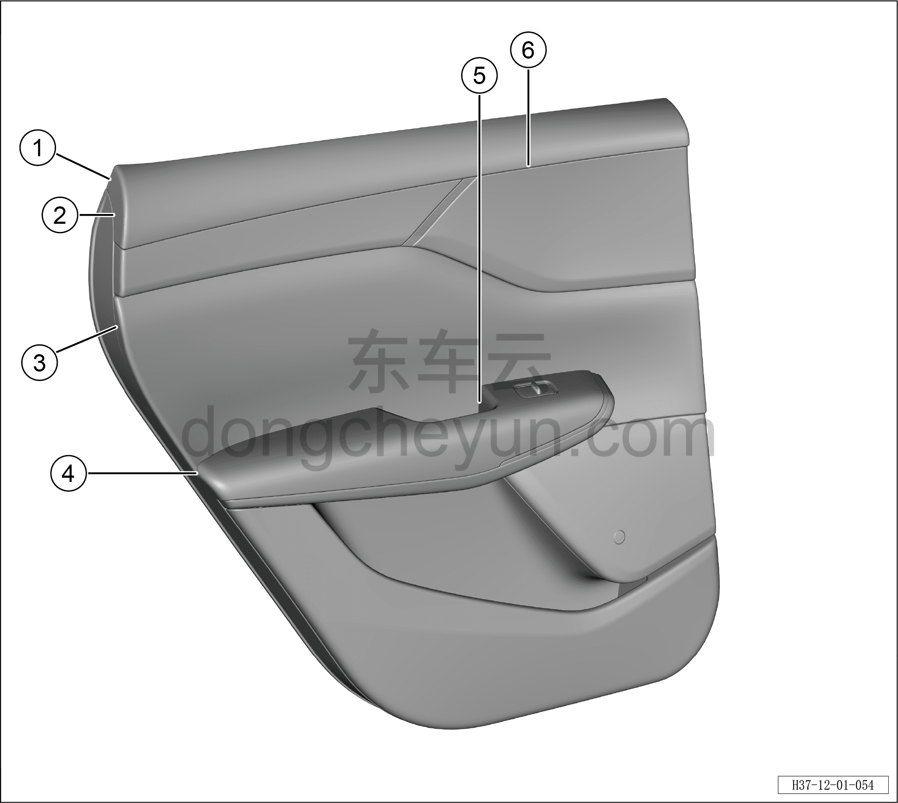

**Примечание:**

**- Для регулировки или проверки размеров зазора следует использовать пластиковый щуп для измерения зазора.**

Стандарт сборки внутренней отделки корпуса задней двери

| № | Место | Допустимый размер зазора (мм) | Допустимый размер перепада (мм) |
|---|---|---|---|
| 1 | Верхняя облицовка накладки задней двери — стекло задней двери | 8±2//2 | - |
| 2 | Верхняя облицовка накладки задней двери — внутренняя накладка задней двери | 0/0.3 | - |
| 3 | Средняя облицовка накладки задней двери — внутренняя накладка задней двери | 0/0.3 | - |
| 4 | Облицовка подлокотника задней двери — внутренняя накладка задней двери | 0/0.3 | - |
| 5 | Ручка подлокотника — коробка ручки задней двери | 0/0.3 | - |
| 6 | Верхняя облицовка накладки задней двери — декоративная накладка задней двери | 0/0.3 | - |

Внутренняя отделка дверной панели

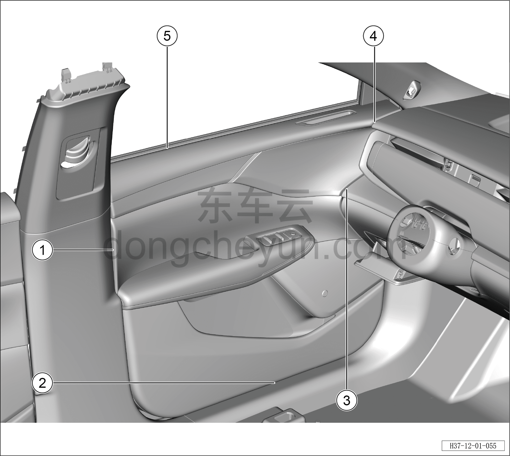

**Примечание:**

**- Для регулировки или проверки размеров зазора следует использовать пластиковый щуп для измерения зазора.**

Стандарт сборки внутренней отделки дверной панели

| № | Место | Допустимый размер зазора (мм) | Допустимый размер перепада (мм) |
|---|---|---|---|
| 1 | Средняя декоративная накладка передней двери — нижняя накладка стойки B | 6.8±2 | - |
| 2 | Накладка порога передней двери — накладка передней двери | 9.6±2 | - |
| 3 | Декоративная накладка INS панели передней двери — боковая декоративная панель | 5±2 | - |
| 4 | Верхняя облицовка передней двери — верхняя накладка панели приборов | 5±2 | - |
| 5 | Верхняя облицовка передней двери — стекло передней двери | 8±2.0//2.0 | - |

Внутренняя отделка левой части панели приборов

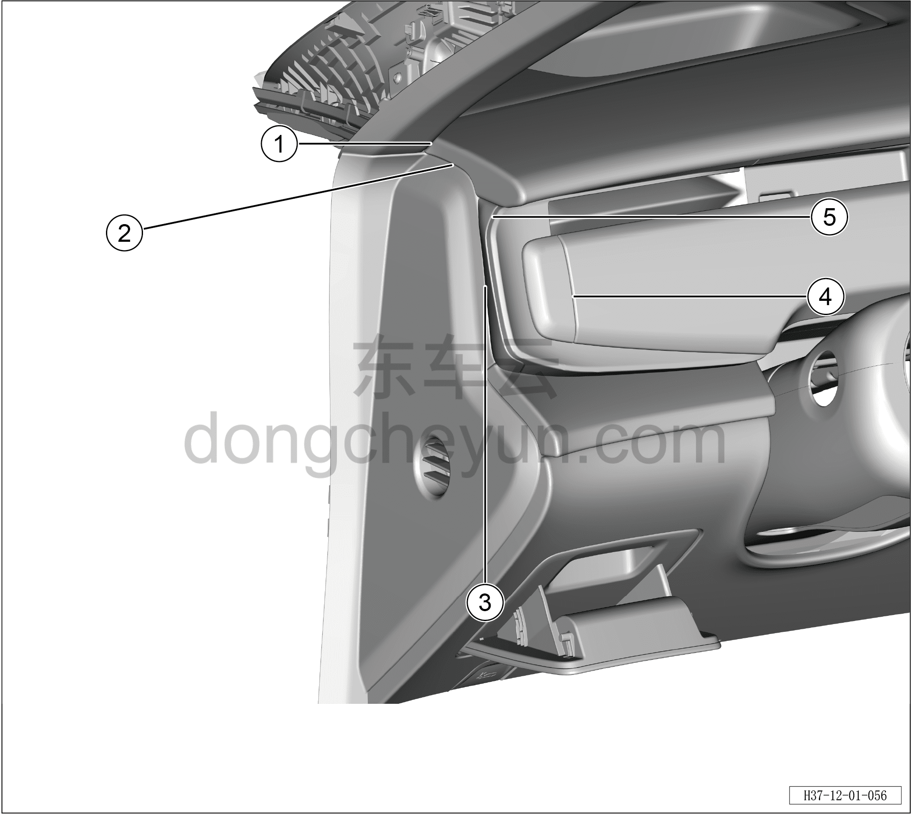

**Примечание:**

**- Для регулировки или проверки размеров зазора следует использовать пластиковый щуп для измерения зазора.**

Стандарт сборки внутренней отделки левой части панели приборов

| № | Место | Допустимый размер зазора (мм) | Допустимый размер перепада (мм) |
|---|---|---|---|
| 1 | Передняя накладка дефростера — верхняя накладка стойки A | 0.5/0 | - |
| 2 | Верхняя накладка панели приборов — левая торцевая крышка панели приборов | -1±0.5//0.5 | - |
| 3 | Боковая крышка воздуховыпускного отверстия — левая торцевая крышка панели приборов | 0.5±0.5//0.5 | - |
| 4 | Центральная декоративная панель — декоративная накладка центральной декоративной панели | 0, прилегание | - |
| 5 | Наружная крышка воздуховыпускного отверстия — боковая крышка воздуховыпускного отверстия | 0.3±0.3 | - |

Внутренняя отделка левой нижней накладки

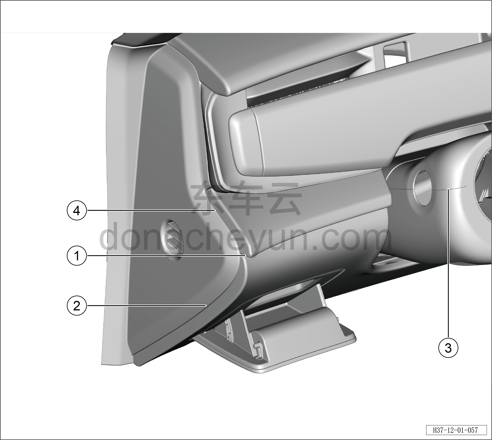

**Примечание**:

**- Для регулировки или проверки размеров зазора следует использовать пластиковый щуп для измерения зазора.**

Стандарт сборки внутренней отделки левой нижней накладки

| № | Место | Допустимый размер зазора (мм) | Допустимый размер перепада (мм) |
|---|---|---|---|
| 1 | Боковая декоративная полоса — нижняя накладка | 0.5±0.5 | - |
| 2 | Левая торцевая крышка — левая нижняя накладка | 0.5±0.5 | - |
| 3 | Верхний кожух рулевой колонки — нижний кожух рулевой колонки | 0.2±0.2 | - |
| 4 | Левая торцевая крышка — боковая декоративная полоса | 0.5±0.5 | - |

Внутренняя отделка воздуховыпускного отверстия со стороны водителя

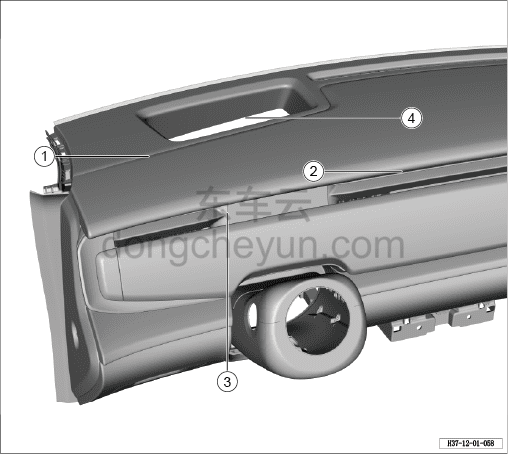

**Примечание:**

**- Для регулировки или проверки размеров зазора следует использовать пластиковый щуп для измерения зазора.**

Стандарт сборки внутренней отделки воздуховыпускного отверстия со стороны водителя

| № | Место | Допустимый размер зазора (мм) | Допустимый размер перепада (мм) |
|---|---|---|---|
| 1 | Передняя накладка дефростера — верхняя накладка панели приборов | 0/0.3 | - |
| 2 | Верхняя накладка панели приборов — воздуховыпускное отверстие в сборе | 1.5±0.5 | - |
| 3 | Дисплей комбинации приборов — воздуховыпускное отверстие в сборе | 1.5±0.7 | - |
| 4 | Передняя накладка дефростера — отверстие проекционного дисплея (HUD) | 2±1 | - |

Внутренняя отделка козырька панели приборов

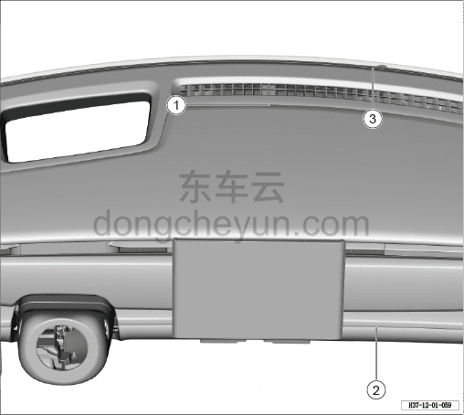

**Примечание:**

**- Для регулировки или проверки размеров зазора следует использовать пластиковый щуп для измерения зазора.**

Стандарт сборки внутренней отделки козырька панели приборов

| № | Место | Допустимый размер зазора (мм) | Допустимый размер перепада (мм) |
|---|---|---|---|
| 1 | Верхняя накладка панели приборов — передняя накладка дефростера | 0.3/0 | - |
| 2 | Боковая декоративная полоса — нижняя накладка | 0.5±0.5 | - |
| 3 | Лобовое стекло — передняя накладка дефростера | 5±2.0//2.0 | - |

Внутренняя отделка правой нижней накладки панели приборов

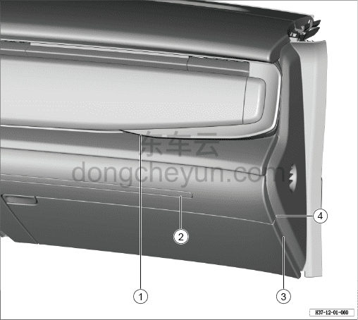

**Примечание:**

**- Для регулировки или проверки размеров зазора следует использовать пластиковый щуп для измерения зазора.**

Стандарт сборки внутренней отделки правой нижней накладки панели приборов

| № | Место | Допустимый размер зазора (мм) | Допустимый размер перепада (мм) |
|---|---|---|---|
| 1 | Крышка бардачка (боковой торец) — центральная правая нижняя накладка | 1.5±0.7//1.0 | - |
| 2 | Ручка бардачка — крышка бардачка | 1.5±0.7 | - |
| 3 | Ручка бардачка — центральная правая нижняя накладка | 1.5±0.7 | - |
| 4 | Крышка бардачка (верхний торец) — центральная правая нижняя накладка | 1.5±0.7//1.0 | - |

Внутренняя отделка бардачка

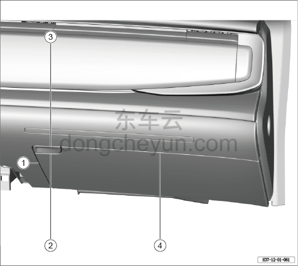

**Примечание:**

**- Для регулировки или проверки размеров зазора следует использовать пластиковый щуп для измерения зазора.**

Стандарт сборки внутренней отделки бардачка

| № | Место | Допустимый размер зазора (мм) | Допустимый размер перепада (мм) |
|---|---|---|---|
| 1 | Крышка бардачка (боковой торец) — центральная правая нижняя накладка | 1.5±0.7//1.0 | - |
| 2 | Ручка бардачка — крышка бардачка | 1.5±0.7 | - |
| 3 | Ручка бардачка — центральная правая нижняя накладка | 1.5±0.7 | - |
| 4 | Крышка бардачка (верхний торец) — центральная правая нижняя накладка | 1.5±0.7//1.0 | - |

Внутренняя отделка левой нижней накладки

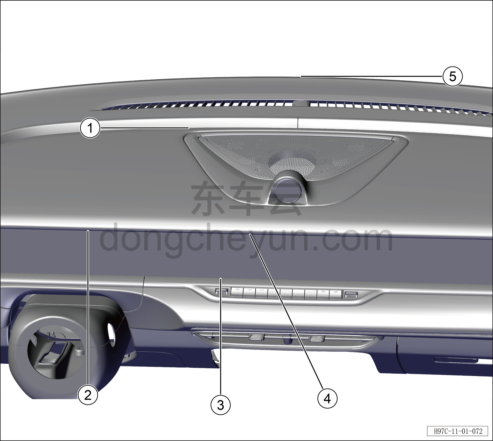

**Примечание:**

**- Для регулировки или проверки размеров зазора следует использовать пластиковый щуп для измерения зазора.**

Стандарт сборки внутренней отделки левой нижней накладки

| № | Место | Допустимый размер зазора (мм) | Допустимый размер перепада (мм) |
|---|---|---|---|
| 1 | Левая торцевая крышка — левая нижняя накладка | 0.5±0.5 | - |
| 2 | Левая нижняя накладка панели приборов — кнопка открывания капота (верхний торец) | 2±0.5 | - |
| 3 | Боковая декоративная полоса — нижняя накладка | 0.5±0.5 | - |
| 4 | Уплотнительная накладка верхнего кожуха — верхний кожух | 0.3/0 | - |
| 5 | Наружная крышка воздуховыпускного отверстия — боковая декоративная полоса | 1.2±1 | - |
| 6 | Ящик для мелочей (боковой торец) — левая нижняя накладка панели приборов | -1~0 (переменный) ±0,5 | - |
| 7 | Ящик для мелочей (верхний торец) — левая нижняя накладка панели приборов | 1.5±0.7//0.7 | - |
| 8 | Левая нижняя накладка панели приборов — кнопка открывания капота (боковой торец) | 1.5±0.5 | - |

Внутренняя отделка центральной нижней накладки IP

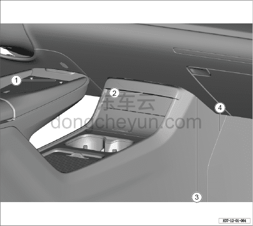

**Примечание:**

**- Для регулировки или проверки размеров зазора следует использовать пластиковый щуп для измерения зазора.**

Стандарт сборки внутренней отделки центральной нижней накладки IP

| № | Место | Допустимый размер зазора (мм) | Допустимый размер перепада (мм) |
|---|---|---|---|
| 1 | Декоративная полоса верхней панели — коврик беспроводной зарядки | 0.3/0 | - |
| 2 | Передний соединительный элемент — декоративная полоса | 0.5±0.5//0.5 | - |
| 3 | Центральная правая нижняя накладка панели приборов — боковая крышка | 1.5±0.5//1.0 | - |
| 4 | Передняя удлинительная накладка — боковая крышка | 0.5±0.5//0.5 | - |

Внутренняя отделка правой боковой панели

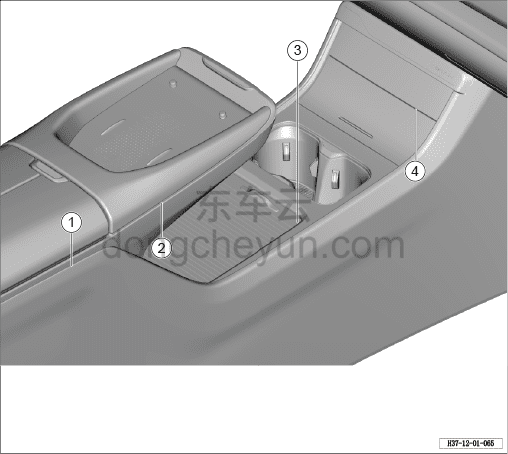

**Примечание:**

**- Для регулировки или проверки размеров зазора следует использовать пластиковый щуп для измерения зазора.**

Стандарт сборки внутренней отделки правой боковой панели

| № | Место | Допустимый размер зазора (мм) | Допустимый размер перепада (мм) |
|---|---|---|---|
| 1 | Боковая крышка — боковая панель подлокотника | 0.5±0.5//0.5 | - |
| 2 | Боковая панель подлокотника — декоративная полоса верхней панели | 0.3±0.3//0.3 | - |
| 3 | Верхняя крышка — раздвижная крышка | 1±0.5//0.5 | - |
| 4 | Передний соединительный элемент — передняя откидная крышка USB | 1.5±0.5//0.5 | - |

Внутренняя отделка верхней панели

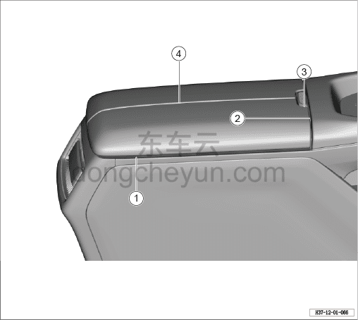

**Примечание:**

**- Для регулировки или проверки размеров зазора следует использовать пластиковый щуп для измерения зазора.**

Стандарт сборки внутренней отделки верхней панели

| № | Место | Допустимый размер зазора (мм) | Допустимый размер перепада (мм) |
|---|---|---|---|
| 1 | Крышка бокса подлокотника — боковая панель подлокотника | 4±1.0//1.0 | - |
| 2 | Верхняя панель — крышка бокса подлокотника | 2.5±1.0 | - |
| 3 | Кнопка подлокотника — крышка бокса подлокотника | 2±1.2//1.2 | - |
| 4 | Левая крышка бокса подлокотника — правая крышка бокса подлокотника | 2±1.2//1.2 | - |

Внутренняя отделка задней крышки

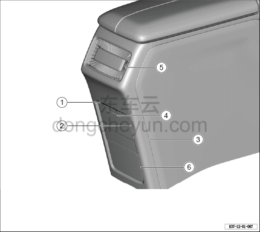

**Примечание:**

**- Для регулировки или проверки размеров зазора следует использовать пластиковый щуп для измерения зазора.**

Стандарт сборки внутренней отделки задней крышки

| № | Место | Допустимый размер зазора (мм) | Допустимый размер перепада (мм) |
|---|---|---|---|
| 1 | Задняя крышка — задний ящик для мелочей (верхний торец) | 1.5±0.5//0.5 | - |
| 2 | Задняя крышка — задний ящик для мелочей (боковой торец) | 1.5±0.5 | - |
| 3 | Боковая крышка — задняя крышка | 0.5±0.5//0.5 | - |
| 4 | Декоративная полоса заднего ящика для мелочей — задний ящик для мелочей | 0.2±0.3//0.3 | - |
| 5 | Решётка заднего воздуховыпускного отверстия — декоративная полоса заднего воздуховыпускного отверстия | 0.3±0.3//0.3 | - |
| 6 | Задняя крышка — крышка отделения для ароматизатора | 0.5±0.5 | - |

Внутренняя отделка задней крышки

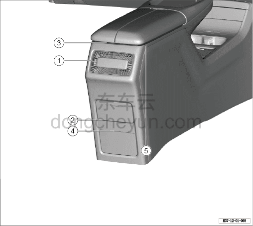

**Примечание:**

**- Для регулировки или проверки размеров зазора следует использовать пластиковый щуп для измерения зазора.**

Стандарт сборки внутренней отделки центральной консоли

| № | Место | Допустимый размер зазора (мм) | Допустимый размер перепада (мм) |
|---|---|---|---|
| 1 | Нижняя накладка консоли (подвесной тип) — боковая декоративная накладка бокса подлокотника | 0.5±0.5//0.5 | - |
| 2 | Нижняя накладка консоли (подвесной тип) — декоративная полоса верхней панели | 0±0.5 | - |
| 3 | Нижняя крышка консоли (подвесной тип) — крышка USB | 0.5±0.5//0.5 | - |
| 4 | Верхняя крышка — крышка USB | 0.5±0.5 | - |
| 5 | Верхняя крышка — крышка USB | 0.5±0.5//0.5 | - |
| 6 | Разъём USB-зарядки — крышка USB | -0.5±0.5//0.5 | - |
