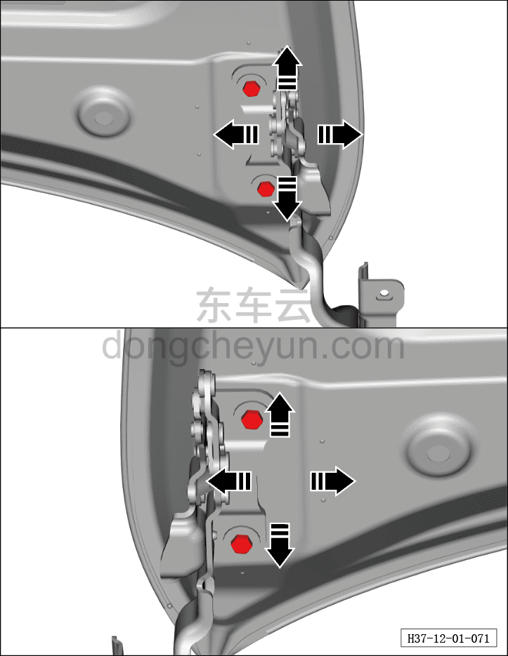
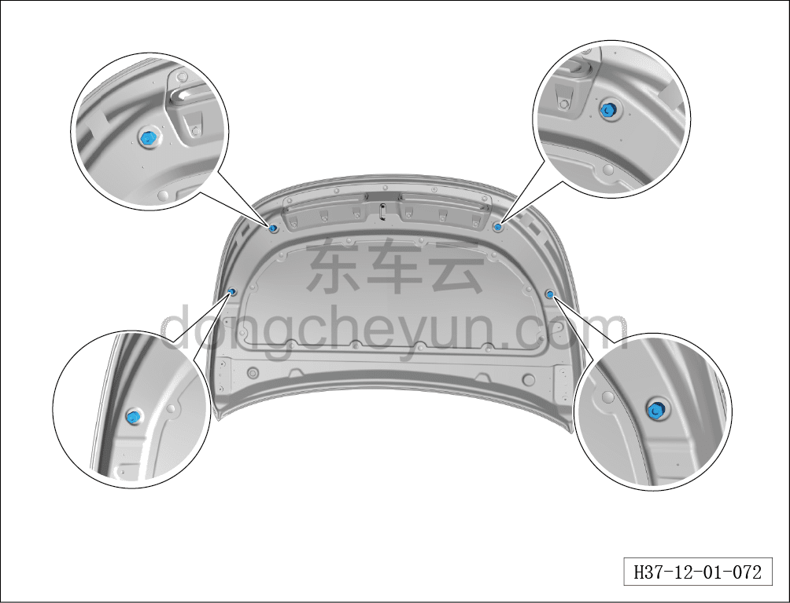

# Регулировка капота

> Кузовные жестяные работы, окраска › Кузов в белом (BIW) в сборе › Методы регулировки навесных элементов кузова  
> Оригинал: `调整发动机罩` · [dongcheyun 56746](https://dongcheyun.com/p/56746), страница `c4cc3faa9a794efe8cc5a5d1203f1f4a` · [оглавление](../README.md)

1. Ослабьте 8 болтов петель на капоте.

2. Переместите капот, отрегулировав зазор между капотом и крылом.

3. После регулировки затяните 4 болта петель. Момент затяжки болтов: 21±3 Н·м

**Внимание:**

**- Отметьте положение петли относительно кузовной панели капота в сборе для последующей ориентации при снятии и установке.**

4. Поворотом резиновой прокладки отрегулируйте высоту переднего края капота.
