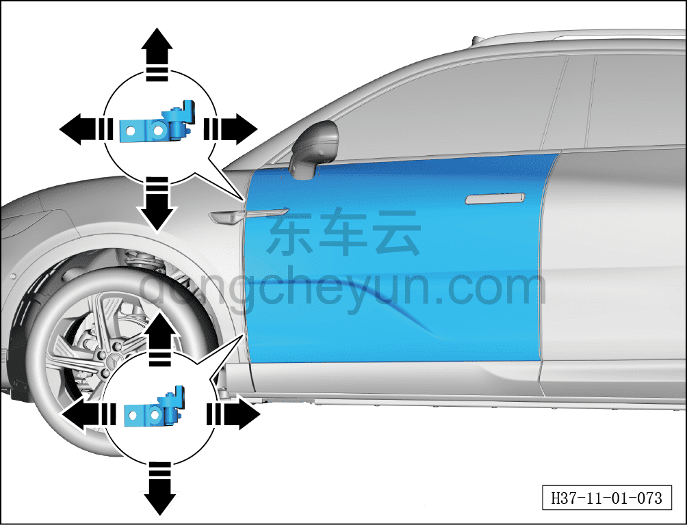

# Регулировка передней двери

> Кузовные жестяные работы, окраска › Кузов в белом (BIW) в сборе › Методы регулировки навесных элементов кузова  
> Оригинал: `调整前车门` · [dongcheyun 56746](https://dongcheyun.com/p/56746), страница `327391fe2cfc423e8bb97c198f9b5d73` · [оглавление](../README.md)

**Примечание:**

**- При регулировке передней двери автомобиль должен неподвижно стоять на горизонтальной поверхности.**

**- Регулировку выполнять с помощью второго техника.**

1. Снимите крыло.

2. Ослабьте (не выворачивая полностью) крепёжные болты верхней и нижней петель со стороны кузова, переместите дверь в направлении стрелки вперёд/назад, вверх/вниз так, чтобы при закрытом положении двери зазор был равномерным по всему периметру, без вогнутости или выпуклости, а контуры совпадали — это означает, что передняя дверь отрегулирована правильно.

3. Затяните болты петель.

Момент затяжки болта: 30±5 Н·м
