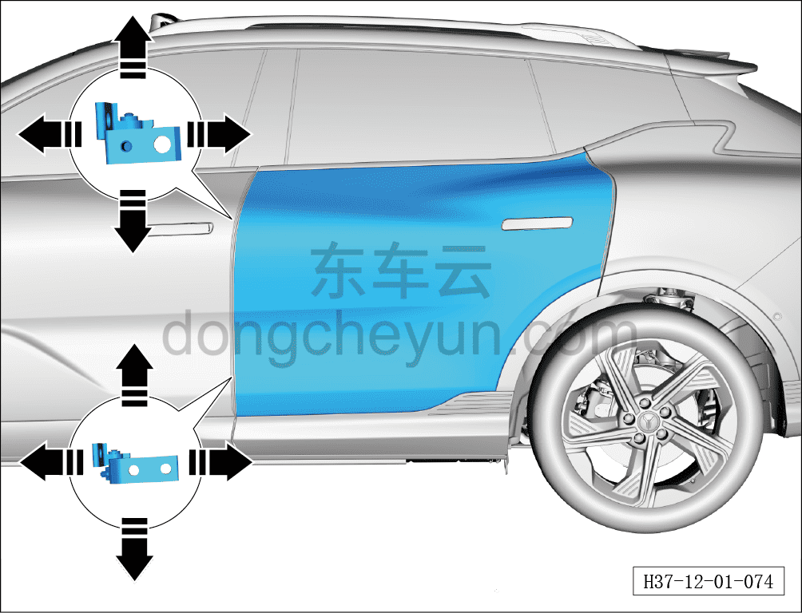

# Регулировка задней двери

> Кузовные жестяные работы, окраска › Кузов в белом (BIW) в сборе › Методы регулировки навесных элементов кузова  
> Оригинал: `调整后车门` · [dongcheyun 56746](https://dongcheyun.com/p/56746), страница `b1c4aa1cae324bce87c85b50453148ec` · [оглавление](../README.md)

**Примечание:**

**- При регулировке задней двери автомобиль должен неподвижно стоять на горизонтальной поверхности.**

**- Регулировку выполнять с помощью второго техника.**

1. Ослабьте (не выворачивая полностью) крепёжные болты верхней и нижней петель со стороны кузова, переместите дверь в направлении стрелки вперёд/назад, вверх/вниз так, чтобы при закрытом положении двери зазор был равномерным по всему периметру, без вогнутости или выпуклости, а контуры совпадали — это означает, что задняя дверь отрегулирована правильно.

2. Затяните крепёжные болты петель. Момент затяжки болтов: 30±5 Н·м
