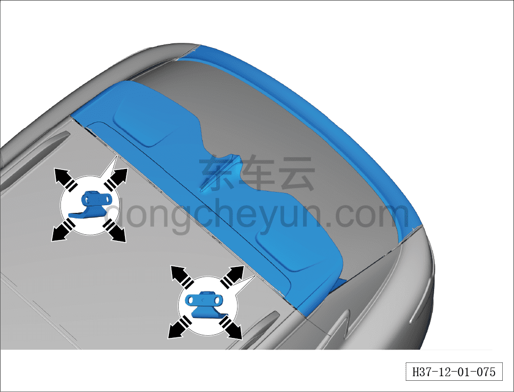
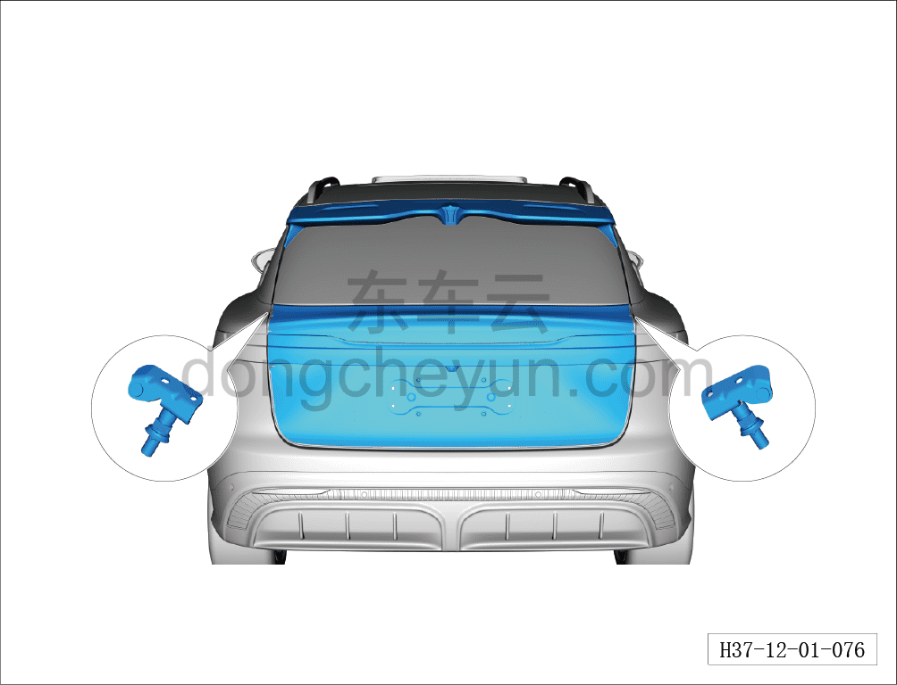

# Регулировка двери багажника

> Кузовные жестяные работы, окраска › Кузов в белом (BIW) в сборе › Методы регулировки навесных элементов кузова  
> Оригинал: `调整背门` · [dongcheyun 56746](https://dongcheyun.com/p/56746), страница `346262e532424a1c9c3d22048e8f107b` · [оглавление](../README.md)

**Примечание:**

**- При регулировке двери багажника автомобиль должен неподвижно стоять на горизонтальной поверхности.**

**- Регулировку выполнять с помощью второго техника.**

1. Снимите задний дефлектор.

2. Ослабьте (не выворачивая полностью) крепёжные болты левой и правой петель на кузове, переместите дверь багажника в направлении стрелки так, чтобы при закрытом положении двери багажника зазор был равномерным по всему периметру, без вогнутости или выпуклости, а контуры совпадали — это означает, что дверь багажника отрегулирована правильно.

3. Затяните болты петель.

Момент затяжки болта: 30±5 Н·м

4. Поворотом ограничителя двери багажника выровняйте дверь багажника относительно заднего бампера.

**Примечание:**

**- Поворотом резиновой прокладки ограничителя двери багажника можно поднять или опустить дверь багажника.**
