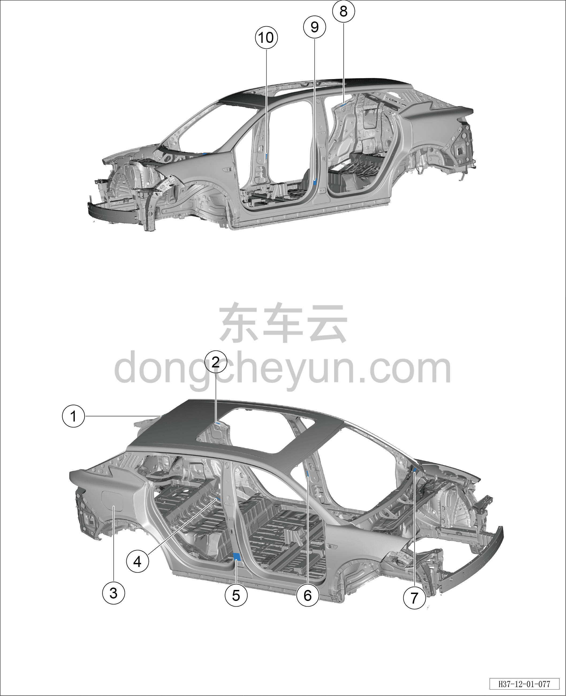
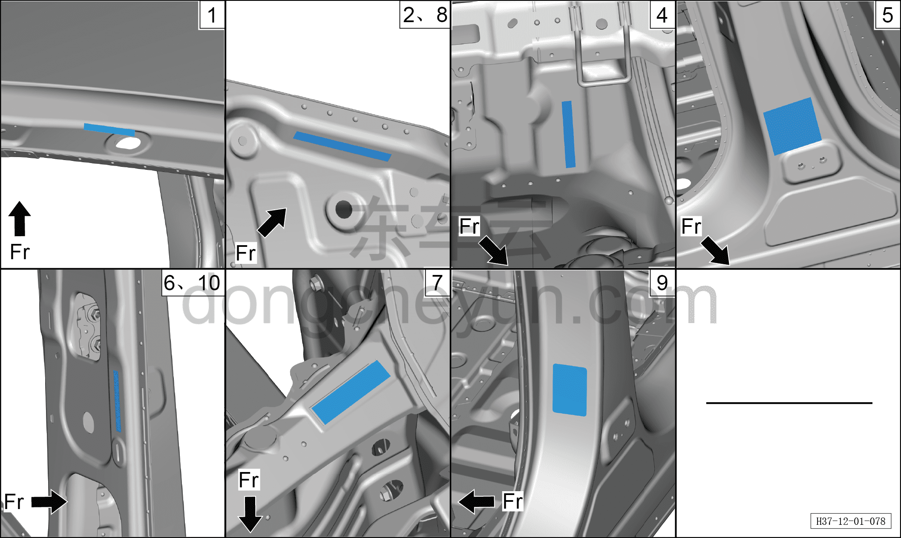

# Места расположения шильдиков/наклеек

> Кузовные жестяные работы, окраска › Кузов в белом (BIW) в сборе › Методы регулировки навесных элементов кузова  
> Оригинал: `标牌/标签粘贴位置` · [dongcheyun 56746](https://dongcheyun.com/p/56746), страница `79dbb56651724e51ba4095eb0aaad0b6` · [оглавление](../README.md)

| № | Название шильдика/наклейки | Место расположения шильдика/наклейки |
|---|---|---|
| 1 | Наклейка VIN | Левая сторона крепёжной пластины петли двери багажника |
| 2 | Наклейка VIN | Внутренняя сторона левой стойки C |
| 3 | Наклейка с указаниями по зарядке | Внутренняя сторона лючка зарядного порта |
| 4 | Наклейка VIN | Середина заднего поперечного пола |
| 5 | Товарный (заводской) шильдик | Нижняя часть наружной стороны правой стойки B |
| 6 | Наклейка VIN | Середина внутренней стороны левой стойки B |
| 7 | Наклейка VIN | Левая сторона переднего щита (перегородки) |
| 8 | Наклейка VIN | Внутренняя сторона правой стойки C |
| 9 | Предупреждающая наклейка о давлении в шинах | Нижняя часть наружной стороны левой стойки B |
| 10 | Наклейка VIN | Середина внутренней стороны правой стойки B |
