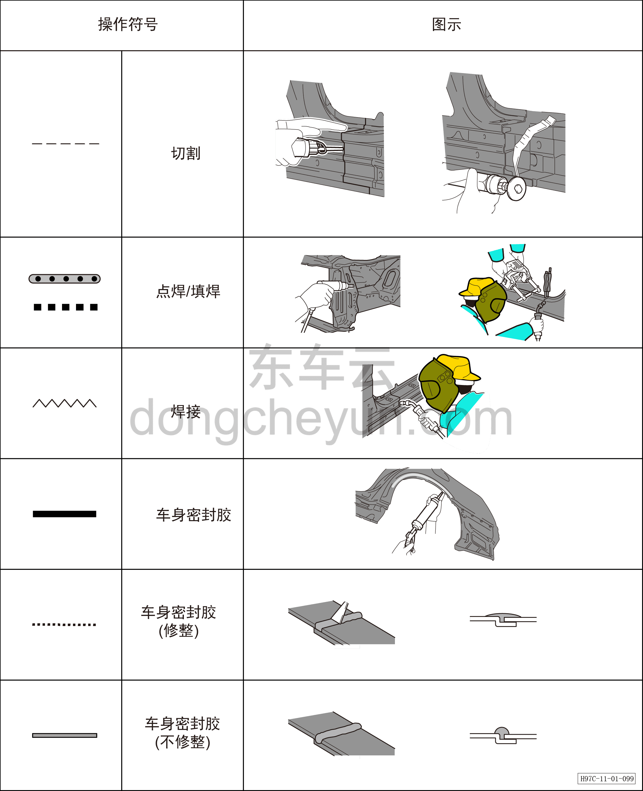

# Пояснение символов

> Кузовные жестяные работы, окраска › Кузов в белом (BIW) в сборе › Методы регулировки навесных элементов кузова  
> Оригинал: `符号解释` · [dongcheyun 56746](https://dongcheyun.com/p/56746), страница `47d05ef6dfc44f5ab17e39b214859314` · [оглавление](../README.md)

