# Размеры кузова

> Кузовные жестяные работы, окраска › Кузов в белом (BIW) в сборе › Методы регулировки навесных элементов кузова  
> Оригинал: `车身尺寸` · [dongcheyun 56746](https://dongcheyun.com/p/56746), страница `ab467b3b624b4fa1bee7ba8ce9e31180` · [оглавление](../README.md)

Базовые размеры

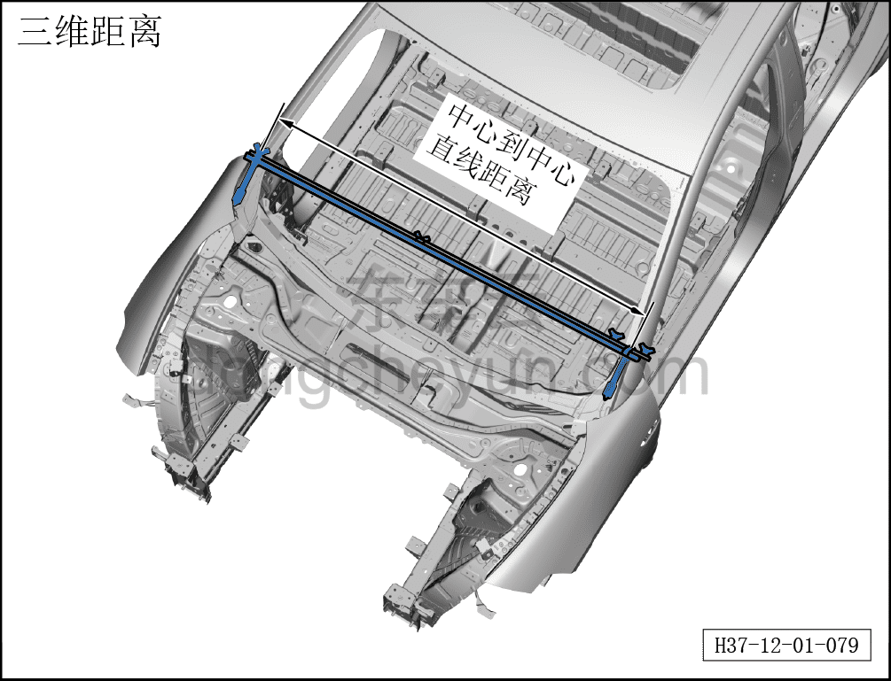

Трёхмерное расстояние

Прямолинейное расстояние между центрами двух измеряемых точек.

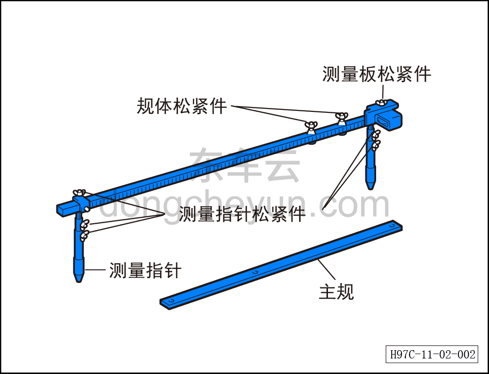

Измерение

Все измерения при ремонтных работах должны выполняться с помощью прибора для измерения колеи (базы); для операций, где прибор для измерения колеи применить невозможно, следует использовать рулетку.

**Внимание:**

**- При использовании рулетки не допускайте её скручивания и изгиба.**

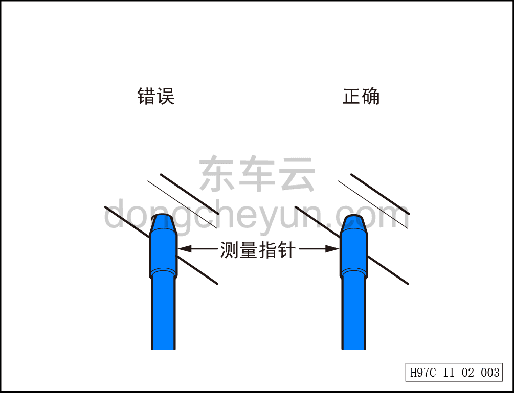

При использовании прибора для измерения колеи корпус прибора, измерительная планка или измерительный указатель не должны иметь люфта.

**Внимание:**

**- Высота левого и правого измерительных указателей должна быть одинаковой.**

**- Перед измерением или после регулировки высоты измерительного указателя обязательно откалибруйте прибор для измерения колеи.**

**- При использовании прибора для измерения колеи не допускайте его падения или воздействия вибрации.**

**- Убедитесь, что измерительный указатель зафиксирован в измерительном отверстии.**

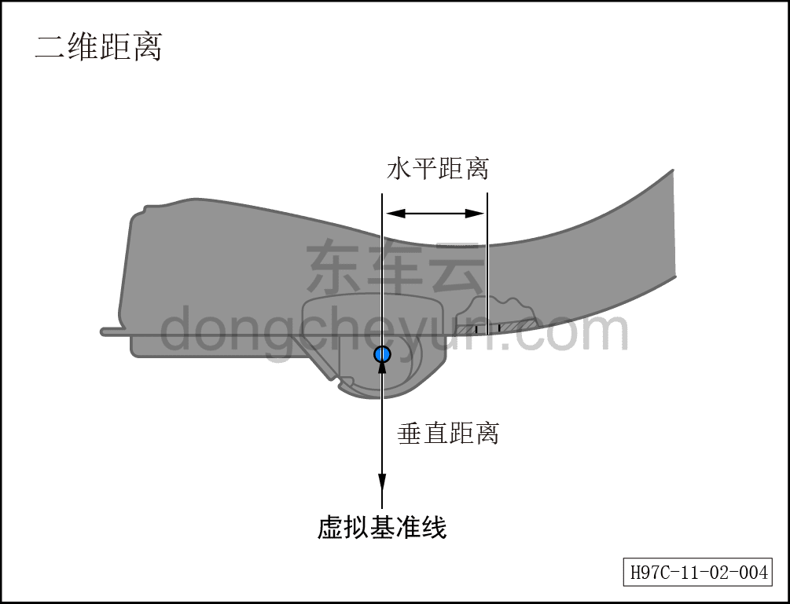

Двумерное расстояние

- Горизонтальное расстояние между центрами двух измеряемых точек в направлении вперёд/назад.

- Перпендикулярное расстояние от измеряемой точки до условной базовой линии.

**Внимание:**

**- Если указан только один размер, это означает симметрию слева и справа.**

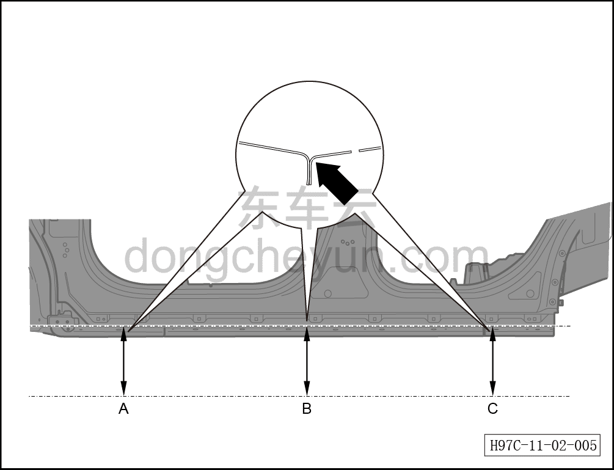

Условная базовая линия

Условная базовая линия — это линия, соединяющая базовые точки, описанные в приведённой ниже таблице.

| Символ точки | Базовая точка |
|---|---|
| A | Эта точка расположена на нижней поверхности лонжерона порога в центре передней точки подъёма кузова |
| B | Эта точка расположена на нижней поверхности лонжерона порога в центре между передней и задней точками подъёма кузова |
| C | Эта точка расположена на нижней поверхности лонжерона порога в центре задней точки подъёма кузова |

Определение символов измерительных точек

| Символ | Определение |
|---|---|
|  | Центр круглого отверстия |
|  | Центр овального отверстия |
| 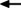 | Угловое положение кузовной панели (только стрелка) |
| Fr | Направление передней части автомобиля |

Передний отсек (кузов с увеличенным запасом хода, range extender)

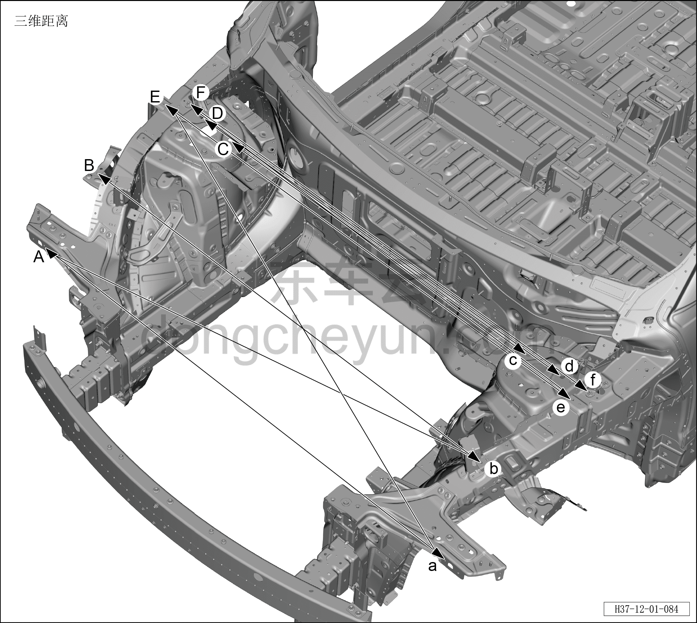

**Примечание:**

**- Символы, обозначенные заглавными буквами, относятся к правой стороне кузова, символы, обозначенные строчными буквами — к левой стороне кузова (если смотреть от задней части автомобиля вперёд).**

| Место измерения | Размер (мм) | Место измерения | Размер (мм) | Место измерения | Размер (мм) | Место измерения | Размер (мм) |
|---|---|---|---|---|---|---|---|
| A-a | 1506 | A-b | 1482 | B-b | 1408 | C-c | 1102 |
| D-d | 1330 | E-e | 1510 | E-a | 1486 | F-f | 1487 |

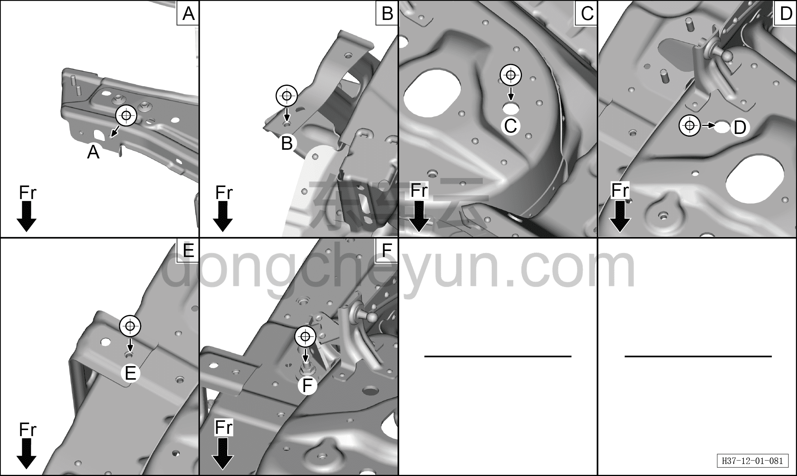

| Символ точки | Место расположения | Диаметр отверстия (мм) | Символ точки | Место расположения | Диаметр отверстия (мм) |
|---|---|---|---|---|---|
| A，a | Технологическое отверстие соединительной панели поперечины передних фар | φ7 | B，b | Технологическое отверстие кронштейна крепления переднего крыла I | φ7 |
| C，c | Технологическое отверстие крышки переднего амортизатора | φ14 | D，d | Технологическое отверстие крышки переднего амортизатора | φ14 |
| E，e | Технологическое отверстие кронштейна крепления переднего крыла | φ7 | F，f | Технологическое отверстие гайковой пластины петли капота | — |

Передний отсек

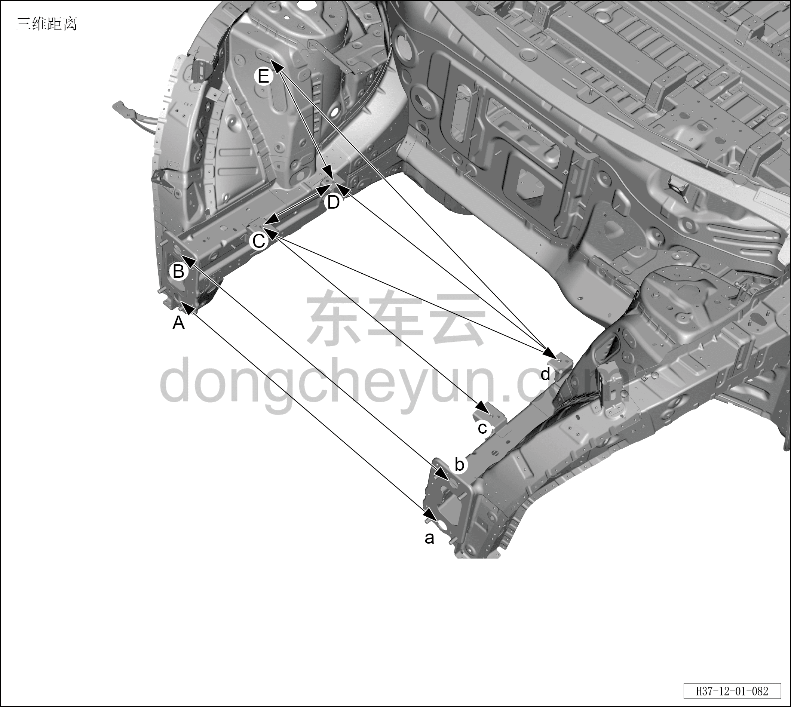

**Примечание:**

**- Символы, обозначенные заглавными буквами, относятся к правой стороне кузова, символы, обозначенные строчными буквами — к левой стороне кузова (если смотреть от задней части автомобиля вперёд).**

**- Точки C и D на кузове несимметричны.**

| Место измерения | Размер (мм) | Место измерения | Размер (мм) | Место измерения | Размер (мм) |
|---|---|---|---|---|---|
| A-a | 905 | B-b | 920 | C-c | 870 |
| C-D | 243 | C-d | 805 | D-d | 760 |
| D-E | 386 | d-E | 1006 | - | - |

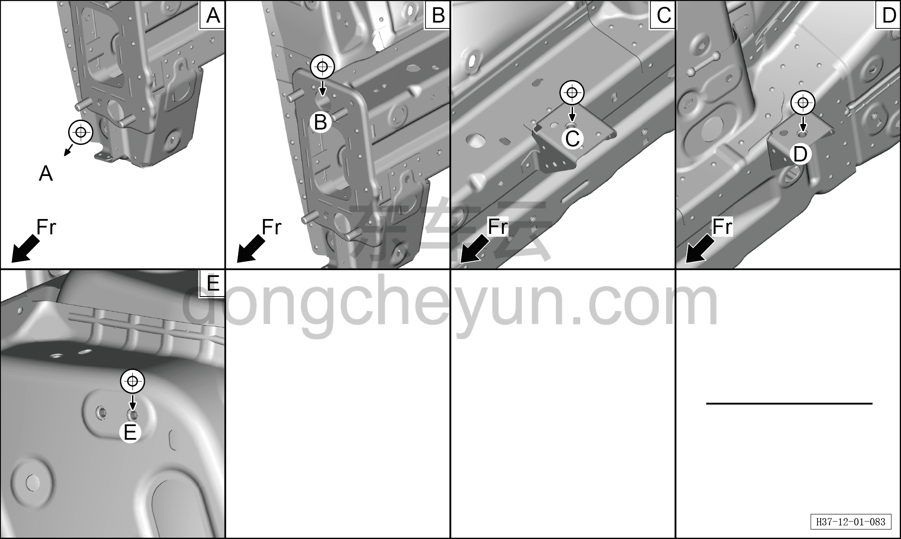

| Символ точки | Место расположения | Диаметр отверстия (мм) | Символ точки | Место расположения | Диаметр отверстия (мм) |
|---|---|---|---|---|---|
| A，a | Технологическое отверстие панели крепления переднего противоударного бруса | φ30 | B，b | Технологическое отверстие панели крепления переднего противоударного бруса | φ30 |
| c | Правый передний кронштейн крепления опоры EV | φ11 | C | Левый передний кронштейн крепления опоры EV | φ11 |
| d | Левый задний кронштейн крепления опоры EV | φ11 | D | Левый задний кронштейн крепления опоры EV | φ11 |
| E | Технологическое отверстие переднего усилителя колёсной арки II (правого) | φ8.5 | - | - | - |

Лобовое стекло

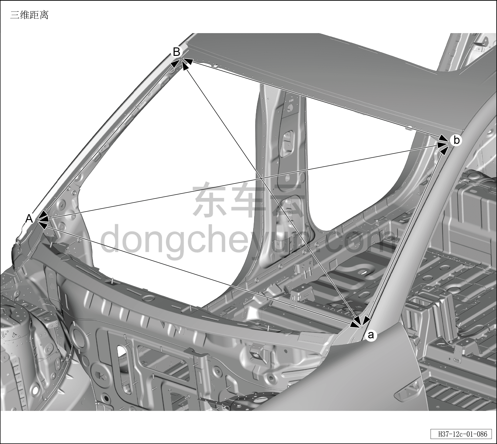

**Примечание:**

**- Символы, обозначенные заглавными буквами, относятся к правой стороне кузова, символы, обозначенные строчными буквами — к левой стороне кузова (если смотреть от задней части автомобиля вперёд).**

| Место измерения | Размер (мм) | Место измерения | Размер (мм) | Место измерения | Размер (мм) |
|---|---|---|---|---|---|
| A-a | 1511 | A-B | 708 | A-b | 1560 |
| B-a | 1560 | B-b | 1280 | a-b | 708 |

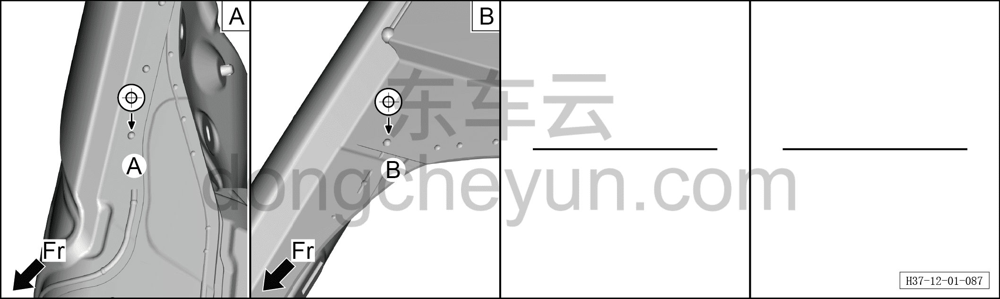

| Символ точки | Место расположения | Диаметр отверстия (мм) | Символ точки | Место расположения | Диаметр отверстия (мм) |
|---|---|---|---|---|---|
| A，a | Технологическое отверстие наружной панели боковины | φ3.2 | B，b | Технологическое отверстие наружной панели боковины | φ3.2 |

Передняя дверь

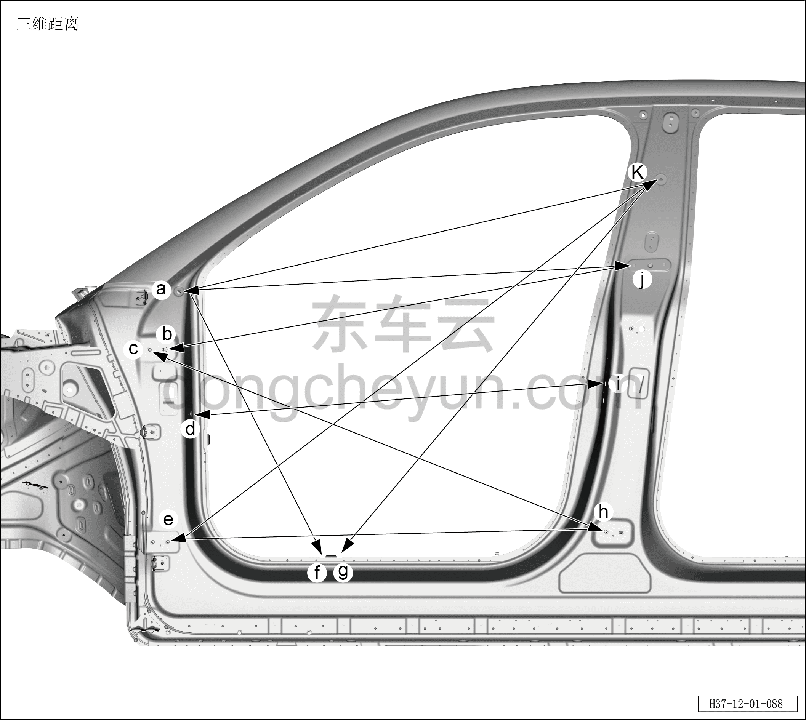

**Примечание:**

**- Символы, обозначенные заглавными буквами, относятся к правой стороне кузова, символы, обозначенные строчными буквами — к левой стороне кузова (если смотреть от задней части автомобиля вперёд).**

| Место измерения | Размер (мм) | Место измерения | Размер (мм) | Место измерения | Размер (мм) | Место измерения | Размер (мм) |
|---|---|---|---|---|---|---|---|
| a-k | 1202 | a-j | 1202 | a-f | 736 | b-j | 1144 |
| c-h | 1170 | d-i | 1005 | e-h | 1047 | e-k | 1484 |
| g-k | 1026 | - | - | - | - | - | - |

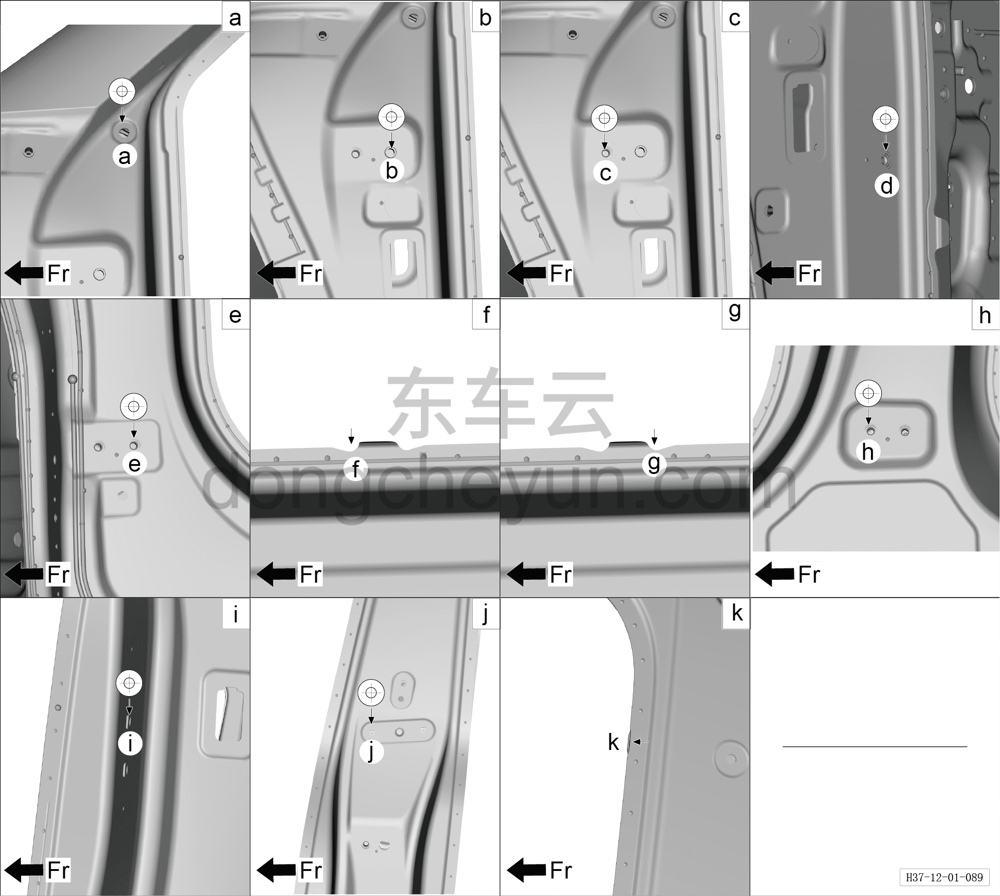

| Символ точки | Место расположения | Диаметр отверстия (мм) | Символ точки | Место расположения | Диаметр отверстия (мм) |
|---|---|---|---|---|---|
| A，a | Монтажное отверстие крыла в сборе | φ10.3 | B，b | Монтажное отверстие верхней петли передней двери | φ12 |
| C，c | Монтажное отверстие верхней петли передней двери | φ14 | D，d | Монтажное отверстие ограничителя передней двери | φ16 |
| E，e | Монтажное отверстие нижней петли передней двери | φ14 | F，f | Вырез дверного проёма | - |
| G，g | Вырез дверного проёма | - | H,h | Монтажное отверстие нижней петли задней двери | φ14 |
| I,i | Монтажное отверстие ответной части замка боковой двери | φ9 | J,j | Монтажное отверстие верхней петли задней двери | φ14 |
| K,k | Вырез дверного проёма | - | - | - | - |

Задняя дверь

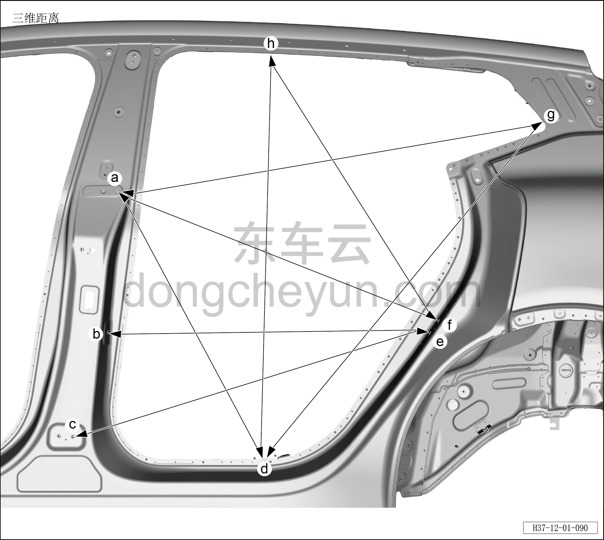

**Примечание:**

**- Символы, обозначенные заглавными буквами, относятся к правой стороне кузова, символы, обозначенные строчными буквами — к левой стороне кузова (если смотреть от задней части автомобиля вперёд).**

| Место измерения | Размер (мм) | Место измерения | Размер (мм) | Место измерения | Размер (мм) | Место измерения | Размер (мм) |
|---|---|---|---|---|---|---|---|
| a-d | 782 | a-f | 906 | a-g | 1144 | b-e | 840 |
| c-e | 957 | d-g | 1141 | d-h | 1091 | f-h | 863 |

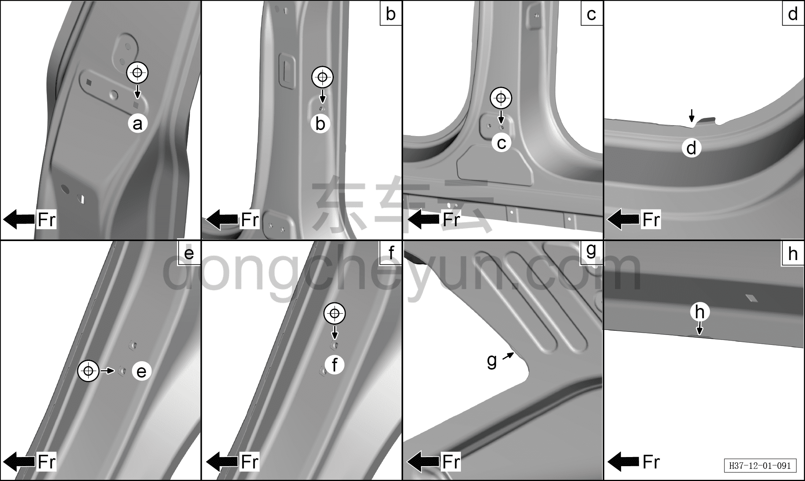

| Символ точки | Место расположения | Диаметр отверстия (мм) | Символ точки | Место расположения | Диаметр отверстия (мм) |
|---|---|---|---|---|---|
| A，a | Монтажное отверстие верхней петли задней двери | φ8 | B，b | Монтажное отверстие ограничителя задней двери | φ16 |
| C，c | Монтажное отверстие нижней петли задней двери | φ14 | D，d | Вырез дверного проёма | - |
| E，e | Монтажное отверстие ответной части замка боковой двери | φ9 | F，f | Монтажное отверстие ответной части замка боковой двери | φ9 |
| G,g | Вырез дверного проёма | - | H,h | Вырез дверного проёма | - |

Средняя часть кузова

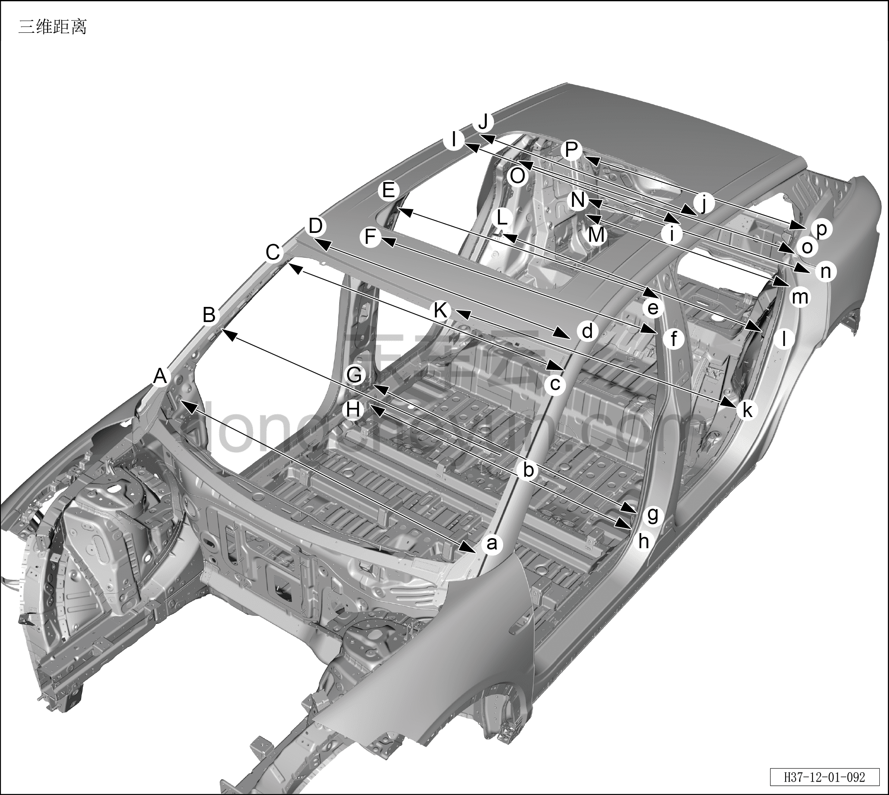

**Примечание:**

**- Символы, обозначенные заглавными буквами, относятся к правой стороне кузова, символы, обозначенные строчными буквами — к левой стороне кузова (если смотреть от задней части автомобиля вперёд).**

| Место измерения | Размер (мм) | Место измерения | Размер (мм) | Место измерения | Размер (мм) | Место измерения | Размер (мм) |
|---|---|---|---|---|---|---|---|
| A-a | 1448 | B-b | 1371 | C-c | 1270 | D-d | 1142 |
| E-e | 1232 | F-f | 1445 | G-g | 1474 | H-h | 1416 |
| I-i | 1063 | J-j | 1060 | K-k | 1499 | L-l | 1378 |
| M-m | 992 | N-n | 1493 | O-o | 1199 | P-p | 1647 |

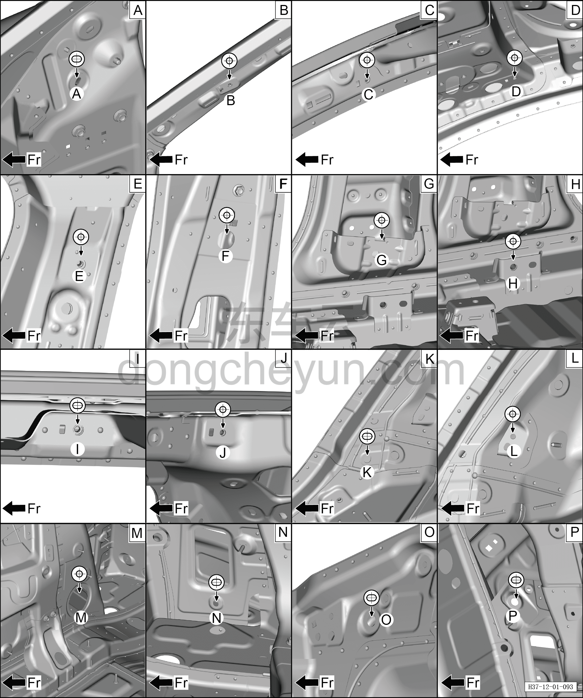

| Символ точки | Место расположения | Диаметр отверстия (мм) | Символ точки | Место расположения | Диаметр отверстия (мм) |
|---|---|---|---|---|---|
| A，a | Монтажное отверстие панели крепления поперечины панели приборов | φ7 | B，b | Технологическое отверстие верхнего усилителя боковины | φ16 |
| C，c | Монтажное отверстие накладки стойки A | φ6 | D，d | Технологическое отверстие соединительной панели передней поперечины крыши | φ6 |
| E，e | Технологическое отверстие верхней части внутренней панели средней стойки | φ12 | F，f | Технологическое отверстие средней части внутренней панели средней стойки | φ16 |
| G，g | Крепёжное отверстие ретрактора переднего ремня безопасности | φ12 | H，h | Крепёжное отверстие переднего ремня безопасности | φ11 |
| I，i | Технологическое отверстие внутренней верхней панели средней стойки | φ12 | J，j | Технологическое отверстие верхней части наружной панели заднего колёсного арки | φ16 |
| K，k | Технологическое отверстие средней части наружной панели заднего колёсного арки | φ14 | L，l | Монтажное отверстие накладки стойки C | φ8.5 |
| M，m | Технологическое отверстие внутренней панели заднего колёсного арки | φ40 | N，n | Технологическое отверстие задней части наружной панели заднего колёсного арки | φ8 |
| O，o | Технологическое отверстие верхней части наружной панели заднего колёсного арки | φ7 | P，p | Технологическое отверстие наружной панели боковины | φ24 |

Задняя часть кузова

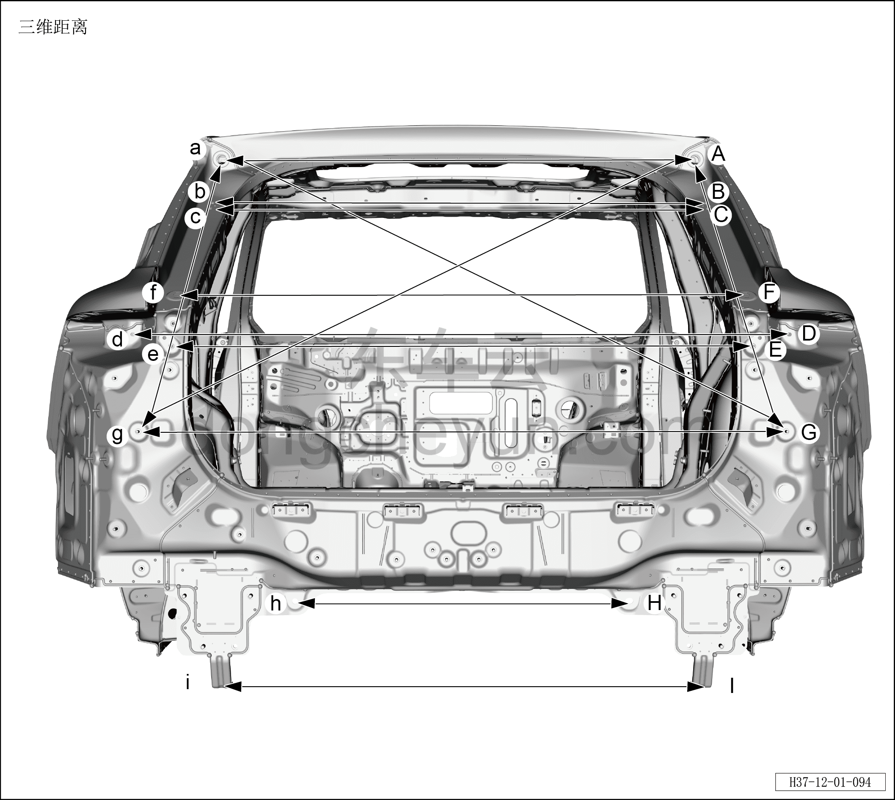

**Примечание:**

**- Символы, обозначенные заглавными буквами, относятся к правой стороне кузова, символы, обозначенные строчными буквами — к левой стороне кузова (если смотреть от задней части автомобиля вперёд).**

| Место измерения | Размер (мм) | Место измерения | Размер (мм) | Место измерения | Размер (мм) | Место измерения | Размер (мм) |
|---|---|---|---|---|---|---|---|
| A-a | 1130 | A-g | 1516 | A-G | 829 | a-G | 1516 |
| a-g | 829 | B-b | 1145 | C-c | 1148 | D-d | 1125 |
| E-e | 1321 | F-f | 1192 | G-g | 1424 | H-h | 688 |
| I-i | 980 | - | - | - | - | - | - |

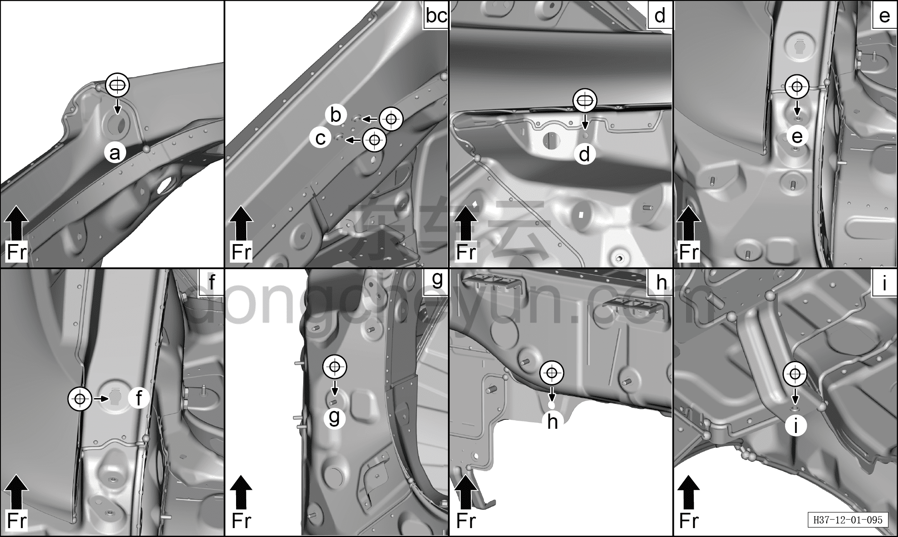

| Символ точки | Место расположения | Диаметр отверстия (мм) | Символ точки | Место расположения | Диаметр отверстия (мм) |
|---|---|---|---|---|---|
| A，a | Технологическое отверстие кронштейна заднего водостока | φ25 | B，b | Монтажное отверстие верхнего кронштейна упора двери багажника | φ12 |
| C，c | Монтажное отверстие верхнего кронштейна упора двери багажника | φ12 | D，d | Монтажное отверстие заднего комбинированного фонаря | φ8.2 |
| E，e | Монтажное отверстие заднего комбинированного фонаря | φ12 | F，f | Монтажное отверстие буфера двери багажника | φ15.4 |
| G，g | Сварной шпилечный болт панели крепления заднего комбинированного фонаря | φ6 | H-h | Технологическое отверстие наружной панели задней поперечины заднего щита | φ36 |
| I，i | Монтажное отверстие нижнего крепёжного кронштейна заднего бампера | φ8 |   |   |   |

Верхняя часть кузова

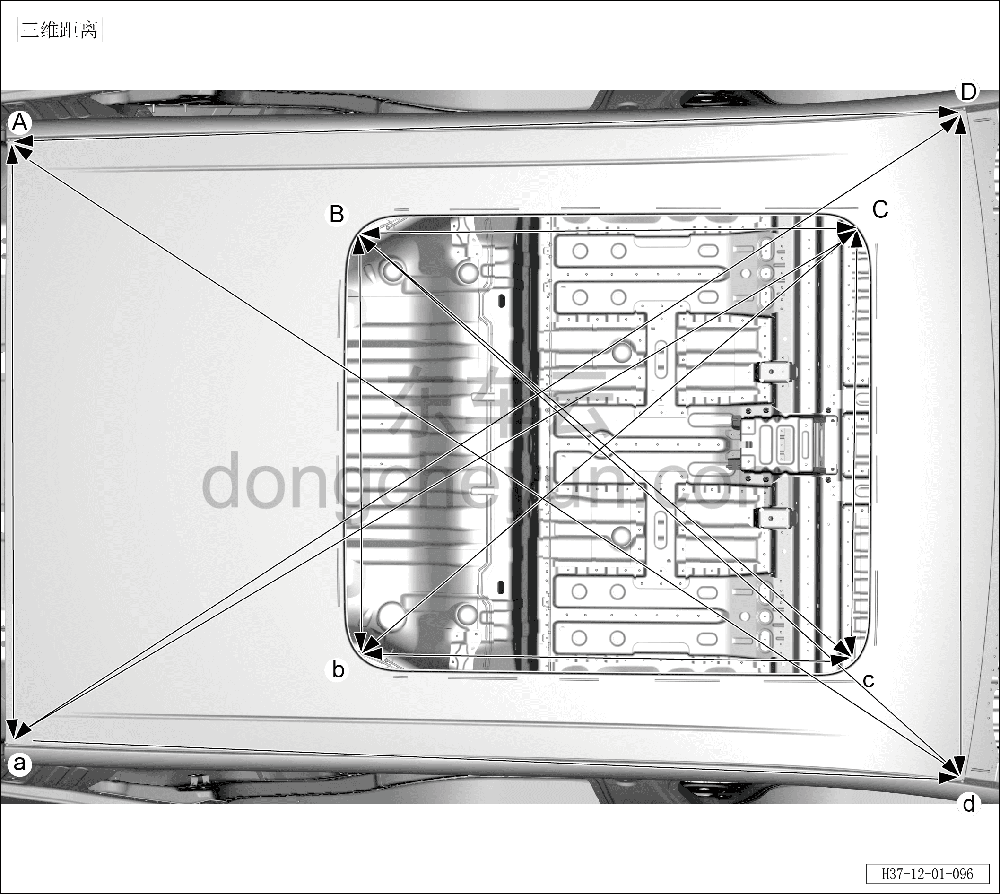

**Примечание:**

**- Символы, обозначенные заглавными буквами, относятся к правой стороне кузова, символы, обозначенные строчными буквами — к левой стороне кузова (если смотреть от задней части автомобиля вперёд).**

| Место измерения | Размер (мм) | Место измерения | Размер (мм) | Место измерения | Размер (мм) | Место измерения | Размер (мм) |
|---|---|---|---|---|---|---|---|
| A-a | 1184 | A-D | 1857 | A-d | 2225 | a-c | 1660 |
| a-D | 2228 | a-d | 1857 | B-b | 810 | B-C | 942 |
| B-c | 1242 | B-d | 1558 | b-C | 1242 | b-c | 942 |
| C-c | 806 | D-d | 1275 | - | - | - | - |

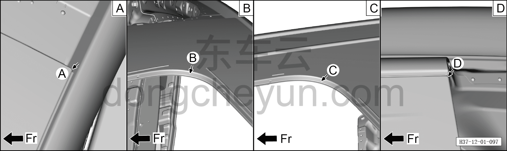

| Символ точки | Место расположения | Диаметр отверстия (мм) | Символ точки | Место расположения | Диаметр отверстия (мм) |
|---|---|---|---|---|---|
| A，a | Острый угол наружной панели крыши | — | B，b | Угловое положение проёма люка | — |
| C，c | Угловое положение проёма люка | — | D，d | Острый угол наружной панели крыши | — |

Верхняя часть кузова (версия с панорамной крышей)

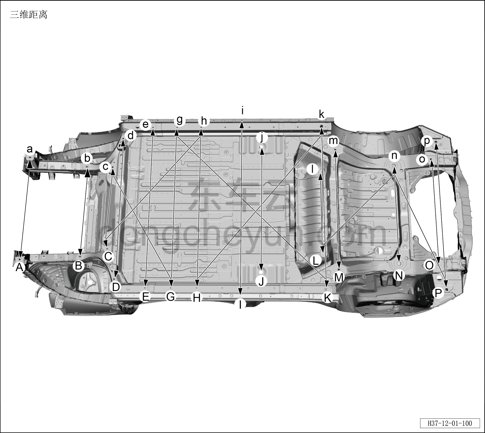

**Примечание:**

**- Символы, обозначенные заглавными буквами, относятся к правой стороне кузова, символы, обозначенные строчными буквами — к левой стороне кузова (если смотреть от задней части автомобиля вперёд).**

| Место измерения | Размер (мм) | Место измерения | Размер (мм) | Место измерения | Размер (мм) | Место измерения | Размер (мм) |
|---|---|---|---|---|---|---|---|
| A-a | 969 | B-b | 870 | C-c | 830 | P-p | 1578 |
| C-h | 1380 | c-G | 1270 | D-d | 1300 | E-e | 1500 |
| F-f | 1013 | G-g | 1452 | g-K | 1992 | H-h | 1498 |
| H-k | 1869 | I-i | 1652 | J-j | 1190 | K-k | 1537 |
| k-L | 1187 | L-l | 793 | L-n | 1369 | M-m | 1133 |
| N-n | 1012 | n-P | 1034 | - | - | - | - |

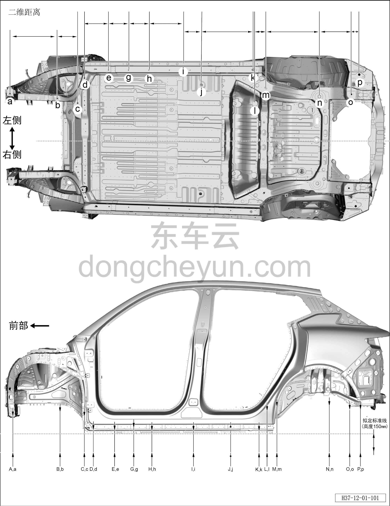

**Примечание:**

**- Символы, обозначенные заглавными буквами, относятся к правой стороне кузова, символы, обозначенные строчными буквами — к левой стороне кузова (если смотреть от задней части автомобиля вперёд).**

**- Двумерные расстояния — это горизонтальные проекционные расстояния между измеряемыми точками.**

| Место измерения | Размер (мм) | Место измерения | Размер (мм) | Место измерения | Размер (мм) | Место измерения | Размер (мм) |
|---|---|---|---|---|---|---|---|
| a-b | 266 | b-c | 368 | c-d | 85 | d-e | 272 |
| e-f | 330 | f-g | 12 | g-h | 224 | h-i | 356 |
| i-j | 368 | j-k | 419 | k-l | 239 | l-m | 200 |
| m-n | 360 | - | - | - | - | - | - |

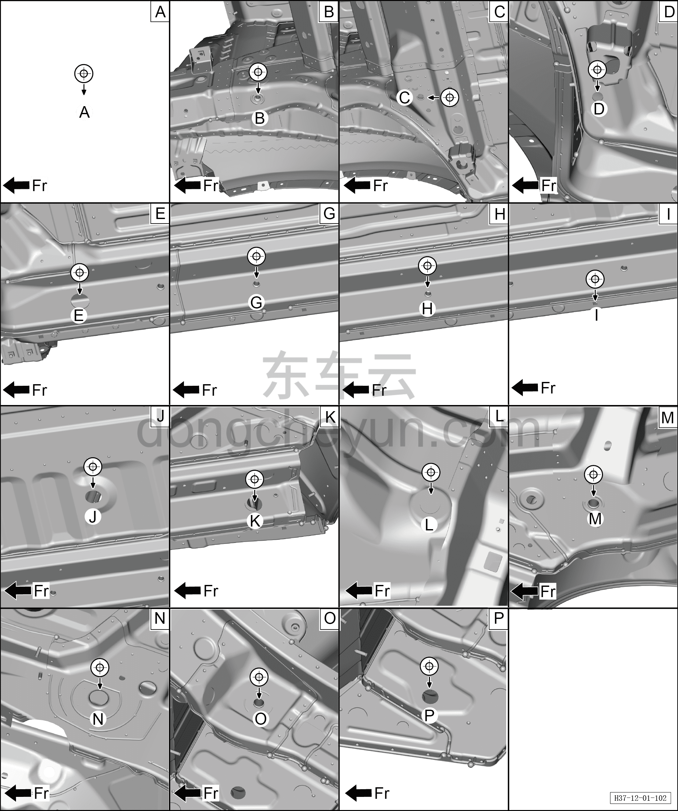

| Символ точки | Место расположения | Диаметр отверстия (мм) | Символ точки | Место расположения | Диаметр отверстия (мм) |
|---|---|---|---|---|---|
| A，a | Монтажное отверстие переднего подрамника | φ14 | B，b | Монтажное отверстие переднего подрамника | φ14 |
| C，c | Резьбовая труба заднего крепления передней подвески | φ12 | D，d | Технологическое отверстие соединительной панели среднего участка лонжерона | φ16 |
| E，e | Технологическое отверстие передней опорной панели порога | φ14 | F，f | Технологическое отверстие нижней усилительной соединительной панели среднего тоннеля | φ14 |
| G，g | Технологическое отверстие внутренней панели порога | φ14 | H，h | Технологическое отверстие внутренней панели порога | φ14 |
| I，i | Технологическое отверстие усилительной балки порога | φ16 | J，j | Технологическое отверстие переднего пола | φ30 |
| K，k | Технологическое отверстие усилительной панели заднего участка балки порога | φ25 | L，l | Технологическое отверстие поперечины задней подвесной проушины топливного бака | φ10 |
| M，m | Технологическое отверстие усилительной панели лонжерона заднего пола | φ26 | N，n | Технологическое отверстие усилительной панели заднего крепления задней подвески | φ16 |
| O，o | Технологическое отверстие заднего участка заднего пола | φ30 | P，p | Технологическое отверстие заглушки | φ25 |
