# Зона герметизации кузова

> Кузовные жестяные работы, окраска › Кузов в белом (BIW) в сборе › Герметизация и антикоррозийная обработка  
> Оригинал: `车身密封区域` · [dongcheyun 56746](https://dongcheyun.com/p/56746), страница `ea34a460df094528a95190b6946e99d0` · [оглавление](../README.md)

Нанесение герметика на капот кузова

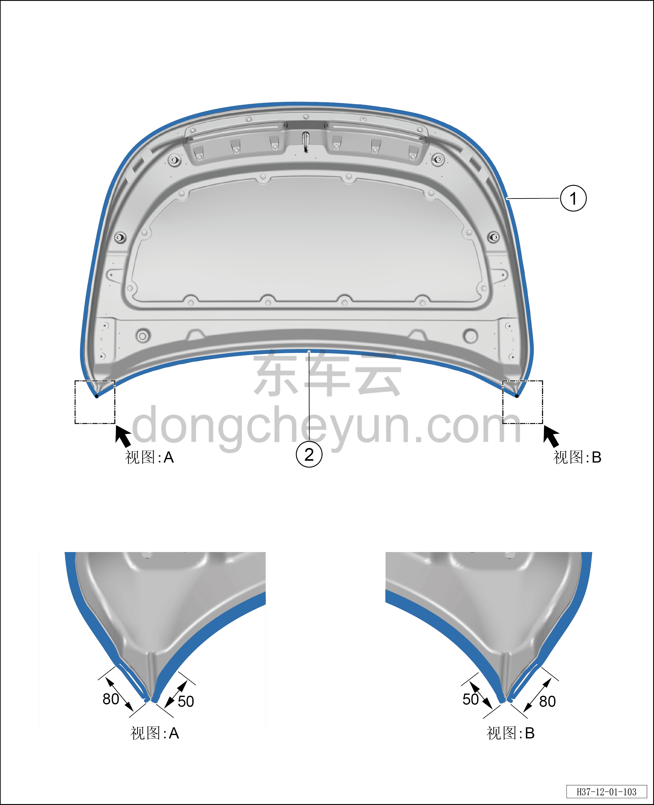

**Порядок выполнения работ:**

**- Возьмите пистолет для выдавливания герметика с плоским наконечником и нанесите герметик на герметизируемые участки по краю капота; после нанесения кистью с герметиком обработайте участки со скоплением герметика, негерметичные и неэстетичные места, а с технологических отверстий и болтов, на которые попал ПВХ-клей, удалите остатки герметика марлей.**

**- Обратите внимание на длину соскабливания герметика (мм) в местах, указанных на видах A, B. Технические параметры нанесения герметика на капот кузова**

<table>
<tr><td rowspan=2>№</td><td rowspan=2 colspan=3>Место нанесения герметика</td><td colspan=3>Длина нанесения герметика (м)</td><td colspan=3>Функция</td><td rowspan=2>Примечание</td></tr>
<tr><td>Левая сторона</td><td>Правая сторона</td><td>Итого</td><td>Гидроизоляция</td><td>Пневмоизоляция (герметичность от воздуха)</td><td>Антикоррозийная защита</td></tr>
<tr><td>1</td><td>Внутренняя панель капота</td><td>-</td><td>Наружная панель капота</td><td colspan=2>1.81</td><td>1.81</td><td></td><td>●</td><td>●</td><td>Декоративный (внешний) герметик</td></tr>
<tr><td>2</td><td>Внутренняя панель капота</td><td>-</td><td>Наружная панель капота</td><td colspan=2>1.64</td><td>1.64</td><td></td><td>●</td><td>●</td><td>Декоративный (внешний) герметик</td></tr>
</table>

Нанесение герметика в зоне передней двери

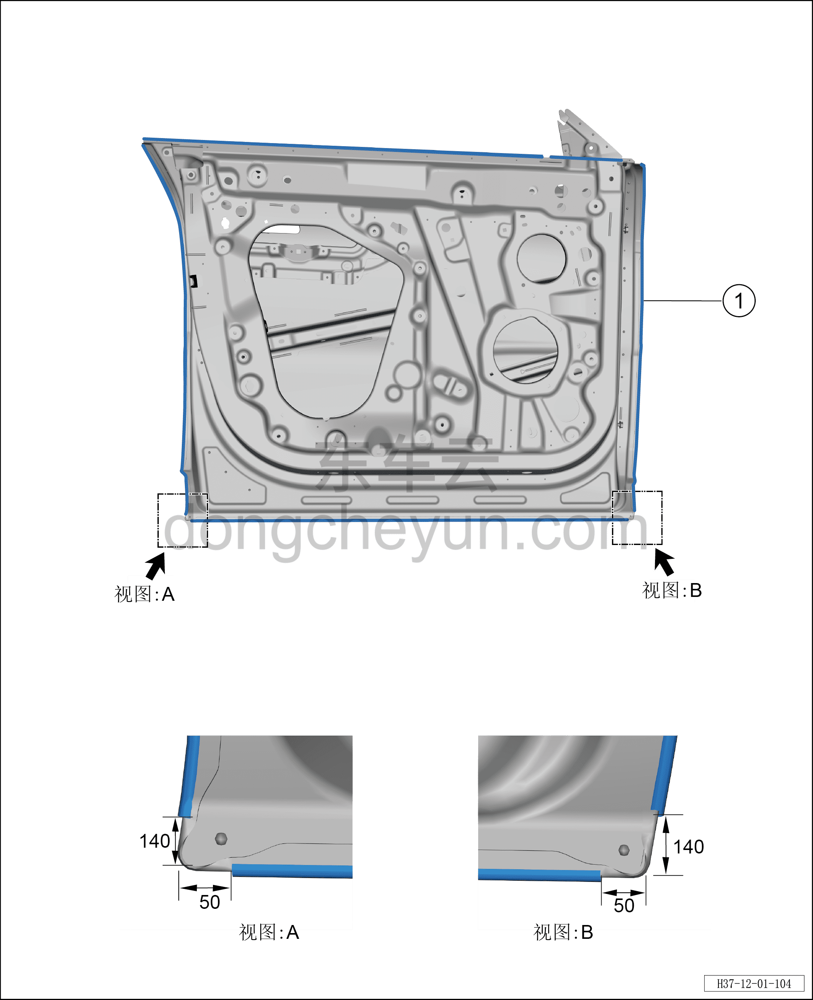

**Порядок выполнения работ:**

**- Левая и правая стороны симметричны, на схеме показана только левая сторона, для правой стороны нанесение в целом аналогично левой.**

**- Возьмите прямой пистолет с плоским наконечником и нанесите герметик на сварной шов фальца двери; после завершения нанесения выровняйте стыки двух валиков герметика шпателем, снятый герметик поместите на сложенную марлю; переход в месте стыка должен быть плавным и естественным, без остатков герметика по краям; для верхней части двери возьмите пистолет для выдавливания герметика с изогнутым узким наконечником и выполните герметизацию, как показано на рисунке.**

**- Обратите внимание на длину соскабливания герметика (мм) в местах, указанных на видах A, B. Технические параметры нанесения герметика в зоне передней двери**

<table>
<tr><td rowspan=2>№</td><td rowspan=2 colspan=3>Место нанесения герметика</td><td colspan=3>Длина нанесения герметика (м)</td><td colspan=3>Функция</td><td rowspan=2>Примечание</td></tr>
<tr><td>Левая сторона</td><td>Правая сторона</td><td>Итого</td><td>Гидроизоляция</td><td>Пневмоизоляция (герметичность от воздуха)</td><td>Антикоррозийная защита</td></tr>
<tr><td>1</td><td>Наружная панель передней двери</td><td>-</td><td>Внутренняя панель передней двери</td><td>2.88</td><td>2.88</td><td>5.76</td><td>●</td><td>●</td><td>●</td><td>Декоративный (внешний) герметик</td></tr>
</table>

Нанесение герметика в зоне задней двери

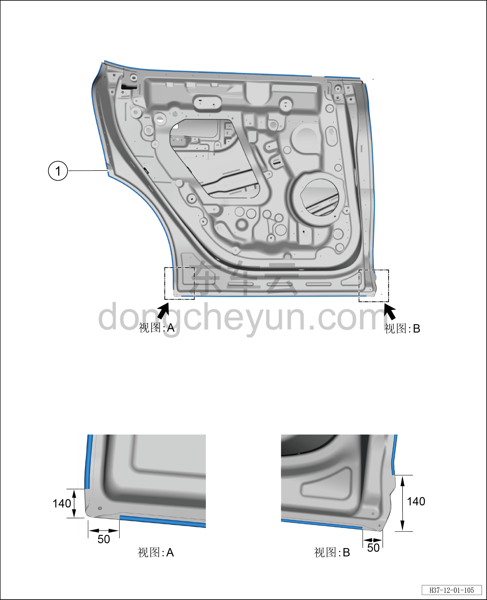

**Порядок выполнения работ:**

**- Левая и правая стороны симметричны, на схеме показана только левая сторона, для правой стороны нанесение в целом аналогично левой.**

**- Возьмите прямой пистолет с плоским наконечником и нанесите герметик на сварной шов фальца двери; после завершения нанесения выровняйте стыки двух валиков герметика шпателем, снятый герметик поместите на сложенную марлю; переход в месте стыка должен быть плавным и естественным, без остатков герметика по краям.**

**- Обратите внимание на длину соскабливания герметика (мм) в месте, указанном на виде A. Технические параметры нанесения герметика в зоне задней двери**

<table>
<tr><td rowspan=2>№</td><td rowspan=2 colspan=3>Место нанесения герметика</td><td colspan=3>Длина нанесения герметика (м)</td><td colspan=3>Функция</td><td rowspan=2>Примечание</td></tr>
<tr><td>Левая сторона</td><td>Правая сторона</td><td>Итого</td><td>Гидроизоляция</td><td>Пневмоизоляция (герметичность от воздуха)</td><td>Антикоррозийная защита</td></tr>
<tr><td>1</td><td>Наружная панель задней двери</td><td>-</td><td>Внутренняя панель задней двери</td><td>0.50</td><td>0.50</td><td>1.00</td><td>●</td><td>●</td><td>●</td><td>Декоративный (внешний) герметик</td></tr>
<tr><td>2</td><td>Наружная панель задней двери</td><td>-</td><td>Внутренняя панель задней двери</td><td>1.69</td><td>1.69</td><td>3.38</td><td>●</td><td>●</td><td>●</td><td>Декоративный (внешний) герметик</td></tr>
</table>

Нанесение герметика в зоне двери багажника

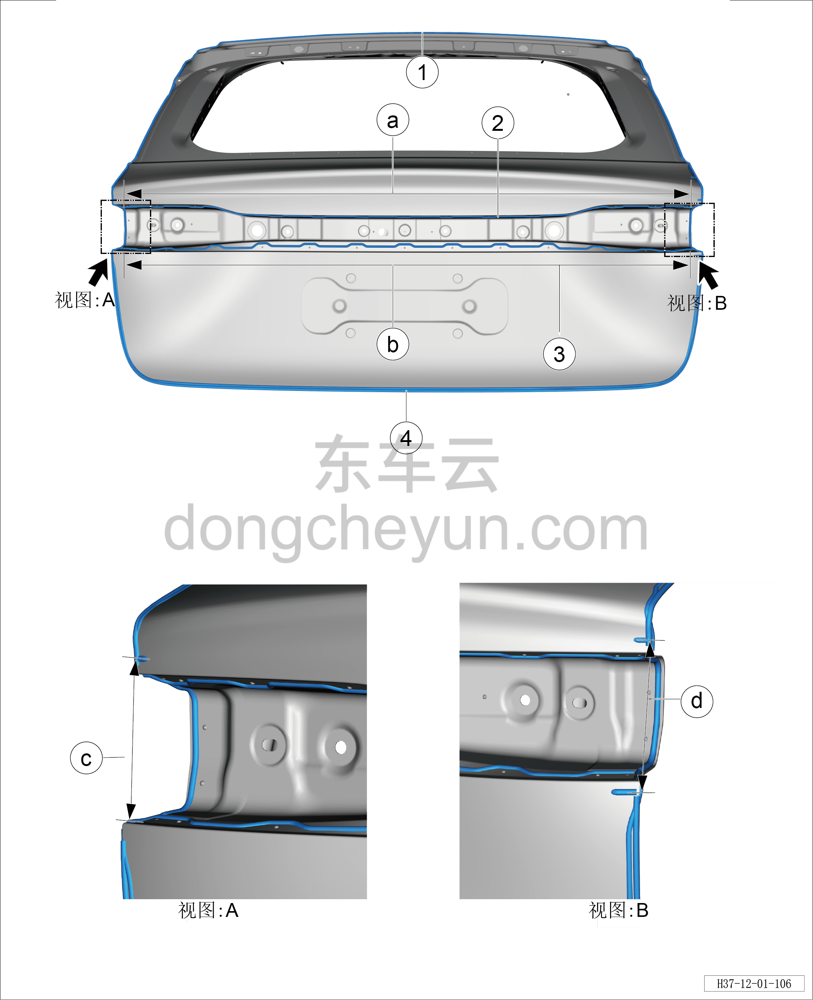

**Порядок выполнения работ:**

**- Возьмите прямой пистолет с плоским наконечником и нанесите герметик на сварной шов фальца задней крышки; после завершения нанесения выровняйте шпателем стыки двух валиков герметика, снятый герметик поместите на сложенную марлю размером 4×40; переход в месте стыка должен быть плавным и естественным, без остатков герметика по краям.**

**- Герметик на вертикальных кромках, показанных штриховой рамкой, после нанесения необходимо выровнять.**

**- Обратите внимание, что в местах, обозначенных на рисунке буквами a, b, c, d, e и f, требуется соскабливание герметика по всей длине участка. Технические параметры нанесения герметика в зоне двери багажника**

<table>
<tr><td rowspan=2>№</td><td rowspan=2 colspan=3>Место нанесения герметика</td><td colspan=3>Длина нанесения герметика (м)</td><td colspan=3>Функция</td><td rowspan=2>Примечание</td></tr>
<tr><td>Левая сторона</td><td>Правая сторона</td><td>Итого</td><td>Гидроизоляция</td><td>Пневмоизоляция (герметичность от воздуха)</td><td>Антикоррозийная защита</td></tr>
<tr><td>1</td><td>Верхняя панель двери багажника</td><td>-</td><td>Внутренняя панель двери багажника</td><td colspan=2>2.52</td><td>2.52</td><td>●</td><td>●</td><td>●</td><td>Декоративный (внешний) герметик</td></tr>
<tr><td>2</td><td>Верхняя панель двери багажника</td><td>-</td><td>Средний усилитель двери багажника</td><td colspan=2>1.38</td><td>1.38</td><td>●</td><td>●</td><td>●</td><td>Декоративный (внешний) герметик</td></tr>
<tr><td>3</td><td>Нижняя панель двери багажника</td><td>-</td><td>Средний усилитель двери багажника</td><td colspan=2>1.38</td><td>1.38</td><td>●</td><td>●</td><td>●</td><td>Декоративный (внешний) герметик</td></tr>
<tr><td>4</td><td>Нижняя панель двери багажника</td><td>-</td><td>Внутренняя панель двери багажника</td><td colspan=2>1.84</td><td>1.84</td><td>●</td><td>●</td><td>●</td><td>Декоративный (внешний) герметик</td></tr>
</table>

Нанесение герметика в зоне переднего отсека кузова

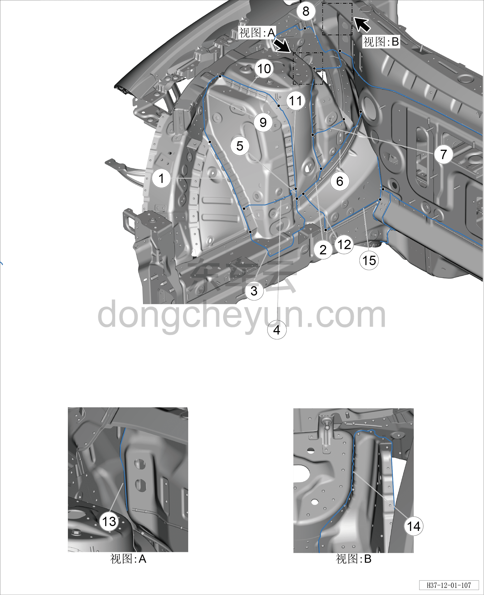

**Порядок выполнения работ:**

**- Возьмите пистолет для выдавливания герметика с прямым круглым наконечником и нанесите герметик на герметизируемые участки, показанные на схеме; после нанесения кистью с герметиком обработайте участки со скоплением герметика, негерметичные и неэстетичные места, а с технологических отверстий и болтов, на которые попал ПВХ-клей, удалите остатки герметика марлей.**

**Технические параметры нанесения герметика в зоне переднего отсека кузова**

<table>
<tr><td rowspan=2>№</td><td rowspan=2 colspan=3>Место нанесения герметика</td><td colspan=3>Длина нанесения герметика (м)</td><td colspan=3>Функция</td><td rowspan=2>Примечание</td></tr>
<tr><td>Левая сторона</td><td>Правая сторона</td><td>Итого</td><td>Гидроизоляция</td><td>Пневмоизоляция (герметичность от воздуха)</td><td>Антикоррозийная защита</td></tr>
<tr><td>1</td><td>Передний участок колёсной арки</td><td>-</td><td>Усилительная панель переднего участка колёсной арки</td><td></td><td></td><td></td><td></td><td></td><td></td><td></td></tr>
<tr><td>2</td><td>Средняя часть колёсной арки</td><td>-</td><td>Передний лонжерон</td><td></td><td></td><td></td><td></td><td></td><td></td><td></td></tr>
<tr><td>3</td><td>Передний участок переднего лонжерона</td><td>-</td><td>Средний участок переднего лонжерона</td><td></td><td></td><td></td><td></td><td></td><td></td><td></td></tr>
<tr><td>4</td><td>Средний участок переднего лонжерона</td><td>-</td><td>Панель крепления переднего амортизатора</td><td></td><td></td><td></td><td></td><td></td><td></td><td></td></tr>
<tr><td>5</td><td>Средний участок переднего лонжерона</td><td>-</td><td>Соединительная панель поперечины переднего щита</td><td></td><td></td><td></td><td></td><td></td><td></td><td></td></tr>
<tr><td>6</td><td>Нижняя усилительная балка переднего щита</td><td>-</td><td>Верхняя усилительная балка переднего щита</td><td></td><td></td><td></td><td></td><td></td><td></td><td></td></tr>
<tr><td>7</td><td>Усилительная балка переднего щита</td><td>-</td><td>Верхняя усилительная балка переднего щита</td><td></td><td></td><td></td><td></td><td></td><td></td><td></td></tr>
<tr><td>8</td><td>Поперечина переднего щита</td><td>-</td><td>Верхняя усилительная балка переднего щита</td><td colspan=2></td><td></td><td></td><td></td><td></td><td></td></tr>
<tr><td>9</td><td>Поперечина переднего щита</td><td>-</td><td>Поперечина переднего щита</td><td></td><td></td><td></td><td></td><td></td><td></td><td></td></tr>
<tr><td>10</td><td>Поперечина переднего щита</td><td>-</td><td>Панель переднего щита</td><td colspan=2></td><td></td><td></td><td></td><td></td><td></td></tr>
<tr><td>11</td><td>Правая поперечина переднего щита</td><td>-</td><td>Соединительная панель поперечины переднего щита</td><td></td><td></td><td></td><td></td><td></td><td></td><td></td></tr>
<tr><td>12</td><td>Водосточный желоб в сборе</td><td>-</td><td>Передняя колёсная арка / передний щит /  Заглушка переднего отсека</td><td></td><td></td><td></td><td></td><td></td><td></td><td></td></tr>
<tr><td>13</td><td>Усилительная панель крепления переднего амортизатора</td><td>-</td><td>Панель крепления переднего амортизатора</td><td></td><td></td><td></td><td></td><td></td><td></td><td></td></tr>
<tr><td>14</td><td>Панель переднего щита</td><td>-</td><td>Внутренняя панель стойки A</td><td></td><td></td><td></td><td></td><td></td><td></td><td></td></tr>
<tr><td>15</td><td>Водосточный желоб переднего щита</td><td>-</td><td>Внутренняя панель стойки A</td><td></td><td></td><td></td><td></td><td></td><td></td><td></td></tr>
</table>

Нанесение герметика в зоне переднего щита в салоне

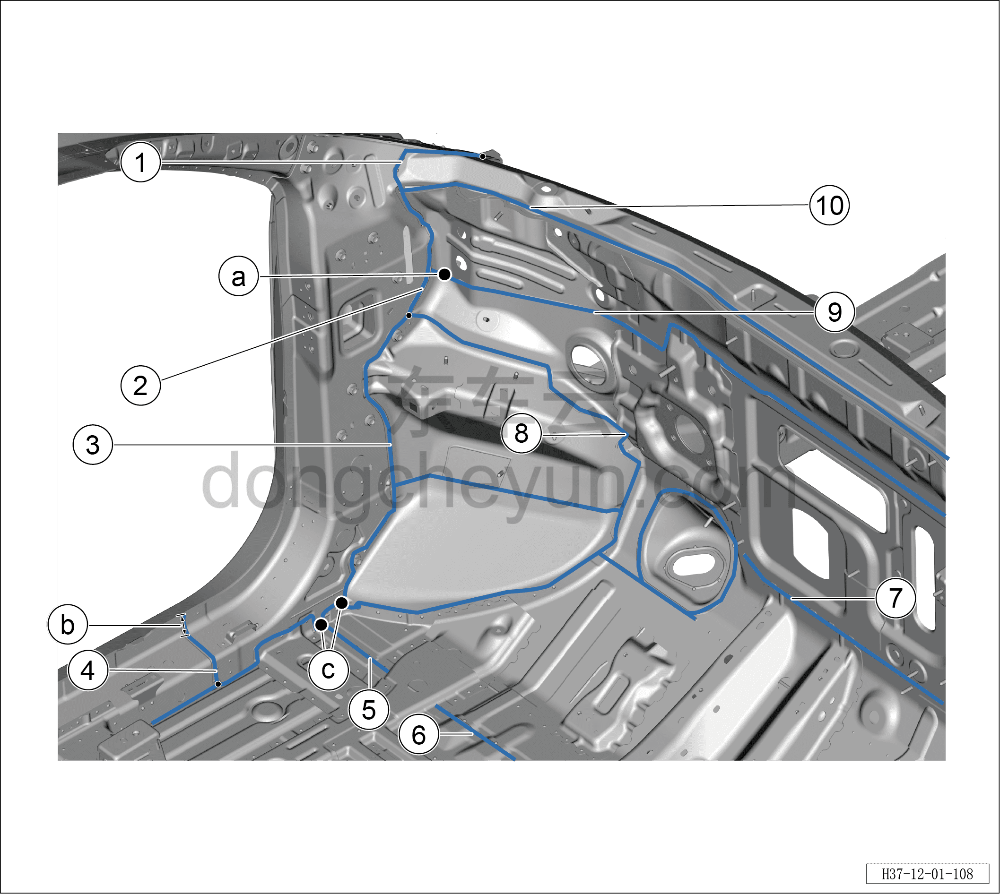

**Порядок выполнения работ:**

**- Возьмите пистолет с прямым круглым наконечником и нанесите герметик на герметизируемые участки, показанные на схеме; после нанесения кистью с герметиком обработайте участки со скоплением герметика, негерметичные и неэстетичные места, а с технологических отверстий и болтов, на которые попал ПВХ-клей, удалите остатки герметика марлей.**

**- Обратите внимание, что на нижней накладке лобового стекла — водосточном желобе лобового стекла имеется 5 выступов кузовной панели, аналогичных виду A, требующих соскабливания герметика, длиной по 60 мм каждый.**

**- Обратите внимание, что в положениях a и c на рисунке внутренний и наружный герметик сварного шва должны перекрываться, а в положении b требуется соскабливание герметика.**

Технические параметры нанесения герметика в зоне переднего щита в салоне

<table>
<tr><td rowspan=2>№</td><td rowspan=2 colspan=3>Место нанесения герметика</td><td colspan=3>Длина нанесения герметика (м)</td><td colspan=3>Функция</td><td rowspan=2>Примечание</td></tr>
<tr><td>Левая сторона</td><td>Правая сторона</td><td>Итого</td><td>Гидроизоляция</td><td>Пневмоизоляция (герметичность от воздуха)</td><td>Антикоррозийная защита</td></tr>
<tr><td>1</td><td>Нижняя часть внутренней панели стойки A в сборе</td><td>-</td><td>Сварной узел переднего щита в сборе</td><td>0.48</td><td>0.473</td><td>0.95</td><td>●</td><td>●</td><td></td><td></td></tr>
<tr><td>2</td><td>Нижняя часть внутренней панели стойки A в сборе</td><td>-</td><td>Заглушка переднего отсека</td><td>0.08</td><td>0.071</td><td>0.15</td><td>●</td><td>●</td><td></td><td></td></tr>
<tr><td>3</td><td>Нижняя часть внутренней панели стойки A в сборе</td><td>-</td><td>Соединительная панель среднего участка лонжерона</td><td>0.62</td><td>0.61</td><td>1.23</td><td>●</td><td>●</td><td></td><td></td></tr>
<tr><td>4</td><td>Нижняя часть внутренней панели стойки A в сборе</td><td>-</td><td>Внутренняя панель порога</td><td>0.19</td><td>0.19</td><td>0.38</td><td>●</td><td>●</td><td></td><td></td></tr>
<tr><td>5</td><td>Передний пол</td><td>-</td><td>Нижняя панель переднего щита</td><td>0.09</td><td>0.09</td><td>0.18</td><td>●</td><td>●</td><td></td><td></td></tr>
<tr><td>6</td><td>Передний пол</td><td>-</td><td>Нижняя панель переднего щита</td><td>0.08</td><td>0.08</td><td>0.16</td><td>●</td><td>●</td><td></td><td></td></tr>
<tr><td>7</td><td>Поперечина переднего щита</td><td>-</td><td>Нижняя панель переднего щита</td><td>0.02</td><td>0.015</td><td>0.04</td><td>●</td><td>●</td><td></td><td></td></tr>
<tr><td>8</td><td>Поперечина переднего щита</td><td>-</td><td>Нижняя панель переднего щита</td><td>0.02</td><td>0.015</td><td>0.04</td><td>●</td><td>●</td><td></td><td></td></tr>
<tr><td>9</td><td>Поперечина переднего щита</td><td>-</td><td>Нижняя панель переднего щита</td><td>0.02</td><td>0.015</td><td>0.04</td><td>●</td><td>●</td><td></td><td></td></tr>
<tr><td>10</td><td>Панель переднего щита</td><td>-</td><td>Нижняя панель переднего щита</td><td colspan=2>0.94</td><td>0.94</td><td>●</td><td>●</td><td></td><td></td></tr>
<tr><td>11</td><td>Соединительная панель среднего участка лонжерона</td><td>-</td><td>Панель переднего щита</td><td>1.01</td><td>1.002</td><td>2.01</td><td>●</td><td>●</td><td></td><td></td></tr>
<tr><td>12</td><td>Панель переднего щита</td><td>-</td><td>Водосточный желоб лобового стекла</td><td colspan=2>1.62</td><td>1.62</td><td>●</td><td>●</td><td></td><td></td></tr>
<tr><td>13</td><td>Нижняя накладка лобового стекла</td><td>-</td><td>Водосточный желоб лобового стекла</td><td colspan=2>1.62</td><td>1.62</td><td>●</td><td>●</td><td></td><td></td></tr>
</table>

Нанесение герметика в зоне переднего пола в салоне

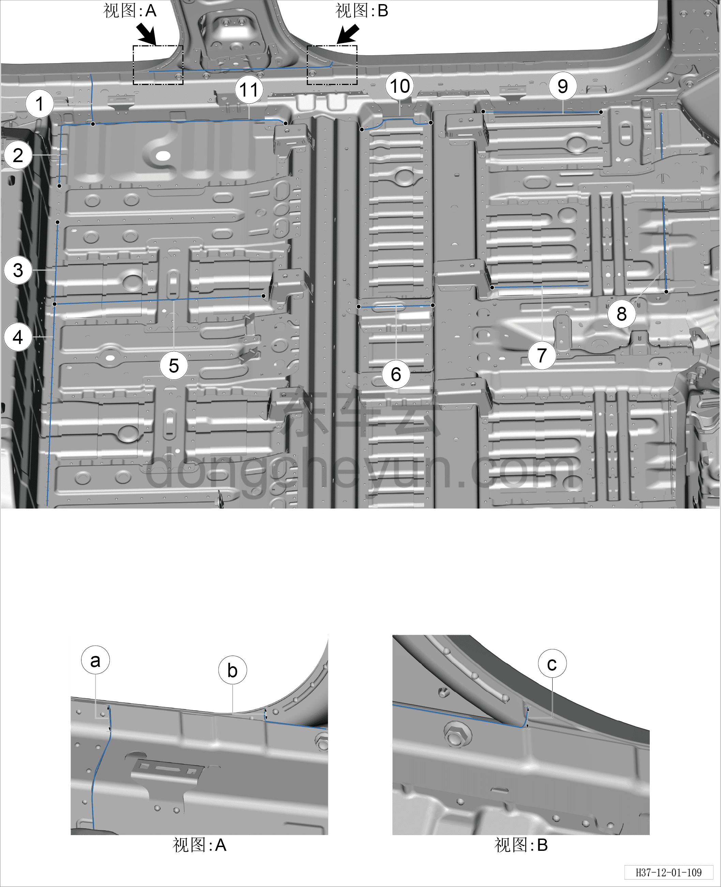

**Порядок выполнения работ:**

**- Возьмите пистолет с прямым круглым наконечником и нанесите герметик на герметизируемые участки, показанные на схеме; после нанесения кистью с герметиком обработайте участки со скоплением герметика, негерметичные и неэстетичные места, а с технологических отверстий и болтов, на которые попал ПВХ-клей, удалите остатки герметика марлей.**

**- Обратите внимание, что в положениях a, b и c на рисунке требуется соскабливание герметика. Технические параметры нанесения герметика в зоне переднего пола в салоне**

<table>
<tr><td rowspan=2>№</td><td rowspan=2 colspan=3>Место нанесения герметика</td><td colspan=3>Длина нанесения герметика (м)</td><td colspan=3>Функция</td><td rowspan=2>Примечание</td></tr>
<tr><td>Левая сторона</td><td>Правая сторона</td><td>Итого</td><td>Гидроизоляция</td><td>Пневмоизоляция (герметичность от воздуха)</td><td>Антикоррозийная защита</td></tr>
<tr><td>1</td><td>Лонжерон</td><td>-</td><td>Внутренняя панель порога</td><td>0.19</td><td>0.19</td><td>0.38</td><td>●</td><td>●</td><td></td><td></td></tr>
<tr><td>2</td><td>Передний пол</td><td>-</td><td>Передняя усилительная панель заднего пола</td><td>0.28</td><td>0.28</td><td>0.56</td><td>●</td><td>●</td><td></td><td></td></tr>
<tr><td>3</td><td>Передний пол</td><td>-</td><td>Передняя усилительная панель заднего пола</td><td>0.67</td><td>0.67</td><td>1.34</td><td>●</td><td>●</td><td></td><td></td></tr>
<tr><td>4</td><td>Средний тоннель пола</td><td>-</td><td>Усилительная панель заднего пола</td><td colspan=2>0.4</td><td>0.4</td><td>●</td><td>●</td><td></td><td></td></tr>
<tr><td>5</td><td>Передний пол</td><td>-</td><td>Средний тоннель пола</td><td>0.21</td><td>0.21</td><td>0.42</td><td>●</td><td>●</td><td></td><td></td></tr>
<tr><td>6</td><td>Передний пол</td><td>-</td><td>Средний тоннель пола</td><td>0.42</td><td>0.42</td><td>0.84</td><td>●</td><td>●</td><td></td><td></td></tr>
<tr><td>7</td><td>Передний пол</td><td>-</td><td>Средний тоннель пола</td><td>0.15</td><td>0.15</td><td>0.30</td><td>●</td><td>●</td><td></td><td></td></tr>
<tr><td>8</td><td>Средний тоннель пола</td><td>-</td><td>Нижняя панель переднего щита</td><td colspan=2>0.64</td><td>0.64</td><td>●</td><td>●</td><td></td><td></td></tr>
<tr><td>9</td><td>Передний пол</td><td>-</td><td>Внутренняя панель порога</td><td>0.38</td><td>0.38</td><td>0.76</td><td>●</td><td>●</td><td></td><td></td></tr>
<tr><td>10</td><td>Передний пол</td><td>-</td><td>Внутренняя панель порога</td><td>0.19</td><td>0.19</td><td>0.38</td><td>●</td><td>●</td><td></td><td></td></tr>
<tr><td>11</td><td>Внутренняя панель средней стойки</td><td>-</td><td>Внутренняя панель порога</td><td>0.39</td><td>0.39</td><td>0.78</td><td>●</td><td>●</td><td></td><td></td></tr>
</table>

Нанесение герметика в зоне заднего пола в салоне

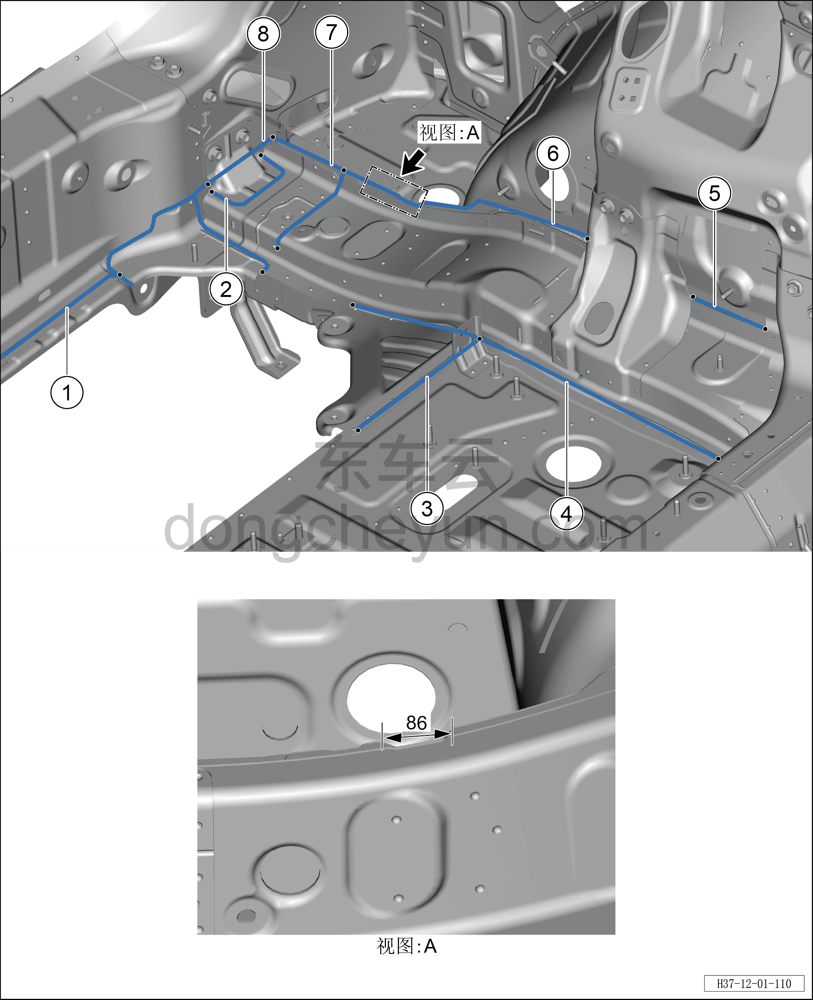

**Порядок выполнения работ:**

**- Возьмите пистолет с прямым круглым наконечником и нанесите герметик на герметизируемые участки пола; после нанесения кистью с герметиком обработайте участки со скоплением герметика, негерметичные и неэстетичные места, а с технологических отверстий и болтов, на которые попал ПВХ-клей, удалите остатки герметика марлей.**

**- Обратите внимание, что в месте, указанном на виде A, требуется соскабливание герметика длиной 86 мм; начальную и конечную точку определять по вырезу кузовной панели. Технические параметры нанесения герметика в зоне заднего пола в салоне**

<table>
<tr><td rowspan=2>№</td><td rowspan=2 colspan=3>Место нанесения герметика</td><td colspan=3>Длина нанесения герметика (м)</td><td colspan=3>Функция</td><td rowspan=2>Примечание</td></tr>
<tr><td>Левая сторона</td><td>Правая сторона</td><td>Итого</td><td>Гидроизоляция</td><td>Пневмоизоляция (герметичность от воздуха)</td><td>Антикоррозийная защита</td></tr>
<tr><td>1</td><td>Панель заднего щита</td><td>-</td><td>Задний участок заднего пола</td><td colspan=2>0.95</td><td>0.95</td><td>●</td><td>●</td><td></td><td></td></tr>
<tr><td>2</td><td>Задний лонжерон</td><td>-</td><td>Соединительная панель противоударной балки</td><td>0.1</td><td>0.1</td><td>0.20</td><td>●</td><td>●</td><td></td><td></td></tr>
<tr><td>3</td><td>Кожух заднего электродвигателя</td><td>-</td><td>Задний участок заднего пола</td><td colspan=2>0.95</td><td>0.95</td><td>●</td><td>●</td><td></td><td></td></tr>
<tr><td>4</td><td>Задний лонжерон</td><td>-</td><td>Задний пол</td><td>0.85</td><td>0.85</td><td>1.70</td><td>●</td><td>●</td><td></td><td></td></tr>
<tr><td>5</td><td>Задний лонжерон</td><td>-</td><td>Внутренняя панель заднего колёсного арки</td><td>0.09</td><td>0.09</td><td>0.18</td><td>●</td><td>●</td><td></td><td></td></tr>
<tr><td>6</td><td>Задний лонжерон</td><td>-</td><td>Внутренняя панель заднего колёсного арки</td><td>0.05</td><td>0.05</td><td>0.10</td><td>●</td><td>●</td><td></td><td></td></tr>
<tr><td>7</td><td>Задний лонжерон</td><td>-</td><td>Заглушка соединительной панели заднего лонжерона</td><td>0.48</td><td>0.48</td><td>0.96</td><td>●</td><td>●</td><td></td><td></td></tr>
<tr><td>8</td><td>Панель заднего щита</td><td>-</td><td>Соединительная панель противоударной балки</td><td>0.26</td><td>0.26</td><td>0.52</td><td>●</td><td>●</td><td></td><td></td></tr>
</table>

Нанесение герметика в зоне заднего пола в салоне

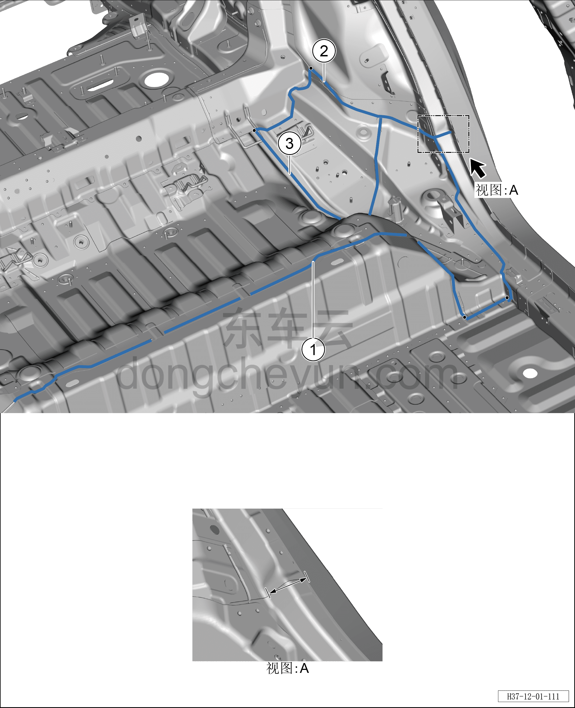

**Порядок выполнения работ:**

**- Возьмите пистолет с прямым круглым наконечником и нанесите герметик на герметизируемые участки пола; после нанесения кистью с герметиком обработайте участки со скоплением герметика, негерметичные и неэстетичные места, а с технологических отверстий и болтов, на которые попал ПВХ-клей, удалите остатки герметика марлей.**

**- Обратите внимание, что в месте, указанном на виде A, требуется соскабливание герметика. Технические параметры нанесения герметика в зоне заднего пола в салоне**

<table>
<tr><td rowspan=2>№</td><td rowspan=2 colspan=3>Место нанесения герметика</td><td colspan=3>Длина нанесения герметика (м)</td><td colspan=3>Функция</td><td rowspan=2>Примечание</td></tr>
<tr><td>Левая сторона</td><td>Правая сторона</td><td>Итого</td><td>Гидроизоляция</td><td>Пневмоизоляция (герметичность от воздуха)</td><td>Антикоррозийная защита</td></tr>
<tr><td>1</td><td>Задний пол</td><td>-</td><td>Усилительная панель заднего пола</td><td colspan=2>2.1</td><td>2.1</td><td>●</td><td>●</td><td></td><td></td></tr>
<tr><td>2</td><td>Задний лонжерон</td><td>-</td><td>Внутренняя панель заднего колёсного арки</td><td>0.42</td><td>0.42</td><td>0.84</td><td>●</td><td>●</td><td></td><td></td></tr>
<tr><td>3</td><td>Задний лонжерон</td><td>-</td><td>Задний пол</td><td>0.66</td><td>0.66</td><td>1.32</td><td>●</td><td>●</td><td></td><td></td></tr>
</table>

Нанесение герметика в зоне верхней части кузова снаружи — (версия с люком)

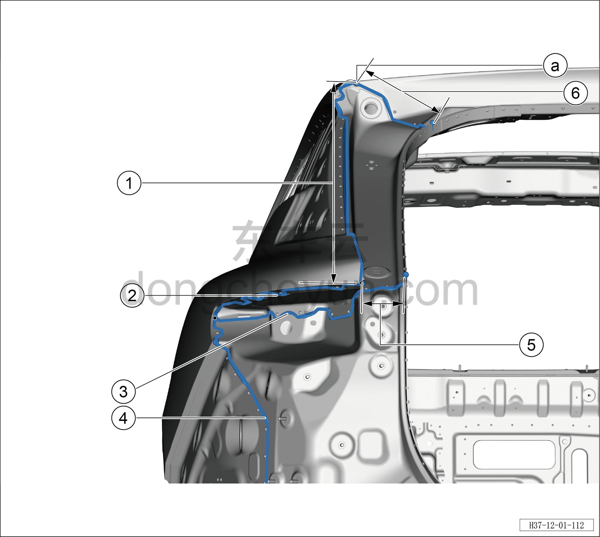

**Порядок выполнения работ:**

**- Возьмите пистолет с прямым круглым наконечником и нанесите герметик на герметизируемые участки пола; после нанесения кистью с герметиком обработайте участки со скоплением герметика, негерметичные и неэстетичные места, а с технологических отверстий и болтов, на которые попал ПВХ-клей, удалите остатки герметика марлей.**

**- Обратите внимание, что в местах ①, ⑥, ⑦ и на виде A требуется соскабливание герметика.**

**- Обратите внимание, что в положении a на рисунке требуется перекрытие с лазерной сваркой.**

Технические параметры нанесения герметика в зоне верхней части кузова снаружи — (версия с люком)

<table>
<tr><td rowspan=2>№</td><td rowspan=2 colspan=3>Место нанесения герметика</td><td colspan=3>Длина нанесения герметика (м)</td><td colspan=3>Функция</td><td rowspan=2>Примечание</td></tr>
<tr><td>Левая сторона</td><td>Правая сторона</td><td>Итого</td><td>Гидроизоляция</td><td>Пневмоизоляция (герметичность от воздуха)</td><td>Антикоррозийная защита</td></tr>
<tr><td>1</td><td>Наружная панель боковины</td><td>-</td><td>Водосточный желоб</td><td>0.80</td><td>0.80</td><td>1.60</td><td>●</td><td>●</td><td>●</td><td>Декоративный (внешний) герметик</td></tr>
<tr><td>2</td><td>Наружная панель боковины</td><td>-</td><td>Соединительная панель наружной панели боковины</td><td>0.58</td><td>0.58</td><td>1.16</td><td>●</td><td>●</td><td>●</td><td></td></tr>
<tr><td>3</td><td>Панель крепления заднего фонаря</td><td>-</td><td>Соединительная панель наружной панели боковины</td><td>0.34</td><td>0.34</td><td>0.68</td><td>●</td><td>●</td><td>●</td><td></td></tr>
<tr><td>4</td><td>Наружная панель боковины</td><td>-</td><td>Панель крепления заднего фонаря</td><td>0.61</td><td>0.61</td><td>1.22</td><td>●</td><td>●</td><td>●</td><td></td></tr>
<tr><td>5</td><td>Панель заднего щита</td><td>-</td><td>Панель крепления заднего фонаря</td><td>0.37</td><td>0.37</td><td>0.74</td><td>●</td><td>●</td><td>●</td><td></td></tr>
<tr><td>6</td><td>Водосточный желоб</td><td>-</td><td>Панель крепления заднего фонаря</td><td>0.23</td><td>0.23</td><td>0.46</td><td>●</td><td>●</td><td>●</td><td>Декоративный (внешний) герметик</td></tr>
<tr><td>7</td><td>Водосточный желоб</td><td>-</td><td>Наружная панель крыши</td><td>0.16</td><td>0.16</td><td>0.32</td><td>●</td><td>●</td><td>●</td><td>Декоративный (внешний) герметик</td></tr>
</table>

Нанесение герметика в зоне верхней части кузова снаружи — (версия с люком)

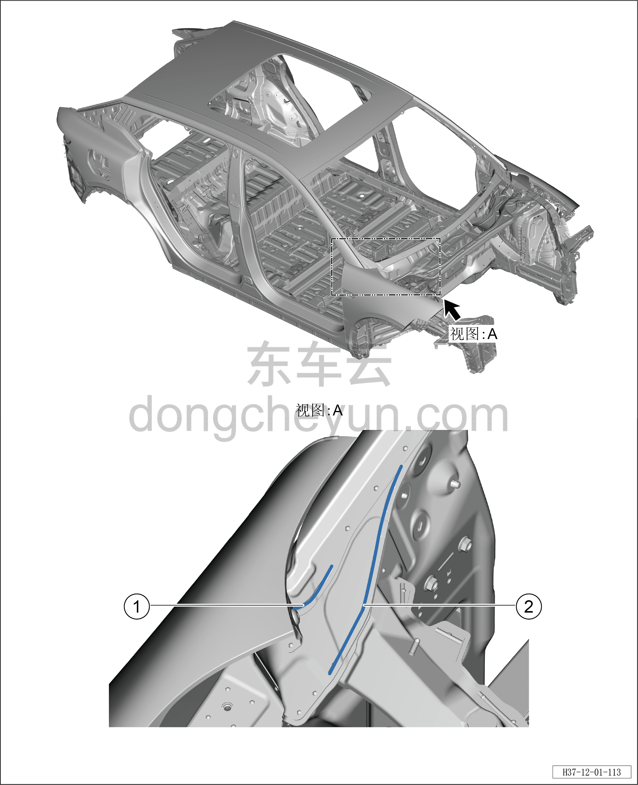

**Порядок выполнения работ:**

**- Возьмите пистолет с прямым круглым наконечником и нанесите герметик на герметизируемые участки пола; после нанесения кистью с герметиком обработайте участки со скоплением герметика, негерметичные и неэстетичные места, а с технологических отверстий и болтов, на которые попал ПВХ-клей, удалите остатки герметика марлей.**

**- Обратите внимание, что в положениях a и d на рисунке требуется соскабливание герметика.**

**- Обратите внимание, что в положениях b и c на рисунке требуется перекрытие со сборочным клеем.**

**- Обратите внимание, что положения ① и ② на рисунке — это гидроизолирующий герметик; из-за недостатка рабочего пространства допускается не соскабливать и не подкрашивать. Технические параметры нанесения герметика в зоне верхней части кузова снаружи — (версия с люком)**

<table>
<tr><td rowspan=2>№</td><td rowspan=2 colspan=3>Место нанесения герметика</td><td colspan=3>Длина нанесения герметика (м)</td><td colspan=3>Функция</td><td rowspan=2>Примечание</td></tr>
<tr><td>Левая сторона</td><td>Правая сторона</td><td>Итого</td><td>Гидроизоляция</td><td>Пневмоизоляция (герметичность от воздуха)</td><td>Антикоррозийная защита</td></tr>
<tr><td>1</td><td>Наружная панель боковины</td><td>-</td><td>Внутренняя панель стойки A</td><td>0.19</td><td>0.19</td><td>0.38</td><td>●</td><td>●</td><td>●</td><td></td></tr>
<tr><td>2</td><td>Нижняя накладка лобового стекла</td><td>-</td><td>Внутренняя панель стойки A</td><td>0.15</td><td>0.15</td><td>0.30</td><td>●</td><td>●</td><td>●</td><td></td></tr>
</table>

Нанесение герметика в зоне верхней части кузова снаружи — (версия с люком)

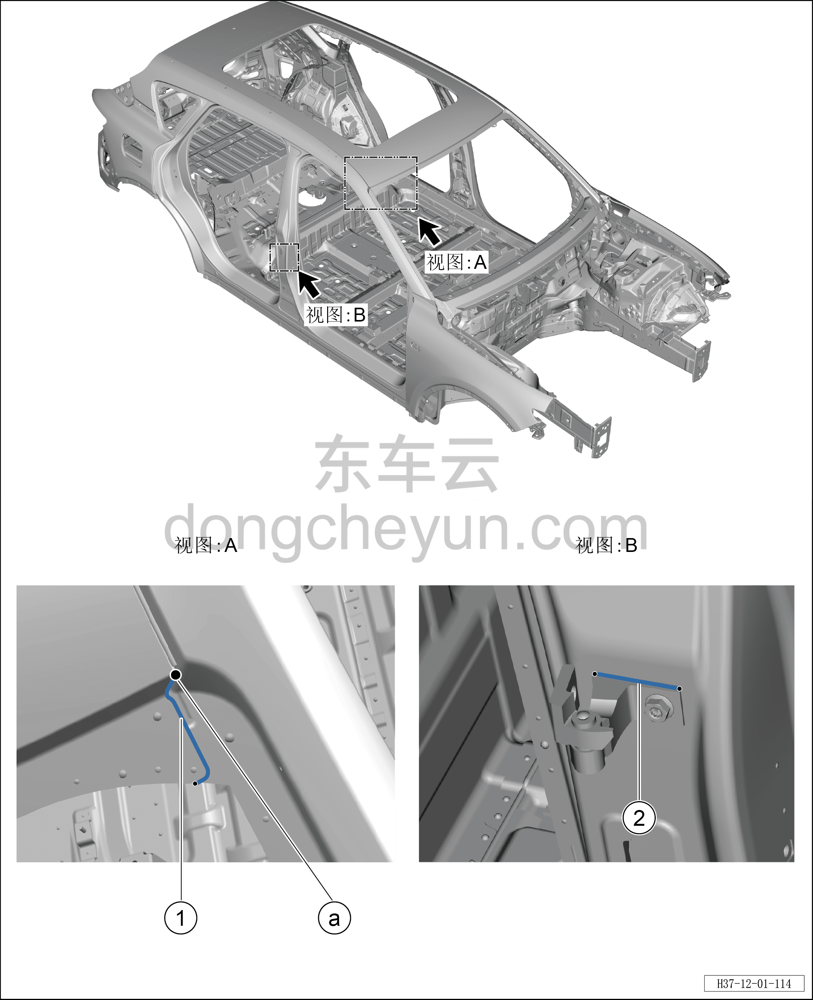

**Порядок выполнения работ:**

**- Возьмите пистолет с прямым круглым наконечником и нанесите герметик на герметизируемые участки пола; после нанесения кистью с герметиком обработайте участки со скоплением герметика, негерметичные и неэстетичные места, а с технологических отверстий и болтов, на которые попал ПВХ-клей, удалите остатки герметика марлей.**

**- Обратите внимание, что в положениях ②, ③, ④ и ⑤ на рисунке требуется соскабливание герметика.**

**- Обратите внимание, что в положении a на рисунке требуется перекрытие с лазерной сваркой.**

Технические параметры нанесения герметика в зоне верхней части кузова снаружи — (версия с панорамной крышей)

<table>
<tr><td rowspan=2>№</td><td rowspan=2 colspan=3>Место нанесения герметика</td><td colspan=3>Длина нанесения герметика (м)</td><td colspan=3>Функция</td><td rowspan=2>Примечание</td></tr>
<tr><td>Левая сторона</td><td>Правая сторона</td><td>Итого</td><td>Гидроизоляция</td><td>Пневмоизоляция (герметичность от воздуха)</td><td>Антикоррозийная защита</td></tr>
<tr><td>1</td><td>Правая наружная панель боковины</td><td>-</td><td>Наружная панель крыши</td><td>0.07</td><td>0.07</td><td>0.14</td><td>●</td><td>●</td><td>●</td><td></td></tr>
<tr><td>2</td><td>Боковина</td><td>-</td><td>Нижняя петля задней двери</td><td>0.06</td><td>0.06</td><td>0.12</td><td>●</td><td>●</td><td>●</td><td></td></tr>
</table>

Нанесение герметика в зоне переднего колёсного арки снаружи кузова

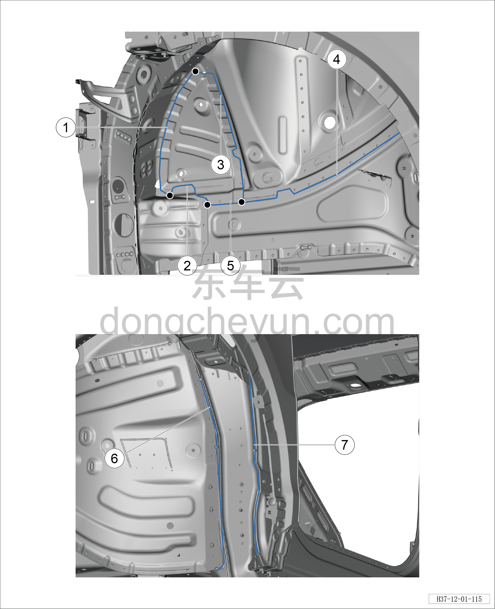

**Порядок выполнения работ:**

**- Возьмите пистолет с прямым круглым наконечником и нанесите герметик на герметизируемые участки пола; после нанесения кистью с герметиком обработайте участки со скоплением герметика, негерметичные и неэстетичные места, а с технологических отверстий и болтов, на которые попал ПВХ-клей, удалите остатки герметика марлей.**

**- Обратите внимание, что в местах ④ и ⑤ на посадочных поверхностях передней подвески не допускается наличие остатков герметика.**

**- Обратите внимание, что начальную и конечную точку положения ⑧ на рисунке определять по краю монтажного выступа петли. Технические параметры нанесения герметика в зоне переднего колёсного арки снаружи кузова**

<table>
<tr><td rowspan=2>№</td><td rowspan=2 colspan=3>Место нанесения герметика</td><td colspan=3>Длина нанесения герметика (м)</td><td colspan=3>Функция</td><td rowspan=2>Примечание</td></tr>
<tr><td>Левая сторона</td><td>Правая сторона</td><td>Итого</td><td>Гидроизоляция</td><td>Пневмоизоляция (герметичность от воздуха)</td><td>Антикоррозийная защита</td></tr>
<tr><td>1</td><td>Передняя часть переднего колёсного арки</td><td>-</td><td>Усилительная панель переднего участка колёсной арки</td><td>0.31</td><td>0.31</td><td>0.62</td><td></td><td></td><td>●</td><td></td></tr>
<tr><td>2</td><td>Панель крепления переднего амортизатора</td><td>-</td><td>Усилительная панель переднего участка колёсной арки</td><td>0.79</td><td>0.79</td><td>1.58</td><td></td><td></td><td>●</td><td></td></tr>
<tr><td>3</td><td>Усилительная панель переднего участка колёсной арки</td><td>-</td><td>Средний участок переднего колёсного арки</td><td>0.14</td><td>0.14</td><td>0.28</td><td></td><td></td><td>●</td><td></td></tr>
<tr><td>4</td><td>Панель крепления переднего амортизатора</td><td>-</td><td>Усилительная панель крепления переднего амортизатора I</td><td>0.50</td><td>0.50</td><td>1.00</td><td></td><td></td><td>●</td><td></td></tr>
<tr><td>5</td><td>Панель крепления переднего амортизатора</td><td>-</td><td>Усилительная панель крепления переднего амортизатора II</td><td>0.96</td><td>0.96</td><td>1.92</td><td></td><td></td><td>●</td><td></td></tr>
<tr><td>6</td><td>Наружная панель переднего участка лонжерона</td><td>-</td><td>Нижняя часть внутренней панели стойки A</td><td>0.39</td><td>0.39</td><td>0.78</td><td>●</td><td>●</td><td>●</td><td></td></tr>
<tr><td>7</td><td>Нижняя усилительная панель каркаса стойки A</td><td>-</td><td>Нижняя часть внутренней панели стойки A</td><td>0.40</td><td>0.40</td><td>0.80</td><td>●</td><td>●</td><td>●</td><td></td></tr>
</table>

Нанесение герметика в зоне заднего колёсного арки снаружи кузова

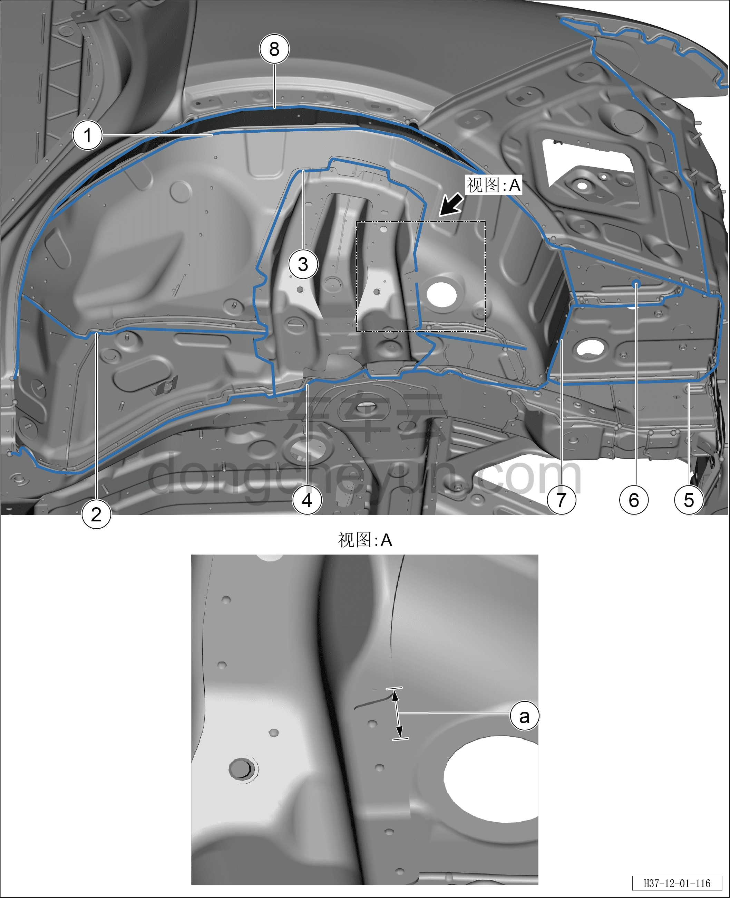

**Порядок выполнения работ:**

**- Возьмите пистолет с прямым круглым наконечником и нанесите герметик на герметизируемые участки пола; после нанесения кистью с герметиком обработайте участки со скоплением герметика, негерметичные и неэстетичные места, а с технологических отверстий и болтов, на которые попал ПВХ-клей, удалите остатки герметика марлей.**

**- Обратите внимание, что в положении a на рисунке длиной 25±10 мм и в положении d длиной 65±10 мм требуется прерывистое нанесение герметика; начальную и конечную точку определять по особенностям кузовной панели.**

**- Обратите внимание, что в положениях b и c на рисунке внутренний и наружный герметик сварного шва должны перекрываться. Технические параметры нанесения герметика в зоне заднего колёсного арки снаружи кузова**

<table>
<tr><td rowspan=2>№</td><td rowspan=2 colspan=3>Место нанесения герметика</td><td colspan=3>Длина нанесения герметика (м)</td><td colspan=3>Функция</td><td rowspan=2>Примечание</td></tr>
<tr><td>Левая сторона</td><td>Правая сторона</td><td>Итого</td><td>Гидроизоляция</td><td>Пневмоизоляция (герметичность от воздуха)</td><td>Антикоррозийная защита</td></tr>
<tr><td>1</td><td>Внутренняя панель заднего колёсного арки</td><td>-</td><td>Наружная панель заднего колёсного арки</td><td>1.62</td><td>1.62</td><td>3.24</td><td>●</td><td>●</td><td>●</td><td></td></tr>
<tr><td>2</td><td>Внутренняя панель заднего колёсного арки</td><td>-</td><td>Панель крепления заднего амортизатора</td><td>0.28</td><td>0.28</td><td>0.56</td><td>●</td><td>●</td><td>●</td><td></td></tr>
<tr><td>3</td><td>Внутренняя панель заднего колёсного арки</td><td>-</td><td>Панель крепления заднего амортизатора</td><td>0.02</td><td>0.02</td><td>0.04</td><td>●</td><td>●</td><td>●</td><td></td></tr>
<tr><td>4</td><td>Левая усилительная панель крепления заднего амортизатора</td><td>-</td><td>Наружная заглушка левого заднего лонжерона</td><td></td><td></td><td></td><td></td><td></td><td>●</td><td></td></tr>
<tr><td>5</td><td>Соединительная панель заднего участка левого заднего лонжерона пола</td><td>-</td><td>Наружная заглушка заднего участка левого заднего лонжерона</td><td></td><td></td><td></td><td>●</td><td>●</td><td>●</td><td></td></tr>
<tr><td>6</td><td>Заглушка</td><td>-</td><td>Наружная панель боковины / наружная панель заднего колёсного арки / задний лонжерон</td><td>0.64</td><td>0.64</td><td>1.28</td><td>●</td><td>●</td><td>●</td><td></td></tr>
<tr><td>7</td><td>Соединительная панель заднего участка левого заднего лонжерона заднего пола</td><td>-</td><td>Внутренняя панель левого заднего колёсного арки</td><td></td><td></td><td></td><td>●</td><td>●</td><td>●</td><td></td></tr>
<tr><td>8</td><td>Соединительная панель заднего участка заднего лонжерона</td><td>-</td><td>Наружная панель левого заднего колёсного арки</td><td>0.91</td><td>0.91</td><td>1.82</td><td>●</td><td>●</td><td>●</td><td></td></tr>
</table>

Нанесение герметика в зоне пола снаружи кузова

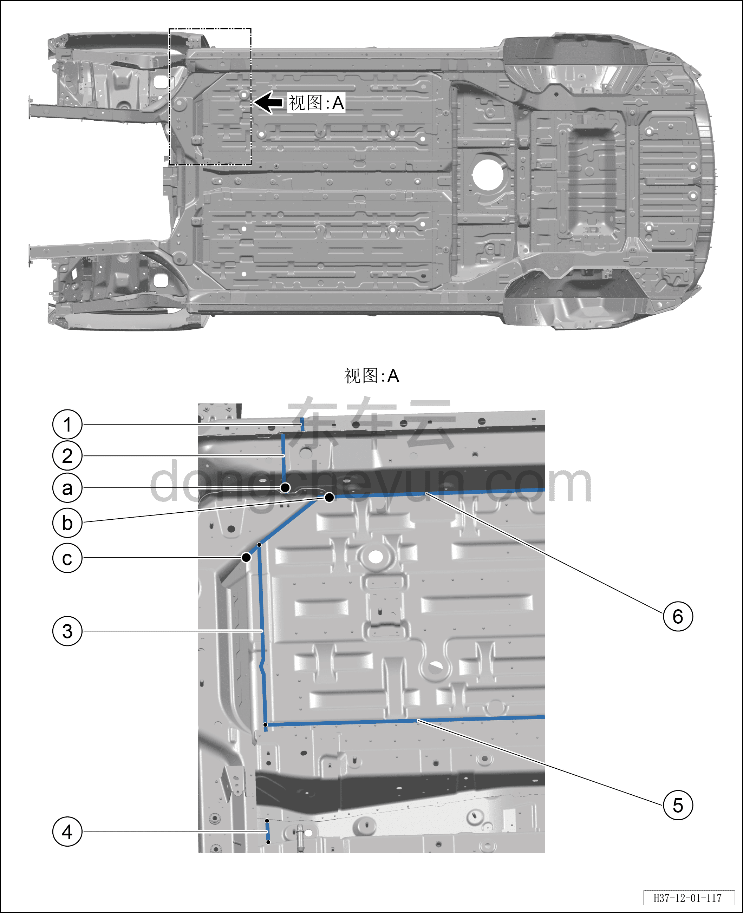

**Порядок выполнения работ:**

**- Возьмите пистолет с прямым круглым наконечником и нанесите герметик на герметизируемые участки пола; после нанесения кистью с герметиком обработайте участки со скоплением герметика, негерметичные и неэстетичные места, а с технологических отверстий и болтов, на которые попал ПВХ-клей, удалите остатки герметика марлей.**

**- Обратите внимание, что в положении a на рисунке требуется перекрытие со сборочным клеем.**

**- Обратите внимание, что в положениях b и c на рисунке внутренний и наружный герметик сварного шва должны перекрываться. Технические параметры нанесения герметика в зоне пола снаружи кузова**

<table>
<tr><td rowspan=2>№</td><td rowspan=2 colspan=3>Место нанесения герметика</td><td colspan=3>Длина нанесения герметика (м)</td><td colspan=3>Функция</td><td rowspan=2>Примечание</td></tr>
<tr><td>Левая сторона</td><td>Правая сторона</td><td>Итого</td><td>Гидроизоляция</td><td>Пневмоизоляция (герметичность от воздуха)</td><td>Антикоррозийная защита</td></tr>
<tr><td>1</td><td>Нижняя усилительная панель каркаса стойки A</td><td>-</td><td>Усилительная балка порога</td><td>0.18</td><td>0.18</td><td>0.36</td><td>●</td><td>●</td><td>●</td><td></td></tr>
<tr><td>2</td><td>Панель переднего щита</td><td>-</td><td>Передний пол</td><td>0.16</td><td>0.16</td><td>0.32</td><td>●</td><td>●</td><td>●</td><td></td></tr>
<tr><td>3</td><td>Левая верхняя усилительная балка переднего щита</td><td>-</td><td>Панель переднего щита</td><td>0.43</td><td>0.43</td><td>0.86</td><td>●</td><td>●</td><td>●</td><td></td></tr>
<tr><td>4</td><td>Нижняя часть левой внутренней панели стойки A</td><td>-</td><td>Отдельная секция соединительной панели среднего участка левого лонжерона</td><td colspan=2>0.07</td><td>0.07</td><td>●</td><td>●</td><td>●</td><td></td></tr>
<tr><td>5</td><td>Левая верхняя усилительная балка переднего щита</td><td>-</td><td>Панель переднего щита</td><td>1.44</td><td>1.44</td><td>2.88</td><td>●</td><td>●</td><td>●</td><td></td></tr>
<tr><td>6</td><td>Левая внутренняя панель порога</td><td>-</td><td>Панель переднего щита</td><td>1.58</td><td>1.58</td><td>3.16</td><td>●</td><td>●</td><td>●</td><td></td></tr>
</table>

Нанесение герметика в зоне пола снаружи кузова

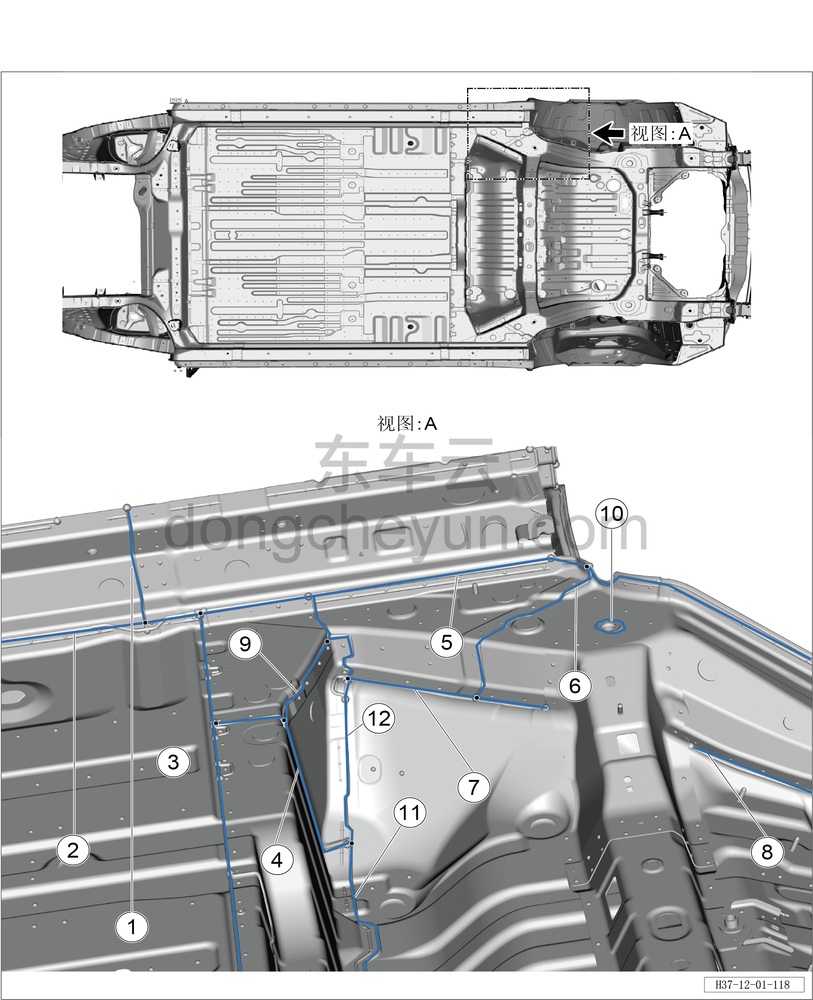

**Порядок выполнения работ:**

**- Возьмите пистолет с прямым круглым наконечником и нанесите герметик на герметизируемые участки пола; после нанесения кистью с герметиком обработайте участки со скоплением герметика, негерметичные и неэстетичные места, а с технологических отверстий и болтов, на которые попал ПВХ-клей, удалите остатки герметика марлей.**

**Технические параметры нанесения герметика в зоне пола снаружи кузова**

<table>
<tr><td rowspan=2>№</td><td rowspan=2 colspan=3>Место нанесения герметика</td><td colspan=3>Длина нанесения герметика (м)</td><td colspan=3>Функция</td><td rowspan=2>Примечание</td></tr>
<tr><td>Левая сторона</td><td>Правая сторона</td><td>Итого</td><td>Гидроизоляция</td><td>Пневмоизоляция (герметичность от воздуха)</td><td>Антикоррозийная защита</td></tr>
<tr><td>1</td><td>Передний пол</td><td>-</td><td>Внутренняя панель порога</td><td>1.58</td><td>1.58</td><td>3.16</td><td>●</td><td>●</td><td>●</td><td></td></tr>
<tr><td>2</td><td>Передний пол</td><td>-</td><td>Средний тоннель пола</td><td>1.44</td><td>1.44</td><td>2.88</td><td>●</td><td>●</td><td>●</td><td></td></tr>
<tr><td>3</td><td>Передний пол</td><td>-</td><td>Передняя усилительная панель заднего пола</td><td>0.55</td><td>0.55</td><td>1.10</td><td>●</td><td>●</td><td>●</td><td></td></tr>
<tr><td>4</td><td>Средний тоннель пола</td><td>-</td><td>Передняя усилительная панель заднего пола</td><td colspan=2>0.08</td><td>0.08</td><td>●</td><td>●</td><td>●</td><td></td></tr>
<tr><td>5</td><td>Передняя усилительная панель заднего пола</td><td>-</td><td>Задний пол</td><td>0.40</td><td>0.40</td><td>0.80</td><td>●</td><td>●</td><td>●</td><td></td></tr>
<tr><td>6</td><td>Передняя усилительная панель заднего пола</td><td>-</td><td>Задний пол</td><td colspan=2>0.38</td><td>0.38</td><td>●</td><td>●</td><td>●</td><td></td></tr>
<tr><td>7</td><td>Левый задний лонжерон</td><td>-</td><td>Задний пол</td><td>0.43</td><td>0.43</td><td>0.86</td><td>●</td><td>●</td><td>●</td><td></td></tr>
<tr><td>8</td><td>Кожух заднего электродвигателя</td><td>-</td><td>Задний пол</td><td>0.94</td><td>0.94</td><td>1.88</td><td>●</td><td>●</td><td>●</td><td></td></tr>
<tr><td>9</td><td>Нижняя панель левого заднего лонжерона</td><td>-</td><td>Кожух заднего электродвигателя / задний пол</td><td>0.55</td><td>0.55</td><td>1.10</td><td>●</td><td>●</td><td>●</td><td></td></tr>
<tr><td>10</td><td>Нижняя панель левого заднего лонжерона</td><td>-</td><td>Левый задний лонжерон</td><td>0.55</td><td>0.55</td><td>1.10</td><td>●</td><td>●</td><td>●</td><td></td></tr>
<tr><td>11</td><td>Левый кронштейн крепления заднего подрамника</td><td>-</td><td>Соединительная панель внутренней панели заднего колёсного арки  / нижняя часть левого заднего лонжерона</td><td>0.86</td><td>0.86</td><td>1.72</td><td>●</td><td>●</td><td>●</td><td></td></tr>
<tr><td>12</td><td>Нижняя панель левого заднего лонжерона</td><td>-</td><td>Задний участок балки порога /  Левый задний лонжерон / задний пол</td><td>0.98</td><td>0.98</td><td>1.96</td><td>●</td><td>●</td><td>●</td><td></td></tr>
</table>

Нанесение герметика в зоне пола снаружи кузова

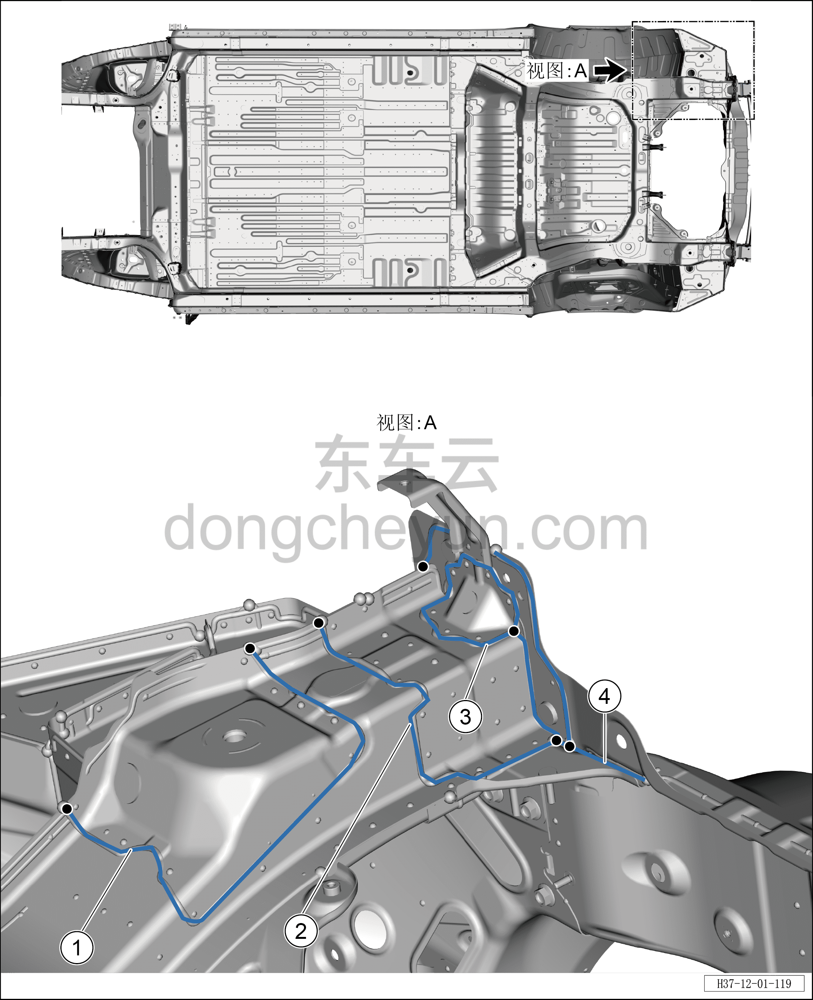

**Порядок выполнения работ:**

**- Возьмите пистолет с прямым круглым наконечником и нанесите герметик на герметизируемые участки пола; после нанесения кистью с герметиком обработайте участки со скоплением герметика, негерметичные и неэстетичные места, а с технологических отверстий и болтов, на которые попал ПВХ-клей, удалите остатки герметика марлей.**

**Технические параметры нанесения герметика в зоне пола снаружи кузова**

<table>
<tr><td rowspan=2>№</td><td rowspan=2 colspan=3>Место нанесения герметика</td><td colspan=3>Длина нанесения герметика (м)</td><td colspan=3>Функция</td><td rowspan=2>Примечание</td></tr>
<tr><td>Левая сторона</td><td>Правая сторона</td><td>Итого</td><td>Гидроизоляция</td><td>Пневмоизоляция (герметичность от воздуха)</td><td>Антикоррозийная защита</td></tr>
<tr><td>1</td><td>Нижняя панель левого заднего лонжерона</td><td>-</td><td>Соединительная панель противоударной балки</td><td>0.21</td><td>0.21</td><td>0.42</td><td>●</td><td>●</td><td>●</td><td></td></tr>
<tr><td>2</td><td>Нижняя панель левого заднего лонжерона</td><td>-</td><td>Левый задний лонжерон</td><td>0.27</td><td>0.27</td><td>0.54</td><td>●</td><td>●</td><td>●</td><td></td></tr>
<tr><td>3</td><td>Задний участок заднего пола</td><td>-</td><td>Левый задний лонжерон</td><td>0.27</td><td>0.27</td><td>0.54</td><td>●</td><td>●</td><td>●</td><td></td></tr>
<tr><td>4</td><td>Задний участок заднего пола</td><td>-</td><td>Наружная панель поперечины заднего щита</td><td colspan=2>0.90</td><td>0.90</td><td>●</td><td>●</td><td>●</td><td></td></tr>
</table>
