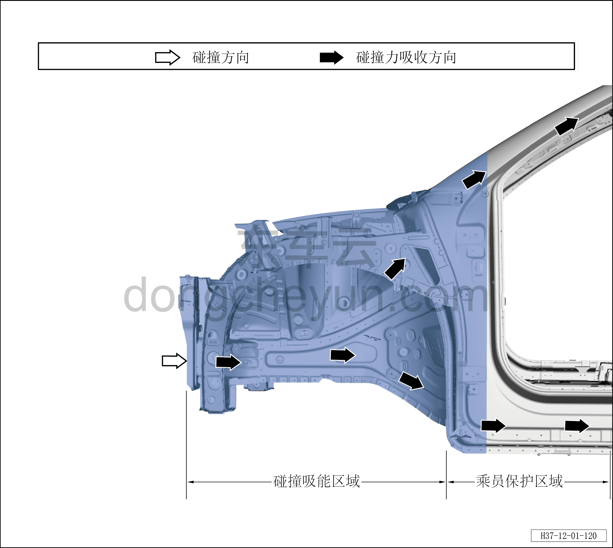
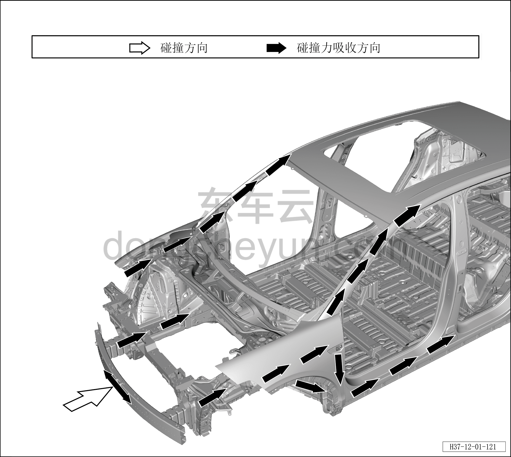
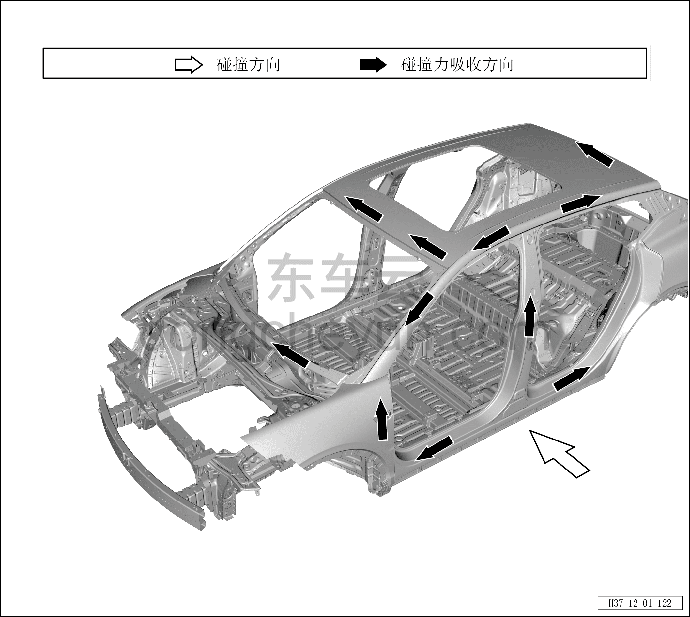
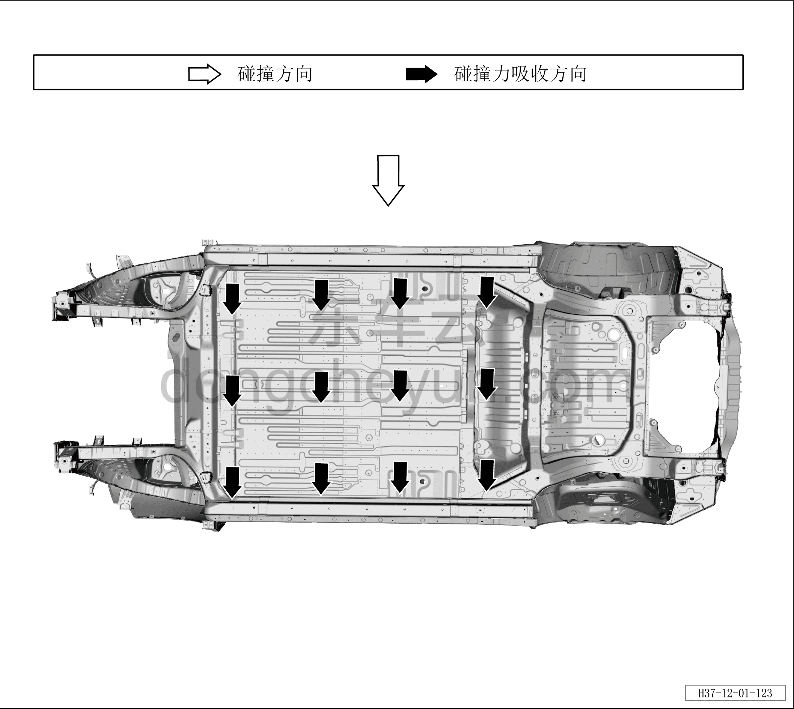
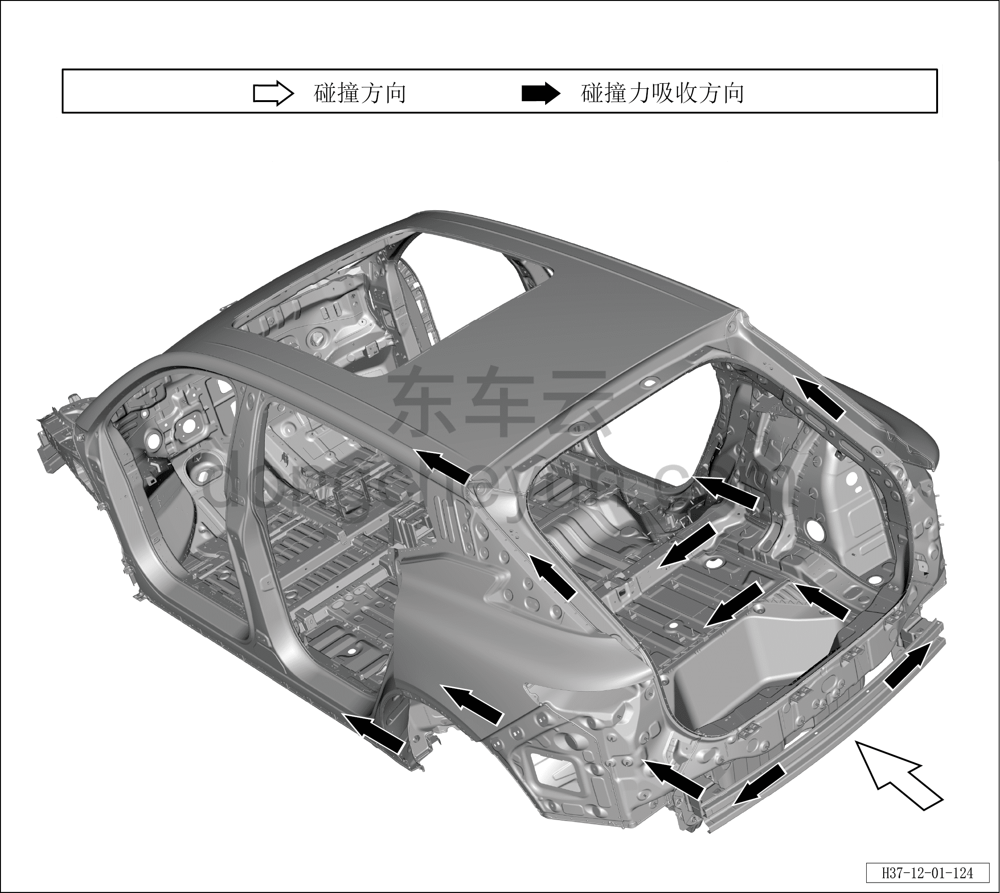

# Путь передачи силы удара

> Кузовные жестяные работы, окраска › Кузов в белом (BIW) в сборе › Диагностика повреждений  
> Оригинал: `碰撞力传递路径` · [dongcheyun 56746](https://dongcheyun.com/p/56746), страница `39dd7f2724ca43caa0529dd39f542513` · [оглавление](../README.md)

Фронтальное столкновение

В данном автомобиле применена полностью усовершенствованная структура для восприятия столкновений и оптимально спроектированная структура бокового столкновения, максимально поглощающая и рассеивающая энергию удара. В передней структуре кузова применена передовая технология управления поглощением энергии удара, научно обоснованный путь передачи силы и конструктивное решение, обеспечивающие стабильную несущую способность при ударе; при фронтальном столкновении происходит стабильное и упорядоченное деформационное поглощение энергии, максимально поглощающая энергию столкновения и обеспечивающая высокий уровень безопасности при столкновении.

Боковое столкновение

В боковой структуре кузова применена структура передачи силы по четырём продольным элементам сбоку и структура противоударных балок дверей в форме перевёрнутой расходящейся V-образной формы, рационально и удачно рассеивающая силу бокового удара, максимально защищающая пассажиров при боковом столкновении и обеспечивающая безупречную боковую защиту.

Заднее столкновение

В задней структуре кузова применена передовая технология управления поглощением энергии удара, научно обоснованный путь передачи силы и конструктивное решение, обеспечивающие стабильную несущую способность при ударе; при заднем столкновении происходит стабильное и упорядоченное деформационное поглощение энергии, максимально поглощающая энергию столкновения и обеспечивающая высокий уровень безопасности при столкновении.
