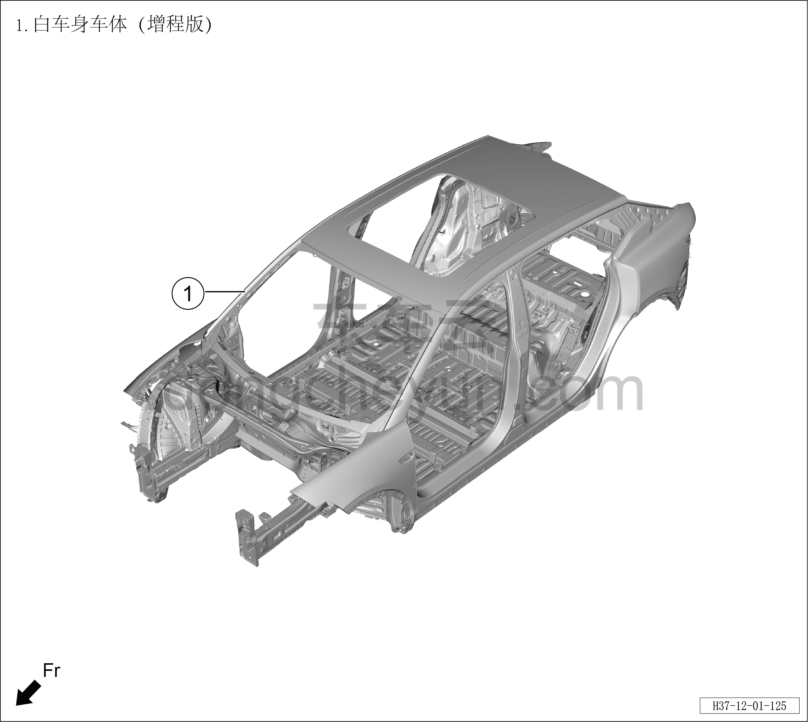

# Схема кузова в сборе

> Кузовные жестяные работы, окраска › Кузов в белом (BIW) в сборе › Покомпонентный вид (деталировка)  
> Оригинал: `车身本体图` · [dongcheyun 56746](https://dongcheyun.com/p/56746), страница `77f770ae73af4af4831c322146f0882e` · [оглавление](../README.md)

| № | Наименование детали | Кол-во на автомобиль | Примечание |
|---|---|---|---|
| 1 | Кузов в белом (BIW) | 1 |   |
