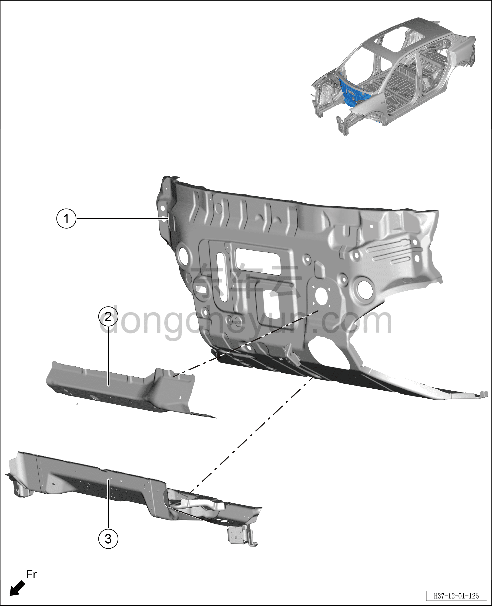

# Схема конструкции переднего щита

> Кузовные жестяные работы, окраска › Кузов в белом (BIW) в сборе › Покомпонентный вид (деталировка)  
> Оригинал: `前围结构图` · [dongcheyun 56746](https://dongcheyun.com/p/56746), страница `1090fb83e08a4396a8bb80423389bf13` · [оглавление](../README.md)

**Примечание:**

**Для определения того, какие детали продаются как запасные части, см. соответствующий каталог деталей в «Руководстве по деталям».**

| № | Наименование детали | Кол-во на автомобиль | Примечание |
|---|---|---|---|
| 1 | Сварной узел переднего щита в сборе | 1 |   |
| 2 | Узел поперечины переднего щита | 1 |   |
| 3 | Усилительная балка переднего щита в сборе | 1 |   |
