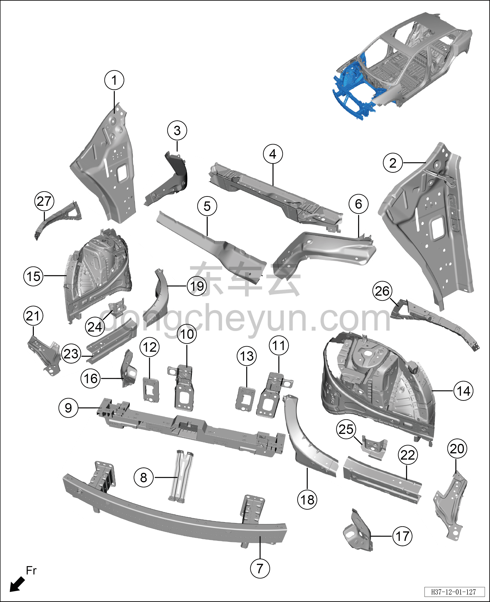

# Схема конструкции переднего отсека (с увеличенным запасом хода)

> Кузовные жестяные работы, окраска › Кузов в белом (BIW) в сборе › Покомпонентный вид (деталировка)  
> Оригинал: `前机舱结构图（增程）` · [dongcheyun 56746](https://dongcheyun.com/p/56746), страница `e5e382e996ad4172b53837c0549803b9` · [оглавление](../README.md)

**Примечание:**

**- Для определения того, какие детали продаются как запасные части, см. соответствующий каталог деталей в «Руководстве по деталям».**

| № | Наименование детали | Кол-во на автомобиль | Примечание |
|---|---|---|---|
| 1 | Верхняя часть правой внутренней панели стойки A | 1 |   |
| 2 | Верхняя часть левой внутренней панели стойки A | 1 |   |
| 3 | Отдельная секция соединительной панели среднего участка правого лонжерона | 1 |   |
| 4 | Усилительная балка переднего щита в сборе | 1 |   |
| 5 | Поперечина переднего щита | 1 |   |
| 6 | Отдельная секция соединительной панели среднего участка левого лонжерона | 1 |   |
| 7 | Сварной узел переднего противоударного бруса в сборе | 1 |   |
| 8 | Кронштейн замка переднего модуля | 1 |   |
| 9 | Рама переднего модуля | 1 |   |
| 10 | Узел правой гайковой пластины переднего противоударного бруса 1 | 1 |   |
| 11 | Узел левой гайковой пластины переднего противоударного бруса 1 | 1 |   |
| 12 | Правая соединительная панель переднего противоударного бруса | 1 |   |
| 13 | Левая соединительная панель переднего противоударного бруса | 1 |   |
| 14 | Сварной узел наружной панели переднего участка левого лонжерона в сборе | 1 |   |
| 15 | Сварной узел наружной панели переднего участка правого лонжерона в сборе | 1 |   |
| 16 | Задняя усилительная панель внутренней панели правого лонжерона | 1 |   |
| 17 | Задняя усилительная панель внутренней панели левого лонжерона | 1 |   |
| 18 | Соединительная панель среднего участка левого лонжерона | 1 |   |
| 19 | Соединительная панель среднего участка правого лонжерона | 1 |   |
| 20 | Левая панель крепления верхней поперечины радиатора | 1 |   |
| 21 | Правая панель крепления верхней поперечины радиатора | 1 |   |
| 22 | Внутренняя панель переднего участка левого лонжерона | 1 |   |
| 23 | Внутренняя панель переднего участка правого лонжерона | 1 |   |
| 24 | Усилительная накладка правой опоры переднего амортизатора | 1 |   |
| 25 | Усилительная накладка левой опоры переднего амортизатора | 1 |   |
| 26 | Левая усилительная панель переднего отсека | 1 |   |
| 27 | Правая усилительная панель переднего отсека | 1 |   |
