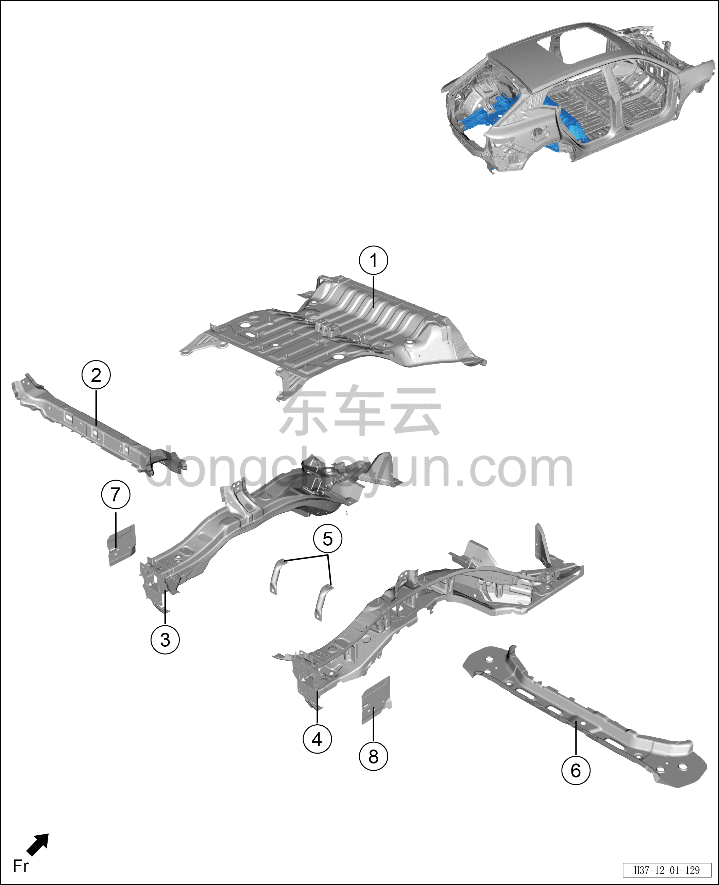

# Схема конструкции заднего пола

> Кузовные жестяные работы, окраска › Кузов в белом (BIW) в сборе › Покомпонентный вид (деталировка)  
> Оригинал: `后地板结构图` · [dongcheyun 56746](https://dongcheyun.com/p/56746), страница `28cf47f535ef47f58c685d5335e9831e` · [оглавление](../README.md)

**Примечание:**

**- Для определения того, какие детали продаются как запасные части, см. соответствующий каталог деталей в «Руководстве по деталям».**

| № | Наименование детали | Кол-во на автомобиль | Примечание |
|---|---|---|---|
| 1 | Подузел заднего пола | 1 |   |
| 2 | Узел поперечины спинки заднего сиденья в сборе | 1 |   |
| 3 | Узел левого заднего лонжерона заднего пола в сборе | 1 |   |
| 4 | Узел правого заднего лонжерона заднего пола в сборе | 1 |   |
| 5 | Сборочный узел опорного элемента заднего ящика для мелочей | 1 |   |
| 6 | Задняя поперечина заднего пола | 1 |   |
| 7 | Узел заглушки соединительной панели левого заднего лонжерона в сборе | 1 |   |
| 8 | Узел заглушки соединительной панели правого заднего лонжерона в сборе | 1 |   |
