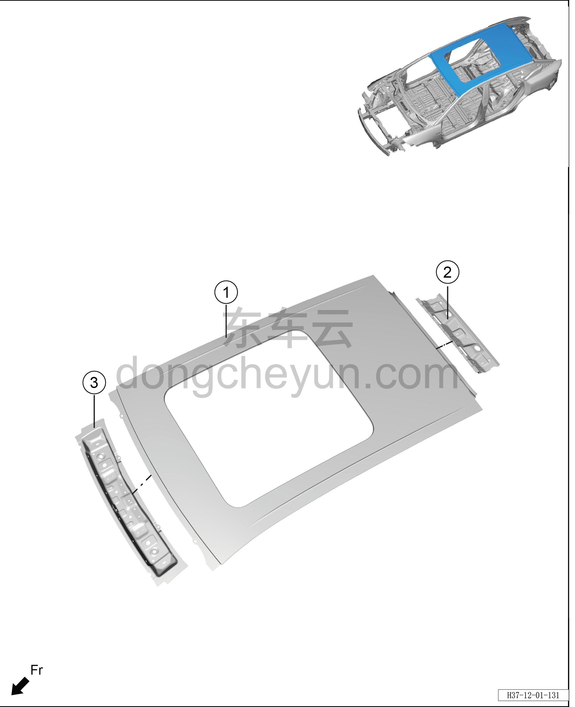

# Схема конструкции крыши (версия с люком)

> Кузовные жестяные работы, окраска › Кузов в белом (BIW) в сборе › Покомпонентный вид (деталировка)  
> Оригинал: `顶盖结构图（天窗版）` · [dongcheyun 56746](https://dongcheyun.com/p/56746), страница `4e050d8c5c1045be84a7b53a3dc8e4ca` · [оглавление](../README.md)

| № | Наименование детали | Кол-во на автомобиль | Примечание |
|---|---|---|---|
| 1 | Сварной узел крыши в сборе | 1 |   |
| 2 | Сварной узел задней поперечины крыши в сборе | 1 |   |
| 3 | Сварной узел передней поперечины крыши в сборе | 1 |   |
