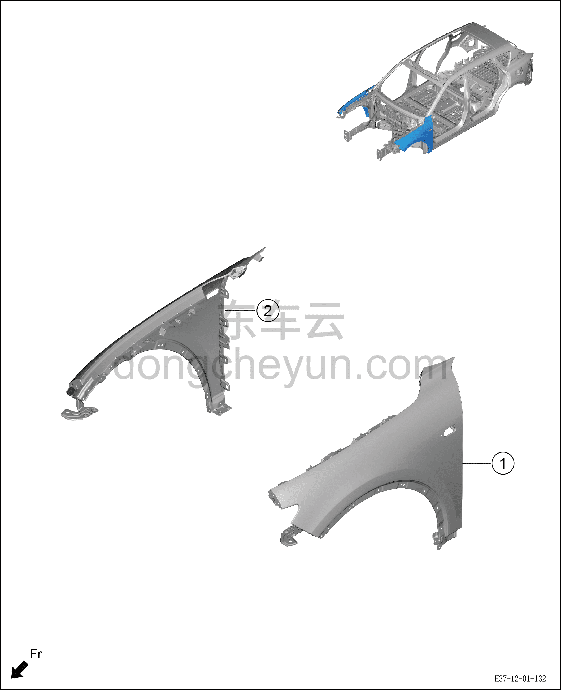

# Схема конструкции крыла

> Кузовные жестяные работы, окраска › Кузов в белом (BIW) в сборе › Покомпонентный вид (деталировка)  
> Оригинал: `翼子板结构图` · [dongcheyun 56746](https://dongcheyun.com/p/56746), страница `05bd986078784066aadd2b12263e1542` · [оглавление](../README.md)

**Примечание:**

**- Для определения того, какие детали продаются как запасные части, см. соответствующий каталог деталей в «Руководстве по деталям».**

| № | Наименование детали | Кол-во на автомобиль | Примечание |
|---|---|---|---|
| 1 | Сварной узел левого переднего крыла в сборе | 1 |   |
| 2 | Сварной узел правого переднего крыла в сборе | 1 |   |
