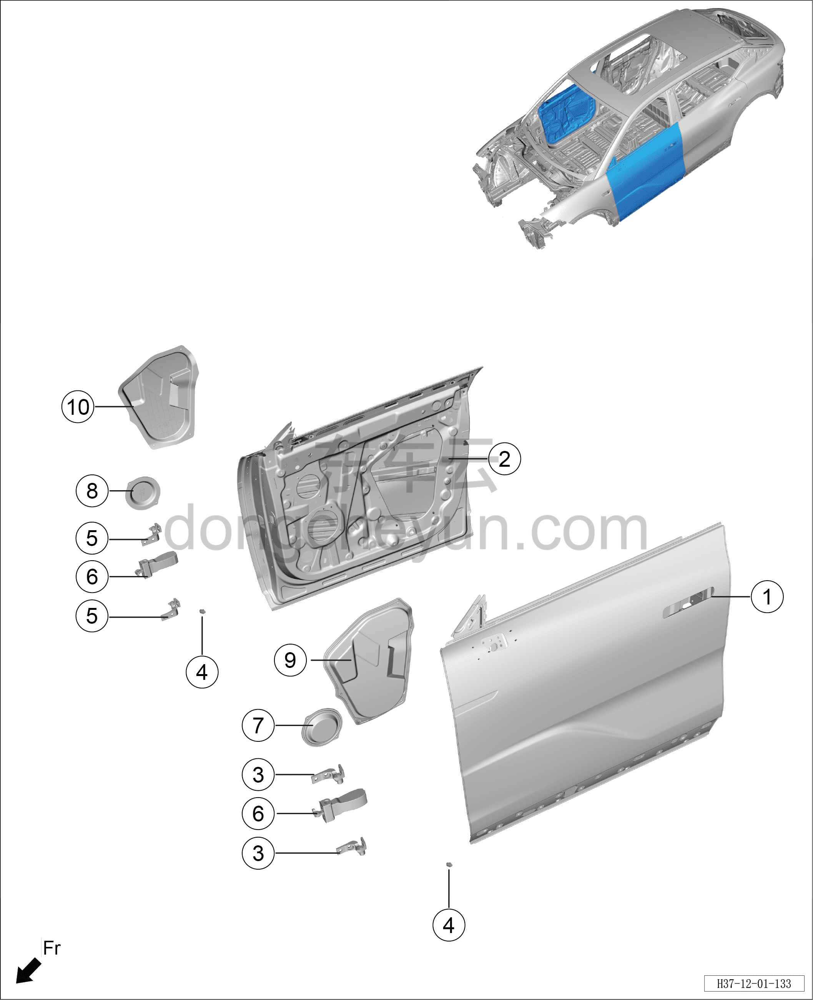

# Схема конструкции передней двери

> Кузовные жестяные работы, окраска › Кузов в белом (BIW) в сборе › Покомпонентный вид (деталировка)  
> Оригинал: `前车门结构图` · [dongcheyun 56746](https://dongcheyun.com/p/56746), страница `abea56cc49784d08b484ddc35d15c669` · [оглавление](../README.md)

**Примечание:**

**- Для определения того, какие детали продаются как запасные части, см. соответствующий каталог деталей в «Руководстве по деталям».**

| № | Наименование детали | Кол-во на автомобиль | Примечание |
|---|---|---|---|
| 1 | Узел деталей левой передней двери в сборе | 1 |   |
| 2 | Узел деталей правой передней двери в сборе | 1 |   |
| 3 | Узел верхней петли передней двери (левой) в сборе | 2 |   |
| 4 | Буфер задней двери | 1 |   |
| 5 | Узел верхней петли передней двери (правой) в сборе | 2 |   |
| 6 | Узел ограничителя передней двери в сборе | 1 |   |
| 7 | Передняя водозащитная плёнка левой передней двери | 1 |   |
| 8 | Передняя водозащитная плёнка правой передней двери | 1 |   |
| 9 | Гидроизоляционная плёнка левой передней двери | 1 |   |
| 10 | Водозащитная плёнка правой передней двери | 1 |   |
