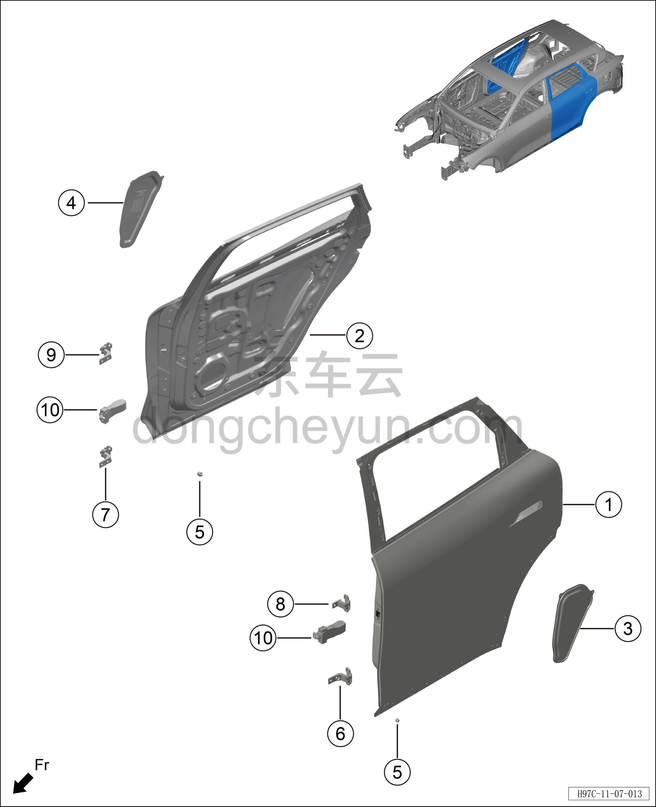

# Схема конструкции задней двери

> Кузовные жестяные работы, окраска › Кузов в белом (BIW) в сборе › Покомпонентный вид (деталировка)  
> Оригинал: `后车门结构图` · [dongcheyun 56746](https://dongcheyun.com/p/56746), страница `7d4cf8bbbcc64b22994d0471270b2ec7` · [оглавление](../README.md)

**Примечание:**

**- Для определения того, какие детали продаются как запасные части, см. соответствующий каталог деталей в «Руководстве по деталям».**

| № | Наименование детали | Кол-во на автомобиль | Примечание |
|---|---|---|---|
| 1 | Узел деталей левой задней двери в сборе | 1 |   |
| 2 | Узел деталей правой задней двери в сборе | 1 |   |
| 3 | Гидроизоляционная плёнка левой задней двери | 1 |   |
| 4 | Водозащитная плёнка правой задней двери | 1 |   |
| 5 | Буфер задней двери | 2 |   |
| 6 | Узел верхней петли передней двери (левой) в сборе | 1 |   |
| 7 | Узел верхней петли передней двери (правой) в сборе | 1 |   |
| 8 | Узел верхней петли задней двери (левой) в сборе | 1 |   |
| 9 | Узел верхней петли задней двери (правой) в сборе | 1 |   |
| 10 | Узел ограничителя задней двери в сборе | 2 |   |
