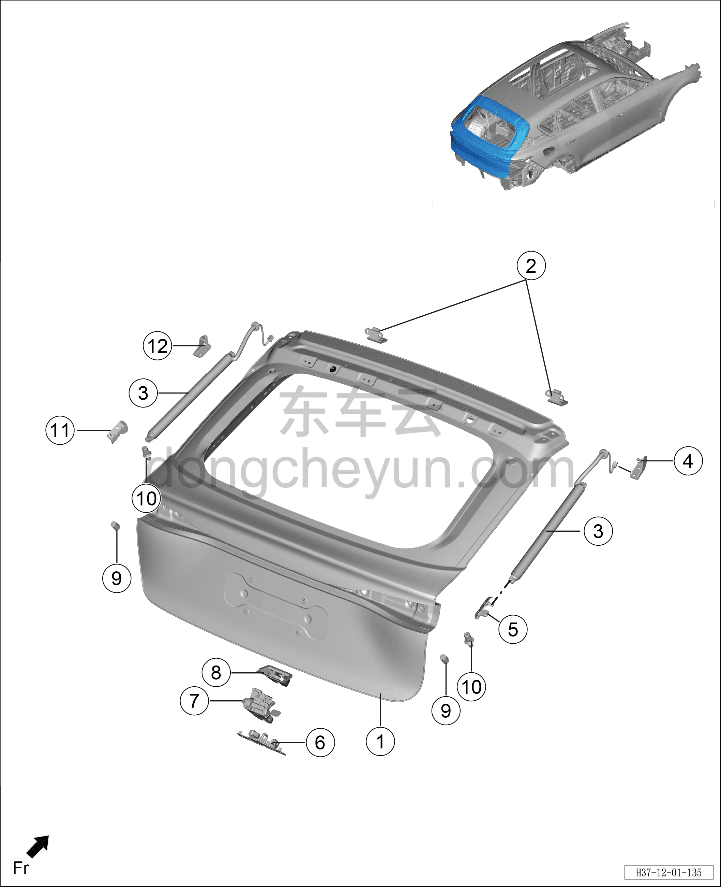

# Схема конструкции двери багажника

> Кузовные жестяные работы, окраска › Кузов в белом (BIW) в сборе › Покомпонентный вид (деталировка)  
> Оригинал: `背门结构图` · [dongcheyun 56746](https://dongcheyun.com/p/56746), страница `eff841abc608427889eab13f16fd3ed6` · [оглавление](../README.md)

**Примечание:**

**- Для определения того, какие детали продаются как запасные части, см. соответствующий каталог деталей в «Руководстве по деталям».**

| № | Наименование детали | Кол-во на автомобиль | Примечание |
|---|---|---|---|
| 1 | Узел деталей двери багажника в сборе | 1 |   |
| 2 | Узел петли двери багажника в сборе | 2 |   |
| 3 | Узел электропривода упора двери багажника в сборе | 2 |   |
| 4 | Узел верхнего кронштейна правого упора двери багажника в сборе | 1 |   |
| 5 | Узел нижнего кронштейна правого упора двери багажника в сборе | 1 |   |
| 6 | Ответная часть замка двери багажника в сборе | 1 |   |
| 7 | Замок двери багажника в сборе | 1 |   |
| 8 | Чехол замка двери багажника | 1 |   |
| 9 | Ограничитель двери багажника на кузове | 2 |   |
| 10 | Ограничитель двери багажника на двери | 2 |   |
| 11 | Узел нижнего кронштейна левого упора двери багажника в сборе | 2 |   |
| 12 | Узел верхнего кронштейна левого упора двери багажника в сборе | 1 |   |
