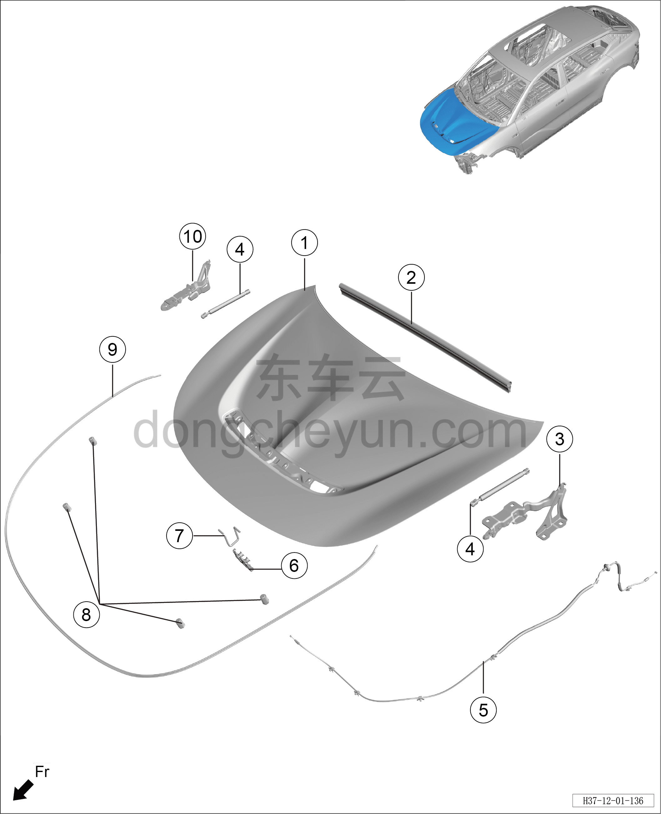

# Схема конструкции капота

> Кузовные жестяные работы, окраска › Кузов в белом (BIW) в сборе › Покомпонентный вид (деталировка)  
> Оригинал: `发动机罩结构图` · [dongcheyun 56746](https://dongcheyun.com/p/56746), страница `d744fb590467452da2427e2026d1f43f` · [оглавление](../README.md)

**Примечание:**

**- Для определения того, какие детали продаются как запасные части, см. соответствующий каталог деталей в «Руководстве по деталям».**

| № | Наименование детали | Кол-во на автомобиль | Примечание |
|---|---|---|---|
| 1 | Узел панели капота в сборе | 1 |   |
| 2 | Узел заднего уплотнителя капота в сборе | 1 |   |
| 3 | Узел левой петли капота в сборе | 1 |   |
| 4 | Пневматический упор капота | 2 |   |
| 5 | Трос замка капота | 1 |   |
| 6 | Замок капота | 1 |   |
| 7 | Ответная часть замка капота | 1 |   |
| 8 | Мягкая прокладка боковой стороны переднего моторного отсека | 4 |   |
| 9 | Узел переднего уплотнителя капота в сборе | 1 |   |
| 10 | Узел правой петли капота в сборе | 1 |   |
