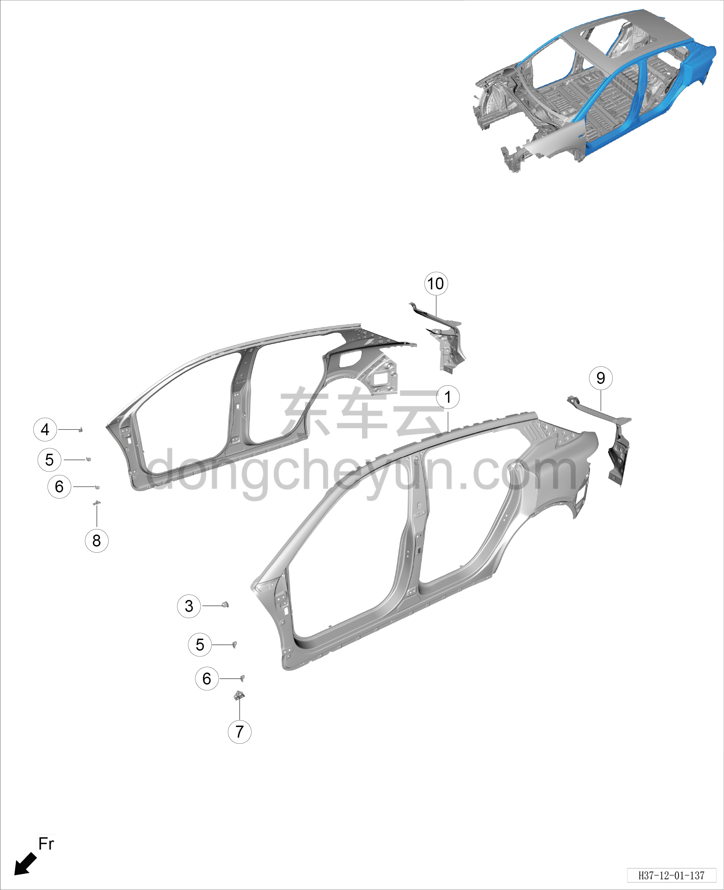

# Схема конструкции боковины

> Кузовные жестяные работы, окраска › Кузов в белом (BIW) в сборе › Покомпонентный вид (деталировка)  
> Оригинал: `侧围结构图` · [dongcheyun 56746](https://dongcheyun.com/p/56746), страница `661871133a0f414983643998e7c3f45b` · [оглавление](../README.md)

**Примечание:**

**- Для определения того, какие детали продаются как запасные части, см. соответствующий каталог деталей в «Руководстве по деталям».**

| № | Наименование детали | Кол-во на автомобиль | Примечание |
|---|---|---|---|
| 1 | Левая наружная панель боковины | 1 |   |
| 2 | Правая наружная панель боковины | 1 |   |
| 3 | Узел заднего верхнего кронштейна крепления левого переднего крыла | 1 |   |
| 4 | Узел заднего верхнего кронштейна крепления правого переднего крыла | 1 |   |
| 5 | Задний средний кронштейн крепления переднего крыла | 2 |   |
| 6 | Узел нижнего кронштейна крепления крыла | 2 |   |
| 7 | Узел переднего крепёжного кронштейна левого наружного обвеса | 1 |   |
| 8 | Узел переднего крепёжного кронштейна правого наружного обвеса | 1 |   |
| 9 | Узел левого заднего водосточного желоба в сборе | 1 |   |
| 10 | Узел правого заднего водосточного желоба в сборе | 1 |   |
