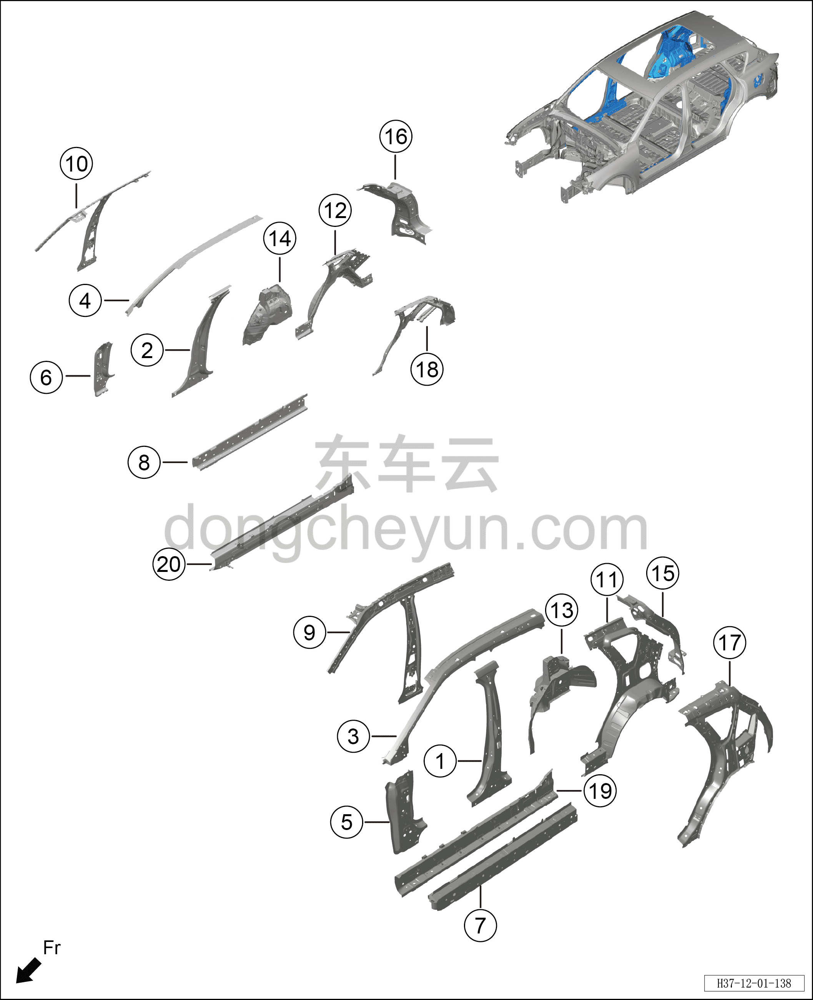

# Схема конструкции стоек кузова

> Кузовные жестяные работы, окраска › Кузов в белом (BIW) в сборе › Покомпонентный вид (деталировка)  
> Оригинал: `车身支柱结构图` · [dongcheyun 56746](https://dongcheyun.com/p/56746), страница `b7ed5bf383734c178cf525571cb8ead6` · [оглавление](../README.md)

**Примечание:**

**- Для определения того, какие детали продаются как запасные части, см. соответствующий каталог деталей в «Руководстве по деталям».**

| № | Наименование детали | Кол-во на автомобиль | Примечание |
|---|---|---|---|
| 1 | Узел усилительной панели каркаса левой стойки B в сборе | 1 |   |
| 2 | Узел усилительной панели каркаса правой стойки B в сборе | 1 |   |
| 3 | Узел верхней усилительной панели каркаса левой стойки A в сборе | 1 |   |
| 4 | Узел верхней усилительной панели каркаса правой стойки A в сборе | 1 |   |
| 5 | Узел нижней усилительной панели каркаса левой стойки A в сборе | 1 |   |
| 6 | Узел нижней усилительной панели каркаса правой стойки A в сборе | 1 |   |
| 7 | Узел левой усилительной панели порога в сборе | 1 |   |
| 8 | Узел правой усилительной панели порога в сборе | 1 |   |
| 9 | Узел левого заднего водосточного желоба в сборе | 1 |   |
| 10 | Узел правого заднего водосточного желоба в сборе | 1 |   |
| 11 | Узел левой внутренней панели боковины в сборе | 1 |   |
| 12 | Узел правой внутренней панели боковины в сборе | 1 |   |
| 13 | Узел внутренней панели левого заднего колёсного арки в сборе | 1 |   |
| 14 | Узел внутренней панели правого заднего колёсного арки в сборе | 1 |   |
| 15 | Узел левой внутренней панели стойки D в сборе | 1 |   |
| 16 | Узел правой внутренней панели стойки D в сборе | 1 |   |
| 17 | Узел левой усилительной панели задней боковины в сборе | 1 |   |
| 18 | Узел правой усилительной панели задней боковины в сборе | 1 |   |
| 19 | Узел внутренней панели порога в сборе (левой) | 1 |   |
| 20 | Узел внутренней панели порога в сборе (правой) | 1 |   |
