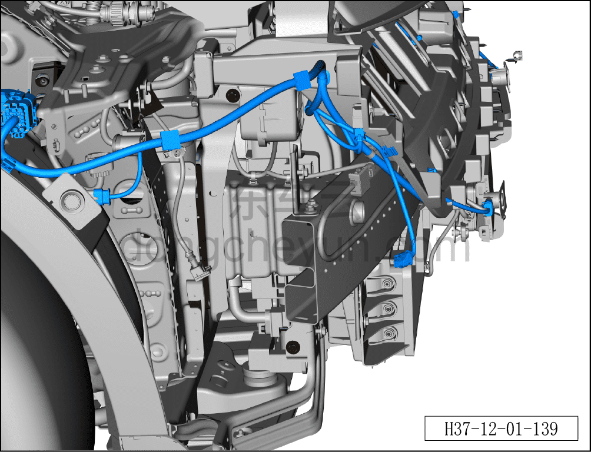
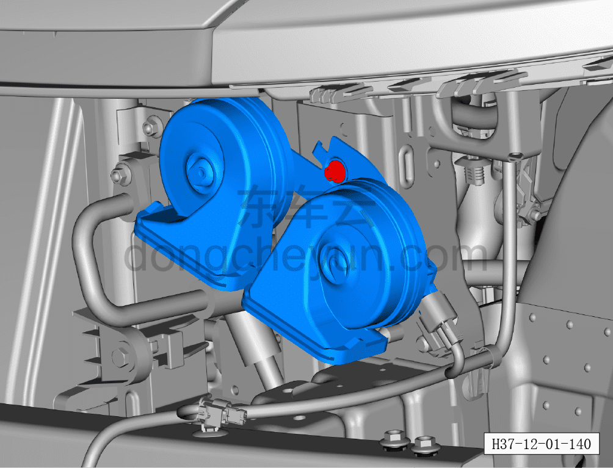
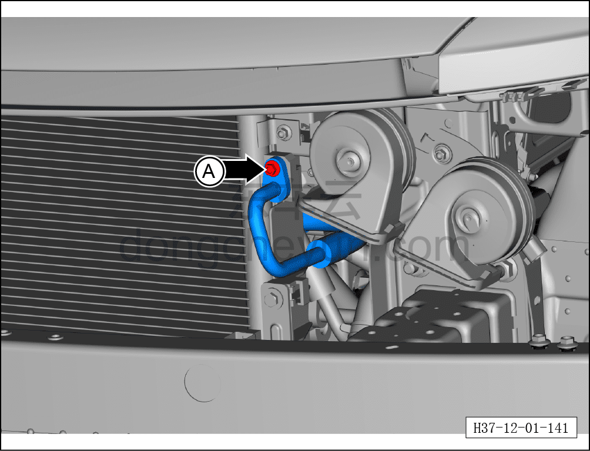
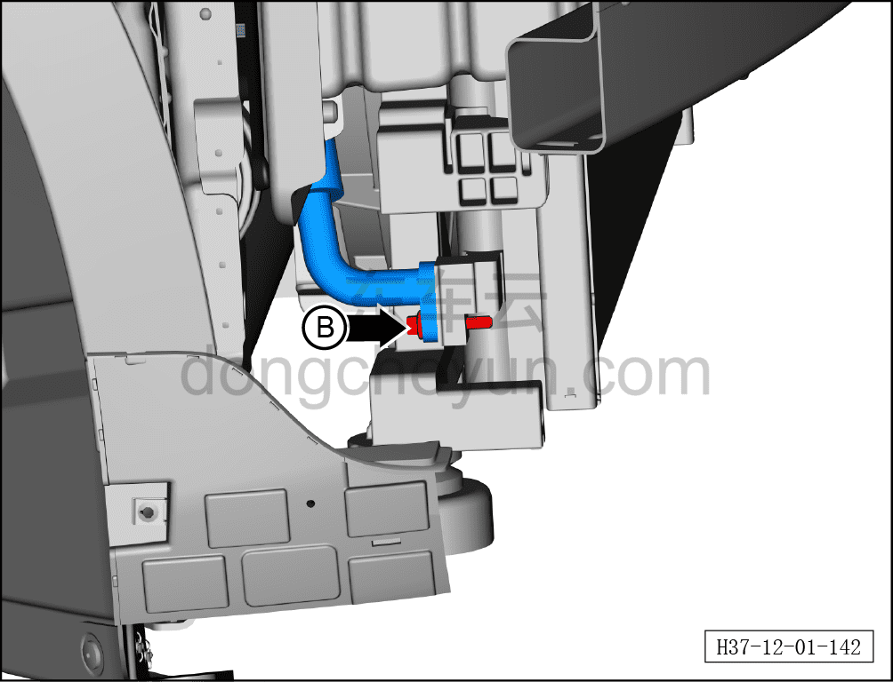
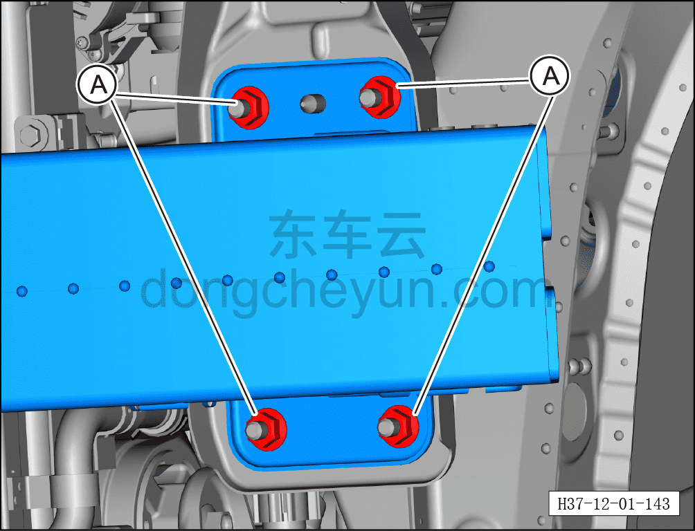
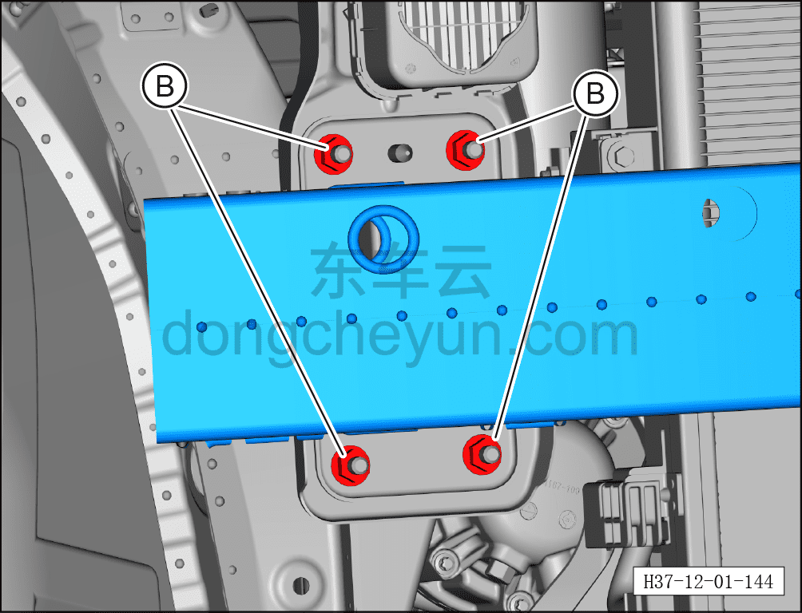

# Снятие и установка переднего противоударного бруса в сборе

> Кузовные жестяные работы, окраска › Кузов в белом (BIW) в сборе › Навесные элементы кузова  
> Оригинал: `拆卸与安装前防撞梁总成` · [dongcheyun 56746](https://dongcheyun.com/p/56746), страница `4a66440fb0fe462284b2d619e4d30c59` · [оглавление](../README.md)

**Порядок снятия**

**Примечание:**

**- При снятии переднего противоударного бруса в сборе необходимо тесное взаимодействие со вторым монтажником.**

1. Снимите передний бампер в сборе. См. [8.6.3.3 Снятие и установка переднего бампера в сборе](../08-внутренняя-и-внешняя-отделка/163-снятие-и-установка-переднего-бампера-в-сборе.md)

2. Снимите энергопоглощающий элемент переднего бампера. См. [8.6.3.21 Снятие и установка энергопоглощающего элемента переднего бампера](../08-внутренняя-и-внешняя-отделка/181-снятие-и-установка-энергопоглощающего-блока-переднего.md)

3. Снимите направляющую рамку радиатора. См. [8.6.3.22 Снятие и установка левой передней направляющей рамки активной решётки радиатора](../08-внутренняя-и-внешняя-отделка/182-снятие-и-установка-левого-переднего-направляющего.md)

4. Снимите кронштейн замка переднего модуля. См. [12.1.9.3 Снятие и установка кронштейна замка переднего модуля](036-снятие-и-установка-кронштейна-замка-переднего-модуля.md)

5. Извлеките хладагент. См. [10.1.6.12 Извлечение/вакуумирование/заправка хладагента](../10-кондиционер/045-сбор-вакуумирование-заправка-хладагента.md)

6. Снимите передний противоударный брус в сборе

a. Отсоедините клипсу, соединяющую передний противоударный брус в сборе с правым жгутом проводов моторного отсека в сборе.

b. Выверните 1 крепёжный болт, соединяющий передний противоударный брус в сборе с кронштейном звукового сигнала, аналогично с правой стороны.

c. Используя торцевую головку 10 мм, выверните крепёжную гайку A трубы выхода переднего испарителя в сборе.

d. Используя торцевую головку 10 мм, выверните крепёжную гайку B трубы входа переднего испарителя в сборе.

Момент затяжки гаек A, B: 7~9 Н·м

**Внимание:**

**– Загерметизируйте соединения трубопроводов.**

**– Замените уплотнительное кольцо O-ring в соединении трубопроводов на новое и нанесите на него масло для смазки компрессора кондиционера.**

**– Заправьте хладагент. См. [10.1.6.12 Извлечение/вакуумирование/заправка хладагента](../10-кондиционер/045-сбор-вакуумирование-заправка-хладагента.md)**

e. Выверните 4 крепёжных болта A, соединяющих передний противоударный брус в сборе с передней рамой.

Момент затяжки болтов: 40±6 Н·м

f. Выверните 2 крепёжных болта B, соединяющих передний противоударный брус в сборе с передней рамой. Момент затяжки болтов: 10±1 Н·м

g. Выверните 4 крепёжных болта C, соединяющих передний противоударный брус в сборе с передней рамой.

Момент затяжки болтов: 40±6 Н·м

h. Выверните 2 крепёжных болта D, соединяющих передний противоударный брус в сборе с передней рамой.

Момент затяжки болтов: 10±1 Н·м

i. Снимите передний противоударный брус в сборе①.

**Порядок установки**

Установка выполняется в обратном порядке.
