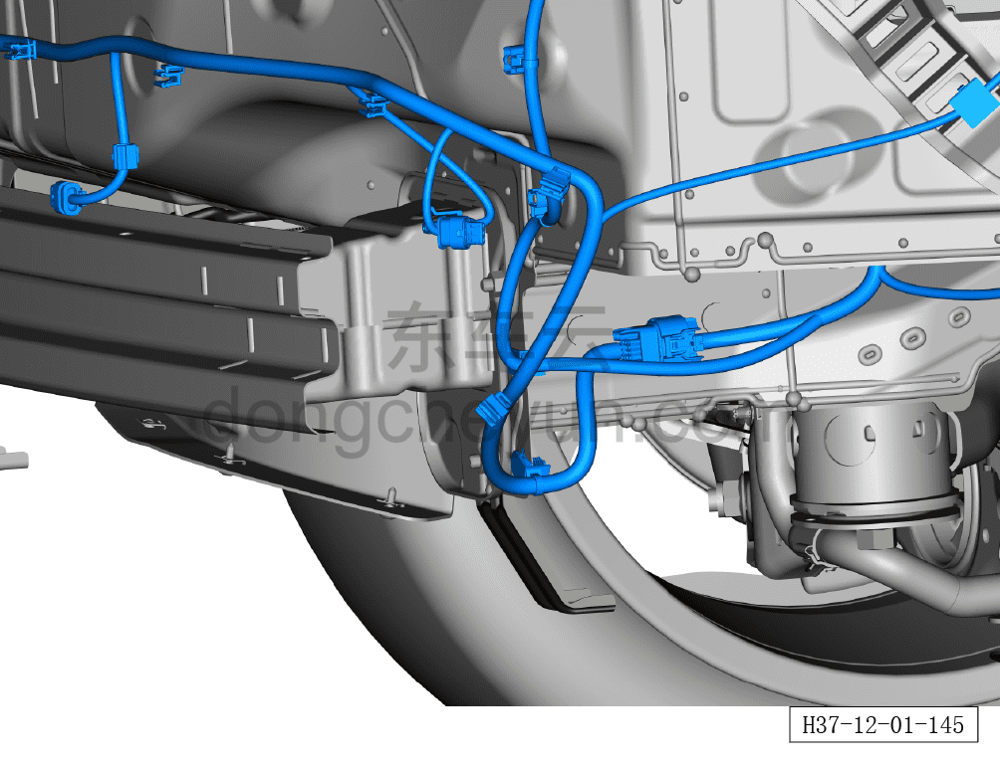
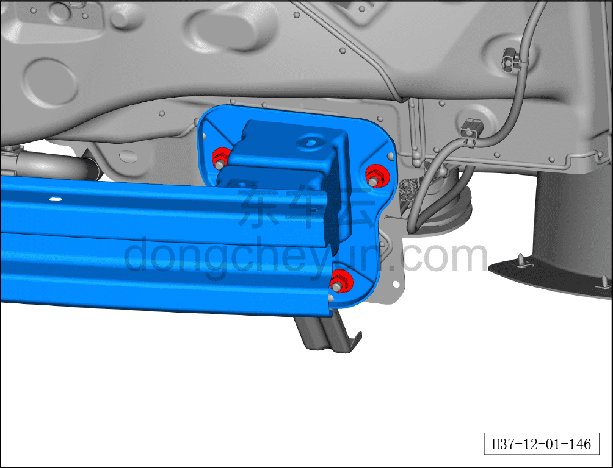
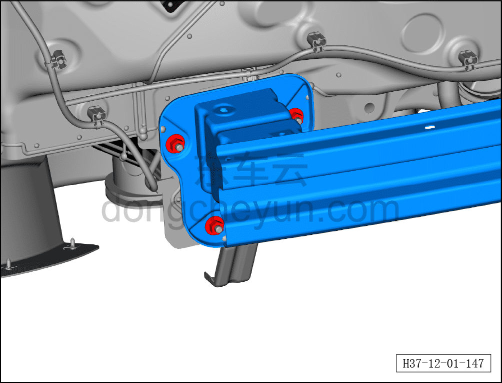

# Снятие и установка заднего противоударного бруса в сборе

> Кузовные жестяные работы, окраска › Кузов в белом (BIW) в сборе › Навесные элементы кузова  
> Оригинал: `拆卸与安装后防撞梁总成` · [dongcheyun 56746](https://dongcheyun.com/p/56746), страница `7b11242e9ee545ffa6241cf1f0685e47` · [оглавление](../README.md)

**Порядок снятия**

**Примечание:**

**- При снятии заднего противоударного бруса в сборе необходимо тесное взаимодействие со вторым монтажником.**

1. Снимите задний бампер в сборе. См. [8.6.3.26 Снятие и установка заднего бампера в сборе](../08-внутренняя-и-внешняя-отделка/186-снятие-и-установка-заднего-бампера-в-сборе.md)

2. Снимите задний противоударный брус в сборе.

a. Отсоедините 3 клипсы, соединяющие сварной узел заднего противоударного бруса в сборе с жгутом проводов кузова в сборе.

b. Выверните 3 крепёжные гайки, соединяющие сварной узел заднего противоударного бруса в сборе с наружной панелью задней поперечины заднего щита.

Момент затяжки гайки: 20±3 Н·м

c. Выверните 3 крепёжные гайки, соединяющие сварной узел заднего противоударного бруса в сборе с наружной панелью задней поперечины заднего щита.

Момент затяжки гайки: 20±3 Н·м

d. Снимите сварной узел заднего противоударного бруса в сборе①.

**Порядок установки**

Установка выполняется в обратном порядке.
