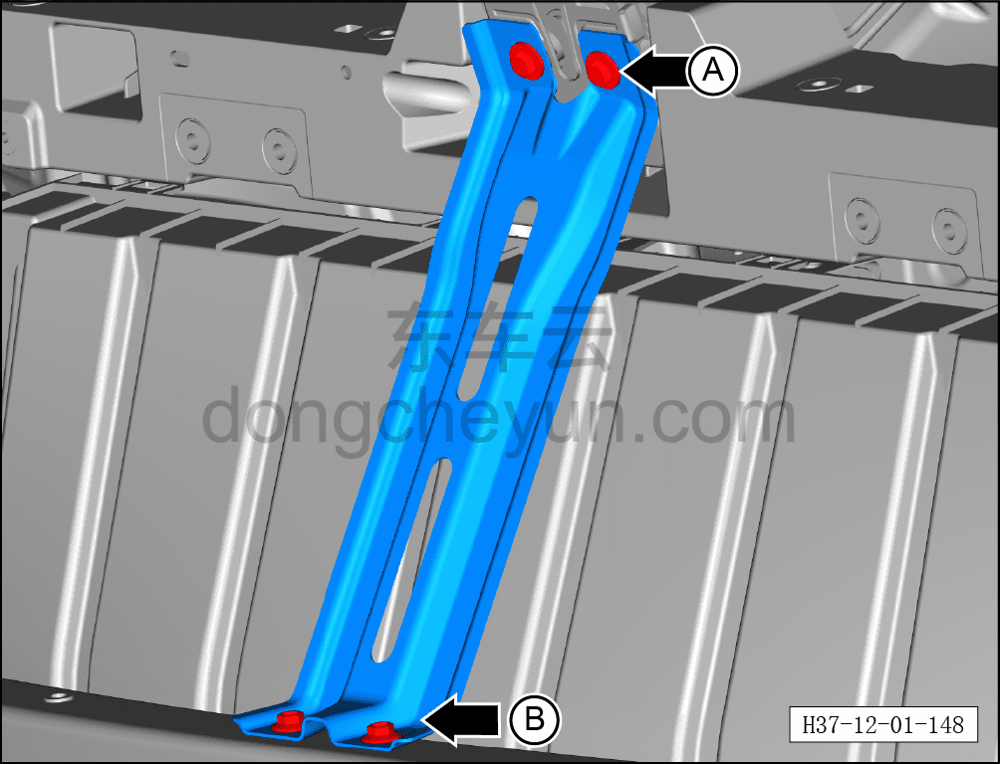

# Снятие и установка кронштейна замка переднего модуля

> Кузовные жестяные работы, окраска › Кузов в белом (BIW) в сборе › Навесные элементы кузова  
> Оригинал: `拆卸与安装前端模块锁支架` · [dongcheyun 56746](https://dongcheyun.com/p/56746), страница `db8d2546997d401dba0170ccfd5a8504` · [оглавление](../README.md)

**Порядок снятия**

1. Снимите переднюю центральную декоративную накладку моторного отсека. См. [8.6.6.10 Снятие и установка декоративной накладки моторного отсека](../08-внутренняя-и-внешняя-отделка/223-снятие-и-установка-декоративной-накладки-моторного.md)

2. Снимите передний бампер в сборе. См. [8.6.3.3 Снятие и установка переднего бампера в сборе](../08-внутренняя-и-внешняя-отделка/163-снятие-и-установка-переднего-бампера-в-сборе.md)

3. Снимите кронштейн замка переднего модуля.

a. Выверните 2 верхних крепёжных болта A кронштейна замка переднего модуля.

Момент затяжки болтов: 20±3 Н·м

b. Выверните 2 нижних крепёжных болта B кронштейна замка переднего модуля.

Момент затяжки болтов: 10±3 Н·м

c. Снимите кронштейн замка переднего модуля①

**Порядок установки**

Установка выполняется в обратном порядке.
