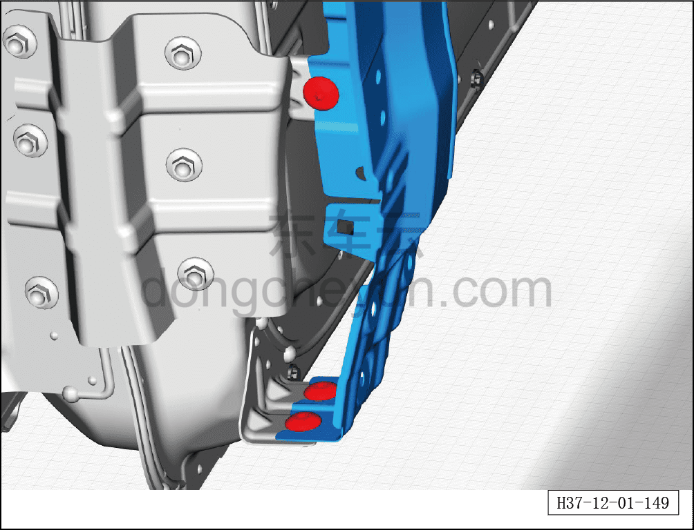
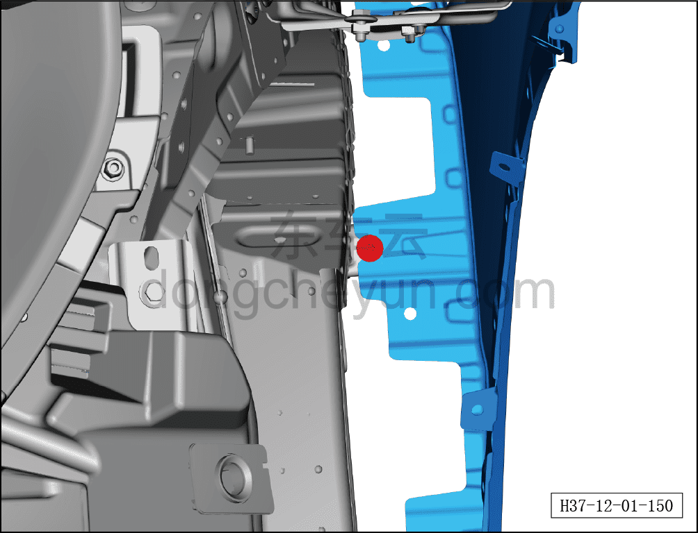
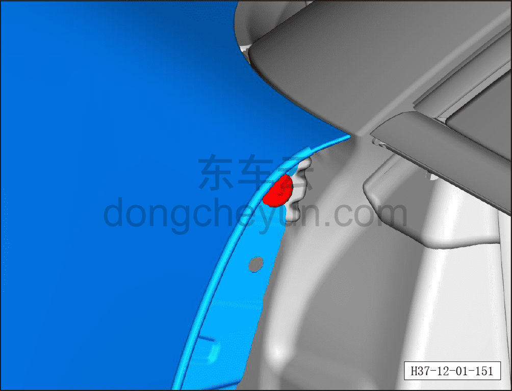
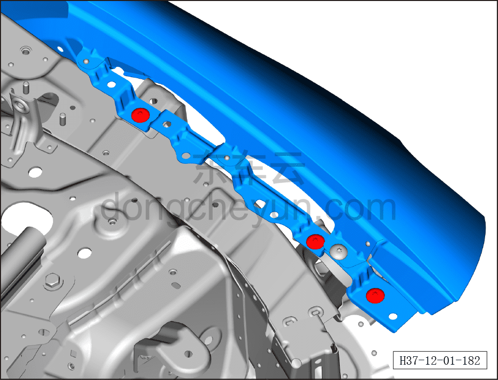

# Снятие и установка переднего крыла в сборе

> Кузовные жестяные работы, окраска › Кузов в белом (BIW) в сборе › Навесные элементы кузова  
> Оригинал: `拆卸与安装前翼子板总成` · [dongcheyun 56746](https://dongcheyun.com/p/56746), страница `6c32156fa685464d8989a96b053d14ff` · [оглавление](../README.md)

**Порядок снятия**

**Примечание:**

**- Ниже описывается снятие и установка левого переднего крыла в сборе, для правой стороны действуйте по аналогии с левой**

1. Снимите передний бампер в сборе. См. [8.6.3.3 Снятие и установка переднего бампера в сборе](../08-внутренняя-и-внешняя-отделка/163-снятие-и-установка-переднего-бампера-в-сборе.md)

2. Снимите левую переднюю фару. См. [9.9.3.2 Снятие и установка передней фары (левой)](../09-электрическая-и-электронная-система/078-снятие-и-установка-фары-левой.md)

3. Снимите левый подкрылок переднего колеса в сборе. См. [8.6.4.1 Снятие и установка левого подкрылка переднего колеса](../08-внутренняя-и-внешняя-отделка/191-снятие-и-установка-левого-подкрылка-передней-колёсной.md)

4. Снимите левый декоративный элемент стыка в сборе. См. [8.6.6.11 Снятие и установка декоративной накладки левого крыла](../08-внутренняя-и-внешняя-отделка/224-снятие-и-установка-декоративной-накладки-левого-крыла.md)

5. Снимите корпус левой нижней декоративной панели порога. См. [8.6.6.6 Снятие и установка левой нижней декоративной панели порога](../08-внутренняя-и-внешняя-отделка/219-снятие-и-установка-левой-нижней-накладки-порога.md)

6. Снимите защитную накладку камеры левого крыла в сборе. См. [8.6.6.16 Снятие и установка защитной накладки камеры левого крыла](../08-внутренняя-и-внешняя-отделка/229-снятие-и-установка-защитной-накладки-камеры-левого.md)

7. Снимите левое переднее крыло в сборе.

a. Выверните 4 крепёжных болта левого переднего крыла в сборе.

Момент затяжки болта: 8±1 Н·м

b. Выверните 3 крепёжных болта левого переднего крыла в сборе.

Момент затяжки болта: 8±1 Н·м

c. Снимите левую переднюю дверь в сборе. См. [7.2.3.1 Снятие и установка левой передней двери](../07-открывающиеся-элементы-кузова/012-снятие-и-установка-левой-передней-двери.md)

d. Выверните 1 крепёжный винт левого переднего крыла в сборе.

Момент затяжки винта: 8±1 Н·м

e. Выверните 3 крепёжных винта левого переднего крыла в сборе.

Момент затяжки винта: 8±1 Н·м

f. Снимите левое переднее крыло в сборе.

**Порядок установки**

Установка выполняется в обратном порядке.
