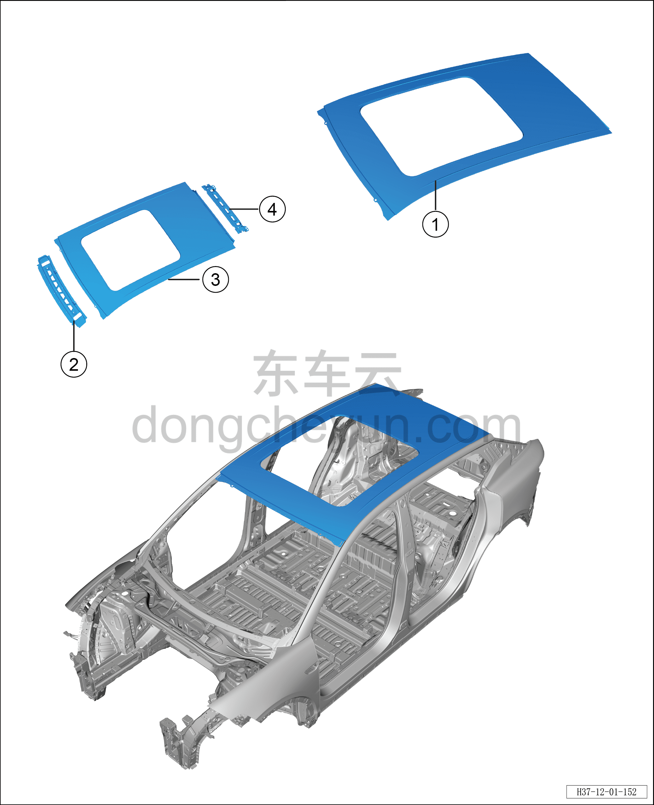
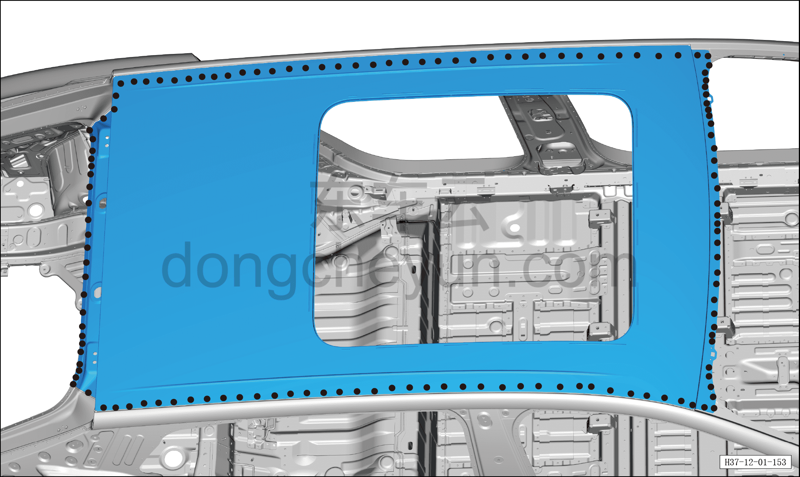
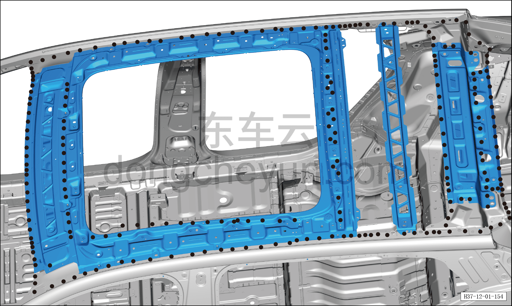
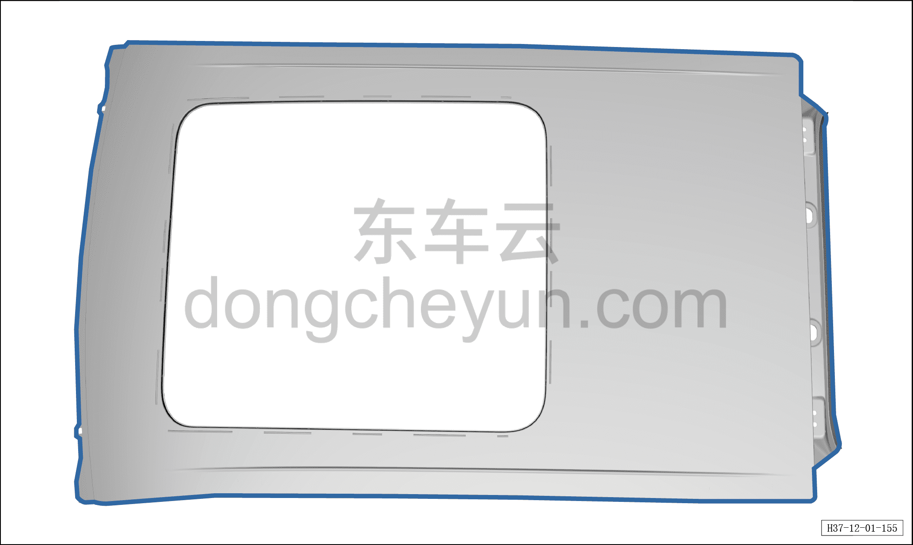
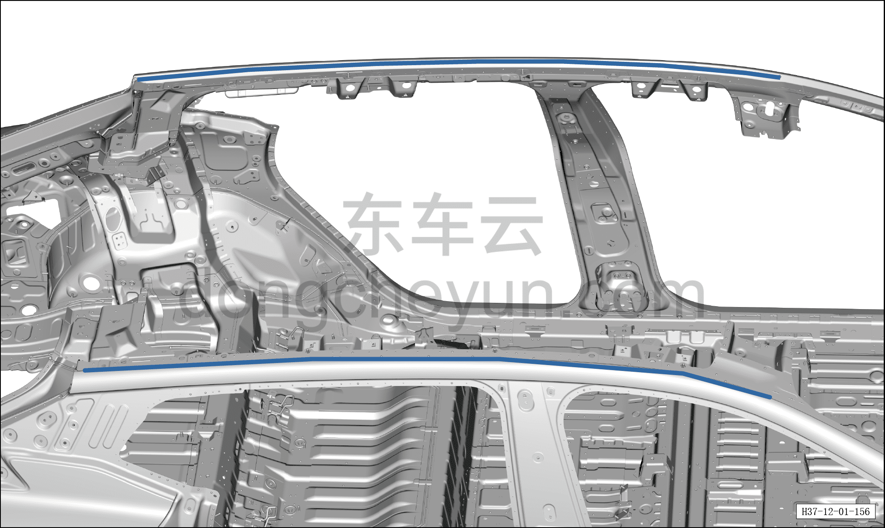
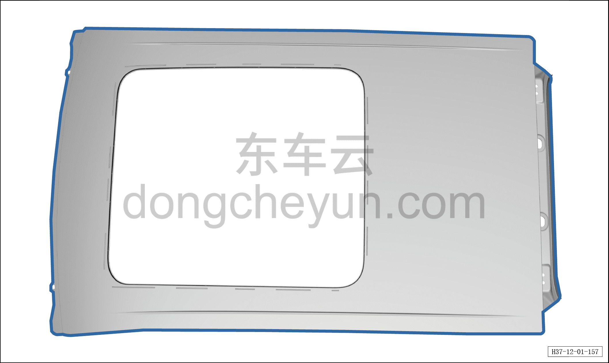
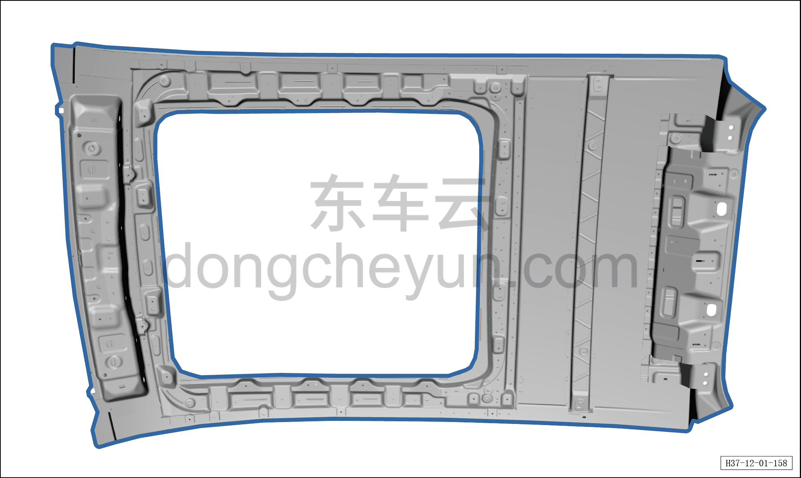
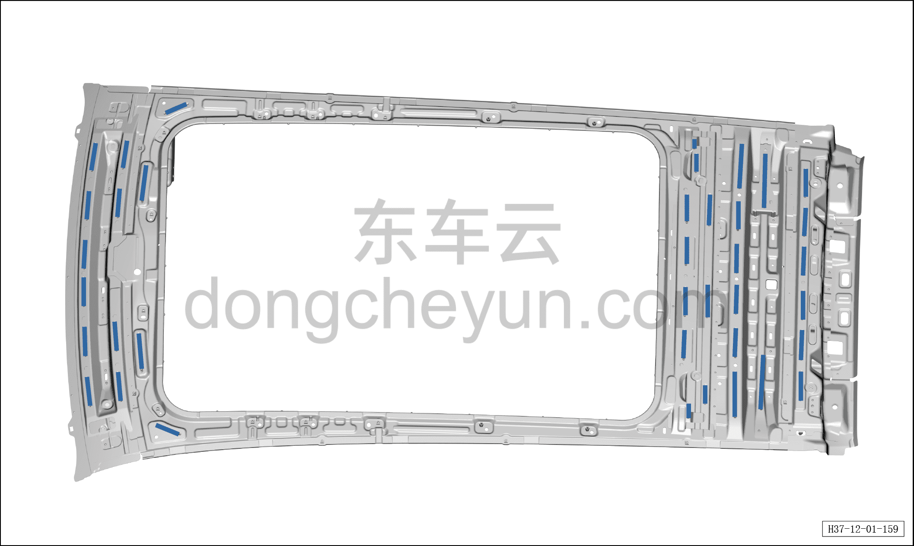
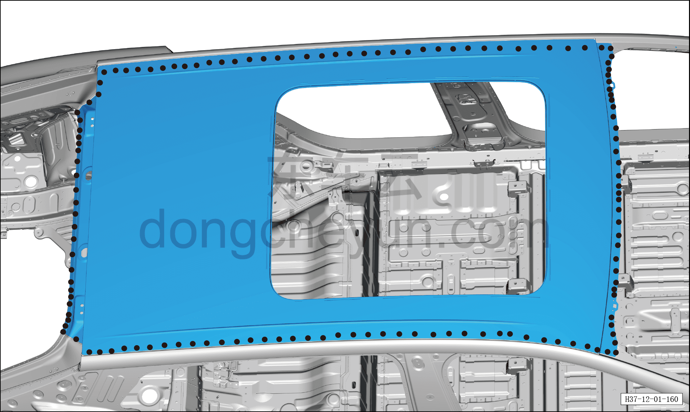
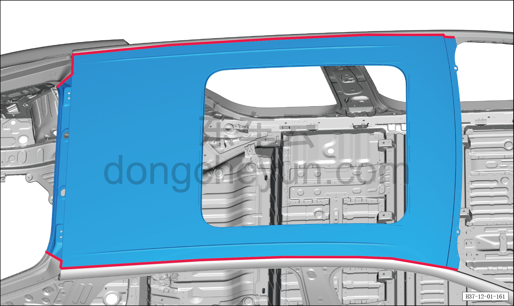

# Замена обивки потолка

> Кузовные жестяные работы, окраска › Кузов в белом (BIW) в сборе › Навесные элементы кузова  
> Оригинал: `顶棚更换` · [dongcheyun 56746](https://dongcheyun.com/p/56746), страница `de90ede1768d46d0890ec87a662f00ee` · [оглавление](../README.md)

1. Заменяемые детали и запасные части

| № | Наименование детали | Кол-во на автомобиль | Примечание |
|---|---|---|---|
| 1 | Крыша в сборе | 1 |   |
| 2 | Наружная панель передней поперечины крыши | 1 |   |
| 3 | Усилительное кольцо люка крыши | 1 |   |
| 4 | Наружная панель задней поперечины крыши | 1 |   |

2. Разделение точек сварки

a. Как показано на рисунке, разделите точки сварки сверлом для удаления точечной сварки диаметром Φ=8 мм, отделите точки сварки плоским зубилом, снимите крышу.

b. Как показано на рисунке, разделите точки сварки сверлом для удаления точечной сварки диаметром Φ=8 мм, отделите точки сварки плоским зубилом, снимите переднюю поперечину крыши и заднюю поперечину крыши.

c. Как показано на рисунке, разделите точки сварки сверлом для удаления точечной сварки диаметром Φ=8 мм, отделите точки сварки плоским зубилом.

3. Подготовка кузова

a. Как показано на рисунке, выровняйте кромку соединительной поверхности кузовной панели и крыши, зашлифуйте грунт электрической металлической щёткой, нанесите токопроводящее сварочное покрытие C7.

4. Подготовка запасной части

a. Выровняйте соединительную поверхность крыши и кузова, зашлифуйте грунт электрической металлической щёткой, нанесите токопроводящее сварочное покрытие C7.

b. Выровняйте соединительные поверхности передней поперечины крыши, усилительного кольца люка в сборе, второй средней поперечины крыши, третьей средней поперечины крыши, внутренней панели задней поперечины крыши с кузовом, зашлифуйте грунт электрической металлической щёткой, нанесите токопроводящее сварочное покрытие C7.

5. Сварка

a. Равномерно нанесите необходимое количество виброгасящего клея в местах, отмеченных линиями на рисунке.

6. Герметизация и защита

b. Совместите крышу с кузовом, зафиксируйте зажимными клещами для кузовных панелей, выполните сварку в местах сварки и зашлифуйте сварные швы.

a. Как показано на рисунке, нанесите герметик A1 по линии, а некачественную полосу герметика подровняйте кистью, чтобы закрыть сварной шов.
