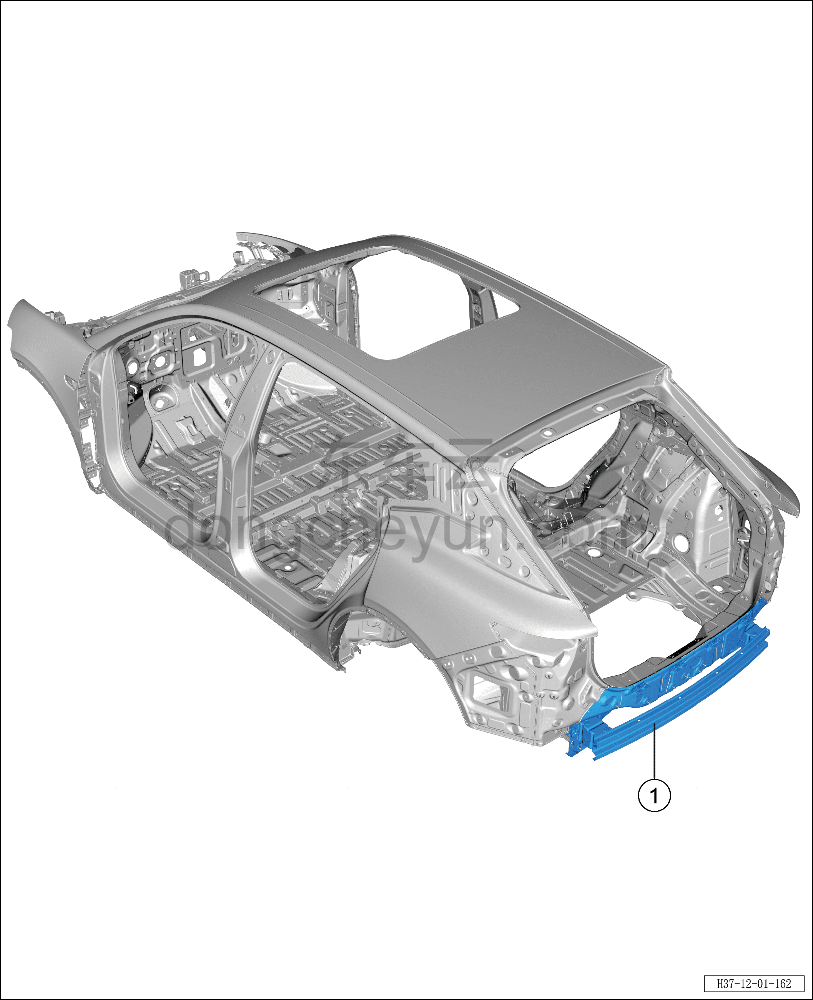
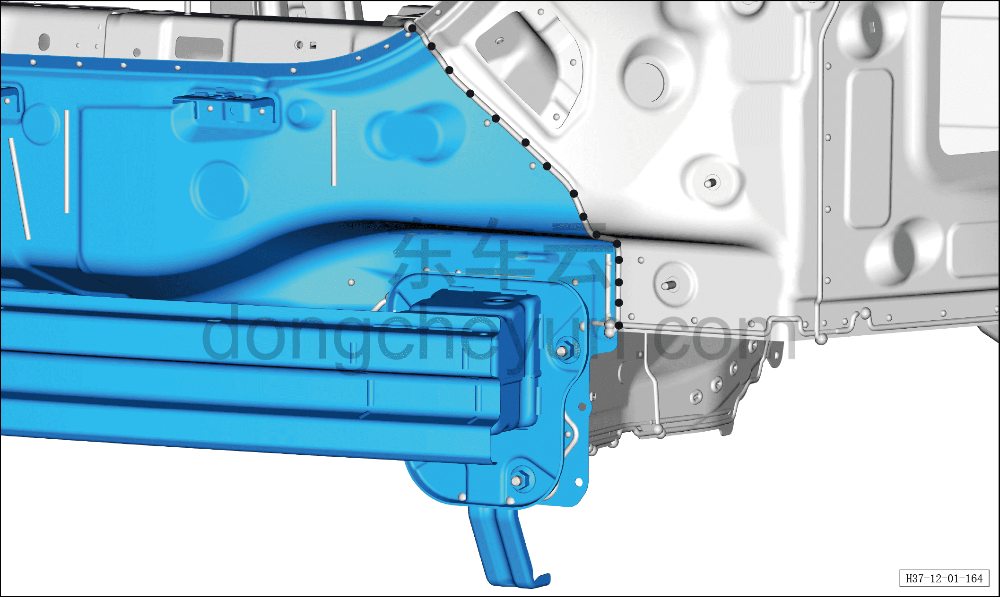
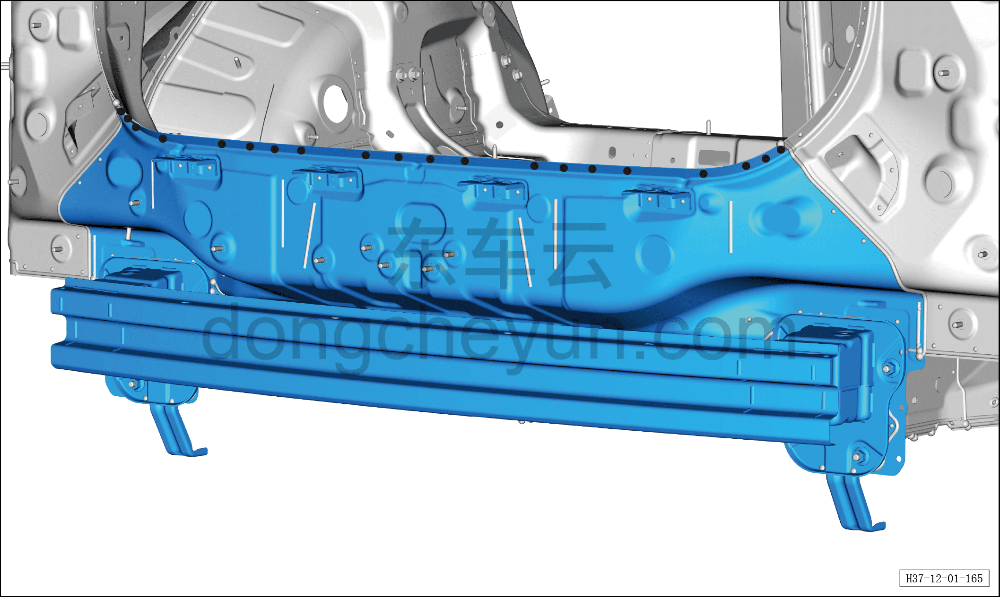
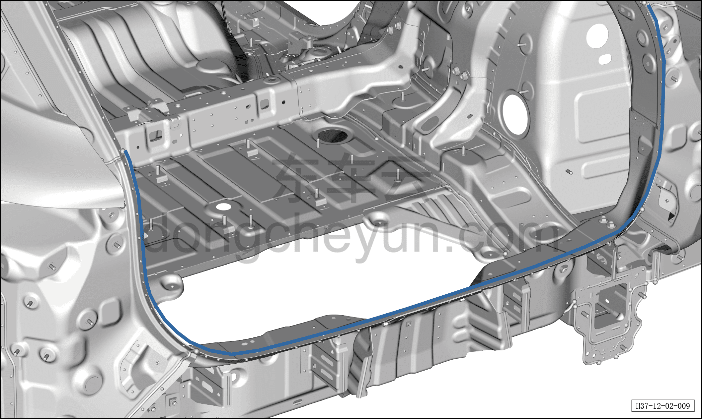
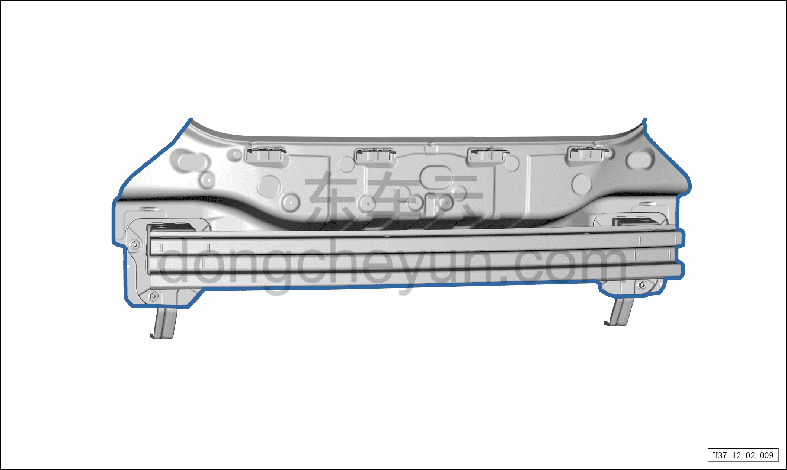
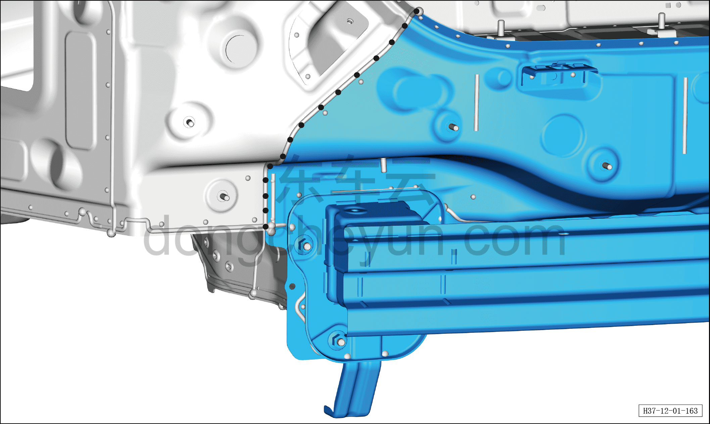
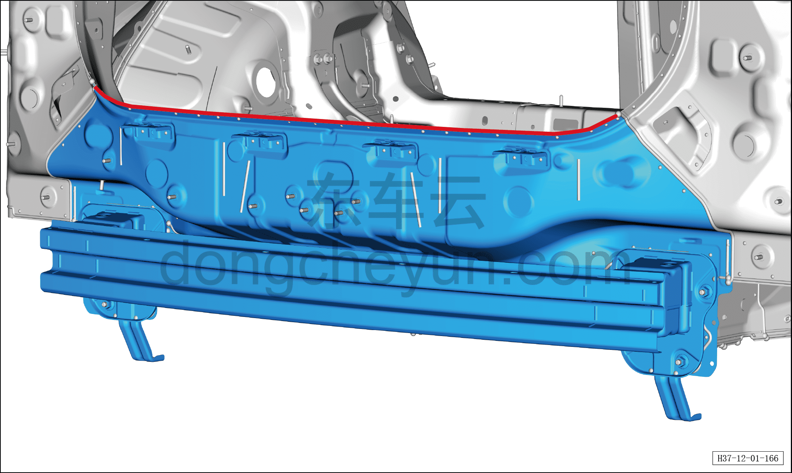

# Замена панели заднего щита в сборе

> Кузовные жестяные работы, окраска › Кузов в белом (BIW) в сборе › Навесные элементы кузова  
> Оригинал: `后围板总成更换` · [dongcheyun 56746](https://dongcheyun.com/p/56746), страница `ee853fae48a146bf9dc0524b49a85e46` · [оглавление](../README.md)

1. Заменяемые детали и запасные части

| № | Наименование детали | Кол-во на автомобиль | Примечание |
|---|---|---|---|
| 1 | Узел деталей двери багажника в сборе | 1 |   |

2. Разделение точек сварки

a. Как показано на рисунке, разделите точки сварки сверлом для удаления точечной сварки диаметром Φ=8 мм, отделите точки сварки плоским зубилом.

b. Как показано на рисунке, разделите точки сварки сверлом для удаления точечной сварки диаметром Φ=8 мм, отделите точки сварки плоским зубилом.

c. Как показано на рисунке, разделите точки сварки сверлом для удаления точечной сварки диаметром Φ=8 мм, отделите точки сварки плоским зубилом, снимите задний щит.

3. Подготовка кузова

a. Как показано на рисунке, выровняйте соединительную поверхность кузовной панели и узла переднего щита с поперечиной щита в сборе, зашлифуйте грунт электрической металлической щёткой, нанесите токопроводящее сварочное покрытие C7.

4. Подготовка запасной части

a. Выровняйте соединительную поверхность крыши и кузова, зашлифуйте грунт электрической металлической щёткой, нанесите токопроводящее сварочное покрытие C7.

b. Совместите узел переднего щита с поперечиной щита в сборе с кузовом, зафиксируйте зажимными клещами для кузовных панелей, выполните сварку в местах сварки и зашлифуйте сварные швы.

5. Сварка

a. Выполните сварку в местах сварки и зашлифуйте сварные швы.

b. Выполните сварку в местах сварки и зашлифуйте сварные швы.

5. Герметизация и защита

a. Как показано на рисунке, нанесите герметик A1 по линии, а некачественную полосу герметика подровняйте кистью, чтобы закрыть сварной шов.
