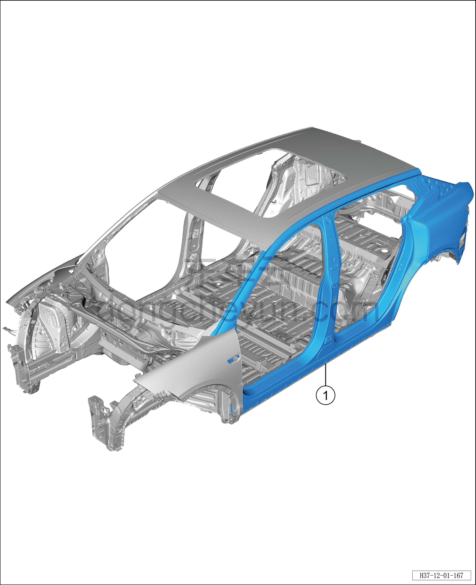
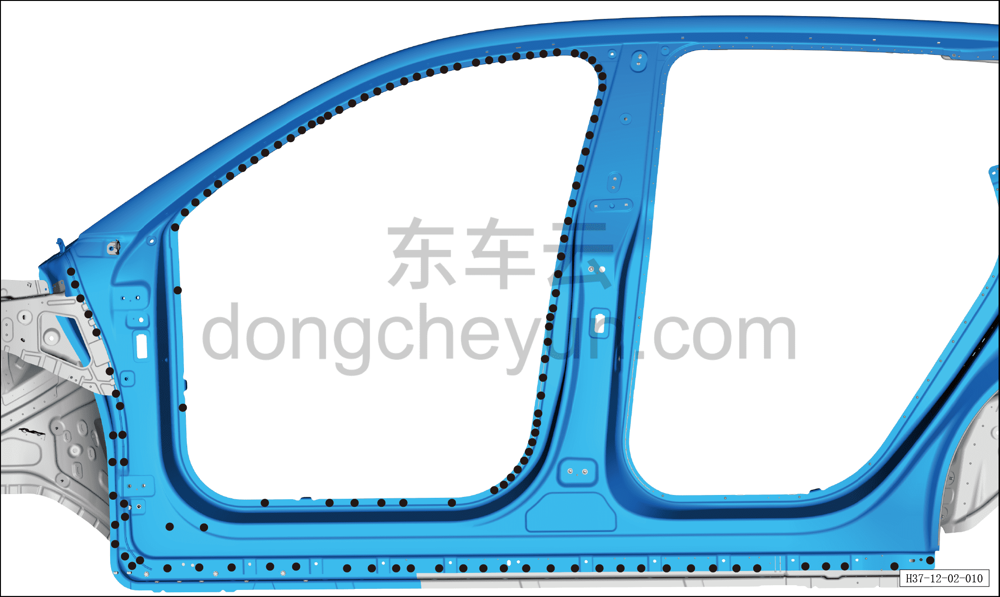
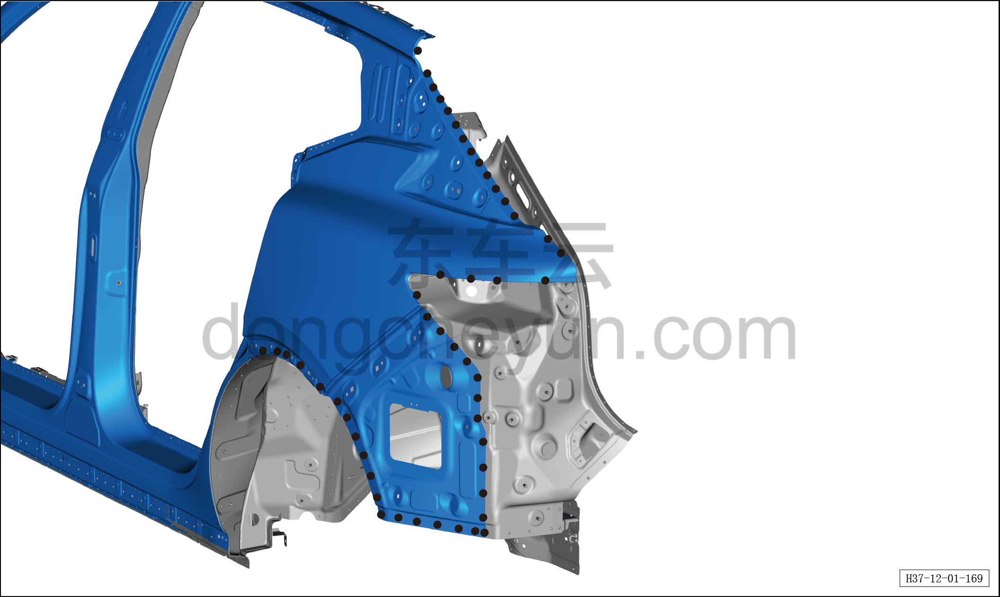
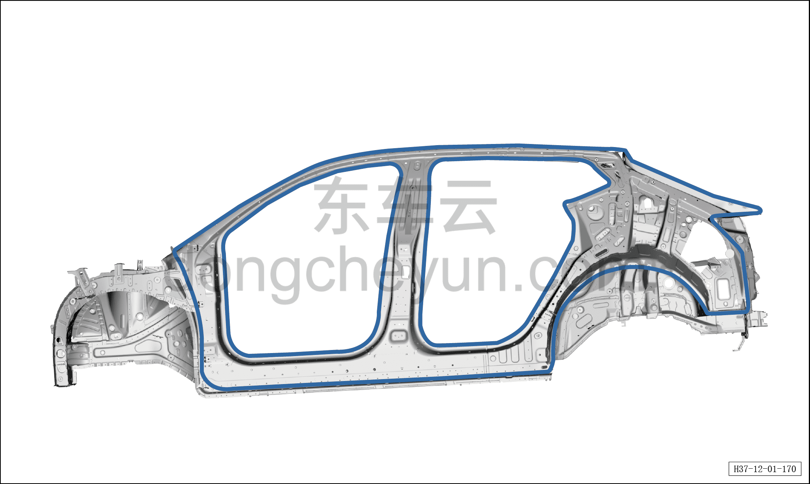
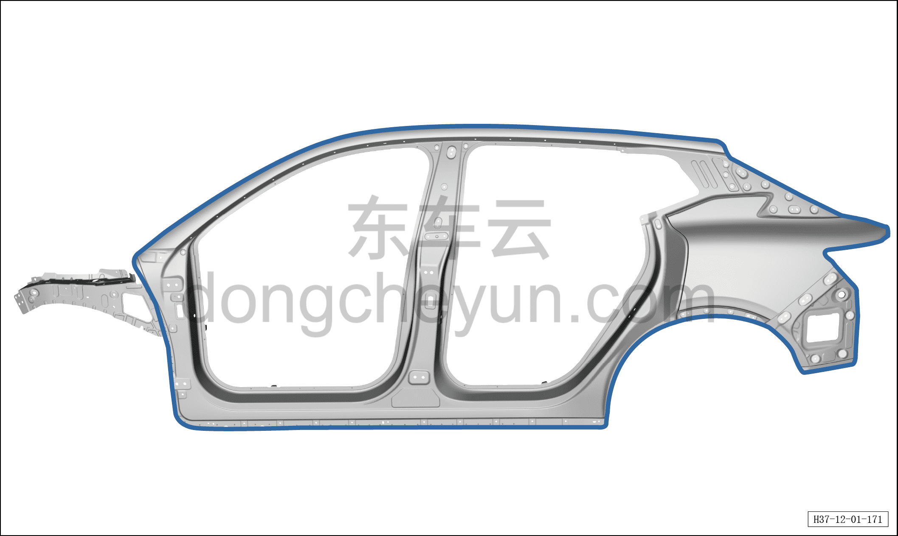
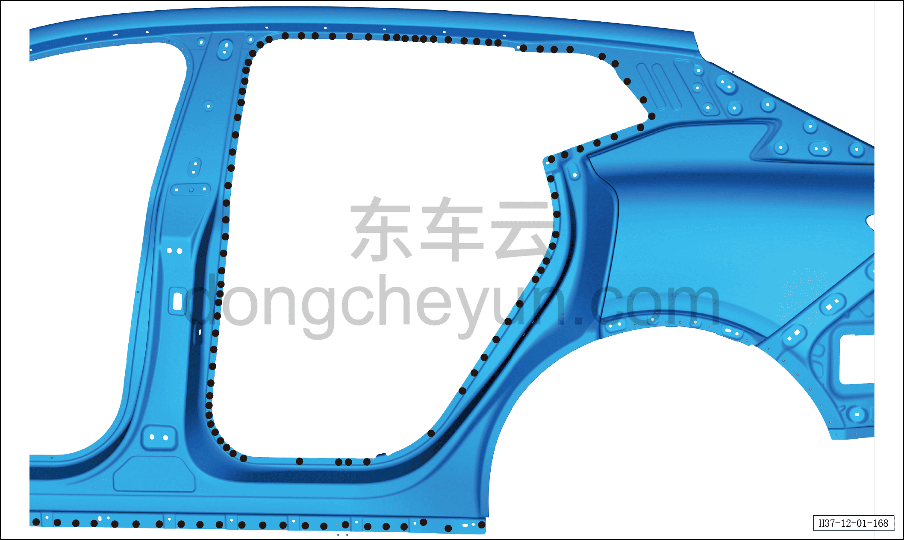
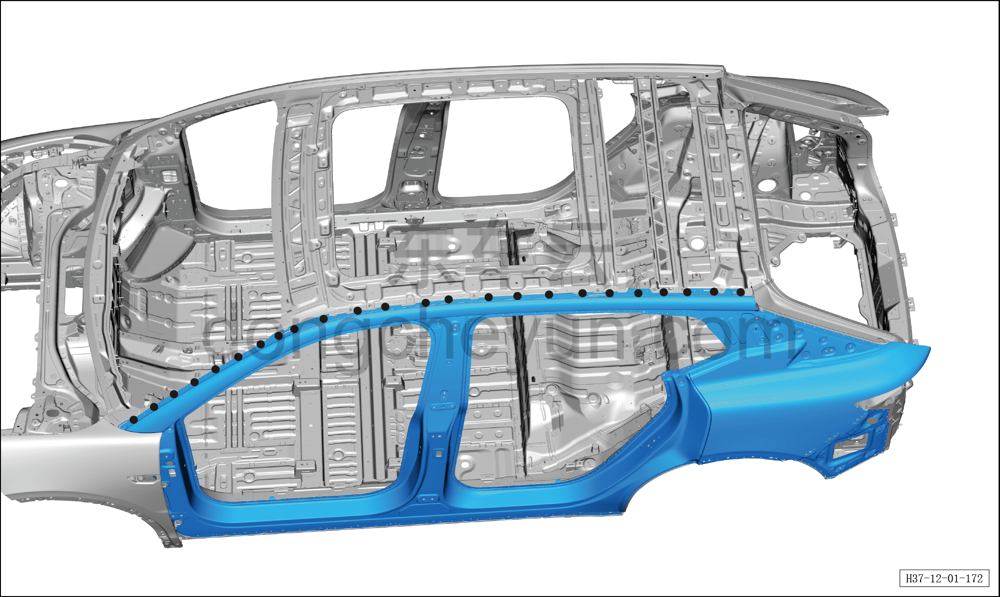
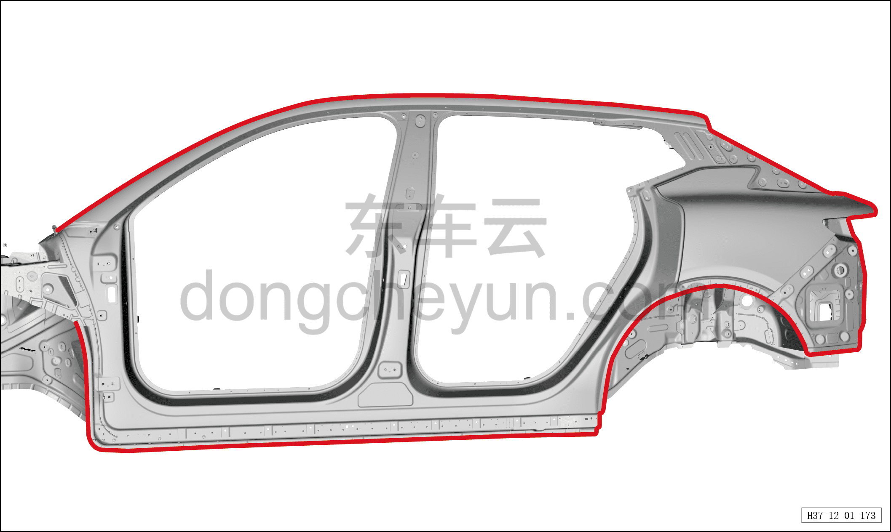

# Замена наружной панели боковины в сборе

> Кузовные жестяные работы, окраска › Кузов в белом (BIW) в сборе › Навесные элементы кузова  
> Оригинал: `侧围外板总成更换` · [dongcheyun 56746](https://dongcheyun.com/p/56746), страница `e85b77dbffb54b9b8f1e409295f56301` · [оглавление](../README.md)

1. Заменяемые детали и запасные части

| № | Наименование детали | Кол-во на автомобиль | Примечание |
|---|---|---|---|
| 1 | Наружная панель боковины в сборе | 1 |   |

2. Разделение точек сварки

a. Как показано на рисунке, разделите точки сварки сверлом для удаления точечной сварки диаметром Φ=8 мм, отделите точки сварки плоским зубилом.

b. Как показано на рисунке, разделите точки сварки сверлом для удаления точечной сварки диаметром Φ=8 мм, отделите точки сварки плоским зубилом.

c. Как показано на рисунке, разделите точки сварки сверлом для удаления точечной сварки диаметром Φ=8 мм, отделите точки сварки плоским зубилом, снимите наружную панель боковины в сборе.

3. Подготовка кузова

a. Как показано на рисунке, выровняйте кромку соединительной поверхности кузовной панели и крыши, зашлифуйте грунт электрической металлической щёткой, нанесите токопроводящее сварочное покрытие C7.

4. Подготовка запасной части

a. Как показано на рисунке, выровняйте соединительную поверхность кузовной панели и наружной панели боковины в сборе, зашлифуйте грунт электрической металлической щёткой, нанесите токопроводящее сварочное покрытие C7.

5. Сварка

a. Совместите наружную панель боковины в сборе с кузовом, зафиксируйте зажимными клещами для кузовных панелей, выполните сварку в местах сварки и зашлифуйте сварные швы.

b. Выполните сварку в местах сварки и зашлифуйте сварные швы.

c. Выполните сварку в местах сварки и зашлифуйте сварные швы.

a. Как показано на рисунке, нанесите герметик A1 по линии, обозначенной штрихом, а некачественную полосу герметика подровняйте кистью, чтобы закрыть сварной шов. Установите обивку потолка.

См. [12.1.9.5 Замена обивки потолка](038-замена-обивки-потолка.md)
