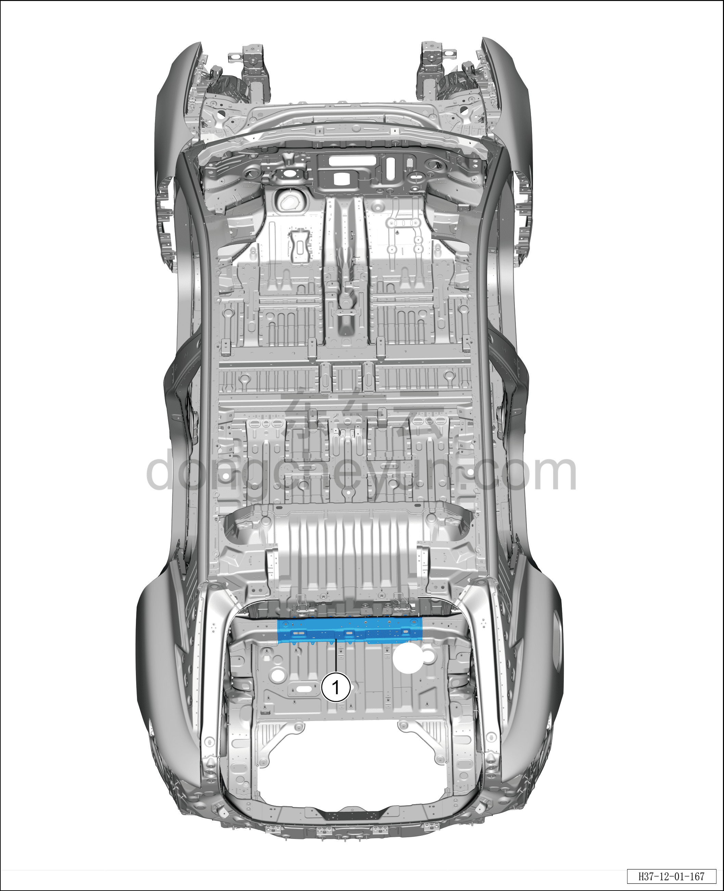
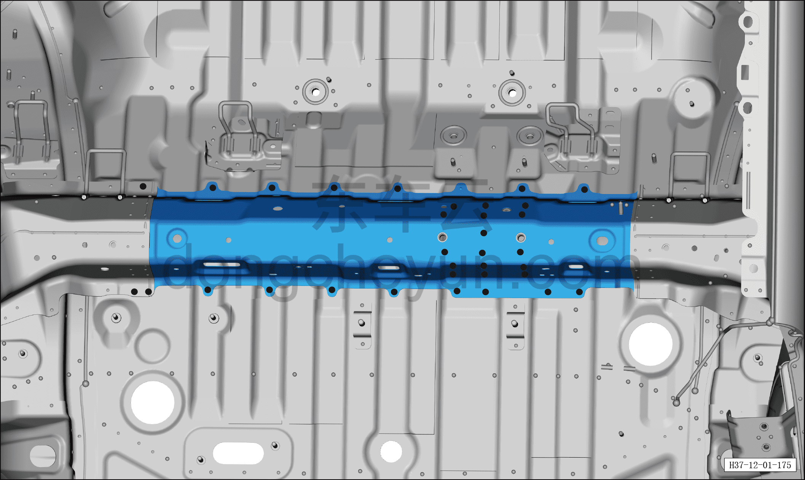
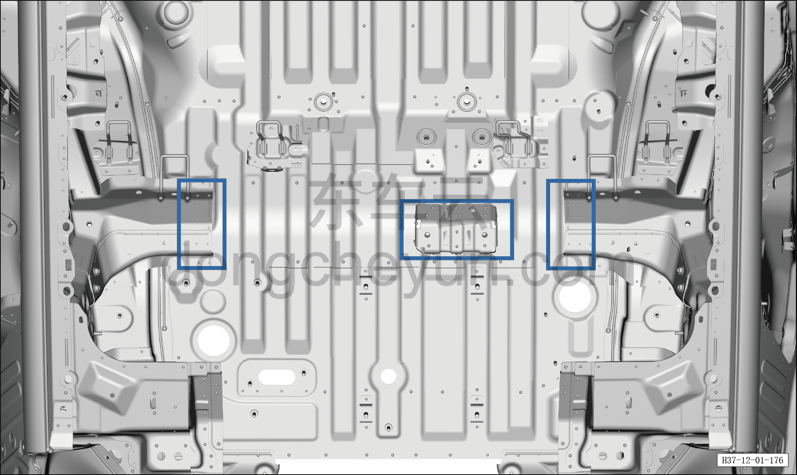
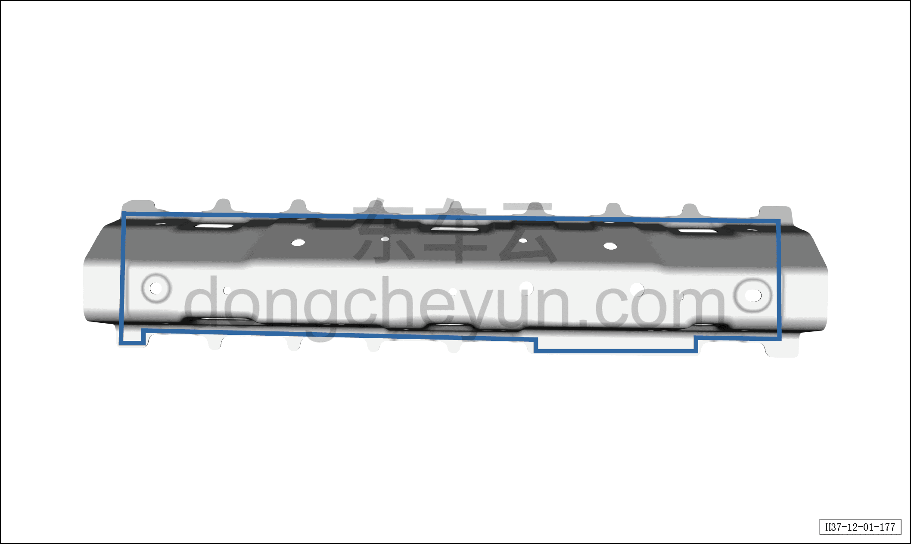
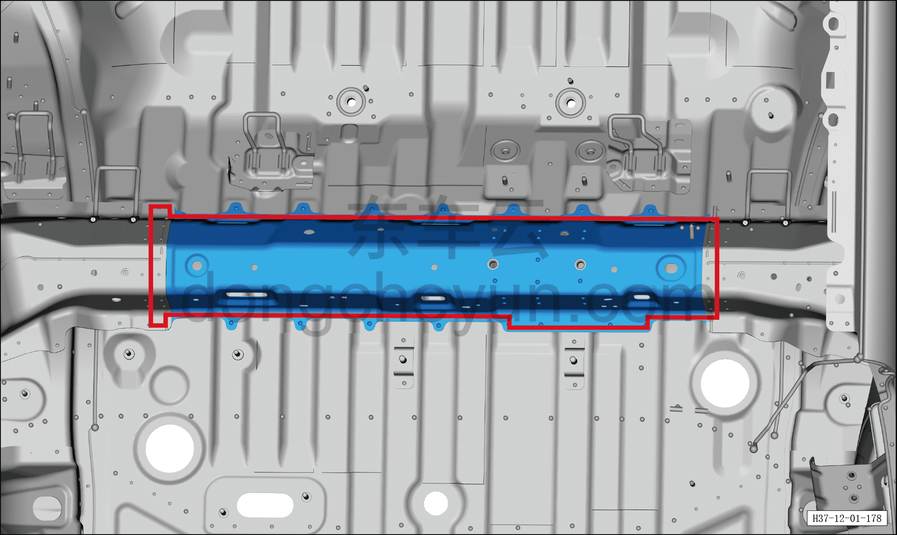

# Замена узла задней поперечины пола с кронштейном в сборе

> Кузовные жестяные работы, окраска › Кузов в белом (BIW) в сборе › Навесные элементы кузова  
> Оригинал: `后地板中横梁带支架总成更换` · [dongcheyun 56746](https://dongcheyun.com/p/56746), страница `65d46c0aaf314db3bae00e9f91b66cc9` · [оглавление](../README.md)

1. Заменяемые детали и запасные части

| № | Наименование детали | Кол-во на автомобиль | Примечание |
|---|---|---|---|
| 1 | Узел задней поперечины пола с кронштейном в сборе | 1 |   |

2. Разделение точек сварки

a. Как показано на рисунке, разделите точки сварки сверлом для удаления точечной сварки диаметром Φ=8 мм, отделите точки сварки плоским зубилом.

3. Подготовка кузова

a. Как показано на рисунке, выровняйте кромку соединительной поверхности кузовной панели и крыши, зашлифуйте грунт электрической металлической щёткой, нанесите токопроводящее сварочное покрытие C7.

4. Подготовка запасной части

a. Выровняйте соединительную поверхность крыши и кузова, зашлифуйте грунт электрической металлической щёткой, нанесите токопроводящее сварочное покрытие C7.

5. Сварка

a. Совместите узел задней поперечины пола с кронштейном в сборе с кузовом, зафиксируйте зажимными клещами для кузовных панелей, выполните сварку в местах сварки и зашлифуйте сварные швы.

6. Герметизация и защита

a. Как показано на рисунке, нанесите герметик A1 по линии, а некачественную полосу герметика подровняйте кистью, чтобы закрыть сварной шов.
