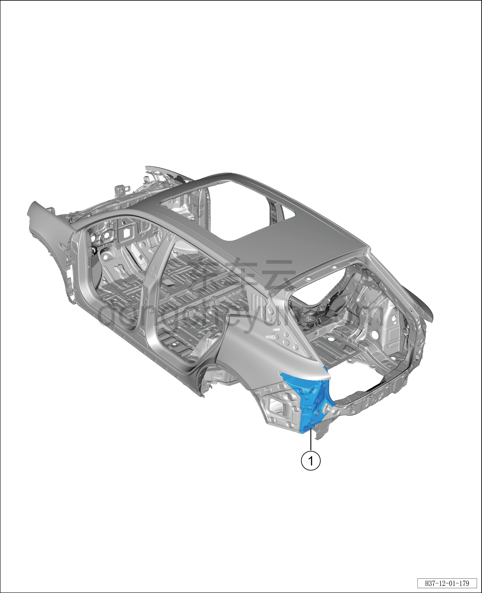
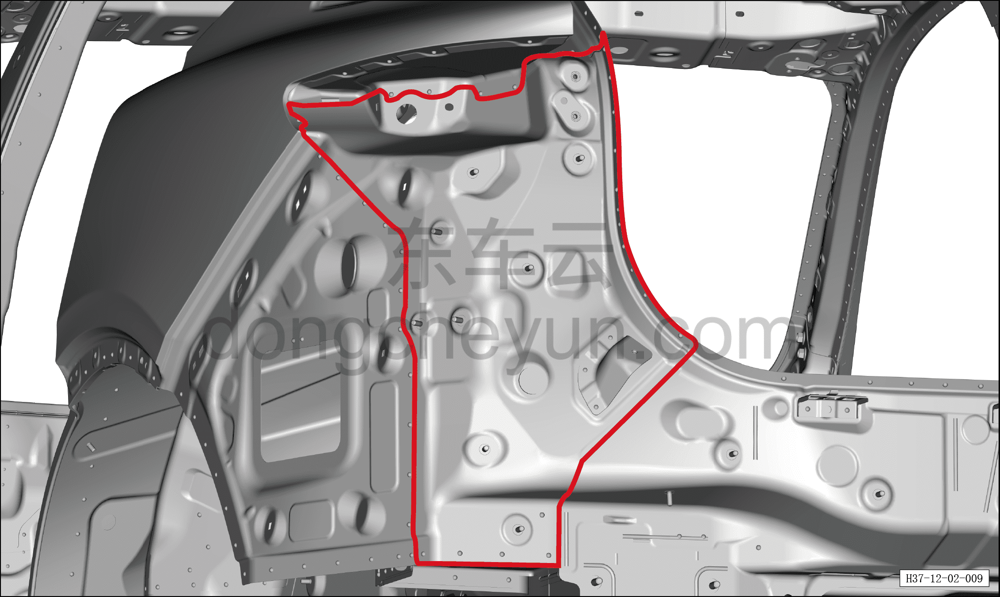
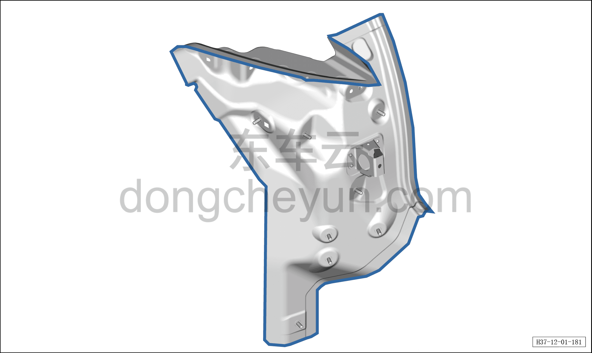
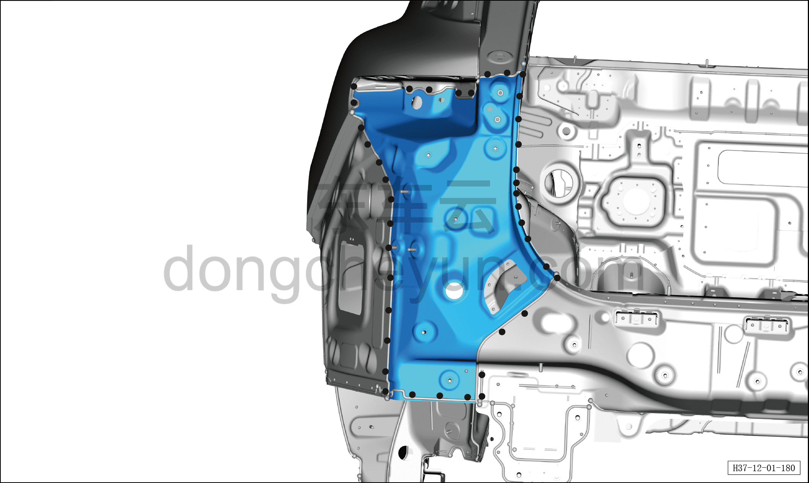

# Замена узла панели крепления заднего комбинированного фонаря в сборе

> Кузовные жестяные работы, окраска › Кузов в белом (BIW) в сборе › Навесные элементы кузова  
> Оригинал: `后组合灯座板总成更换` · [dongcheyun 56746](https://dongcheyun.com/p/56746), страница `72208afe748b4ed7a4b66f2a71cfd58b` · [оглавление](../README.md)

1. Заменяемые детали и запасные части

| № | Наименование детали | Кол-во на автомобиль | Примечание |
|---|---|---|---|
| 1 | Узел панели крепления заднего комбинированного фонаря в сборе | 1 |   |

2. Разделение точек сварки

a. Как показано на рисунке, разделите точки сварки сверлом для удаления точечной сварки диаметром Φ=8 мм, снимите узел панели крепления заднего комбинированного фонаря в сборе.

3. Подготовка кузова

a. Как показано на рисунке, выровняйте соединительную поверхность кузовной панели и узла панели крепления заднего комбинированного фонаря в сборе, зашлифуйте грунт электрической металлической щёткой, нанесите токопроводящее сварочное покрытие C7.

4. Подготовка запасной части

a. Выровняйте соединительную поверхность узла переднего щита с поперечиной щита в сборе и кузова, зашлифуйте грунт электрической металлической щёткой, нанесите токопроводящее сварочное покрытие C7.

5. Сварка

a. Совместите узел панели крепления заднего комбинированного фонаря в сборе с кузовом, зафиксируйте зажимными клещами для кузовных панелей, выполните сварку в местах сварки и зашлифуйте сварные швы.

6. Герметизация и защита

a. Как показано на рисунке, нанесите герметик A1 по линии, а некачественную полосу герметика подровняйте кистью, чтобы закрыть сварной шов.
